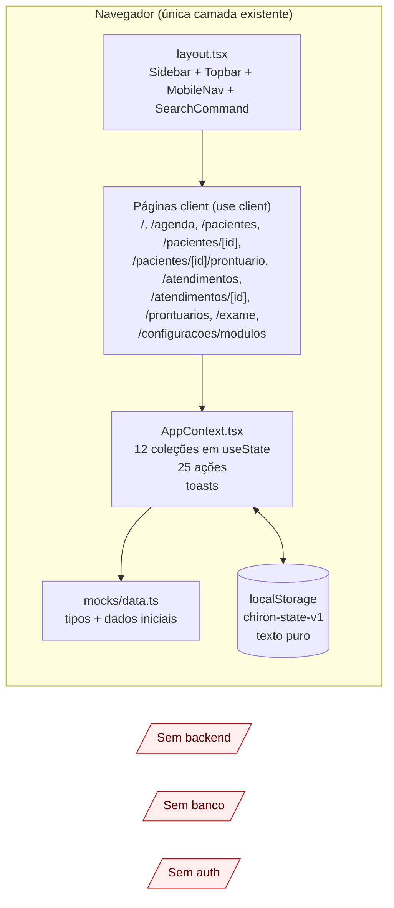
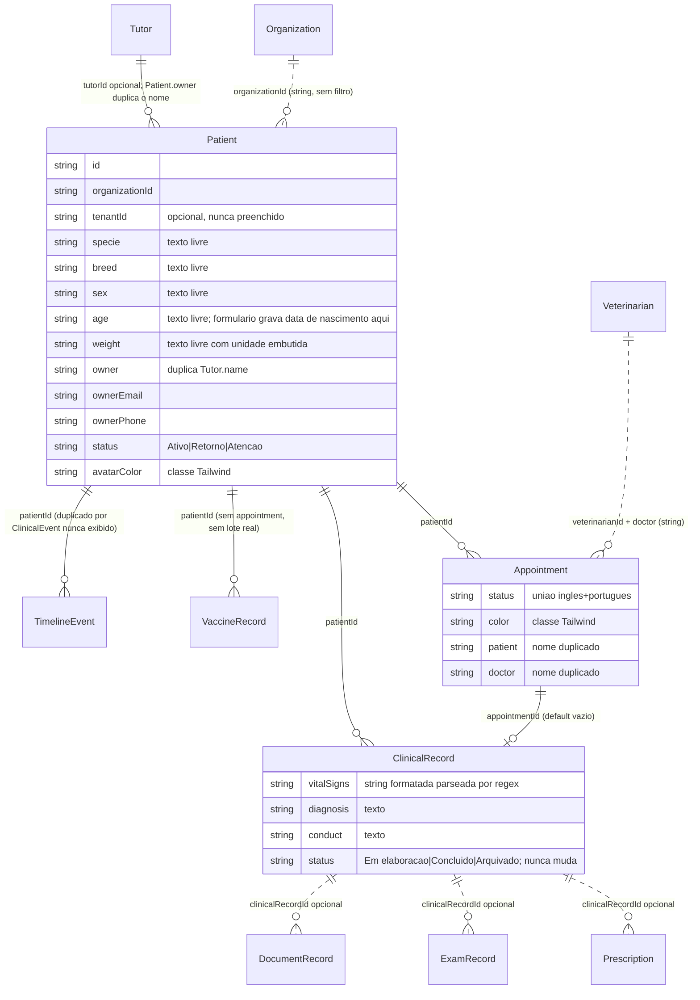
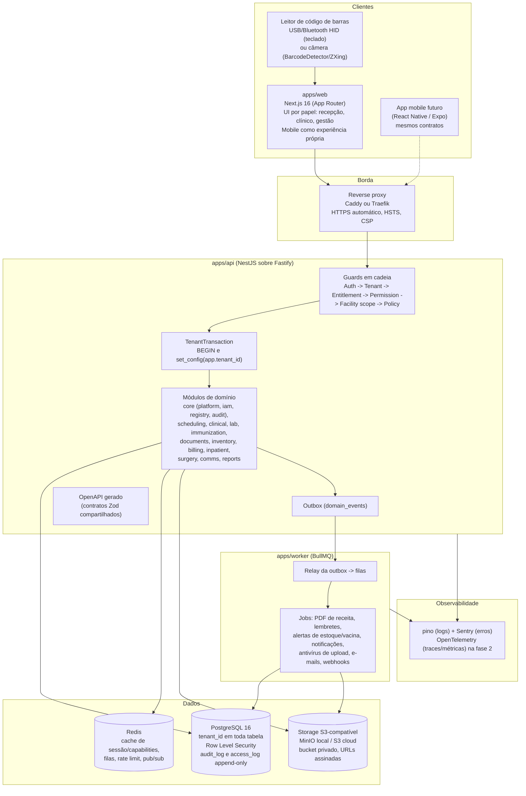
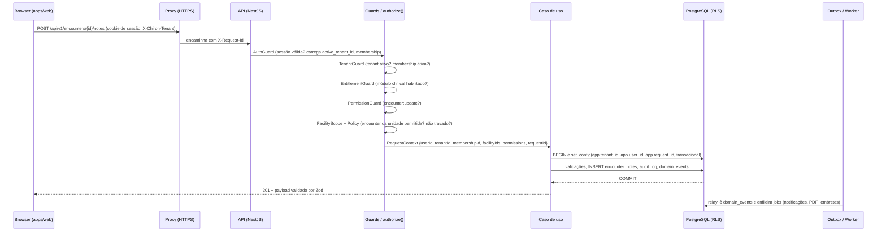
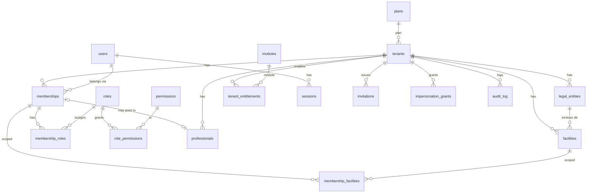
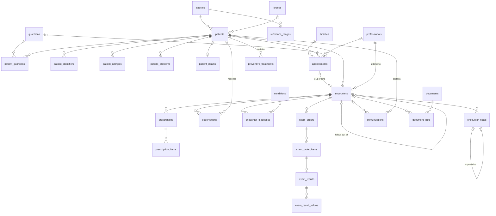
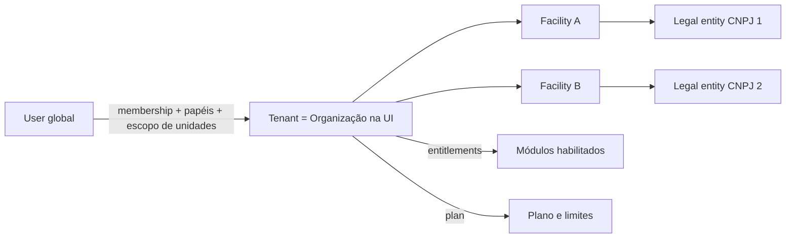
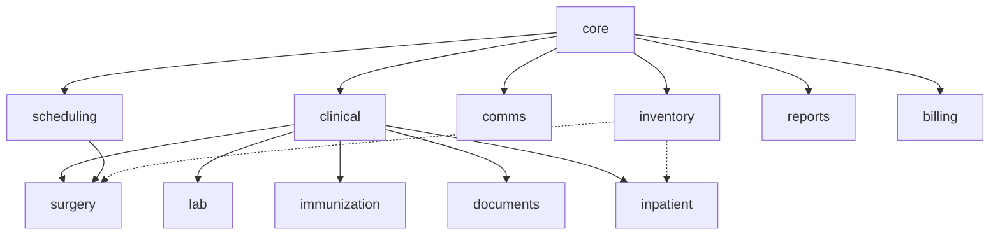
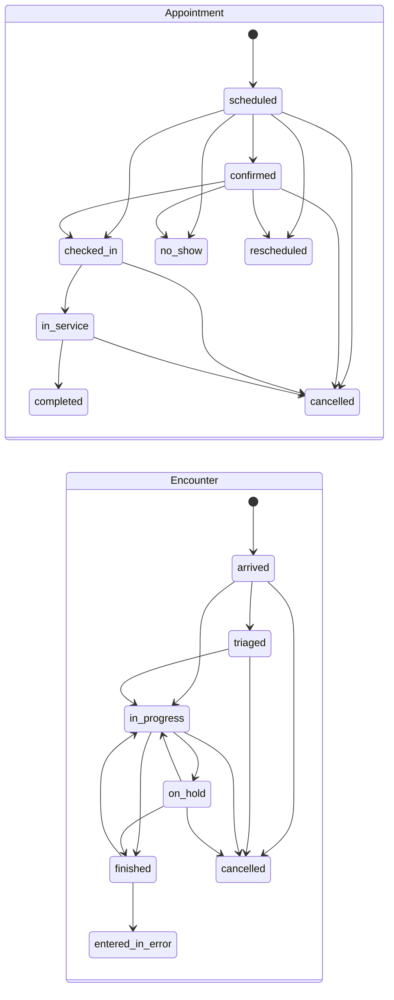
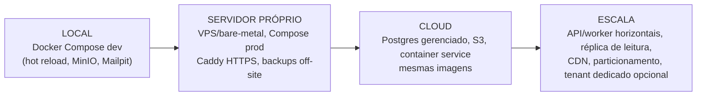

# CHIRON: Análise Mestra de Arquitetura e Produto

| Campo | Valor |
|---|---|
| Projeto | CHIRON, plataforma veterinária |
| Repositório | https://github.com/vctrmaia1412/Chiron (raiz do repositório é a pasta `app/`) |
| Data da análise | 15 de agosto de 2026 |
| Base analisada | commit `70e1f19` ("Initial project import"), branch `main` |
| Escopo | Auditoria completa do código atual, diagnóstico, arquitetura alvo, modelo de domínio e de dados, multi-tenancy, segurança e LGPD, UX/UI, testes, infraestrutura, roadmap e critérios de aceite |
| Natureza | Documento de decisão. Nenhuma funcionalidade foi implementada nesta etapa. Este arquivo é a fonte de verdade para a próxima etapa |
| Método | Leitura integral dos 31 arquivos de código; execução de `tsc`, `eslint` e `next build`; auditoria por sete perspectivas (arquitetura e estado, domínio veterinário, fluxo clínico, UX/UI e mobile, segurança e LGPD, multi-tenancy e módulos, qualidade e DevOps) com 135 achados, cada um verificado por revisão independente lendo o arquivo e a linha citados (125 confirmados, 10 confirmados com correção de linha ou severidade, 0 refutados); painel de projeto com quatro propostas independentes (multi-tenancy, stack, modelo de dados, módulos e RBAC) e um parecer de síntese que resolveu os conflitos entre elas; revisão crítica do documento final por três lentes independentes (arquiteto que construiria do zero, segurança e LGPD, veterinário e produto), com 69 apontamentos incorporados, e verificação da sintaxe dos diagramas. O apêndice B lista os achados verificados |

Convenção usada neste documento: referências a código aparecem como `caminho/arquivo.tsx:linha`, sempre relativas à raiz do repositório (`app/`). Onde uma decisão foi tomada, ela aparece como **Decisão** com justificativa. Onde depende do dono do produto, aparece em "Perguntas em aberto".

---

## Sumário

1. Resumo executivo
2. Estado atual do projeto
3. Arquitetura atual
4. Problemas encontrados
5. Riscos
6. Arquitetura recomendada
7. Stack recomendada
8. Modelo de domínio
9. Modelo de dados
10. Multi-tenancy
11. Segurança e LGPD
12. UX/UI
13. Mobile
14. Módulos
15. Fluxo clínico
16. Estratégia de testes
17. Infraestrutura
18. Observabilidade
19. Roadmap
20. MVP
21. O que NÃO fazer agora
22. Critérios de aceite
23. Decisões arquiteturais
24. Perguntas em aberto
25. Ordem recomendada de implementação
26. Princípios que o CHIRON deve seguir
27. Apêndices (A: auditoria por módulo; B: achados verificados por perspectiva; C: inventário do código; D: superfície de API do MVP; E: variáveis de ambiente, seeds e processo)

---

## 1. Resumo executivo

### 1.1 O que o CHIRON é hoje

O CHIRON hoje é um **protótipo visual navegável de frontend**, e nada além disso. São 31 arquivos de código (aproximadamente 4.500 linhas) em Next.js 16.3 / React 19.2 / TypeScript 5.9 / Tailwind CSS 4.3, sem backend, sem API, sem banco de dados, sem autenticação, sem testes, sem CI, sem Docker, sem variáveis de ambiente e sem documentação própria (o `README.md` é o template do `create-next-app`). O próprio `layout.tsx:14` e o `manifest.ts:7` se descrevem como "protótipo visual".

Todo o estado da aplicação vive em um único React Context (`src/context/AppContext.tsx`, 579 linhas) alimentado por dados de exemplo (`src/mocks/data.ts`, 440 linhas, que também é onde vivem **todos** os tipos do domínio) e persistido em texto puro no `localStorage` do navegador (chave `chiron-state-v1`, `AppContext.tsx:103`). Não existe nenhuma camada de serviço, repositório, validação ou API.

O que existe de positivo e reaproveitável: uma identidade visual coerente (paleta verde `#0F766E`, cards arredondados, tipografia Inter), um conjunto pequeno de componentes de UI simples (`StatusBadge`, `MetricCard`, `PatientCard`, `Timeline`), um esqueleto de navegação (Sidebar desktop, Topbar, MobileNav com botão central de ação, busca com Ctrl+K), a **intenção** correta de um fluxo clínico guiado por etapas (`src/app/atendimentos/[id]/page.tsx`) e a **intenção** de rastreabilidade (`patientId`, `appointmentId`, `clinicalRecordId` presentes nos tipos de receita, exame e documento). Essas intenções são o único capital de produto acumulado; a implementação por trás delas terá de ser substituída.

### 1.2 Veredito

| Dimensão | Veredito |
|---|---|
| Frontend visual | Reaproveitável como referência de linguagem visual e de fluxos; o código das páginas deve ser reescrito sobre uma camada de dados real, componentes acessíveis e formulários validados |
| Estado e persistência | Substituir integralmente (Context monolítico + localStorage não servem para produto clínico) |
| Modelo de domínio | Substituir integralmente (strings livres para espécie, raça, idade, peso, sinais vitais, dose; tutor embutido no paciente; status em dois idiomas) |
| Multi-tenancy | Inexistente na prática (o seletor de organização é cosmético; nenhuma lista filtra por organização) |
| Segurança e LGPD | Inexistente (sem login, sem RBAC, dados pessoais e clínicos em localStorage em texto puro, qualquer rota aberta) |
| Backend, banco, API | Inexistentes; precisam nascer com multi-tenancy, RBAC, auditoria e validação no servidor |
| Testes, CI/CD, infra | Inexistentes |
| Mobile | Desktop encolhido (regra global `html { font-size: 14px }` abaixo de 768px em `globals.css:71-78`), com alguns acertos pontuais (bottom nav com safe-area, modal em bottom sheet) |

Em uma frase: **o CHIRON tem uma casca de produto e nenhum núcleo**. Isso não é ruim para a fase em que está (foi feito para ser visto), mas significa que a próxima etapa é uma construção de plataforma, não uma evolução incremental do que existe.

### 1.3 Decisões centrais (detalhadas na seção 23)

| # | Decisão | Resumo da justificativa |
|---|---|---|
| D1 | Multi-tenancy em **banco compartilhado, schema compartilhado, `tenant_id` em toda tabela de dado de cliente, isolamento reforçado por Row Level Security (RLS) no PostgreSQL** e por chaves estrangeiras compostas `(tenant_id, id)`; roteamento por tenant para banco dedicado (`tenants.database_ref`) desenhado desde o início e implementado só se um cliente exigir | Menor custo operacional para poucos clientes, uma única migração por versão, escala a milhares de tenants; RLS bloqueia vazamento mesmo quando uma query esquece o filtro (exatamente o defeito do protótipo) |
| D2 | Vocabulário fechado: **`tenant`** (rótulo "Organização" na UI) é a fronteira de isolamento; **`facility`** ("Unidade") fica abaixo; **`legal_entity`** (CNPJ/CPF emissor) é atributo fiscal apontado pela unidade; usuários são globais e entram no tenant por **`memberships`** com papéis (N:N), escopo de unidades e `professional_id` opcional; a palavra "organization" sai do código e do banco | Elimina a ambiguidade `organizationId`/`tenantId` do protótipo em vez de renomeá-la; `unit` sai para não colidir com unidade de medida; suporta veterinário em várias clínicas, multiunidade e grupos com vários CNPJs |
| D3 | Manter **Next.js 16 + React 19 + TypeScript + Tailwind** para o web app; criar **backend TypeScript separado (NestJS sobre Fastify) com PostgreSQL 16, Drizzle ORM, Redis e BullMQ**, em **monorepo pnpm + Turborepo** com pacotes compartilhados (`contracts` com Zod, `domain` puro, `ui`) | API-first para app mobile, integrações (laboratório, pagamento, WhatsApp) e leitor de código de barras; módulos e guards do NestJS mapeiam 1:1 para módulos e RBAC; Drizzle é SQL-first, o que facilita RLS e migrações com políticas em SQL; um único ponto abre transação e faz `SET LOCAL` |
| D4 | Separar **`appointments` (agenda) de `encounters` (atendimento clínico)**; o prontuário é composto por notas por seção (`encounter_notes`), medições numéricas com unidade (`observations`), diagnósticos, prescrições, pedidos de exame, imunizações e documentos, todos ligados por `encounter_id`; a timeline é uma **VIEW** sobre as fontes (materializada só quando medido) | Rastreabilidade real, retorno ligado ao atendimento de origem, internação e cirurgia reutilizam a mesma espinha clínica; timeline nunca diverge da fonte |
| D5 | Modelo de paciente **multi-espécie**: `species` e `breeds` como catálogo global com extensão por tenant, `species_profiles` com campos exigidos e schema de atributos, `reference_ranges` por espécie/idade/peso, `patients.attributes` JSONB validado, `patient_identifiers` (microchip, brinco, anilha, passaporte, licença), `patient_guardians` N:N com papel | Cães, gatos, aves, répteis, equinos, bovinos, silvestres e exóticos sem forçar "cão + raça + tutor" |
| D6 | Módulos como **entitlements por tenant persistidos no banco e avaliados no backend** (guard por rota e por caso de uso), permissões granulares `recurso:ação` agrupadas em papéis, escopo por unidade no `authorize()` (não no RLS), navegação derivada de `/me/context`; sessão opaca server-side sem papéis nem permissões no token | Módulo desabilitado deixa de existir na API, não só no menu; revogação em segundos |
| D7 | Auditoria **imutável** (`audit_log` e `access_log` gravados pela aplicação na mesma transação, append-only, sem dado pessoal em claro) + prontuário com **assinatura e adendos** (nota assinada nunca é alterada; correção cria nova linha que supersede a anterior; trigger valida as transições permitidas) + soft delete só em cadastro; registro clínico e financeiro nunca é apagado; o hash de integridade não é assinatura jurídica (validade de receita e atestado eletrônicos é pergunta em aberto com padrão conservador: impresso e assinado à mão) | Exigência de prontuário e de LGPD; base para perícia e para direitos do titular |
| D8 | Infra por **Docker Compose** (web, api, worker, postgres, redis, minio, proxy com HTTPS automático) igual em local, servidor próprio e cloud; migrações versionadas como passo de deploy; backups criptografados com teste de restauração; outbox no Postgres alimenta filas | Sem dívida impossível de pagar depois: o mesmo compose sobe em VPS e vira base para orquestração gerenciada; nenhum evento perdido entre commit e enfileiramento |
| D9 | Mobile como **experiência própria** por papel e contexto (recepção, sala de atendimento, campo), com componentes de UI acessíveis (Radix via shadcn/ui) e sem "encolher" tipografia | O erro identificado pelo próprio time (desktop encolhido) é a raiz da maior parte dos problemas de UX atuais |
| D10 | MVP focado no núcleo clínico: identidade, tenants, tutores e pacientes multi-espécie, agenda, atendimento com notas e observações numéricas, prescrição com PDF, pedido de exame manual, documentos com upload real, vacinas simples, prontuário e timeline, notificações internas, e o que a clínica pequena faz toda semana (vacinas e preventivos com carteira, receita de controle especial impressa, atestados e termos gerados por modelo, óbito, cirurgia ambulatorial como atendimento, resumo para cobrança); cerca de 70 tabelas em duas ondas (27 na fundação, 45 no MVP) | Financeiro completo, estoque com código de barras, internação, centro cirúrgico, WhatsApp, gateway, assinatura eletrônica qualificada, multiunidade em UI e integrações de laboratório ficam para as fases seguintes, mas `charge_items` e `stock_movements` já nascem para não exigir refactor |
| D11 | O protótipo é **congelado como referência**, não consertado: nenhuma hora em `AppContext.tsx`; as páginas são reescritas uma a uma sobre a API; dados gerados no protótipo não migram (autoria falsa) | Cada hora no mock é hora tirada da migração 0001 e dos contratos |

### 1.4 Principais problemas encontrados (resumo; detalhes na seção 4 e no apêndice B)

1. **Multi-tenancy cosmético**: `setCurrentOrgId` (`Topbar.tsx:99`) muda apenas o rótulo; nenhuma lista, busca ou métrica filtra por `organizationId`; `tenantId` é literalmente `"tenant-demo"` (`AppContext.tsx:272, 337, 365`); a organização padrão `org-demo` nem consta na lista de organizações e é injetada em tempo de execução (`AppContext.tsx:159-162`); formulários mandam o `organizationId` que quiserem e o Context aceita (`AppContext.tsx:382, 406, 430, 452`).
2. **Segurança inexistente**: sem login, sem sessão, sem RBAC; dados de tutores (nome, e-mail, telefone, endereço) e dados clínicos em `localStorage` em texto puro; qualquer URL é acessível; rotas dinâmicas fazem lookup global por id.
3. **Modelo de domínio incapaz de sustentar produto clínico**: espécie, raça, sexo, idade, peso são strings livres (`mocks/data.ts:7-11`); o campo rotulado "Data de nascimento" grava em `age` (`PatientForms.tsx:106-107`); sinais vitais são uma string formatada e reparseada por regex (`atendimentos/[id]/page.tsx:36-69`) com defaults inventados (peso `6,0 kg` para qualquer espécie, `page.tsx:31`); dose, frequência e duração são strings; `Patient` carrega `owner`, `ownerEmail`, `ownerPhone` ao mesmo tempo em que existe `Tutor`.
4. **Rastreabilidade quebrada no fluxo clínico**: `updateClinicalRecord` faz upsert por `patientId + appointmentId` com `appointmentId` padrão `""` (`AppContext.tsx:339, 354`); `finishAppointment` só muda status e nunca leva o `ClinicalRecord` a "Concluído" (`AppContext.tsx:321-327`); a página de prontuário mostra **um** registro por paciente com `clinicalRecords.find(...)` (`pacientes/[id]/prontuario/page.tsx:23`), não a história por atendimento; prescrições criadas com dose/via/quantidade hardcoded (`atendimentos/[id]/page.tsx:277-282`); exames com laboratório fixo `"Lab VetCare"` (`:303`); documentos com `size: "0.6 MB"` sem upload (`:328`); veterinário fixo `"vet-ana"`/`"Dra. Amanda"` em vários pontos.
5. **Persistência frágil e bug de hidratação**: `useState(() => getStoredState()...)` lê `localStorage` no primeiro render do cliente enquanto o servidor renderiza com dados iniciais (`AppContext.tsx:146-158`), o que gera hydration mismatch assim que houver estado salvo; IDs com `Date.now()` (`AppContext.tsx:204, 226, 270, 286...`); `deletePatient` apaga documentos, exames, receitas, vacinas e timeline mas deixa `appointments` e `clinicalRecords` órfãos e apaga tutores sem pacientes (`AppContext.tsx:243-255`).
6. **Datas e usuário hardcoded**: "hoje" é `"2026-08-13"` no dashboard (`page.tsx:33`), na agenda (`agenda/page.tsx:15`) e nos modais (`AppointmentFlowModal.tsx:17, 64`); janela de vacinas com `Date.UTC(2026, 7, 42)` (`page.tsx:110`); saudação "Boas-vindas, Dra. Amanda." (`page.tsx:169`) enquanto o usuário logado é "Fábio N." (`mocks/data.ts:236`) com avatar "FN" fixo (`Topbar.tsx:84-86`).
7. **Código morto e navegação para o vazio**: `AppointmentModal.tsx` nunca é importado; `lib/dataIntegrity.ts` nunca é importado (e é fail-open); `clinicalEvents` é populado e nunca exibido; sete exports de `mocks/data.ts` não são usados; o Sidebar aponta para `/receita`, `/internacao`, `/estoque`, `/financeiro`, `/relatorios`, que não existem (`Sidebar.tsx:28-32`); o filtro de período em atendimentos não filtra nada (`atendimentos/page.tsx:57-61`); o botão "Hoje" da agenda é um no-op (`agenda/page.tsx:115`).
8. **UX duplicada e botões sem ação**: na página do paciente, "Histórico", "Linha do tempo" (aba) e "Linha do tempo clínica" (seção) mostram os mesmos eventos; "Resumo clínico" hardcoded ("12/08/2026", "19/08/2026", "V10 em dia") aparece duas vezes (`pacientes/[id]/page.tsx:52-56` e `:236-240`); documentos listados duas vezes; "Nova receita", "Novo exame", "Nova vacina", "Mais ações", "Exportar", upload, "Ações clínicas" e "Pagamento" não fazem nada; `Modal.tsx` não tem focus trap, `aria-modal`, portal, bloqueio de scroll nem rolagem interna (o modal de novo atendimento é cortado no mobile).
9. **Módulos apenas escondidos**: `toggleModule` altera estado local não persistido (`AppContext.tsx:473-481`; `appModules` não entra no `localStorage`); o Sidebar filtra por id com mapeamento inconsistente (`prescricao` vs rota `receita`, `exames` vs rota `exame`, `Sidebar.tsx:43-48`); `MobileNav` ignora módulos; rotas continuam acessíveis por URL.
10. **Zero testes, zero CI, zero observabilidade**: nenhum `error.tsx`, `loading.tsx` ou `not-found.tsx`; nenhum logger; nenhum script além de `dev/build/start/lint`.
11. **Bugs de fluxo que passam despercebidos na demo**: o modal de novo atendimento agenda **para o primeiro paciente da lista** quando nenhum foi selecionado (`AppointmentFlowModal.tsx:33`, `selectedPatient = ... ?? patients[0]`); cada "salvar" no atendimento **gera um novo id de registro clínico**, zera `createdAt`, volta o status a "Em elaboração", apaga `assessment` e deixa receitas, exames e documentos anteriores apontando para um id que não existe mais (`AppContext.tsx:335, 341-348, 353-359`); a regex de sinais vitais não casa com o formato do próprio seed, então o atendimento de Thor exibe e, ao salvar, grava "Peso 6,0 kg" no lugar de 32,4 kg (`atendimentos/[id]/page.tsx:39` versus `mocks/data.ts:361`); a aba padrão da página do paciente ("Linha do tempo") não tem renderer e abre com "Selecione uma aba" (`pacientes/[id]/page.tsx:17, 129`); um atendimento pausado não tem como ser retomado (`atendimentos/[id]/page.tsx:354-358`); tutores criados no cadastro **não são persistidos** e somem no reload, enquanto o paciente fica (`AppContext.tsx:147, 178-191`); não existe máquina de estados, então finalizar um agendamento "scheduled" ou pausar um finalizado é aceito (`AppContext.tsx:305-327`).

### 1.5 Como ler este documento

As seções 2 a 5 descrevem o que existe e o que está errado. As seções 6 a 18 desenham a plataforma alvo. As seções 19 a 25 dizem em que ordem construir, o que deixar de fora e o que ainda precisa de resposta do dono do produto. A seção 26 fixa os princípios. Os apêndices trazem a tabela de auditoria por módulo, os achados verificados por perspectiva (cada um com arquivo e linha) e o inventário do código.

---

## 2. Estado atual do projeto

### 2.1 Inventário

| Item | Situação encontrada |
|---|---|
| Raiz do repositório | `C:\Users\Sinapse\Documents\projetos\Chiron\app` (a pasta `Chiron/` não é repositório; o `.git` está em `app/`) |
| Histórico git | 2 commits: `f0a7202` "Initial commit from Create Next App" (13/08/2026) e `70e1f19` "Initial project import" (15/08/2026); autor `unknown <suporte@sinapsecorp.com.br>`; sem tags, sem branches além de `main`, remoto `origin` em GitHub, árvore limpa |
| Framework | Next.js 16.3.0 (App Router, Turbopack), React 19.2.8, React DOM 19.2.8 |
| Linguagem | TypeScript 5.9.3, `strict: true`, `moduleResolution: bundler`, alias `@/* -> ./src/*` (`tsconfig.json`) |
| Estilo | Tailwind CSS 4.3.3 via `@tailwindcss/postcss`; `globals.css` com tokens em `:root` e regras globais agressivas |
| Ícones | lucide-react 1.31.0 |
| Outras dependências | Nenhuma. Não há biblioteca de formulários, validação, data, estado, HTTP, testes, ORM, auth |
| Scripts npm | `dev`, `build`, `start`, `lint` (`package.json`). Não há `typecheck`, `test`, `format` |
| Lint | ESLint 9 com `eslint-config-next/core-web-vitals` e `/typescript` (`eslint.config.mjs`); passa sem erros |
| Typecheck | `tsc --noEmit` passa |
| Build | `next build` passa: 13 rotas geradas (10 estáticas, 3 dinâmicas) |
| Testes | Nenhum arquivo de teste, nenhum runner instalado |
| CI/CD | Nenhum workflow, nenhum pipeline |
| Docker / infra | Nenhum Dockerfile, compose, proxy, script de deploy |
| Variáveis de ambiente | Nenhum `.env*` (o `.gitignore` já os ignora); sem `.env.example`; sem `engines`/`.nvmrc` |
| Backend / API | Nenhuma rota `app/api`, nenhum Server Action, nenhum acesso a banco |
| Banco de dados | Nenhum |
| Autenticação | Nenhuma; não existe rota de login; o layout raiz renderiza Sidebar, Topbar e MobileNav para todas as rotas (`layout.tsx:17-34`) |
| PWA | Apenas `manifest.ts` (nome, cores, `display: standalone`, um ícone SVG). Sem service worker, sem offline, sem ícones PNG maskable, sem `apple-touch-icon`, sem `viewport-fit=cover` |
| Documentação | `README.md` é o template padrão do create-next-app; `AGENTS.md`/`CLAUDE.md` são gerados pelo Next; não há `docs/` |
| Assets | `public/file.svg`, `globe.svg`, `next.svg`, `vercel.svg`, `window.svg` do template, não usados; `icon.svg` usado pelo manifest |
| Persistência | `localStorage` chave `chiron-state-v1` com pacientes, agendamentos, registros clínicos, receitas, exames, documentos, vacinas, timeline, notificações (`AppContext.tsx:175-192`). Tutores, veterinários, módulos, organizações e eventos clínicos **não** são persistidos |

### 2.2 Rotas existentes

| Rota | Arquivo | Tipo | O que faz de fato |
|---|---|---|---|
| `/` | `src/app/page.tsx` | client | Dashboard com 4 métricas calculadas do estado, "Próximos atendimentos" (filtrados por data fixa `2026-08-13`), "Atenção clínica", "Pacientes recentes", "Ações rápidas", faixa "Atendimento guiado" decorativa |
| `/agenda` | `src/app/agenda/page.tsx` | client | Mini calendário mensal com contagem por dia, lista do dia, "semana" e "mês" como listas verticais; filtro por status; botão novo agendamento abre `AppointmentFlowModal` |
| `/pacientes` | `src/app/pacientes/page.tsx` | client | Lista em cards com busca por texto e filtro por status ("Todos", "Ativo", "Retorno", "Atenção"), criação/edição via `PatientForm`, exclusão com confirmação |
| `/pacientes/[id]` | `src/app/pacientes/[id]/page.tsx` | client (dinâmica) | Cabeçalho do paciente, 4 cards (idade, peso, espécie, status), botões sem ação, abas (Resumo, Histórico, Linha do tempo, Exames, Prescrições, Documentos), aside com tutor e documentos, seção "Linha do tempo clínica", "Resumo clínico" hardcoded, "Ações clínicas" sem ação. A aba padrão ("Linha do tempo") não tem renderer |
| `/pacientes/[id]/prontuario` | `src/app/pacientes/[id]/prontuario/page.tsx` | client (dinâmica) | Abas Resumo (um único ClinicalRecord), Linha do tempo, Atendimentos, Diagnósticos (vazio), Exames, Receitas, Vacinas, Documentos, Internações (vazio) |
| `/atendimentos` | `src/app/atendimentos/page.tsx` | client | Lista de agendamentos com filtros (período não funcional, veterinário, status, tipo), botão "Iniciar" muda status sem navegar, "Continuar"/"Ver atendimento" navega para o detalhe; agendados não têm link para o detalhe |
| `/atendimentos/[id]` | `src/app/atendimentos/[id]/page.tsx` | client (dinâmica) | Fluxo em 11 etapas (Paciente, Anamnese, Exame físico, Sinais vitais, Avaliação, Diagnóstico, Conduta, Prescrição, Exames, Documentos, Finalização). "Avaliação" cai no bloco de finalização por falta de ramo próprio. Salva `ClinicalRecord` via upsert (que troca o id a cada salvamento); cria receita/exame/documento com dados fixos; "Finalizar" muda status e redireciona ao prontuário sem confirmação; "Pausar" sempre visível e sem "Retomar" |
| `/atendimento` | `src/app/atendimento/page.tsx` | server | `redirect("/atendimentos")` |
| `/prontuarios` | `src/app/prontuarios/page.tsx` | client | Cards por paciente com contagens (eventos de timeline rotulados como "atendimentos"), filtro por espécie fixo (Cão, Gato, Ave, Bovino) |
| `/prontuario` | `src/app/prontuario/page.tsx` | server | `redirect("/prontuarios")` |
| `/exame` | `src/app/exame/page.tsx` | client | Cards de exames; filtro vem só de `?status=` lido de `window.location.search` no inicializador de estado (sem UI para trocar); cards sem nome do paciente e sem ação |
| `/configuracoes/modulos` | `src/app/configuracoes/modulos/page.tsx` | client | Toggle visual de módulos (não persistido) |
| Rotas linkadas e inexistentes | `/receita`, `/internacao`, `/estoque`, `/financeiro`, `/relatorios` (Sidebar) | | 404 do Next (sem `not-found.tsx` próprio) |

### 2.3 Componentes

| Componente | Arquivo | Estado | Observação |
|---|---|---|---|
| `AppProvider` / `useApp` | `src/context/AppContext.tsx` | Funciona como mock | 579 linhas; 12 coleções de estado, 25 ações, toasts, persistência; `useMemo` com 41 dependências que inclui estado de UI (busca, painel, toasts), logo qualquer toast re-renderiza todos os consumidores; é a "aplicação" inteira |
| `AppointmentFlowModal` | `src/components/AppointmentFlowModal.tsx` | Funciona como mock, com bug | Busca de paciente, seleção de veterinário, tipo, data/hora fixas `2026-08-13 09:00`, cria agendamento; **usa `patients[0]` quando nenhum paciente foi selecionado** (`:33`); abre `PatientForm` aninhado |
| `AppointmentModal` | `src/components/AppointmentModal.tsx` | **Código morto** | Nunca importado; usa status em português (`"Agendado"...`) incompatíveis com o restante; chama `addAppointment` sem `patientId` (seria recusado com toast, mas a UI confirmaria sucesso) |
| `PatientForm` | `src/components/PatientForms.tsx` | Funciona como mock | Sem validação, sem campo obrigatório, espécie como texto livre, "Data de nascimento" grava em `age`; `useState` inicial não reage a mudança de `initialData` |
| `PatientCard` | `src/components/PatientCard.tsx` | Funciona | Simples e reaproveitável como referência visual |
| `Timeline` | `src/components/Timeline.tsx` | Funciona como mock | Lê `timelines` do contexto sem ordenar; ícone por tag |
| `SearchCommand` | `src/components/SearchCommand.tsx` | Parcial | Busca em memória; resultados de tutor levam para `/pacientes`, de consulta para `/agenda`, de exame para `/exame` (sem deep link); sem navegação por teclado |
| `NotificationPanel` | `src/components/NotificationPanel.tsx` | Funciona como mock | Painel com fechar por Esc/click fora; "Ver todas" só fecha; ícone inferido pelo texto do título; clicar numa notificação não leva a lugar nenhum |
| `Sidebar` | `src/components/layout/Sidebar.tsx` | Parcial | Filtra itens por módulos ativos com mapeamento inconsistente; links para rotas inexistentes; estado ativo ignora rotas aninhadas |
| `Topbar` | `src/components/layout/Topbar.tsx` | Parcial | Atalho Ctrl+K, sino, seletor de organização (cosmético), usuário "Fábio N." fixo; menu de organização não fecha ao clicar fora |
| `MobileNav` | `src/components/MobileNav.tsx` | Funciona | Bottom nav com safe-area e botão central; "Mais" leva a Configurações de módulos; sem acesso a Atendimentos, Prontuários e Exames no mobile |
| `Modal` | `src/components/ui/Modal.tsx` | Parcial | Sem portal, sem focus trap, sem `role="dialog"`/`aria-modal`, sem scroll interno, sem bloqueio de scroll do body |
| `ConfirmDialog` | `src/components/ui/ConfirmDialog.tsx` | Parcial | Mesmas lacunas de acessibilidade do Modal |
| `MetricCard` | `src/components/ui/MetricCard.tsx` | Funciona | Glifo de "tendência" é decorativo e enganoso |
| `StatusBadge` | `src/components/ui/StatusBadge.tsx` | Funciona | Reaproveitável |
| `dataIntegrity` | `src/lib/dataIntegrity.ts` | **Código morto** | Funções de validação de pertencimento a organização nunca chamadas e fail-open (`if (x.organizationId && ...)`); duplica `DEFAULT_ORGANIZATION_ID` |
| Tipos e mocks | `src/mocks/data.ts` | Mock | Todos os tipos do domínio + dados iniciais + 7 exports não usados (`dashboardMetrics`, `patientSummary`, `recentDocuments`, `patientList`, `timelineEvents`, `clinicalAlerts`, `upcomingAppointments`, este último com os mesmos ids `appt-1..3` de `initialAppointments` e conteúdo diferente, e referenciando um paciente `mel` inexistente) |

### 2.4 Classificação: o que existe, funciona, é mock, parcial, quebrado, mal arquitetado, deve ser substituído, pode ser reaproveitado, falta

| Classe | Itens |
|---|---|
| **Existe e funciona (dentro do escopo de protótipo)** | Navegação entre páginas; criação/edição/exclusão de paciente em memória; criação de agendamento; iniciar/pausar/finalizar atendimento (status); salvar seções do registro clínico; criar receita/exame/documento fictícios; toasts; busca global em memória; painel de notificações; toggle visual de módulos; build/lint/typecheck |
| **Funciona apenas como mock** | Tudo acima, porque não há servidor, validação, usuário, permissão nem persistência confiável |
| **Parcialmente implementado** | Agenda (sem grade real de horários, sem conflitos, sem profissionais/salas, "semana" e "mês" são listas); atendimento (etapas sem persistência estruturada, "Avaliação" sem formulário próprio, "Triagem", "Evolução", "Retorno", "Encaminhamento" ausentes); prontuário (um registro por paciente); exames (sem pedido estruturado, sem resultado, sem anexos); documentos (sem upload); notificações (estáticas); busca (sem deep link); módulos (só UI) |
| **Quebrado** | Hidratação com estado salvo; agendamento para `patients[0]` sem seleção; id do registro clínico trocado a cada salvamento (orfana receitas/exames/documentos); regex de sinais vitais que não casa com o seed e sobrescreve peso; aba padrão do paciente sem conteúdo; atendimento pausado sem retomar; tutores não persistidos; links do Sidebar para 404; filtro de período; botão "Hoje"; abas "Diagnósticos" e "Internações" vazias; "Avaliação" caindo em "Finalização"; card "Prescrição" que diz "Registrado no prontuário" baseado em `conduct`; `deletePatient` deixando órfãos; `PatientForm` de edição que não atualiza ao trocar `initialData`; `AppointmentModal` com status incompatíveis (morto); mês da agenda com dias iniciando no domingo mas semana iniciando na segunda; sem máquina de estados |
| **Mal arquitetado** | Tipos no arquivo de mocks; Context monolítico; strings para tudo; upsert por chave frágil; IDs por `Date.now()`; datas hardcoded e em dois formatos; multi-tenant cosmético; regras globais de CSS; módulos filtrados no cliente; ausência de camada de domínio; toasts renderizados dentro do Provider |
| **Deve ser substituído** | `AppContext.tsx` (por sessão + cache de servidor + store de UI), `mocks/data.ts` (por `packages/contracts` e `packages/domain` + seeds no backend), `Modal.tsx`/`ConfirmDialog.tsx` (por primitivas acessíveis), formulários (por React Hook Form + Zod), `globals.css` (por tokens de design sem regras globais agressivas), toda a lógica de negócio das páginas (por casos de uso no backend) |
| **Pode ser reaproveitado** | Paleta e linguagem visual; estrutura de rotas em português (`/pacientes`, `/agenda`, `/atendimentos`, `/prontuarios`, `/exames`, `/configuracoes/...`); ideia da bottom nav com ação central; ideia do fluxo clínico em etapas e os campos de sinais vitais como especificação; ideia da busca global; `StatusBadge`, `MetricCard`, `PatientCard`, `Timeline` como referência de componentes (após remover `useApp()`); textos e rótulos em pt-BR; a lista de módulos (`mocks/data.ts:389-402`) como base do catálogo; mocks normalizados como seed de desenvolvimento |
| **Falta completamente** | Login, sessões, usuários, papéis, permissões, tenants reais, unidades, convites; backend, API, banco, migrações; validação; auditoria; upload e storage; PDF; tutores como entidade com N:N; espécies/raças; sinais vitais numéricos; diagnósticos estruturados; evolução; retorno; encaminhamento; triagem; agenda real (profissionais, salas, bloqueios, confirmação, no-show, lembretes); exames com resultado; estoque; código de barras; financeiro; internação; cirurgia; comunicações; relatórios; configurações reais; testes; CI/CD; Docker; observabilidade; documentação |

---

## 3. Arquitetura atual

### 3.1 Visão



### 3.2 Fluxo de dados real

1. O servidor Next renderiza cada página client com o estado inicial vindo de `mocks/data.ts` (no servidor `window` é `undefined`, então `getInitialPersistedState` retorna `null`, `AppContext.tsx:105-108`).
2. No cliente, o inicializador de `useState` lê o `localStorage` e pode produzir um estado diferente do HTML do servidor: **hydration mismatch** garantido a partir do momento em que existe estado salvo (por exemplo depois de criar um paciente e recarregar). `getStoredState` é chamado nove vezes no mount, cada uma parseando o `localStorage` inteiro (`AppContext.tsx:146-158`).
3. Toda ação de UI chama uma função do contexto que altera arrays em memória; um `useEffect` serializa 9 coleções inteiras no `localStorage` a cada mudança (`AppContext.tsx:175-192`), sem schema, sem versão efetiva, sem tratamento de falha de escrita (quota) e omitindo tutores, veterinários, módulos e eventos clínicos.
4. Não há validação, não há erro de servidor, não há loading; portanto não há estados de erro/carregamento nas telas. Mutações retornam `void`, e a UI confirma sucesso mesmo quando a operação abortou (`createAppointment` retorna cedo com toast de aviso em `AppContext.tsx:261-264` e o modal ainda emite "Atendimento criado com sucesso" em `AppointmentFlowModal.tsx:58`).

### 3.3 Modelo de dados atual (como está nos tipos)



O diagrama mostra o problema central: as relações existem por convenção de string, não por integridade; nomes são duplicados em vez de referenciados; e campos de apresentação (`avatarColor`, `color`) estão misturados ao domínio.

### 3.4 Onde a intenção era boa

Vale registrar, para não jogar fora: os tipos `Prescription`, `ExamRecord` e `DocumentRecord` já carregam `patientId`, `appointmentId?` e `clinicalRecordId?` (`mocks/data.ts:124-171`); o `ClinicalRecord` tem as seções certas (queixa, anamnese, exame físico, sinais vitais, avaliação, diagnóstico, conduta, `mocks/data.ts:184-201`); `lib/dataIntegrity.ts` tenta validar pertencimento a organização; a lista de módulos (`mocks/data.ts:389-402`) já enumera o catálogo certo; as 11 etapas do fluxo clínico e os 8 campos de sinais vitais (`atendimentos/[id]/page.tsx:10-34`) são uma boa especificação de UX. Esses são os "fósseis" de arquitetura correta que a versão alvo formaliza.

---

## 4. Problemas encontrados

Esta seção agrupa os problemas por categoria. Cada item aponta arquivo e linha. A severidade segue o critério de "impacto em um produto clínico multi-tenant comercial", não o de "impacto no protótipo". O apêndice B traz a lista completa dos achados verificados por perspectiva.

### 4.1 Arquitetura e estado

| # | Severidade | Problema | Evidência | Impacto |
|---|---|---|---|---|
| A1 | Crítica | Não existe backend, API, banco nem camada de serviço; toda regra de negócio vive em callbacks do Context e em handlers de página | `AppContext.tsx` inteiro; `atendimentos/[id]/page.tsx:105-132` | Nada é confiável, compartilhável entre usuários ou auditável; nada disso pode ser reaproveitado como lógica de negócio |
| A2 | Crítica | Estado global monolítico com 12 coleções e 25 ações num único Provider que envolve toda a árvore | `AppContext.tsx:53-98, 495-543` | Cada mudança re-renderiza a aplicação inteira; impossível fatiar por módulo, permissão ou tenant |
| A3 | Crítica | Persistência de dados de negócio em `localStorage` em texto puro | `AppContext.tsx:103, 175-192` | Dados clínicos e pessoais no dispositivo, sem controle de acesso, sem sincronização, sem limite (5 MB), sem versionamento de schema |
| A4 | Alta | Hydration mismatch: o servidor renderiza com dados iniciais e o cliente inicializa `useState` lendo `localStorage` | `AppContext.tsx:105-158` | Avisos de hidratação e UI inconsistente assim que existir estado salvo; em React 19 o mismatch força re-render do cliente e pode descartar interações |
| A5 | Alta | Tipos de domínio vivem no arquivo de mocks | `mocks/data.ts:1-221` | Acoplamento entre "dados de exemplo" e "contrato"; qualquer módulo importa `@/mocks/data` para tipar |
| A6 | Alta | IDs por `Date.now()` (e `Date.now() + Math.random()` para toasts) | `AppContext.tsx:170, 204, 226, 270, 286, 330, 335, 363, 388, 411, 435, 457`; `atendimentos/[id]/page.tsx:266, 274, 297, 320` | Colisão em criações no mesmo milissegundo, IDs adivinháveis, impossíveis de gerar no servidor com segurança |
| A7 | Alta | Dados desnormalizados e duplicados: `Patient.owner/ownerEmail/ownerPhone` coexistem com `Tutor`; `Appointment.patient/doctor/tutor` são nomes copiados; `TimelineEvent` e `ClinicalEvent` representam a mesma coisa | `mocks/data.ts:12-16, 68-74, 83-95, 203-215` | Renomear um tutor não atualiza pacientes nem agendamentos; duas timelines divergentes |
| A8 | Alta | `AppointmentStatus` e `AppointmentPriority` são uniões de valores em inglês e português | `mocks/data.ts:33-45, 59` | Filtros e badges tratam só os valores em inglês; `AppointmentModal.tsx` (morto) grava em português |
| A9 | Alta | Upsert de registro clínico por `patientId + appointmentId` com `appointmentId` padrão `""` | `AppContext.tsx:339, 353-359` | Todos os registros sem atendimento colapsam num único registro; um paciente com dois atendimentos no mesmo dia teria histórico sobrescrito se o id de agendamento faltar |
| A10 | Alta | `deletePatient` faz cascade parcial: remove docs/exames/receitas/vacinas/timeline, deixa `appointments` e `clinicalRecords` órfãos e apaga tutores que ficam sem pacientes | `AppContext.tsx:243-255` | Órfãos na agenda; perda silenciosa de cadastro de tutor; delete físico de dado clínico (proibido em prontuário) |
| A11 | Média | Datas "hoje" hardcoded `2026-08-13`; janela de vacinas `Date.UTC(2026, 7, 42)` | `page.tsx:33, 109-110`; `agenda/page.tsx:15, 35`; `AppointmentFlowModal.tsx:17, 64`; `AppointmentModal.tsx:28` | O dashboard e a agenda "congelam" no dia da demo; qualquer uso real mostra listas vazias |
| A12 | Média | Veterinário e tenant fixos em código | `AppContext.tsx:267, 272, 274, 337, 340, 365, 373, 417, 463`; `atendimentos/[id]/page.tsx:110-111` | Todo registro é atribuído a "Dra. Amanda"/"vet-ana"/"tenant-demo" independentemente de quem opera |
| A13 | Média | Código morto: `AppointmentModal.tsx`, `lib/dataIntegrity.ts`, `clinicalEvents`, exports `dashboardMetrics`, `patientSummary`, `recentDocuments`, `patientList`, `timelineEvents`, `clinicalAlerts`, `upcomingAppointments` (com paciente `mel` inexistente) | `mocks/data.ts:223-228, 335-336, 411-440`; `AppContext.tsx:156, 361-376` | Ruído, falsa sensação de cobertura, divergência entre "o que os tipos sugerem" e "o que a UI faz" |
| A14 | Média | Sidebar aponta para rotas inexistentes; filtro de módulos com chaves inconsistentes | `Sidebar.tsx:28-32, 43-48` | 404 em produção; módulo "Prescrição" (`prescricao`) não controla a rota `/receita`; `exames` não controla `/exame` |
| A15 | Média | Filtro de período que não filtra | `atendimentos/page.tsx:57-61` | Controle enganoso |
| A16 | Média | Botão "Hoje" da agenda seleciona a própria data já selecionada | `agenda/page.tsx:115` | No-op |
| A17 | Média | Etapa "Avaliação" não tem formulário próprio e cai no bloco de "Finalização" | `atendimentos/[id]/page.tsx:134-344` (não há ramo para `"Avaliação"`) | Selecionar "Avaliação" mostra o botão de finalizar |
| A18 | Média | `PatientForm` inicializa `useState` com `initialData` uma vez e não reage a mudanças; sem `key` no uso | `PatientForms.tsx:27-38`; `pacientes/[id]/page.tsx:261` | Editar um paciente, navegar para outro e editar mostra dados do anterior se o componente for reutilizado |
| A19 | Média | `exame/page.tsx` lê `window.location.search` no inicializador de estado | `exame/page.tsx:9-13` | Diferença servidor/cliente e nenhum controle para trocar o filtro |
| A20 | Baixa | `next.config.ts` vazio: sem headers de segurança, sem `output: "standalone"`, sem `images`, sem `typedRoutes` | `next.config.ts` | Nada configurado para produção |
| A21 | Baixa | `README.md` é o template padrão | `README.md` | Ninguém consegue subir ou entender o projeto por ele |
| A22 | Alta | Cada salvamento de seção regenera o id do `ClinicalRecord` (`id: record.id ?? record-${Date.now()}` e depois `{ ...existing, ...baseRecord }`), zera `createdAt`, volta `status` a "Em elaboração" e apaga `assessment` (nunca enviado pela página) | `AppContext.tsx:333-359`; `atendimentos/[id]/page.tsx:105-118` | Receitas, exames e documentos criados antes apontam para `clinicalRecordId` que deixou de existir; a "Avaliação" nunca é gravada |
| A23 | Alta | Sem máquina de estados: `startAppointment`, `pauseAppointment` e `finishAppointment` aceitam qualquer transição (finalizar um `scheduled`, pausar um `finished`) | `AppContext.tsx:305-327` | Estados inválidos sem erro |
| A24 | Alta | Tutores não são persistidos (`tutors` fica fora do `useEffect` de persistência) embora os dados duplicados do tutor dentro do paciente sejam | `AppContext.tsx:147, 175-192` | Tutor criado no cadastro some no reload; o paciente fica com `owner` e `tutorId` órfão |
| A25 | Média | Mutações retornam `void`; a UI confirma sucesso mesmo quando a operação abortou | `AppContext.tsx:257-264` (retorno antecipado com toast de aviso) versus `AppointmentFlowModal.tsx:58` (toast de sucesso incondicional) | Feedback falso |
| A26 | Média | `getStoredState()` é chamado nove vezes no mount, cada uma parseando o `localStorage` inteiro | `AppContext.tsx:146-158` | Custo desnecessário; sintoma da ausência de um único carregamento |
| A27 | Baixa | Todo o app é client-side (21 arquivos `"use client"`, Provider no layout raiz), nenhum uso deliberado de Server Components | `layout.tsx:21`; todas as `page.tsx` | O Next é usado como SPA com roteador; a decisão sobre RSC precisa ser deliberada |
| A28 | Baixa | `upcomingAppointments` repete os ids `appt-1..3` de `initialAppointments` com conteúdo diferente | `mocks/data.ts:322-326` versus `:417-421` | Mesmo id, dois fatos (só não quebra porque o export é morto) |

### 4.2 Multi-tenancy e módulos

| # | Severidade | Problema | Evidência | Impacto |
|---|---|---|---|---|
| T1 | Crítica | Trocar de organização muda apenas o rótulo; **nenhuma** coleção é filtrada por `organizationId` | `Topbar.tsx:79-108`; grep em `src/app` e `src/components` não encontra filtro por `organizationId` fora do próprio Context | O conceito de tenant não existe em runtime |
| T2 | Crítica | `tenantId` fixo `"tenant-demo"`; `organizationId` e `tenantId` coexistem sem semântica | `AppContext.tsx:272, 337, 365`; `mocks/data.ts:4, 64, 187` | Dois campos para a mesma ideia, nenhum aplicado |
| T3 | Alta | Organização padrão `org-demo` não está em `initialOrganizations` e é injetada dinamicamente | `mocks/data.ts:230-238`; `AppContext.tsx:159-162` | O seletor mostra 4 organizações e os dados pertencem a uma quinta |
| T4 | Alta | Não existe `Unit`, `Membership`, `Role`, `Permission`; `User` é `{id, name, role: string}` | `mocks/data.ts:217-221, 236` | Impossível representar recepção, técnico, veterinário, gestor, unidade |
| T5 | Alta | Módulos são toggles locais não persistidos e o Sidebar apenas esconde itens; rotas continuam acessíveis por URL | `AppContext.tsx:157, 473-481`; `Sidebar.tsx:41-48` | "Módulo desabilitado" é ficção |
| T6 | Média | `lib/dataIntegrity.ts` tem a validação de pertencimento a organização, mas nunca é chamado e é fail-open (`if (patient.organizationId && ...)` deixa passar quem não tem organização) | `lib/dataIntegrity.ts:14-72` (24, 44, 67) | A única tentativa de isolamento é código morto e, se fosse usada, falharia aberta |
| T7 | Alta | O cliente escolhe o tenant: `addPrescription`, `addExam`, `addVaccine`, `addDocument` aceitam `organizationId` do chamador (`x.organizationId ?? currentOrgId`); formulários mandam `"org-demo"` literal | `AppContext.tsx:382, 406, 430, 452`; `PatientForms.tsx:63`; `AppointmentModal.tsx:37`; `atendimentos/[id]/page.tsx:267, 298, 321` | É o padrão exatamente oposto ao que o backend deve ter (tenant só da sessão) |
| T8 | Alta | `Veterinarian`, `NotificationItem`, `User` e `Organization` não têm vínculo com organização: profissionais e notificações são globais | `mocks/data.ts:97-110, 173-182, 217-221` | Impossível ter agenda por clínica ou notificação por usuário/tenant |
| T9 | Média | Rotas dinâmicas fazem lookup global por id sem verificar organização ou permissão | `atendimentos/[id]/page.tsx:88`; `pacientes/[id]/page.tsx:21`; `pacientes/[id]/prontuario/page.tsx:16` | Qualquer id de qualquer organização resolve |
| T10 | Média | Não há dependências entre módulos: é possível ativar Cirurgia ou Internação sem Clínico/Estoque, ou desativar módulos base | `AppContext.tsx:473-481` | Estados inconsistentes de configuração |

### 4.3 Domínio veterinário e dados clínicos

| # | Severidade | Problema | Evidência | Impacto |
|---|---|---|---|---|
| V1 | Crítica | Sinais vitais como string formatada `"T 39,2°C · FC 110 bpm · ..."` reparseada por regex; qualquer edição fora do formato perde os dados. **A regex não casa nem com o formato do próprio seed** (`"FR 24 rpm · FC 110 bpm · T 39,2°C · Peso 32,4 kg · SpO2 98%"`, ordem e campos diferentes do exigido `T · FC · FR · PAS · PAD · SpO2 · Peso · TPC`), então o registro de Thor abre com os defaults e, ao salvar qualquer etapa, grava "Peso 6,0 kg" por cima do peso real de 32,4 kg | `atendimentos/[id]/page.tsx:36-69` (regex em `:39`); `AppContext.tsx:344`; `mocks/data.ts:361` | Sem número, sem unidade, sem faixa de referência, sem gráfico de peso, sem alerta; corrupção silenciosa de dado clínico |
| V2 | Crítica | Defaults de sinais vitais inventados (`temperature: "39,2°C"`, `weight: "6,0 kg"`, `spo2: "98%"`, `systolic: "120"`) preenchidos automaticamente para qualquer espécie e persistidos ao salvar | `atendimentos/[id]/page.tsx:24-34, 37, 41` | Um bovino de 420 kg ou um psitacídeo de 0,8 kg recebe "6,0 kg" como peso pré-preenchido: erro clínico induzido pela UI |
| V3 | Crítica | Prescrição criada com dose `"1x ao dia"`, via `"Oral"`, frequência `"12/12 h"`, duração `"5 dias"`, quantidade `"10 comprimidos"` fixas, e o texto do usuário vira `name` e `active` | `atendimentos/[id]/page.tsx:264-286` | Receita falsa; nenhuma estrutura de medicamento, concentração, dose por kg |
| V4 | Alta | `specie`, `breed`, `sex`, `age`, `weight` como strings livres; espécie digitada à mão no formulário | `mocks/data.ts:7-11`; `PatientForms.tsx:89-92` | "Cão", "cão", "Canino" viram três espécies; impossível filtrar, validar, ou aplicar perfil por espécie |
| V5 | Alta | Campo rotulado "Data de nascimento" grava em `age`; `age` é exibido como idade | `PatientForms.tsx:105-108`; `PatientCard.tsx:36` | Dado errado desde a origem; idade nunca envelhece |
| V6 | Alta | Peso com unidade dentro da string (`"32,4 kg"`, `"0,8 kg"`, `"420 kg"`) | `mocks/data.ts:256, 274, 292, 310` | Sem histórico de peso, sem conversão g/kg, sem cálculo de dose |
| V7 | Alta | Diagnóstico como texto único; sem diferencial, sem status, sem código | `mocks/data.ts:196`; `atendimentos/[id]/page.tsx:245` | Sem lista de problemas, sem relatórios epidemiológicos, sem retorno por diagnóstico |
| V8 | Alta | Vacina sem vínculo com atendimento, produto, lote real ou estoque; `nextDose` string `dd/mm/aaaa` | `mocks/data.ts:149-159, 385-387` | Alerta de vencimento depende de parse de string; sem rastreabilidade de lote |
| V9 | Alta | Exame sem itens, sem resultado estruturado, sem anexos, laboratório como string; status em português misturado com lógica de "pendente" por lista de exclusão | `mocks/data.ts:135-147`; `page.tsx:66, 95`; `exame/page.tsx:17` | Sem integração de laboratório possível; sem revisão formal |
| V10 | Média | `Patient.status` é `"Ativo" \| "Retorno" \| "Atenção"`, misturando situação cadastral e situação clínica | `mocks/data.ts:13` | Um paciente falecido, transferido ou inativo não é representável; "Retorno" pertence à agenda |
| V11 | Média | Sem triagem, evolução, retorno, encaminhamento, peso por visita, escore de dor, condição corporal, alergias estruturadas (hoje `allergies?: string[]` com `"Nenhuma"`, `"N/A"`) | `mocks/data.ts:17, 262, 280, 298, 316` | Fluxo clínico incompleto |
| V12 | Média | Tutor sem tipo (pessoa física/jurídica), sem documento (CPF/CNPJ), sem múltiplos contatos, sem endereço estruturado, sem consentimento; N:N com paciente impossível (`Tutor.patients: string[]` unidirecional + `Patient.tutorId?` opcional) | `mocks/data.ts:23-31` | Fazenda, centro de fauna, casal tutor, responsável financeiro diferente do tutor: nenhum representável |
| V13 | Média | Sexo sem estado reprodutivo (castrado/inteiro), gestação/lactação ou método de sexagem (aves e répteis) | `PatientForms.tsx:97-104`; `mocks/data.ts:9` | Dado clínico básico ausente |
| V14 | Média | Identificação animal restrita a microchip e código interno como strings soltas; sem brinco, SISBOV, anilha, passaporte, registro genealógico, licença IBAMA/SISPASS | `mocks/data.ts:19-20` | Grandes animais e silvestres não identificáveis |
| V15 | Média | Sem perfil de atributos por espécie (pelagem, aptidão, categoria de produção, alojamento, dieta) nem mecanismo extensível | `mocks/data.ts:1-21` | Não escala para equinos, bovinos, aves, répteis |
| V16 | Média | Atendimento sem local (clínica, domiciliar, propriedade), sem atendimento de lote/rebanho, sem procedimento, internação, anestesia ou óbito | `mocks/data.ts:61-81` | Grandes animais e hospital não representáveis |
| V17 | Média | Alergia real de Thor ("Alergia à penicilina") está em `notes`, enquanto `allergies` traz `"Nenhuma"`; a UI exibe as notas como badges verdes de sucesso | `mocks/data.ts:262-263`; `pacientes/[id]/page.tsx:167` | Alerta clínico exibido como sinal positivo |

### 4.4 Fluxo clínico e rastreabilidade

| # | Severidade | Problema | Evidência | Impacto |
|---|---|---|---|---|
| F1 | Crítica | Finalizar atendimento só muda `Appointment.status`; `ClinicalRecord.status` fica "Em elaboração" para sempre; nenhuma assinatura, bloqueio ou evento de finalização | `AppContext.tsx:321-327`; `atendimentos/[id]/page.tsx:128-132` | Prontuário nunca é fechado; edição destrutiva sempre possível |
| F2 | Crítica | Prontuário exibe um único `ClinicalRecord` por paciente (`find`), não a série por atendimento | `pacientes/[id]/prontuario/page.tsx:23, 37-57` | Histórico clínico não existe como conceito |
| F3 | Alta | Agendamento e atendimento são a mesma entidade (`Appointment`) | `mocks/data.ts:61-81`; `AppointmentFlowModal.tsx` cria "atendimento" e `agenda` mostra o mesmo objeto | Impossível ter atendimento sem agendamento (urgência walk-in), agendamento com vários atendimentos, ou histórico de reagendamento |
| F4 | Alta | Receita, exame e documento recebem `clinicalRecordId: patientRecord?.id` que é `undefined` se o registro ainda não foi salvo | `atendimentos/[id]/page.tsx:270, 301, 324` | Vínculo com o registro clínico depende da ordem de cliques |
| F5 | Alta | Card "Prescrição" no atendimento mostra "Registrado no prontuário" quando existe `conduct`, não quando existe prescrição | `atendimentos/[id]/page.tsx:413` | Informação falsa na tela |
| F6 | Alta | Documento "anexado" sem arquivo, com `size: "0.6 MB"` e `type: "Atendimento"` fixos | `atendimentos/[id]/page.tsx:318-332` | Não há anexo |
| F7 | Média | Timeline gravada como texto (`title`, `detail`) no momento da ação, com `date` ora `dd/mm/aaaa` ora `aaaa-mm-dd`, e `doctor` fixo "Dra. Amanda" em exame/documento | `AppContext.tsx:285-294, 386-400, 410-424, 456-470`; `mocks/data.ts:329-333` | Ordenação por data impossível; timeline não reflete a fonte de verdade |
| F8 | Média | `startAppointment` grava `startedAt` mas `waiting` (check-in) nunca é atingido por ação de UI; não há triagem | `AppContext.tsx:305-311`; `atendimentos/page.tsx:167-171` | Fluxo de recepção inexistente |
| F9 | Média | Não há "retorno" ligado ao atendimento de origem, nem encaminhamento | Ausência em `mocks/data.ts` e nas páginas | Continuidade de cuidado não rastreável |
| F10 | Média | Contagens rotuladas "atendimentos" na tela de prontuários são eventos de timeline | `prontuarios/page.tsx:75` | Número errado |
| F11 | Crítica | O modal de novo atendimento usa o **primeiro paciente da lista** quando nenhum foi selecionado (`selectedPatient = patients.find(...) ?? patients[0]`) e o rodapé mostra esse paciente como "selecionado" | `AppointmentFlowModal.tsx:33, 190` | Agendamento e atendimento criados para o paciente errado sem nenhuma ação do usuário |
| F12 | Alta | Atendimento pausado não pode ser retomado: "Iniciar" só aparece para `scheduled`/`waiting`, "Pausar" está sempre visível (inclusive em finalizado) e não há "Retomar" | `atendimentos/[id]/page.tsx:354-358`; `AppContext.tsx:313-319` | Fluxo trava; a única saída é "Finalizar" |
| F13 | Alta | Finalização sem confirmação e sem validação de conteúdo mínimo (nenhuma seção, nenhum diagnóstico) | `atendimentos/[id]/page.tsx:128-132, 358` | Prontuário vazio finalizado por clique acidental |
| F14 | Média | Na lista de atendimentos, "Iniciar" muda o status sem navegar e agendados não têm link para o detalhe; o filtro de tipo ignora status em português | `atendimentos/page.tsx:68-71, 167-181` | Recepção não consegue abrir o atendimento agendado |
| F15 | Média | Registro clínico salvo não gera evento na timeline visível (`ClinicalEvent` é populado mas nunca exibido nem persistido) | `AppContext.tsx:361-376`; ausência de consumidor de `clinicalEvents` | Anamnese/diagnóstico não aparecem na linha do tempo |

### 4.5 UX/UI e mobile

| # | Severidade | Problema | Evidência | Impacto |
|---|---|---|---|---|
| U1 | Alta | Mobile como desktop encolhido: `html { font-size: 14px }` até 768px e `13px` até 390px | `globals.css:71-92` | Legibilidade e toque comprometidos, exatamente o erro que o time já identificou |
| U2 | Alta | Regras globais agressivas: `button, input, a { min-height: 2.75rem }`, `main, section, aside, div { max-width: 100% }`, `pointer-events: auto` em vários seletores | `globals.css:42-69` | Links inline viram blocos altos; impossível ter botão pequeno legítimo; sinal de correções por força bruta |
| U3 | Alta | `Modal` sem portal, sem `role="dialog"`, sem `aria-modal`, sem focus trap, sem retorno de foco, sem bloqueio de scroll do body, sem rolagem interna | `Modal.tsx:20-49`; `ConfirmDialog.tsx:13-36` | Inacessível por teclado/leitor de tela; `AppointmentFlowModal` (lista de pacientes + formulário) é cortado em telas baixas |
| U4 | Alta | Informação duplicada na página do paciente: abas "Histórico" e "Linha do tempo" e a seção "Linha do tempo clínica" mostram os mesmos `timelines`; "Resumo clínico" hardcoded aparece na aba "Resumo" e no aside; status do paciente aparece no badge e num card | `pacientes/[id]/page.tsx:49-82, 166, 175, 224-241` | Página longa, redundante e com dados falsos ("12/08/2026", "19/08/2026", "V10 em dia") |
| U5 | Alta | Botões sem ação: "Nova receita", "Novo exame", "Nova vacina", "Mais ações", "Exportar", upload, "Atendimento", "Receita", "Exame", "Pagamento" | `pacientes/[id]/page.tsx:178-185, 213, 228, 244-256` | Promessa visual não cumprida |
| U6 | Média | Saudação "Boas-vindas, Dra. Amanda." e avatar/nome "FN"/"Fábio N." fixos | `page.tsx:169`; `Topbar.tsx:84-86` | Identidade do usuário inconsistente na mesma tela |
| U7 | Média | Toasts em `z-[70]` abaixo do modal `z-[80]`; painel de notificações `z-[90]` full-screen no mobile com overlay `z-[80]`; ConfirmDialog `z-[90]` | `AppContext.tsx:548`; `Modal.tsx:35`; `NotificationPanel.tsx:55, 61`; `ConfirmDialog.tsx:26` | Toast disparado com modal aberto fica atrás do backdrop; camadas sem sistema |
| U8 | Média | Agenda: "mês" é uma lista vertical de todos os dias; "semana" usa `toISOString` (deslocamento de fuso); cabeçalho do mini calendário começa no domingo enquanto a semana calcula a partir da segunda | `agenda/page.tsx:56-67, 79, 118-129, 218-253` | Não é um calendário; datas podem pular um dia conforme fuso |
| U9 | Média | Sem loading, sem skeleton, sem estado de erro, sem `error.tsx`/`loading.tsx`/`not-found.tsx` | `src/app/*` (ausência) | Quando houver rede, a UI não tem como reagir |
| U10 | Média | Formulários sem campo obrigatório, sem validação, sem máscara (telefone, e-mail, peso), sem mensagem de erro | `PatientForms.tsx`, `AppointmentFlowModal.tsx` | Dados sujos desde a origem |
| U11 | Média | Botão "Filtros" que cicla o status; "Ver todas" que só fecha o painel; "Central de ajuda" que abre a busca | `pacientes/page.tsx:37-42, 70-73`; `NotificationPanel.tsx:145-151`; `Topbar.tsx:55-62` | Affordance enganosa |
| U12 | Média | Inputs de sinais vitais com unidade dentro do valor (`"39,2°C"`) e sufixo `°C` ao lado; PAS/PAD como texto | `atendimentos/[id]/page.tsx:189-217` | Entrada numérica impossível de validar |
| U13 | Média | `MetricCard` mostra glifo de tendência (seta, ponto ou traço) sem dado de tendência | `MetricCard.tsx:18-25` | Indicador falso |
| U14 | Média | Filtro de espécie fixo (Cão, Gato, Ave, Bovino) na tela de prontuários; filtro de status de paciente por conceito misto | `prontuarios/page.tsx:40`; `pacientes/page.tsx:74` | Não escala para catálogo de espécies |
| U15 | Baixa | Ícone `Video` exibido para tipo "Retorno" sem teleconsulta; ícone `Syringe` para "Novo documento"; ícone `Stethoscope` para "Pacientes" | `agenda/page.tsx:281`; `page.tsx:161`; `Sidebar.tsx:24` | Semântica visual confusa |
| U16 | Baixa | `SearchCommand` sem deep link para tutor/consulta/exame; sem navegação por teclado nos resultados | `SearchCommand.tsx:29-60` | Busca global pouco útil |
| U17 | Baixa | Nomes de rotas inconsistentes no singular/plural (`/exame` vs `/prontuarios`, `/atendimento` redirect) | `src/app` | Pequeno, mas indica falta de convenção |
| U18 | Alta | A página do paciente abre na aba "Linha do tempo" (estado inicial), mas `renderTabContent` não tem ramo para ela: o usuário vê "Selecione uma aba para visualizar o conteúdo" | `pacientes/[id]/page.tsx:17, 48-130` | Primeira impressão da tela mais importante é um placeholder |
| U19 | Média | Documentos listados duas vezes na página do paciente (aba "Documentos" e aside "Documentos") | `pacientes/[id]/page.tsx:113-127, 210-220` | Redundância |
| U20 | Média | Notas do paciente exibidas como badges verdes de sucesso, inclusive "Alergia à penicilina" | `pacientes/[id]/page.tsx:167`; `mocks/data.ts:263` | Semântica de cor invertida em dado de risco |
| U21 | Média | Fluxo clínico no mobile: 11 botões de etapa empilhados antes do formulário; sem stepper, sem "anterior/próxima", sem barra de ação fixa | `atendimentos/[id]/page.tsx:383-390` | Uso em tablet/celular exige rolar tudo a cada etapa |
| U22 | Média | Sem foco visível, abas sem semântica (`button` sem `role="tab"`), ícones sem rótulo em botões de ação | `pacientes/[id]/page.tsx:188-194`; `pacientes/[id]/page.tsx:213` | Teclado e leitor de tela sem referência |
| U23 | Média | Sem `viewport-fit=cover` (safe-area lateral pode ser 0 no iOS), manifest só com ícone SVG, sem `apple-touch-icon` | `layout.tsx`; `manifest.ts:12-18` | PWA e Safari incompletos |
| U24 | Baixa | Estado ativo do Sidebar compara igualdade exata de rota e ignora rotas aninhadas (`/pacientes/[id]` não acende "Pacientes") | `Sidebar.tsx:64` | Orientação perdida no detalhe |
| U25 | Baixa | Menu de organização não fecha ao clicar fora; `ConfirmDialog` repete os problemas do `Modal` | `Topbar.tsx:79-108`; `ConfirmDialog.tsx:26` | Inconsistência de comportamento |

### 4.6 Segurança e LGPD

| # | Severidade | Problema | Evidência | Impacto |
|---|---|---|---|---|
| S1 | Crítica | Sem autenticação, sem sessão, sem rota de login; layout raiz renderiza a aplicação para qualquer visitante | `layout.tsx:17-34` | Qualquer pessoa com a URL vê e altera dados |
| S2 | Crítica | Dados pessoais (tutores: nome, e-mail, telefone, endereço) e clínicos em `localStorage` sem criptografia, sem expiração, compartilhados por qualquer script da origem | `AppContext.tsx:175-192` | Violação direta da LGPD em qualquer uso com dado real |
| S3 | Crítica | Sem RBAC nem controle de acesso por tenant; `currentOrgId` é estado de UI | `AppContext.tsx:163`; `Topbar.tsx:99` | Impossível impedir vazamento entre organizações |
| S4 | Alta | Sem auditoria: nenhum log de quem criou, alterou, visualizou ou apagou registro clínico | Ausência de qualquer `createdBy`/`updatedBy` persistido (só `ClinicalEvent.createdBy` fixo "Dra. Amanda") | Sem rastreabilidade legal |
| S5 | Alta | Delete físico de paciente e cascata em dados clínicos | `AppContext.tsx:243-255` | Prontuário apagável (contraria dever de guarda) |
| S6 | Alta | Sem validação nem sanitização de entrada; texto livre renderizado diretamente | Todos os formulários | XSS reflexivo mitigado só pelo escape do React; sem limite de tamanho, sem tipo |
| S7 | Média | Sem headers de segurança (CSP, HSTS, X-Frame-Options, Referrer-Policy) | `next.config.ts` vazio | Clickjacking e injeção de recursos externos possíveis quando publicado |
| S8 | Média | UI de "anexar documento" sem upload real, sem tipo de arquivo, sem limite, sem antivírus, sem controle de acesso ao arquivo | `atendimentos/[id]/page.tsx:314-333` | Quando o upload existir, tudo isso precisa nascer junto |
| S9 | Média | IDs sequenciais no tempo e previsíveis | `Date.now()` | Enumeração de recursos trivial quando houver API |
| S10 | Baixa | Nenhum aviso de privacidade, termo de uso, consentimento de comunicação, base legal | Ausência | LGPD exige antes do primeiro tutor real |
| S11 | Alta | Registros clínicos são sobrescritos in place, sem versão, mesmo após "finalização"; identidade do autor é fixa e não alimenta autoria de nada | `AppContext.tsx:353-359`; `Topbar.tsx:86` | Sem valor probatório; sem responsável identificável |
| S12 | Média | Busca global filtra tutores por e-mail sobre a lista completa, sem escopo de organização (o e-mail não é exibido no resultado, mas participa do filtro) | `SearchCommand.tsx:29-38` | Enumeração indireta de dado pessoal |
| S13 | Média | Dados do tutor duplicados dentro do paciente são persistidos, enquanto a entidade `Tutor` não é | `AppContext.tsx:147, 175-192` | Dado pessoal espalhado em N registros sem FK dificulta exportação e anonimização LGPD |

### 4.7 Qualidade, testes, DevOps

| # | Severidade | Problema | Evidência | Impacto |
|---|---|---|---|---|
| Q1 | Crítica | Zero testes de qualquer tipo | Ausência de `*.test.*`, `*.spec.*`, `vitest`, `jest`, `playwright` | Nenhuma rede de proteção para reconstruir |
| Q2 | Alta | Sem CI (lint, typecheck, build, test) | Ausência de `.github/workflows` | Regressões passam despercebidas |
| Q3 | Alta | Sem Docker, sem compose, sem proxy, sem estratégia de deploy | Ausência | Não há como rodar em servidor próprio de forma reproduzível |
| Q4 | Alta | Sem `.env`, sem configuração por ambiente, sem gestão de secrets | Ausência | Nada externo pode ser conectado com segurança |
| Q5 | Média | Sem `error.tsx`, `loading.tsx`, `not-found.tsx`, sem error boundary, sem logger | `src/app` | Erros viram tela branca |
| Q6 | Média | Sem Prettier, sem husky/lint-staged, sem `typecheck` script | `package.json` | Padrão de código dependente de disciplina manual |
| Q7 | Média | Git com autor `unknown`, sem convenção de commits, sem CODEOWNERS, sem proteção de branch | `git log` | Histórico pouco confiável |
| Q8 | Baixa | PWA só com manifest (sem service worker, sem offline, sem ícones PNG 192/512 maskable, sem `apple-touch-icon`) | `manifest.ts`; `public/` | "Instalável" mas sem valor de PWA |
| Q9 | Baixa | Higiene do repositório: assets do template versionados e não usados (`file.svg`, `globe.svg`, `next.svg`, `vercel.svg`, `window.svg`), sem `engines`/`.nvmrc`, sem `.env.example`, sem `.dockerignore` | `public/`; `package.json`; `.gitignore` | Ruído e ambiente não reproduzível |
| Q10 | Média | Regras clínicas (parse/format de sinais vitais) e IDs não determinísticos embutidos em componentes, impossíveis de testar isoladamente | `atendimentos/[id]/page.tsx:36-69` | Sem unidade testável |

---

## 5. Riscos

### 5.1 Riscos se a evolução for incremental sobre o código atual

| Risco | Probabilidade | Impacto | Por quê |
|---|---|---|---|
| Vazamento entre tenants | Alta | Catastrófico | O isolamento hoje é uma string opcional comparada em código morto; se o backend nascer copiando o modelo do Context, o filtro por tenant vai depender de disciplina em cada query |
| Perda ou corrupção de dado clínico | Alta | Catastrófico | Upsert por chave frágil, delete físico, strings parseadas por regex, `localStorage` como banco |
| Erro clínico induzido pela UI | Média | Grave | Defaults inventados de sinais vitais e receita; unidades soltas; ausência de faixa por espécie |
| Retrabalho total do frontend | Alta | Alto custo | As páginas misturam regra de negócio, apresentação e mock; qualquer backend real força reescrever cada handler |
| Impossibilidade de auditoria e conformidade | Alta | Grave | Sem auth, sem audit trail, sem versionamento de prontuário |
| Custo de suporte por UX inconsistente | Média | Médio | Botões mortos, dados duplicados, mobile encolhido |
| Bloqueio de escala | Alta | Alto | Estado global monolítico e sem paginação; tudo em memória do navegador |

### 5.2 Riscos da reconstrução (e como mitigar)

| Risco | Mitigação |
|---|---|
| Overengineering ao "pensar em hospital" desde o dia 1 | O modelo de dados nasce completo no desenho, mas o MVP implementa só o núcleo clínico (seção 20); módulos futuros entram como tabelas vazias e entitlements desligados, não como telas |
| Equipe pequena com monorepo e dois apps | Turborepo com dois apps é rotina; o ganho de contratos compartilhados (Zod) e de um domínio puro testável paga o custo em semanas |
| RLS mal configurado dando falsa segurança | Testes automatizados de vazamento entre tenants por tabela (seção 16.1), papel de conexão sem `BYPASSRLS`, `SET LOCAL` obrigatório em middleware transacional |
| Perda da linguagem visual atual | Design tokens extraídos do `globals.css` e das classes recorrentes; componentes reconstruídos sobre Radix mantendo a paleta |
| Divergência entre "prontuário legal" e "produto ágil" | Fechamento de atendimento com assinatura e adendos; edição livre só em rascunho |
| Falta de veterinário validando o domínio | Faixas de referência, campos por espécie e protocolos vacinais entram como **configuração com valores iniciais marcados para validação** por veterinário responsável (seção 24) |

---

## 6. Arquitetura recomendada

### 6.1 Visão geral



### 6.2 Camadas e responsabilidades

| Camada | Responsabilidade | Onde vive | O que NÃO faz |
|---|---|---|---|
| Apresentação web | Telas, navegação, formulários, cache de servidor (TanStack Query), estados de UI, PWA | `apps/web` | Não decide permissão, não valida sozinha, não guarda domínio em `localStorage` |
| Contratos | Schemas Zod de request/response, enums, códigos de erro, tipos derivados; gera OpenAPI e client tipado | `packages/contracts` | Não contém lógica |
| Domínio puro | Regras sem I/O: máquinas de estado (agendamento, atendimento, pedido de exame, internação), cálculo de dose, conversão de unidades, faixas por espécie, regras de fechamento de prontuário, parser de identificadores GS1 | `packages/domain` | Não conhece banco nem HTTP; 100% testável em unidade |
| Aplicação (casos de uso) | Orquestra domínio + repositórios + eventos dentro de uma transação com contexto de tenant; declara `requires: { module, permission }` | `apps/api/src/modules/*/use-cases` | Não renderiza, não sabe de Tailwind |
| Infra | Repositórios Drizzle, storage, filas, e-mail, PDF, integrações (ports/adapters) | `apps/api/src/infra` | Não contém regra de negócio |
| Autorização | Guards e `authorize()` único (tenant, entitlement, permissão, escopo de unidade, política de recurso) | `apps/api/src/auth` | Nunca confia no cliente |
| Persistência | PostgreSQL com RLS, migrações SQL versionadas, seeds de catálogo | `apps/api/drizzle` | Nunca aceita conexão com `BYPASSRLS` a partir da API |
| Jobs | Trabalho assíncrono e agendado; relay da outbox | `apps/worker` | Não expõe HTTP |
| UI kit | Componentes acessíveis (Radix via shadcn/ui), tokens de design, hook de código de barras | `packages/ui` | Não importa domínio |

### 6.3 Regras de dependência (arquitetura hexagonal simplificada)

```
apps/web  ─────►  packages/contracts  ◄─────  apps/api
   │                    ▲                        │
   └──► packages/ui     │                        ├──► packages/domain
                        └────────────────────────┘
apps/worker ──► apps/api (módulos de aplicação) ──► packages/domain
```

* `packages/domain` não depende de nada (só de TypeScript).
* `packages/contracts` depende de Zod e, opcionalmente, de enums do domínio.
* `apps/api` depende de `domain` e `contracts`; expõe HTTP e eventos.
* `apps/web` depende de `contracts` e `ui`; pode importar `domain` apenas para regras de apresentação sem I/O (habilitar botões conforme a máquina de estados, formatar unidades), nunca para decidir permissão.

### 6.4 Request path (o caminho de uma requisição)



O contexto de tenant vem **da sessão** (nunca de corpo, query ou header em requests de browser), é definido **na transação** (`set_config('app.tenant_id', $1, true)`), nunca em conexão global, e o papel de banco usado pela API não tem `BYPASSRLS`. Mesmo que um repositório esqueça um `WHERE tenant_id = ...`, o PostgreSQL bloqueia a leitura de outro tenant. Toda mutação envia o header `X-Chiron-Tenant` (confirmação, não escolha): se divergir da sessão, `409 CONTEXT_MISMATCH` (protege contra a aba antiga que grava no tenant errado depois de uma troca de contexto em outra aba). Unidade: a sessão guarda `active_facility_id` como padrão de UI; endpoints operacionais aceitam `facilityId` explícito (query ou corpo) validado por `authorize()` contra o escopo da membership; se omitido, usam o da sessão; nunca via header em requests de browser.

Topologia de origem (decisão): **um único host público por ambiente** (ex.: `app.exemplo.com.br`); o proxy roteia `/api/v1/*` para `apps/api` e o restante para `apps/web`; cookie de sessão sem `Domain`, `Path=/`, `HttpOnly; Secure; SameSite=Lax`; nenhum CORS necessário para o navegador; a verificação de `Origin`/`Sec-Fetch-Site` em métodos mutáveis aplica-se só quando a credencial vem de cookie; o servidor Next (RSC/middleware) chama a API pela rede interna (`API_INTERNAL_URL`) repassando o header `Cookie` e o `X-Request-Id`; `NEXT_PUBLIC_API_URL` é sempre `/api/v1`. Downloads de documentos usam um segundo host (`files.exemplo.com.br`) para URLs assinadas.

### 6.5 Estrutura de repositório proposta (monorepo)

```
chiron/
├─ apps/
│  ├─ web/                 # Next.js 16 (o app atual migra para cá)
│  ├─ api/                 # NestJS: módulos, guards, drizzle, migrações
│  └─ worker/              # BullMQ processors + relay da outbox (pode começar como modo da api)
├─ packages/
│  ├─ contracts/           # Zod schemas, enums, tipos, OpenAPI, client tipado
│  ├─ domain/              # regras puras + testes unitários
│  ├─ ui/                  # design system (tokens + componentes Radix/shadcn + useBarcodeInput)
│  └─ config/              # eslint, tsconfig, prettier, env schema compartilhados
├─ infra/
│  ├─ docker/              # Dockerfiles
│  ├─ compose/             # docker-compose.{dev,homolog,prod}.yml
│  └─ proxy/               # Caddyfile / traefik
├─ docs/                   # este documento, ADRs, runbooks
├─ .github/workflows/      # CI/CD
├─ turbo.json  pnpm-workspace.yaml  package.json  .nvmrc
```

**Decisão** sobre a transição: o app Next atual vira `apps/web` mantendo as rotas em português; as páginas são reescritas uma a uma consumindo a API. O `AppContext` não recebe nenhuma melhoria; permanece apenas para páginas ainda não migradas e é apagado ao fim da Fase 1.

### 6.6 Padrões transversais obrigatórios

| Padrão | Regra |
|---|---|
| Identificadores | UUID v7 gerados no servidor (ordenáveis no tempo, sem vazamento de contagem); `number` sequencial por tenant para exibição humana (`ATD-2026-000123`) |
| Erros | Formato único `{ code, message, details?, requestId }`; códigos estáveis em `packages/contracts` (ex.: `TENANT_SUSPENDED`, `MODULE_NOT_ENABLED`, `ENCOUNTER_LOCKED`, `VALIDATION_FAILED`, `CONFLICT`); recurso de outro tenant responde 404 (não confirma existência), recurso do próprio tenant sem permissão responde 403 |
| Validação | Zod no cliente para UX e **o mesmo schema** no servidor como fonte de verdade (`nestjs-zod`); regras de negócio adicionais no caso de uso |
| Datas | Sempre `timestamptz` no banco, ISO 8601 UTC na API, fuso da unidade (`facilities.timezone`) para exibição; datas civis (nascimento, validade) em `date` |
| Dinheiro | `numeric(14,2)` no banco, string decimal ou inteiro em centavos na API (nunca `float`) |
| Unidades | Valor numérico + unidade canônica por código de medição (`_uom`); conversão em `packages/domain` |
| Paginação | Cursor (keyset) por `(created_at, id)` para listas grandes; offset só em telas administrativas pequenas |
| Idempotência | `Idempotency-Key` em POSTs críticos (pagamento, movimentação de estoque, emissão de receita) |
| Concorrência | `row_version` em `encounters`, `encounter_notes`, `prescriptions`, `appointments`, `stock_balances`, `invoices`, `hospitalizations`; update condicional `WHERE row_version = $expected` e erro `CONFLICT` |
| Eventos | Toda mutação relevante grava `domain_events` (outbox) na mesma transação; o **relay** (worker, papel `chiron_admin` só para ler a outbox e listar tenants) enfileira no BullMQ com `jobId = event id`; entrega **at-least-once**, consumidores **idempotentes** (chave = event id; tabela `processed_events` ou `jobId` único), ordenação garantida apenas por `aggregate_id`; `attempts`, `last_error`, `dead_at` na outbox; retenção 30 dias após `published_at`; nunca publicar em Redis de dentro da transação de request; jobs carregam ids (não dado pessoal) e reidratam dentro da transação como `chiron_app` com `set_config` do tenant do payload; `removeOnComplete` curto |
| Auditoria | `audit_log` gravado **pela aplicação** na mesma transação (ator, membership, `on_behalf_of`, tenant, unidade, entidade, ação, categoria, diff sem dado pessoal em claro, ip, user agent, request id); leitura de prontuário, timeline, documento, financeiro e exportações registrada em `access_log`; triggers só impedem UPDATE/DELETE e capturam escrita fora da aplicação |
| Step-up | Operações críticas (transferência de ownership, mudança de papel, `encounter:reopen`, exportação completa, criação de API key, revogação de sessões alheias) exigem `auth_time` recente na sessão (reautenticação ou MFA nos últimos 5 minutos) |
| Soft delete | `deleted_at` só em cadastro; registro clínico e financeiro usa `status` (`entered_in_error`, `cancelled`); repositórios filtram `deleted_at IS NULL` por padrão |
| Feature flags | Separadas de entitlements: flags controlam **rollout** (por ambiente/tenant/percentual); entitlements controlam **contrato** (plano); flag nunca é condição suficiente em `authorize()` |
| Realtime | SSE (Server-Sent Events) para agenda e painel de internação, com Redis pub/sub para fan-out entre instâncias; WebSocket só se surgir necessidade bidirecional |

---

## 7. Stack recomendada

### 7.1 Avaliação da stack atual

| Item | Situação | Manter? | Por quê |
|---|---|---|---|
| Next.js 16.3 (App Router, Turbopack) | Atual e funcional | **Sim** para o web app | Roteamento por arquivo, Server Components para shell, leitura de sessão e SSR inicial; boa história de PWA; DX e ecossistema fortes. Atenção: o `AGENTS.md` gerado avisa que esta versão tem mudanças de API; a equipe deve consultar `node_modules/next/dist/docs/`. Nunca colocar lógica de negócio em Server Actions |
| React 19.2 | Atual | Sim | Actions, `use`, transições, boa base para formulários |
| TypeScript 5.9 strict | Atual | Sim | Obrigatório em todo o monorepo |
| Tailwind CSS 4.3 | Atual | Sim, com tokens | Trocar regras globais por tokens `@theme` e componentes; nunca `html { font-size }` responsivo |
| lucide-react | Atual | Sim | Ícones consistentes |
| React Context como estado global de domínio | Atual | **Não** | Substituir por TanStack Query (estado do servidor) + Zustand (estado de UI) + contexto de sessão |
| `localStorage` como persistência | Atual | **Não** | Somente preferências de UI não sensíveis (tema, densidade, última unidade selecionada) |
| Formulários manuais com `useState` | Atual | **Não** | React Hook Form + Zod resolver |
| `Modal`/`ConfirmDialog` próprios | Atual | **Não** | Radix Dialog/AlertDialog/Sheet via shadcn/ui |
| Backend | Inexistente | Criar | Ver 7.2 |

### 7.2 Backend: onde e como

Três opções foram avaliadas.

| Opção | Prós | Contras | Veredito |
|---|---|---|---|
| (a) Next.js full-stack (Route Handlers + Server Actions + ORM) | Um único app; menos infra; Server Actions convenientes | Acopla API ao ciclo de release do frontend; difícil expor API estável para app mobile, integrações e webhooks; jobs, filas, WebSockets/SSE e RLS transacional exigem contornos e ficam sem ponto central; guards/permissões viram convenção manual espalhada por route handlers; o próprio Next avisa sobre mudanças de API entre versões; RSC/Server Actions são difíceis de testar em isolamento | Adequado para SaaS pequeno sem integrações; **inadequado** para a ambição API-first do CHIRON |
| (b) Backend TypeScript separado (NestJS) + Next como frontend | Módulos NestJS mapeiam 1:1 para módulos de produto; guards em cadeia para tenant/entitlement/permissão; OpenAPI gerado; BullMQ, SSE/WebSockets, cron, interceptors de auditoria de fábrica; mesma linguagem e mesmos schemas Zod do frontend | Dois apps para operar; curva do NestJS (decorators, DI) | **Recomendado** |
| (c) Backend em outra linguagem (Go, Java, .NET, Python) | Ecossistemas maduros | Perde compartilhamento de tipos/contratos com o front; equipe pequena em TypeScript perde velocidade | Não recomendado nesta fase; Go pode entrar depois para um serviço isolado atrás do mesmo OpenAPI, se houver ingestão de alto volume |

**Decisão (D3)**: NestJS em `apps/api`, com Fastify como adaptador HTTP, Drizzle ORM sobre PostgreSQL 16 (mínimo suportado), Redis para cache/filas/rate limit/pub-sub, BullMQ para jobs, `nestjs-zod` para validar com os schemas de `packages/contracts` e gerar OpenAPI 3.1, `openapi-typescript` + `openapi-fetch` para o client tipado do frontend. Se a equipe julgar o NestJS pesado demais depois de um spike, o plano B é Fastify + `zod-openapi` + BullMQ com a **mesma** estrutura de módulos, guards e transação; o restante da arquitetura não muda.

### 7.3 ORM: Drizzle vs Prisma

| Critério | Drizzle | Prisma |
|---|---|---|
| RLS e `SET LOCAL` na transação | Natural (`tx.execute(sql\`set local app.tenant_id = ...\`)`) | Possível via `$extends` e `$transaction`, mais cerimônia |
| Migrações com políticas RLS, triggers, índices parciais, `EXCLUDE` | Migrações são SQL versionado, cabe tudo | Migrations SQL também possíveis, mas o schema DSL não expressa RLS/triggers |
| Schemas por domínio | `pgSchema` | Suporte multi-schema em preview |
| Tipagem | Excelente, próxima do SQL | Excelente, mais abstrata |
| Consultas complexas (relatórios, timeline) | Query builder + SQL cru tipado | Raw SQL sem tipagem forte |
| Maturidade e ecossistema | Menor, mas estável e crescente | Maior |
| Peso em runtime | Leve | Motor separado |

**Decisão**: Drizzle ORM + drizzle-kit, com migrações SQL revisadas manualmente (políticas RLS, triggers de `updated_at`, índices, constraints de exclusão). Prisma seria aceitável; Drizzle é mais alinhado ao princípio "o banco é a última linha de defesa". Spike de uma semana com `pgSchema` antes da migração 0001; se atrapalhar, colapsar para `public` com prefixos.

### 7.4 Autenticação e sessão

| Necessidade | Decisão |
|---|---|
| Web app | Sessão **opaca server-side** (tabela `sessions` no PostgreSQL com cache Redis, token opaco de 256 bits cujo id armazenado é `HMAC-SHA256(SESSION_SECRET, token)`, cookie `HttpOnly; Secure; SameSite=Lax` sem `Domain`, rotação no login e na troca de tenant, expiração deslizante 12h/absoluta 30 dias). O registro de sessão guarda `principal_type`, `active_tenant_id`, `active_membership_id`, `active_facility_id`, `facility_scope`, `tenant_perm_version`, `membership_perm_version`, `auth_time`; cache Redis invalidado explicitamente em toda revogação (chave por sessão e conjunto por usuário) |
| App nativo e integrações humanas | `POST /auth/login` com `client=native` devolve o **mesmo token opaco** no corpo, usado em `Authorization: Bearer` (expiração absoluta própria); SSE no mobile via token de curta duração assinado passado em query ou `fetch` com stream; JWT fica reservado a tokens internos entre serviços, se um dia houver mais de um serviço |
| Integrações máquina a máquina | `api_keys` por tenant com escopos, unidades permitidas, rate limit por chave, expiração e rotação (fase 5); header `X-Tenant-Id` só nesse caminho e sempre validado contra a chave; `principal_type = integration` |
| Papéis e permissões | **Nunca no token**; carregados por `membership_id` com cache invalidado por `perm_version`: `tenants.perm_version` (incrementado por entitlement, papéis e `role_permissions`) e `memberships.perm_version` (papéis e escopo do membro), ambos gravados na sessão e comparados pelo `AuthGuard`; qualquer mutação em `roles`, `role_permissions`, `membership_roles`, `membership_facilities` ou `tenant_entitlements` incrementa o contador na mesma transação; revogação em segundos; o `perm_version` atual vai em header de toda resposta para o cliente recarregar `/me/context` |
| Equipe da plataforma | Usuários com `is_platform_staff` (MFA obrigatório) só entram em um tenant por `impersonation_grants` (pedido com motivo, aprovação por owner/admin do tenant, prazo, escopo `read`/`read_write`, revogável); `TenantGuard` aceita a sessão `platform_staff` cujo tenant ativo tem grant válido, marca `on_behalf_of` e força `category = impersonation` em toda auditoria; endpoints `/platform/*` (tenants, entitlements, planos, flags, grants) vivem fora do prefixo de tenant e em rede/host separado; o tenant vê a lista de acessos de suporte; provisionamento de tenant e entitlement por CLI autenticado já na fase 0 |
| Senhas | Argon2id (parâmetros OWASP), tamanho mínimo 10, verificação contra vazamentos (HIBP k-anonymity) na fase 2, bloqueio progressivo por tentativas (Redis) |
| Recuperação de senha | Token de uso único com hash no banco, validade 30 min, e-mail |
| Convites | `invitations` com token, papel e unidades pré-definidos, aceite cria `membership`; nunca duplica `users` |
| MFA | TOTP (RFC 6238) com códigos de recuperação, obrigatório para `owner`/`admin` a partir da fase 3; passkeys (WebAuthn) depois |
| Troca de tenant/unidade | `POST /me/context` valida a membership, regrava a sessão (rotação de id) e é auditada; o cliente descarta o cache (chaves do TanStack Query incluem `tenantId`) |
| CSRF | Cookie SameSite=Lax + verificação de `Origin` em métodos mutáveis |
| Biblioteca | Implementação própria dentro do módulo `identity` do NestJS (credencial, hash, sessão, reset, convite, MFA); o modelo de `tenants`, `memberships`, `roles` é próprio. Se uma biblioteca for usada (Better Auth é a candidata), ela cuida só de credencial/MFA/passkey; o plugin "organization" fica **proibido** porque duplica `memberships`. Auth.js (orientado a provedores sociais e acoplado ao Next) e Keycloak (pesado; só como IdP federado se um hospital exigir SSO/SAML) foram descartados como base |

### 7.5 Frontend: bibliotecas

| Necessidade | Escolha | Observação |
|---|---|---|
| Estado do servidor | TanStack Query v5 | Cache por chave com `tenantId` embutido; invalidação por evento; `staleTime` por recurso; client gerado do OpenAPI |
| Estado de UI | Zustand (leve) ou contexto local | Paleta de comandos, drawers, densidade, unidade ativa; nunca dado de domínio |
| Sessão e contexto | `SessionProvider` alimentado por `/me/context` (usuário, tenants, tenant ativo, unidade ativa, entitlements, permissões, `perm_version`) | Substitui `useApp()` |
| Formulários | React Hook Form + `@hookform/resolvers/zod` | Schemas vêm de `packages/contracts`; erros 422 do servidor mapeados de volta ao formulário |
| UI | shadcn/ui sobre Radix (Dialog, AlertDialog, Sheet, Popover, Command/Combobox, Tabs, Toast via sonner, Tooltip, DropdownMenu, Switch) + Tailwind | Resolve acessibilidade de modais e drawers de uma vez |
| Tabelas | TanStack Table (virtualização com TanStack Virtual) | Listas clínicas e estoque |
| Datas | `date-fns` + `date-fns-tz` | Sempre a partir de `timestamptz`; fuso da unidade |
| Calendário/agenda | Componente próprio sobre grid CSS (dia/semana com slots) usando `date-fns`; avaliar FullCalendar apenas se o custo de construir superar o de licenciar | A agenda é core; vale controle total |
| Ícones | lucide-react | Manter |
| Gráficos (peso, sinais vitais, dashboard) | Recharts ou visx | Fase 2 |
| PDF (receita, atestado, carteira, termo, declaração, encaminhamento, óbito) | Fase 1: `@react-pdf/renderer` (leve, sem Chromium) com templates React versionados em código e personalização (logo, cabeçalho, rodapé, CRMV) lida de `tenants.settings`; documentos de balcão são gerados de forma **síncrona** na assinatura/emissão com fallback ao worker por limite de tempo; migrar para HTML + Chromium quando layouts regulados exigirem | Servidor garante layout único; `signature_meta` reservado para assinatura eletrônica por provedor |
| Leitor de código de barras | HID: captura de teclado com detecção de burst e tratamento de GS/layout; câmera: `BarcodeDetector` nativo com fallback ZXing (`@zxing/browser`) carregado sob demanda atrás de flag | Hook `useBarcodeInput` em `packages/ui`; parser GS1 em `packages/domain` |
| Realtime | `EventSource` (SSE) para agenda e internação | |
| Config | `@t3-oss/env-nextjs` ou Zod próprio validando variáveis no boot | |
| Testes | Vitest + Testing Library; Playwright | Seção 16 |
| Lint/format | ESLint (config compartilhada) + Prettier + lint-staged + knip (código morto) | Seção 17 |

Risco de versões: Next 16, React 19.2, Tailwind 4 e Zod 4 são recentes; combinações com shadcn/ui, resolvers do RHF e `nestjs-zod` podem exigir versões específicas. Fixar no lockfile e validar a matriz num spike antes de adotar.

### 7.6 O que reaproveitar do frontend atual e o que descartar

| Reaproveitar | Como |
|---|---|
| Paleta (`--brand #0F766E`, `--brand-dark #115E59`, `--brand-blue #1E3A5F`, sidebar `#103f3d`, fundo `#F7FAF9`, texto `#172126`), raio 16 a 28 px, sombra suave, Inter | Vira `packages/ui/tokens.css` (`@theme` do Tailwind 4) |
| Estrutura de rotas em pt-BR | Mantida (com padronização plural: `/exames`, `/receitas`) |
| Layout: sidebar escura à esquerda, topbar clara, bottom nav mobile com ação central | Reconstruído com componentes acessíveis e navegação derivada de um `navRegistry` único (Sidebar e MobileNav consomem a mesma fonte) |
| Componentes `StatusBadge`, `MetricCard`, `PatientCard`, `Timeline` | Reescritos em `packages/ui` com props tipadas e sem dependência de `useApp()` |
| Textos e rótulos | Reaproveitados como base do catálogo de mensagens pt-BR |
| Lista de módulos (`mocks/data.ts:389-402`) | Base do catálogo `modules` no banco (com chaves canônicas em inglês) |
| Ideia do fluxo clínico em etapas e os 8 campos de sinais vitais | Viram o "modo atendimento" com notas persistidas por `encounter_id` e catálogo de códigos de `observations` |
| Mocks | Normalizados (ids, enums, datas, autoria) como seed de desenvolvimento; dados gerados no protótipo não migram |
| Descartar | `AppContext.tsx`, `mocks/data.ts` como contrato, `AppointmentModal.tsx`, `lib/dataIntegrity.ts`, `Modal.tsx`, `ConfirmDialog.tsx`, toasts próprios, toda a lógica de handlers das páginas, regras globais do `globals.css`, datas fixas, `README.md` do template, assets do template em `public/` |

---

## 8. Modelo de domínio

### 8.1 Vocabulário canônico (decisão fechada)

O protótipo usa `organizationId` e `tenantId` ao mesmo tempo, sem relação entre eles (`mocks/data.ts:3-4, 63-64, 186-187`). Para não repetir a ambiguidade, o vocabulário do código e do banco é fixado assim (a UI traduz):

| Conceito | Nome no código e no banco | Rótulo na UI (pt-BR) | Definição |
|---|---|---|---|
| Fronteira de isolamento, contrato, plano, LGPD | `tenant` (`tenants`, coluna `tenant_id`) | Organização | Uma clínica, um hospital, um veterinário autônomo, uma rede. Premissa (a confirmar com jurídico, seção 11.3): é o controlador dos dados dos tutores |
| Unidade física | `facility` (`facilities`, `facility_id`) | Unidade | Filial, matriz, hospital X, consultório Y. Agenda, internação, estoque (saldo), caixa e faturamento são por unidade |
| Emissor fiscal | `legal_entity` (`legal_entities`) | Entidade fiscal (CNPJ/CPF) | Cada `facility` aponta para uma `legal_entity`; faturas e documentos fiscais referenciam a `legal_entity`. Não é nível de hierarquia, é atributo fiscal |
| Conta de acesso | `user` (`iam.users`) | Usuário | Global, sem `tenant_id`; um e-mail, uma senha, MFA. Também identifica a equipe da plataforma (`is_platform_staff`) |
| Vínculo do usuário com o tenant | `membership` (`memberships`) | Membro | Papéis (N:N), status, escopo de unidades, `professional_id` opcional |
| Profissional | `professional` (`professionals`) | Profissional | Qualquer pessoa que atua clinicamente (veterinário, técnico, enfermagem); registro em conselho opcional (`council_number NULL` para quem não tem); quem assina precisa de registro válido; pode existir sem login (`user_id NULL`) |
| Tutor | `guardian` (`guardians`) | Tutor | Pessoa física ou jurídica; N:N com paciente por papel |
| Paciente | `patient` | Paciente | Animal individual (ou registro de grupo, fase 4) |
| Agenda | `appointment` | Agendamento | Slot: quem, onde, quando, com quem, status de agenda. Nenhum conteúdo clínico |
| Atendimento | `encounter` | Atendimento | Episódio clínico; pode existir sem agendamento; retorno é novo encounter ligado ao anterior; criado no check-in |
| Seções do atendimento | `encounter_note` | Triagem, Anamnese, Exame físico, Avaliação, Plano, Evolução | Uma linha por seção, com autoria, assinatura e supersessão |
| Sinais vitais e medições | `observation` | Sinais vitais, Peso, Escores | Uma linha por medição, numérica, com unidade e faixa; código de catálogo (`observation_codes`) |
| Diagnóstico | `encounter_diagnosis` + `condition` (catálogo) + `patient_problem` (lista de problemas) | Diagnóstico | Diferencial, presuntivo, definitivo, descartado |
| Receita | `prescription`, `prescription_item` | Receita | Itens estruturados; simples ou de controle especial; emissão em PDF (`document`) |
| Exames | `exam_order`, `exam_order_item`, `exam_result`, `exam_result_value`, `laboratory`, `exam_catalog` | Exames | Pedido com itens, coleta, resultado por analito, revisão |
| Vacinas e preventivos | `immunization` (vacina) e `preventive_treatment` (vermífugo, ectoparasiticida, outros), `immunization_protocol` | Vacinação e preventivos | "Vacina" é o produto; o que vai no prontuário é a aplicação; ambos entram na carteira e geram próxima dose |
| Óbito | `patient_death` + `encounters.disposition` | Óbito | Registro do óbito (natural ou eutanásia) ligado ao atendimento, com termo, atestado e efeitos derivados |
| Documento | `document`, `document_link`, `document_template`, `consent`, `terms_acceptance` | Documento | Metadados; binário no object storage; geração por modelo |
| Estoque | `product`, `product_identifier`, `stock_lot`, `stock_location`, `stock_balance`, `stock_movement`, `dispensation`, `supplier`, `stock_count` | Estoque | Ledger append-only + saldo mantido na transação |
| Serviços | `service_catalog` (schema `registry`, módulo `core`) | Serviços | Catálogo de serviços usado pela agenda, pelo atendimento e pelo financeiro |
| Financeiro | `charge_item`, `invoice`, `invoice_line`, `receivable`, `payment`, `payment_allocation`, `financial_account`, `ledger_entry`, `payable`, `cash_session`, `price_list`, `fiscal_document` | Financeiro | `charge_item` liga clínico a financeiro (nasce no MVP como resumo para cobrança) |
| Internação | `ward`, `bed`, `hospitalization`, `bed_assignment`, `treatment_order`, `treatment_administration`, `care_task` | Internação | Ancorada em um `encounter` de classe `inpatient` |
| Cirurgia (módulo) | `surgery`, `surgery_team_member`, `procedure_catalog` | Centro cirúrgico | Mapa de sala, equipe, checklist e materiais; o registro clínico de uma cirurgia ambulatorial é um `encounter` de classe `surgery` (MVP) |
| Timeline | VIEW `patient_timeline` (fase 1); tabela materializada `timeline_events` só quando medido | Linha do tempo | Nunca escrita à mão pela aplicação |
| Auditoria | `audit_log` (mutações, com `category`), `access_log` (leituras sensíveis) | Auditoria | Append-only; gravadas pela aplicação na mesma transação |
| Eventos | `domain_events` (outbox) | | Fonte de verdade de eventos; alimenta filas; consumidores idempotentes |
| Principais | `principal_type` no contexto de request: `staff` (membership), `platform_staff` (impersonação com grant), `integration` (api key), `guardian_portal` (fase 5) | | Guards e políticas recebem o tipo de principal |

Regras de nomenclatura complementares: tabelas em `snake_case` no plural; colunas de unidade de medida terminam em `_uom` (`dose_uom`, `base_uom`, `weight_uom`) para que `unit` nunca apareça com dois sentidos; a palavra `organization` não aparece em tabela, coluna, tipo ou permissão; `text + CHECK` para máquinas de estado (nunca `CREATE TYPE ... AS ENUM`); catálogos que variam por tenant vão para tabela com `tenant_id NULL` (global) ou preenchido; a tabela de usuários chama-se `iam.users` (qualificada por schema não há conflito com a palavra reservada). Dinheiro trafega na API como string decimal com duas casas (`"120.50"`), mapeando 1:1 para `numeric(14,2)`.

Os nomes seguem FHIR de propósito (`encounter`, `observation`, `condition`, `immunization`) para facilitar integração futura, sem adotar FHIR inteiro.

### 8.2 Contextos delimitados e módulos

| Contexto (schema) | Módulo (`module_key`) | Responsabilidade | Depende de |
|---|---|---|---|
| `platform`, `iam`, `audit`, `registry` | `core` (sempre ativo) | Tenants, facilities, legal entities, usuários, memberships, papéis, permissões, sessões, convites, entitlements, auditoria, tutores, pacientes, espécies, raças, profissionais, serviços, busca, administração da plataforma | nada |
| `scheduling` | `scheduling` | Agendamentos, recursos (salas, equipamentos), agendas de profissional, bloqueios, confirmação, no-show, fila de espera | core |
| `clinical` | `clinical` | Encounters, notas, observações, diagnósticos, prescrições, procedimentos, óbito, timeline | core |
| `lab` | `lab` | Pedidos, itens, coleta, resultados, laboratórios, catálogo de exames | clinical |
| `immunization` | `immunization` | Vacinas, vermífugos e ectoparasiticidas (aplicações), protocolos, próximas doses, carteira, lembretes | clinical |
| `documents` | `documents` | Modelos, geração de PDF, anexos, consentimentos, aceite de termos, assinatura | clinical |
| `inventory` | `inventory` | Produtos, identificadores (código de barras), lotes, locais, saldos, movimentos, dispensação, contagem, fornecedores | core |
| `billing` | `billing` | Itens cobráveis, faturas, pagamentos, parcelas, caixa, contas a pagar, tabela de preços, conciliação, gateway (futuro), fiscal (futuro) | core (usa clinical/scheduling/inventory como origem) |
| `inpatient` | `inpatient` | Alas, leitos, internações, prescrição interna, administrações, tarefas, alta | clinical (inventory recomendado) |
| `surgery` | `surgery` | Mapa cirúrgico, equipe, anestesia, checklist, materiais | clinical, scheduling (inventory recomendado) |
| `comms` | `comms` | Notificações internas, mensagens externas, templates, lembretes, preferências de contato | core |
| `reports` | `reports` | Consultas analíticas, indicadores, exportações | core |

Multiunidade e integrações não são módulos: são limites de plano (`max_facilities`, `api_keys`) avaliados como entitlements de limite. O schema `platform` hospeda também tabelas transversais de infraestrutura (`domain_events`, `feature_flags`, `tenant_counters`); as demais tabelas vivem no schema do módulo dono.

Cada schema vira um módulo NestJS. Comunicação entre contextos: chamada direta de caso de uso quando síncrono no mesmo processo (finalizar encounter gera `charge_items`; check-in cria o encounter) e evento de domínio via outbox quando assíncrono (notificações, lembretes, PDF em fallback, projeções).

### 8.3 Paciente multi-espécie: campos universais, por espécie, configuráveis

| Categoria | Campos | Onde |
|---|---|---|
| Universais (toda espécie) | nome ou identificação; espécie; sexo (`male`, `female`, `unknown`) e estado reprodutivo (`intact`, `neutered`, `spayed`, `unknown`); data de nascimento (exata ou estimada com `birth_date_precision`: `exact`, `month`, `year`, `estimated`); status cadastral (`active`, `inactive`, `deceased`, `transferred`); registro de óbito (`patient_deaths`); foto; observações; alergias estruturadas e flag "sem alergias conhecidas"; peso atual (cache da última `observation` de peso); tutores (N:N; um paciente pode existir temporariamente sem tutor identificado, com alerta `no_guardian`); unidade de origem | `patients` + `patient_guardians` + `patient_allergies` + `patient_alerts` |
| Quase universais (opcionais) | raça (`breed_id`) ou "SRD"/"não se aplica" com `breed_free_text`; pelagem/cor; porte; microchip; temperamento/alerta de manejo | `patients`, `patient_identifiers`, `patient_alerts` |
| Identificadores por espécie/finalidade | microchip (cão/gato/equino), brinco/SISBOV (bovino), anilha (ave), passaporte/registro genealógico (equino), número de tombo e licença IBAMA/SISPASS (silvestre), tatuagem, código interno da clínica | `patient_identifiers (scheme, value, issuer, issued_at)` com unicidade por `(tenant_id, scheme, value)` |
| Específicos por espécie (configuráveis) | Equino: função (esporte, lazer, tração), alojamento (baia/pasto); Bovino: lote/rebanho, propriedade, finalidade (leite/corte), fase, gestação; Aves: subespécie, sexagem por DNA, plumagem, dieta; Répteis: subespécie, temperatura de manejo (POTZ), UVB, alimentação, muda; Silvestres: nome científico obrigatório, origem (apreensão, criadouro), destino (soltura, cativeiro), documentação legal | `patients.attributes JSONB` validado por `species_profiles.attribute_schema` |
| Grupo/rebanho (fase 4) | `animal_groups` (lote, rebanho, plantel) com pacientes membros e `patients.is_group_record` para atendimento coletivo | `animal_groups`, `encounters.animal_group_id` |
| Alergias e alertas | `patient_allergies (substance, active_ingredient_normalized, product_id NULL, reaction, severity, status, source_encounter_id)`; `patients.no_known_allergies` (+ `_at`, `_by`, invalidado ao inserir alergia); `patient_alerts (kind: aggressive, contagious, financial_block, special_diet, no_guardian...)` | Substitui `allergies?: string[]` com `"Nenhuma"`, `"N/A"` |

Granularidade do catálogo de espécies (decisão): não existe "ave", "réptil" ou "silvestre genérico" como espécie única. O catálogo global é semeado por grupos clinicamente úteis (seção E.2): cão, gato, equino, bovino, ovino, caprino, suíno, coelho (separado de roedores), roedores (cobaia, hamster, chinchila, rato), ferret, aves (psitacídeos, passeriformes, galiformes/anseriformes, rapinantes, columbiformes), répteis (quelônios, lagartos, serpentes), anfíbios, peixes ornamentais; silvestres usam `species.category = wild` e exigem `name_scientific`. Cada grupo tem `species_profile`, `observation_panel` e `reference_ranges` próprios.

### 8.4 Sinais vitais, medições e unidades

**Decisão**: uma tabela `observations` com uma linha por medição, `code` de catálogo (`observation_codes`), `value_numeric`/`value_text`/`value_code`, `uom` restrita por código, valor canônico armazenado e valor digitado preservado. Serve a sinais vitais, peso, escores, glicemia, monitoramento anestésico e internação. Pesagem fora de atendimento (recepção, banho e tosa) é uma `observation` com `encounter_id NULL`.

| Código | Unidade canônica | Unidades de entrada aceitas | Observação |
|---|---|---|---|
| `weight` | kg (numeric(9,4)) | kg, g, lb | Aves, répteis e roedores pequenos em g; conversão em `packages/domain`; alimenta `patients.current_weight_kg` e cálculo de dose |
| `temperature` | °C (numeric(4,1)) | °C, °F | Répteis: interpretar com `ambient_temperature` |
| `ambient_temperature` | °C | °C | Répteis e anfíbios |
| `heart_rate` | bpm | bpm | |
| `respiratory_rate` | mpm | mpm | |
| `systolic_bp`, `diastolic_bp`, `mean_bp` | mmHg | mmHg | Método (Doppler, oscilométrico) em `method` |
| `spo2` | % | % | |
| `capillary_refill_time` | s | s | |
| `mucous_membranes` | categórico | rosadas, pálidas, cianóticas, ictéricas, congestas | `value_code` |
| `hydration` | % (estimativa) | % | |
| `body_condition_score` | escala | 1 a 5 ou 1 a 9 (perfil define) | `scale` |
| `pain_score` | escala | Glasgow, Colorado, escala por espécie | `scale` |
| `blood_glucose` | mg/dL | mg/dL, mmol/L | |
| `mentation` | categórico | alerta, deprimido, estuporoso, comatoso | |
| `rumen_motility` | movimentos/2 min | | Ruminantes |

`observation_codes (code, name, value_kind, allowed_uoms, canonical_uom, scale)` é constante em `packages/domain` semeada no banco; `species_profiles.observation_panel text[]` define os códigos exibidos por padrão para a espécie (PA e SpO2 não aparecem por padrão em ave e réptil; `rumen_motility` em bovino; `ambient_temperature` em réptil).

Faixas de referência ficam em `reference_ranges (species_id, breed_id NULL, sex NULL, life_stage NULL, weight_min_kg, weight_max_kg, parameter_code, min_value, max_value, uom, source, validation_status, validated_by, validated_at, tenant_id NULL)`, consultadas para marcar `abnormal_flag`. `parameter_code` cobre também analitos laboratoriais (`exam_result_values.ref_min/ref_max` são preenchidos a partir dela quando o laboratório não informa). Valores iniciais de literatura, semeados com `validation_status = unvalidated`; **faixa não validada aparece como "referência sugerida" ao lado do campo e gera `abnormal_flag` apenas informativo (sem destaque crítico nem notificação); faixa validada pelo veterinário responsável do tenant habilita o alerta**. Cão e gato são semeados por `life_stage` (filhote, adulto, idoso) e cão também por faixa de peso (porte), porque a FC de filhote de raça pequena (160 a 200 bpm) é normal.

| Espécie (adulto) | Temp (°C) | FC (bpm) | FR (mpm) | Peso típico | Unidade de peso |
|---|---|---|---|---|---|
| Cão | 37,5 a 39,2 | 60 a 140 (porte) | 10 a 30 | 1 a 90 kg | kg |
| Gato | 38,0 a 39,5 | 140 a 220 | 20 a 40 | 2 a 8 kg | kg |
| Equino | 37,5 a 38,5 | 28 a 44 | 8 a 16 | 300 a 700 kg | kg |
| Bovino | 38,0 a 39,3 | 48 a 84 | 26 a 50 | 150 a 900 kg | kg |
| Psitacídeos | 40,0 a 42,0 | 200 a 600 | 15 a 45 | 30 g a 1,5 kg | g |
| Répteis (quelônios, lagartos, serpentes) | ectotérmico (POTZ da espécie) | 10 a 80 | 5 a 20 | 20 g a 50 kg | g ou kg |
| Coelho | 38,5 a 40,0 | 130 a 325 | 30 a 60 | 1 a 6 kg | kg |

O sistema **nunca** pré-preenche valores de sinais vitais; mostra a faixa de referência ao lado do campo e sinaliza fora de faixa conforme o status de validação. Isso corrige o defeito V2 (defaults `39,2°C`, `6,0 kg`, `98%` do protótipo, que hoje sobrescrevem o peso real de Thor porque a regex de `parseVitalSigns` não casa com o formato do próprio seed).

### 8.5 Doses, medicamentos, receitas e protocolos

| Conceito | Modelo |
|---|---|
| Medicamento/produto | `products` com `kind = medication`, `active_ingredient`, `concentration_value`, `concentration_uom` (mg/mL, mg/comprimido), `form` (comprimido, solução, injetável), `is_controlled` (receita de controle especial), `species_restrictions`, `default_withdrawal_meat_days`, `default_withdrawal_milk_days` |
| Item de prescrição | `dose_value`, `dose_uom` (mg, mL, UI, comprimido), `dose_per_kg` bool, `computed_dose_value` (usa peso do encounter), `route` (catálogo em `packages/domain`: oral, SC, IM, IV, IM peitoral, tópica, ocular, otológica, inalatória, intranasal, sublingual, retal, intramamária, intrauterina, epidural, intracelomática, outras, filtrado por espécie), `frequency_kind` (`interval_hours`, `times_per_day`, `prn`, `once`, `free`) + `frequency_value`, `duration_days` ou `until` ou `continuous`, `quantity`, `quantity_uom`, `instructions`, `is_free_text`, `withdrawal_meat_days`, `withdrawal_milk_days` (obrigatórios quando `species.category = livestock` e há carência), `extra_label` bool + `extra_label_justification` |
| Receita simples x controle especial | Item com `products.is_controlled` (ou marcado manualmente) força `prescriptions.kind = controlled`; o PDF usa o modelo "receita de controle especial" (duas vias, dados do emitente com CRMV/UF, do comprador, numeração), impresso para assinatura manual no MVP; assinatura eletrônica qualificada por provedor entra quando a validação regulatória exigir (pergunta P16; plano B na fase 2/3, não na 5) |
| Modelos de receita | `prescription_templates` por tenant e por espécie |
| Alergias na prescrição | Matching por `product_id` ou por `active_ingredient_normalized` (sem acento, minúsculo, sinônimos básicos) em `packages/domain`; independentemente do matching, o painel de prescrição exibe as alergias ativas em destaque e a UI exige confirmar "alergias revisadas" antes de assinar |
| Protocolos | `immunization_protocols` + `immunization_protocol_steps` (espécie, produto/antígeno ou classe de preventivo, dose, idade mínima, intervalo, reforço); `clinical_protocols` (checklists por procedimento) mais tarde |
| Cálculo | `computeDose(weightKg, doseValue, doseUom, perKg, concentration)` em `packages/domain` com testes por espécie e limites de segurança configuráveis |

---

## 9. Modelo de dados

### 9.1 Convenções gerais

| Convenção | Regra |
|---|---|
| Chaves primárias | `id uuid` (UUID v7 gerado na aplicação; `uuidv7()` nativo quando o servidor for PostgreSQL 18; mínimo suportado é 16) |
| Números legíveis | `number bigint` por tenant onde humano cita (paciente, atendimento, fatura, pedido de exame), gerado por `tenant_counters (tenant_id, kind, last_value)` com `UPDATE ... RETURNING` |
| Isolamento | Toda tabela de dado de cliente tem `tenant_id uuid NOT NULL REFERENCES tenants(id)` como primeira coluna após `id`, com `DEFAULT NULLIF(current_setting('app.tenant_id', true), '')::uuid`; a família de política RLS de cada tabela está declarada em 9.13 |
| Chaves compostas anti-vazamento | Toda tabela referenciada entre agregados tem `UNIQUE (tenant_id, id)`; FKs entre agregados referenciam `(tenant_id, x_id) REFERENCES x(tenant_id, id)` (paciente, tutor, encounter, agendamento, produto, fatura, internação). FK simples só de filha para pai dentro do mesmo agregado, desde que a filha tenha `tenant_id` própria e RLS |
| FK adiada | Coluna `*_id` que aponta para tabela de uma onda futura nasce **sem** FK e sem uso; a FK é adicionada na migração que cria a tabela alvo (ex.: `immunizations.stock_lot_id`, `observations.hospitalization_id`, `charge_items.invoice_line_id`). Convenção registrada em comentário de coluna (`COMMENT ON COLUMN ... 'deferred fk -> inventory.stock_lots'`) |
| Unidade | `facility_id uuid` NOT NULL nas tabelas operacionais (agendamentos, encounters, internação, cirurgia, saldo de estoque, caixa, faturamento); informativo (`NULL` permitido) em registros clínicos filhos; ausente em cadastro (paciente e tutor são do tenant) |
| Timestamps | `created_at timestamptz NOT NULL DEFAULT now()`, `updated_at timestamptz NOT NULL` (trigger), `created_by uuid`, `updated_by uuid`; datas civis em `date`; fuso da unidade em `facilities.timezone` |
| Soft delete | `deleted_at`, `deleted_by` **apenas em cadastros** (guardians, patients, products, suppliers, facilities, professionals); registros clínicos e financeiros nunca são apagados: usam `status = 'entered_in_error'` ou `'cancelled'`; índices únicos parciais `WHERE deleted_at IS NULL` |
| Versionamento otimista | `row_version integer NOT NULL DEFAULT 1` em `encounters`, `encounter_notes`, `prescriptions`, `appointments`, `stock_balances`, `invoices`, `hospitalizations`; `UPDATE ... WHERE row_version = $n` e 0 linhas = 409 |
| Histórico | `audit_log` genérico com `before`/`after` para tudo; append-only com `supersedes_*_id` para o que é assinado (nota clínica, prescrição, laudo); tabelas `*_history` só onde a leitura é frequente (`appointment_status_history`, `exam_order_status_history`, `bed_assignments`) |
| Auditoria (quem grava) | **A aplicação grava** `audit_log` e `access_log` dentro da mesma transação do caso de uso (`AuditService`), com ator, membership, `on_behalf_of`, request id, IP, user agent, categoria, motivo e diff before/after obtidos pelo repositório. Triggers de banco existem apenas para (a) impedir UPDATE/DELETE em `audit_log`, `access_log`, `stock_movements`, `ledger_entries`; (b) registrar escrita fora do caminho da aplicação (papel `chiron_admin`) com `actor_type = system`, usando `app.request_id`, `app.membership_id`, `app.ip`, `app.user_agent`, `app.on_behalf_of` definidos por `set_config` na transação quando disponíveis. Expurgo por retenção é `DROP` de partição pelo papel owner, registrado em auditoria global |
| Imutabilidade clínica | Trigger **validador de transição** (não bloqueio total) em `encounter_notes`, `prescriptions`, `exam_results`: em linha com `status = draft` qualquer coluna pode mudar; `draft -> final/signed` altera só `status`, `signed_at`, `signed_by`, `version`; `final -> amended` altera só `status`, `superseded_by_note_id`, `superseded_at`; `final -> entered_in_error` (ou `signed -> cancelled` em prescrição) altera só `status`, `status_reason`, `status_changed_at/by`; qualquer outra alteração em linha não-draft aborta; DELETE sempre proibido. Testes de integração cobrem cada transição permitida e proibida |
| Enums | `text + CHECK` para máquinas de estado; tabela de catálogo para o que varia por tenant |
| Índices | Sempre `(tenant_id, ...)` como prefixo; `(tenant_id, patient_id, occurred_at DESC)` nas tabelas clínicas; `(tenant_id, facility_id, start_at)` na agenda; GIN `pg_trgm` em nomes; parciais `WHERE deleted_at IS NULL`; unicidade com `tenant_id NULL` usa `UNIQUE NULLS NOT DISTINCT` (PostgreSQL 15+) |
| Texto | `citext` para e-mail; `text` com `CHECK (char_length(...) <= N)` |
| Dinheiro e quantidade | `numeric(14,2)` + `currency char(3) DEFAULT 'BRL'`; quantidades `numeric(14,4)`; nunca `float`; na API, string decimal com duas casas |
| Dados pessoais criptografados | Colunas `document` (CPF/CNPJ) e segredos com AES-GCM, ciphertext prefixado por `v<key_id>:` e tabela `encryption_keys (id, created_at, retired_at)` para rotação gradual; índice cego `document_hash = HMAC-SHA256(COLUMN_HASH_KEY, documento normalizado)` com chave distinta da de criptografia (hash simples de CPF é reversível por enumeração); busca só por igualdade |
| Schemas | Um schema por domínio (`platform`, `iam`, `audit`, `registry`, `scheduling`, `clinical`, `lab`, `immunization`, `documents`, `inventory`, `billing`, `inpatient`, `surgery`, `comms`); Drizzle `pgSchema` é a decisão; o spike de uma semana só valida ferramental; se falhar, a convenção de fallback é prefixo igual ao nome do schema (`registry_patients`) e o documento continua válido por substituição mecânica |
| Particionamento futuro | `audit_log`, `access_log`, `stock_movements`, `observations`, `treatment_administrations`, `messages` por mês quando volume justificar; não no dia 1 |
| Arquivos | Banco guarda só metadados; binário em object storage S3-compatível com chave `tenant/<tenant_id>/...` |
| Dado pessoal em logs e eventos | `audit_log.before/after` e `domain_events.payload` **não carregam dado pessoal de tutor em claro** (só ids e campos não identificadores); campos pessoais que precisem constar (ex.: e-mail antigo numa retificação) vão cifrados com chave por tutor (crypto-shredding na anonimização) |

### 9.2 `platform`, `iam`, `audit` (identidade e acesso)

| Tabela | Colunas essenciais | Constraints e índices |
|---|---|---|
| `tenants` | id, slug, name, status (`trial`, `active`, `suspended`, `closed`), plan_id, timezone, locale, data_region (`br-1`), database_ref (`shared`), settings JSONB (com `schema_version`), perm_version int, created_at | unique(slug) |
| `legal_entities` | id, tenant_id, person_type (`individual`, `company`), legal_name, trade_name, document (criptografado) + document_hash (HMAC), tax_regime, address JSONB, deleted_at | unique(tenant_id, document_hash) parcial |
| `facilities` | id, tenant_id, legal_entity_id, name, code, kind (`office`, `clinic`, `hospital`, `mobile`, `farm_visit`), address JSONB, phone, timezone, is_default, allow_schedule_overlap bool, deleted_at | unique(tenant_id, code); unique(tenant_id, id) |
| `tenant_counters` | tenant_id, kind, last_value | pk(tenant_id, kind) |
| `plans` / `plan_modules` | plan: id, key, name, limits JSONB (`max_facilities`, `max_users`, `max_active_patients`, `storage_gb`), is_active; plan_module: plan_id, module_key, default_limits JSONB | |
| `modules` | key (pk), name, depends_on text[], description, sort | catálogo semeado por migração; fonte de verdade é a constante tipada no código |
| `tenant_entitlements` | id, tenant_id, module_key, state (`active`, `trial`, `suspended`, `disabled`), source (`plan`, `addon`, `trial`, `manual`), starts_at, expires_at, grace_until, limits JSONB, granted_by_user_id, granted_at, reason | unique(tenant_id, module_key) |
| `feature_flags` / `feature_flag_rules` | flag: key, description, default_state; rule: flag_key, target_type (`global`, `tenant`, `facility`, `user`, `percentage`), target_id, enabled | |
| `users` (schema `iam`) | id, email citext, password_hash, name, phone, avatar_url, status, mfa_enabled, mfa_secret (criptografado), is_platform_staff bool, last_login_at, locale, deleted_at | unique(lower(email)); global; sem RLS (família 3, seção 9.13); acesso mediado pelo módulo `identity`; listagem de usuários sempre via join com `memberships` do tenant ativo |
| `memberships` | id, tenant_id, user_id, status (`invited`, `active`, `suspended`), is_owner (fonte única de "dono"), professional_id NULL, all_facilities bool, default_facility_id, perm_version int | unique(tenant_id, user_id); index(user_id); política de tenant + política de leitura pelo próprio usuário (família 1b) |
| `membership_facilities` | membership_id, facility_id | pk composta; escopo por unidade |
| `membership_roles` | membership_id, role_id | pk composta; a UI do MVP expõe um papel por membro, o schema aceita N |
| `roles` | id, tenant_id NULL (NULL = papel de sistema), key, name, description, template_key, template_version, is_system | `UNIQUE NULLS NOT DISTINCT (tenant_id, key)` |
| `permissions` | key (pk, ex.: `patient:read`), module_key, description | catálogo semeado |
| `role_permissions` | role_id, permission_key | pk composta |
| `professionals` (schema `registry`) | id, tenant_id, user_id NULL, name, council (`CRMV`) NULL, council_number NULL, council_state NULL, council_valid_until NULL, specialties text[], signature_document_id (acessível só pelo próprio profissional e pelo gerador de PDF), color (agenda), is_external, deleted_at | unique parcial (tenant_id, council, council_number, council_state) WHERE council_number IS NOT NULL; `is_licensed` derivado (council_number preenchido e válido); **única fonte de licença profissional**; todo membro com papel clínico recebe `professional_id` |
| `professional_facilities` | professional_id, facility_id | onde atende |
| `sessions` | id (= HMAC-SHA256(SESSION_SECRET, token opaco)), user_id, principal_type (`staff`, `platform_staff`, `integration`), active_tenant_id, active_membership_id, active_facility_id, facility_scope uuid[] NULL, tenant_perm_version, membership_perm_version, impersonation_grant_id NULL, auth_time (para step-up), ip, user_agent, created_at, last_seen_at, expires_at, revoked_at | index(user_id); sem RLS (família 3); cache Redis por id com invalidação explícita em toda revogação (chave por sessão e set por user_id); rotacionar `SESSION_SECRET` invalida todas as sessões |
| `password_reset_tokens` | id, user_id, token_hash, expires_at, used_at | sem RLS (família 3) |
| `invitations` | id, tenant_id, email, role_id, facility_ids uuid[], token_hash, invited_by, expires_at, accepted_at | política de tenant + leitura por token na rota pública de aceite via `chiron_iam` (família 3, ver 9.13) |
| `api_keys` (fase 5) | id, tenant_id, name, key_hash, scopes text[], facility_ids uuid[] NULL, rate_limit_per_min, expires_at, last_used_at, revoked_at | |
| `impersonation_grants` | id, tenant_id, staff_user_id, requested_by_user_id, approved_by_membership_id (owner/admin do tenant), reason, scope (`read`, `read_write`), starts_at, expires_at, revoked_at | política de tenant; o tenant vê seus grants; TenantGuard aceita sessão `platform_staff` cujo tenant ativo tem grant válido e marca `on_behalf_of` |
| `terms_acceptances` | id, user_id, tenant_id NULL, document_kind (`terms`, `privacy`, `dpa`), version, accepted_at, ip | |
| `audit_log` (schema `audit`) | id, tenant_id, facility_id NULL, occurred_at, actor_user_id, actor_membership_id, actor_type (`user`, `platform_staff`, `system`, `api_key`), on_behalf_of, category (`mutation`, `sign`, `cancel`, `reopen`, `merge`, `authz_change`, `entitlement_change`, `access_denied`, `export`, `auth`, `impersonation`, `context_switch`), action, entity_schema, entity_table, entity_id, before JSONB, after JSONB (sem dado pessoal em claro), reason, request_id, ip, user_agent | append-only (trigger + `REVOKE UPDATE, DELETE`); index(tenant_id, entity_table, entity_id, occurred_at); particionável por mês; visualizador redige conteúdo clínico conforme `record:read_sensitive` |
| `access_log` | id, tenant_id, occurred_at, actor_user_id, patient_id NULL, resource (`encounter`, `record`, `timeline`, `document`, `invoice`, `export`, `search`), resource_id, purpose | leitura de prontuário/timeline/documento/financeiro/exportação (LGPD) |
| `domain_events` (outbox, schema `platform`) | id, tenant_id, aggregate_table, aggregate_id, event_type, payload JSONB (sem dado pessoal em claro), occurred_at, published_at NULL, attempts int, last_error, dead_at | index parcial `WHERE published_at IS NULL`; lido pelo relay com `chiron_admin` (única leitura cross-tenant da tabela); retenção 30 dias após `published_at` |
| `data_subject_requests` (schema `platform`) | id, tenant_id, guardian_id, kind (`access`, `rectify`, `delete`, `portability`, `revoke_consent`, `object`, `info_sharing`), requested_at, due_at (prazo legal), verified_by, verification_method, resolved_at, outcome | |



### 9.3 `registry` (cadastro)

| Tabela | Colunas essenciais | Constraints e índices |
|---|---|---|
| `guardians` | id, tenant_id, number, person_type (`individual`, `company`), name, legal_name, document_kind (`cpf`, `cnpj`, `passport`, `none`), document (criptografado) + document_hash (HMAC), email citext, phone_primary, phone_secondary, birth_date date NULL (finalidade: identificação em receita de controle especial; opcional), address JSONB, notes, tags text[], merged_into_id NULL, deleted_at | unique(tenant_id, document_hash) parcial; GIN trgm(name); index(tenant_id, phone_primary); consentimentos ficam em `documents.consents`, preferências em `comms.communication_preferences` (nada de JSONB de consentimento aqui) |
| `guardian_contacts` | id, tenant_id, guardian_id, kind (`phone`, `whatsapp`, `email`), value, is_primary, verified_at | |
| `species` | id, tenant_id NULL, code, name_pt, name_scientific, taxon_class (`mammal`, `bird`, `reptile`, `amphibian`, `fish`, `other`), category (`companion`, `equine`, `livestock`, `wild`, `exotic`), default_weight_uom, supports_group | `UNIQUE NULLS NOT DISTINCT (tenant_id, code)`; família 2 |
| `species_profiles` | id, species_id, required_fields text[], attribute_schema JSONB, observation_panel text[], birth_precision_default, life_stages JSONB, notes | |
| `breeds` | id, tenant_id NULL, species_id, name, size_class | `UNIQUE NULLS NOT DISTINCT (species_id, tenant_id, name)`; família 2 |
| `reference_ranges` | id, tenant_id NULL, species_id, breed_id NULL, sex NULL, life_stage NULL, weight_min_kg, weight_max_kg, parameter_code (observação ou analito), min_value, max_value, uom, source, validation_status (`unvalidated`, `validated`), validated_by, validated_at | index(species_id, parameter_code); família 2 |
| `service_catalog` | id, tenant_id, key, name, category (`consultation`, `return`, `vaccination`, `preventive`, `exam`, `procedure`, `surgery`, `hospital_day`, `grooming`, `other`), default_duration_min, default_price, tax_code, requires_professional, requires_resource, color, active | unique(tenant_id, key); dono = módulo `core`; usada por agenda, atendimento e financeiro |
| `patients` | id, tenant_id, number, name, species_id, breed_id NULL, breed_free_text, sex, reproductive_status, birth_date date NULL, birth_date_precision, estimated_age_months, color_markings, size_class, current_weight_kg (cache), photo_document_id (FK adiada), animal_group_id NULL, is_group_record, status (`active`, `inactive`, `deceased`, `transferred`), no_known_allergies bool, no_known_allergies_at, no_known_allergies_by, attributes JSONB, notes, internal_code, merged_into_id NULL, row_version, deleted_at | unique(tenant_id, id); unique(tenant_id, number); index(tenant_id, status) parcial; GIN(attributes); trgm(name); pode existir sem `patient_guardians` (alerta `no_guardian`) |
| `patient_guardians` | tenant_id, patient_id, guardian_id, role (`owner`, `co_owner`, `financial_responsible`, `authorized_contact`, `caretaker`, `institution`), is_primary, valid_from, valid_to | pk(tenant_id, patient_id, guardian_id, role); único parcial `(tenant_id, patient_id) WHERE is_primary AND valid_to IS NULL` |
| `patient_identifiers` | id, tenant_id, patient_id, scheme (`microchip`, `ear_tag`, `sisbov`, `leg_band`, `passport`, `registry`, `tattoo`, `license`, `internal`), value, issuer, issued_at | unique(tenant_id, scheme, value); trgm(value) |
| `patient_allergies` | id, tenant_id, patient_id, substance, active_ingredient_normalized, product_id NULL (FK adiada), reaction, severity, status (`active`, `inactive`, `refuted`), noted_at, noted_by, source_encounter_id | index parcial status = active |
| `patient_alerts` | id, tenant_id, patient_id, kind, message, active, created_by | |
| `patient_problems` | id, tenant_id, patient_id, condition_id NULL, free_text, status (`active`, `resolved`, `chronic`), onset_at, resolved_at, source_encounter_id | |
| `animal_groups` (fase 4) | id, tenant_id, guardian_id, name, kind (`herd`, `flock`, `lot`), species_id, facility_id NULL, location, head_count | |

Cadastro rápido da recepção: `POST /patients` aceita `guardian` embutido (criação atômica de tutor e paciente na mesma transação). Fusão de duplicados (`POST /patients/{id}/merge`, `POST /guardians/{id}/merge`) repõe FKs em transação, marca a origem com `merged_into_id` e soft delete, e registra `audit_log` categoria `merge` (fase 2, com alerta de possível duplicado na criação por telefone/documento ou nome + espécie + tutor).

### 9.4 `scheduling` (agenda)

| Tabela | Colunas essenciais | Constraints e índices |
|---|---|---|
| `resources` | id, tenant_id, facility_id, kind (`room`, `operating_room`, `equipment`, `vehicle`), name, capacity, active | |
| `schedules` | id, tenant_id, facility_id, professional_id NULL, resource_id NULL, slot_minutes, working_hours JSONB, valid_from, valid_until, active | unique parcial (tenant_id, facility_id, professional_id) |
| `schedule_blocks` | id, tenant_id, schedule_id, start_at, end_at, reason | `EXCLUDE USING gist (schedule_id WITH =, tstzrange(start_at, end_at) WITH &&)` |
| `appointments` | id, tenant_id, facility_id, number, patient_id NULL (tutor sem paciente cadastrado ainda), guardian_id NULL (walk-in/emergência sem tutor identificado), professional_id NULL, resource_id NULL, service_id, kind, start_at, end_at, priority (`routine`, `priority`, `urgent`), status (`scheduled`, `confirmed`, `checked_in`, `in_service`, `completed`, `no_show`, `cancelled`, `rescheduled`), reason, notes, source (`staff`, `portal`, `phone`, `whatsapp`, `walk_in`, `api`), confirmed_at, confirmation_channel, checked_in_at, cancelled_at, cancel_reason, rescheduled_from_id, origin_encounter_id NULL (retorno de qual atendimento), encounter_id NULL (preenchido no check-in), allow_overlap bool (copiado de `facilities.allow_schedule_overlap` ou overbooking explícito), row_version | FKs compostas para patient e guardian; `CHECK (end_at > start_at)`; `CHECK (patient_id IS NOT NULL OR guardian_id IS NOT NULL)`; `EXCLUDE USING gist (professional_id WITH =, tstzrange(start_at,end_at) WITH &&) WHERE (allow_overlap = false AND status NOT IN ('cancelled','no_show','rescheduled'))` (extensão `btree_gist`); índices (tenant_id, facility_id, start_at), (tenant_id, professional_id, start_at), (tenant_id, patient_id, start_at desc), (tenant_id, status) parcial |
| `appointment_status_history` | id, tenant_id, appointment_id, from_status, to_status, changed_by, changed_at, reason | tempo de espera, taxa de no-show |
| `appointment_reminders` (fase 2) | id, tenant_id, appointment_id, channel, scheduled_for, sent_at, status | |
| `waitlist_entries` (fase 3) | id, tenant_id, facility_id, patient_id, guardian_id, kind, preferred_from, preferred_to, priority, status | |

### 9.5 `clinical` (atendimento e prontuário)

| Tabela | Colunas essenciais | Constraints e índices |
|---|---|---|
| `care_episodes` (opcional, fase 2) | id, tenant_id, patient_id, title, opened_at, closed_at, status, primary_condition_id | agrupa consulta + retorno + internação do mesmo problema |
| `encounters` | id, tenant_id, facility_id, number, patient_id, appointment_id NULL, care_episode_id NULL, follow_up_of_encounter_id NULL, class (`outpatient`, `emergency`, `inpatient`, `surgery`, `home_visit`, `field`, `telehealth`), status (`arrived`, `triaged`, `in_progress`, `on_hold`, `finished`, `cancelled`, `entered_in_error`), attending_professional_id, arrived_at, started_at, ended_at, chief_complaint text (cache da nota `chief_complaint` mais recente), weight_kg (snapshot), primary_diagnosis_summary (cache), disposition (`discharged`, `referred`, `admitted`, `deceased`, `transferred`) NULL, referral JSONB NULL, follow_up_due_at date NULL, follow_up_reason, follow_up_appointment_id NULL, finished_by, finished_at, integrity_hash (SHA-256 do conteúdo assinado; não é assinatura jurídica), reopened_at, reopened_by, reopen_reason, row_version | FKs compostas para patient e appointment; único parcial `(tenant_id, appointment_id) WHERE status IN ('arrived','triaged','in_progress','on_hold')` (um encounter ativo por agendamento); `CHECK (status <> 'finished' OR ended_at IS NOT NULL)`; índices (tenant_id, patient_id, started_at desc), (tenant_id, facility_id, status) parcial, (tenant_id, attending_professional_id, started_at), (tenant_id, follow_up_due_at) parcial |
| `encounter_participants` | encounter_id, professional_id, role (`attending`, `assistant`, `nurse`, `student`, `anesthetist`), from_at, to_at | equipes de hospital |
| `encounter_notes` | id, tenant_id, encounter_id, patient_id (redundante de propósito), kind (`triage`, `chief_complaint`, `history`, `physical_exam`, `assessment`, `plan`, `progress`, `nursing`, `procedure_note`, `anesthesia_note`, `discharge_summary`, `addendum`, `free`), title, body text, body_format (`plain`, `markdown`, `json`), structured JSONB NULL, template_id NULL, author_professional_id NOT NULL, status (`draft`, `final`, `amended`, `entered_in_error`), status_reason, signed_at NULL, signed_by NULL, supersedes_note_id NULL, superseded_by_note_id NULL, superseded_at NULL, version int, occurred_at, sequence | `CHECK (status IN ('draft','entered_in_error') OR signed_at IS NOT NULL)`; trigger validador de transição (seção 9.1); índices (tenant_id, encounter_id, kind), (tenant_id, patient_id, occurred_at desc) |
| `note_templates` | id, tenant_id NULL, species_id NULL, kind, name, schema JSONB, body_default | família 2; fase 1: genéricos e cão/gato; fase 2: demais espécies e edição pelo tenant |
| `observation_codes` | code (pk), name, value_kind (`numeric`, `text`, `code`), allowed_uoms text[], canonical_uom, scale, sort | catálogo global semeado |
| `observations` | id, tenant_id, patient_id, encounter_id NULL, hospitalization_id NULL (FK adiada), surgery_id NULL (FK adiada), code, value_numeric numeric(12,4) NULL, value_text NULL, value_code NULL, uom, entered_value, entered_uom, method, scale, measured_at, measured_by_professional_id, abnormal_flag (`low`, `normal`, `high`, `critical`) NULL, abnormal_flag_status (`informational`, `validated`), reference_range_id NULL, status (`final`, `entered_in_error`), notes | `CHECK (value_numeric IS NOT NULL OR value_text IS NOT NULL OR value_code IS NOT NULL)`; check(uom válida para code); índices (tenant_id, patient_id, code, measured_at desc), (tenant_id, encounter_id); particionável |
| `conditions` | id, tenant_id NULL, code, code_system (`venom`, `snomed_vet`, `internal`), name, species_scope | catálogo, família 2 |
| `encounter_diagnoses` | id, tenant_id, encounter_id, patient_id, condition_id NULL, free_text NULL, kind (`differential`, `presumptive`, `final`, `ruled_out`), rank, onset_at, notes, recorded_by, recorded_at | `CHECK (condition_id IS NOT NULL OR free_text IS NOT NULL)` |
| `encounter_procedures` | id, tenant_id, encounter_id, procedure_id NULL (FK adiada para `surgery.procedure_catalog`), service_id NULL, description, performed_at, performed_by, materials JSONB, charge_item_id NULL | |
| `patient_deaths` | id, tenant_id, patient_id, encounter_id NULL, hospitalization_id NULL (FK adiada), occurred_at, kind (`natural`, `euthanasia`), cause_condition_id NULL, cause_text, consent_id NULL, body_disposition (`guardian`, `cremation`, `burial`, `other`), certificate_document_id NULL, recorded_by | unique(tenant_id, patient_id); efeitos: `patients.status = deceased`, cancelamento de agendamentos futuros com motivo, supressão de lembretes, evento na timeline |
| `prescriptions` | id, tenant_id, number, patient_id, encounter_id NULL, hospitalization_id NULL (FK adiada), professional_id, kind (`simple`, `controlled`, `special`, `compounded`), status (`draft`, `signed`, `cancelled`, `entered_in_error`), status_reason, issued_at, valid_until, signed_at, signed_by, document_id NULL, supersedes_prescription_id NULL, notes, row_version | index(tenant_id, patient_id, issued_at desc); trigger validador de transição |
| `prescription_items` | id, tenant_id, prescription_id, seq, product_id NULL (FK adiada), drug_name, active_ingredient, active_ingredient_normalized, concentration_value, concentration_uom, form, dose_value, dose_uom, dose_per_kg, computed_dose_value, route, frequency_kind, frequency_value, duration_days, until, quantity, quantity_uom, instructions, is_controlled, is_free_text, withdrawal_meat_days, withdrawal_milk_days, extra_label, extra_label_justification | `CHECK (product_id IS NOT NULL OR drug_name IS NOT NULL)` |
| `prescription_templates` | id, tenant_id, name, species_id NULL, items JSONB | |
| `patient_timeline` (VIEW) | patient_id, tenant_id, occurred_at, kind, source_table, source_id, encounter_id, title, summary, actor_professional_id, sensitivity (`basic`, `sensitive`) | `UNION ALL` de: patients (created, status change), patient_deaths, patient_allergies (added), observations code = weight (com ou sem encounter), encounters de qualquer classe (started, finished, cancelled), encounter_notes (final; `sensitive`), encounter_diagnoses (final; `sensitive`), immunizations e preventive_treatments, prescriptions (signed), exam_orders/exam_results (`sensitive` para conteúdo), documents, hospitalizations (admit/discharge), surgeries, appointments (no_show/cancelled). Quem não tem `record:read_sensitive` recebe título e resumo redigidos nos itens `sensitive`. Lista de fontes é contrato testado |



### 9.6 `lab`, `immunization`, `documents`

| Tabela | Colunas essenciais | Constraints |
|---|---|---|
| `laboratories` | id, tenant_id, name, is_internal, supplier_id NULL (FK adiada), contact JSONB, integration JSONB (segredos criptografados), deleted_at | |
| `exam_catalog` | id, tenant_id NULL, code, name, category (`hematology`, `biochemistry`, `imaging`, `cytology`, `microbiology`, `urinalysis`, `other`), specimen_kind, turnaround_hours, service_id NULL, analytes JSONB | `UNIQUE NULLS NOT DISTINCT (tenant_id, code)`; família 2 |
| `exam_orders` | id, tenant_id, facility_id, number, patient_id, encounter_id NULL, hospitalization_id NULL (FK adiada), ordered_by_professional_id, ordered_at, priority (`routine`, `urgent`, `stat`), clinical_info, status (`ordered`, `partially_resulted`, `resulted`, `reviewed`, `cancelled`), row_version | índices (tenant_id, patient_id, ordered_at desc), (tenant_id, status) parcial |
| `exam_order_items` | id, tenant_id, exam_order_id, exam_catalog_id, laboratory_id NULL, status (`requested`, `collected`, `sent`, `in_progress`, `resulted`, `reviewed`, `cancelled`), collected_at, collected_by, sent_at, external_ref, price_snapshot, charge_item_id NULL | |
| `exam_results` | id, tenant_id, exam_order_item_id, patient_id, released_at, released_by, report_text, interpretation, report_document_id NULL, status (`preliminary`, `final`, `amended`, `entered_in_error`), status_reason, supersedes_result_id NULL, superseded_by_result_id NULL, reviewed_by, reviewed_at, source (`manual`, `integration`) | trigger validador de transição |
| `exam_result_values` | id, tenant_id, exam_result_id, analyte_code, analyte_name, value_numeric NULL, value_text NULL, uom, ref_min, ref_max, ref_source (`lab`, `reference_ranges`), abnormal_flag | |
| `exam_order_status_history` | | |
| `immunization_protocols` / `immunization_protocol_steps` | protocol: id, tenant_id NULL, species_id, name, kind (`vaccine`, `deworming`, `ectoparasite`); step: protocol_id, product_id NULL, antigen_or_class, dose_number, min_age_days, interval_days, booster_interval_days | família 2 |
| `immunizations` | id, tenant_id, patient_id, encounter_id NULL, protocol_id NULL, product_id NULL (FK adiada), stock_lot_id NULL (FK adiada), vaccine_name (fallback), manufacturer, lot_number, expires_at, administered_at, professional_id, route, site, dose_number, next_due_at date, status (`completed`, `not_done`, `entered_in_error`), reaction_notes, stock_movement_id NULL (FK adiada), document_id NULL (carteira) | índices (tenant_id, patient_id, administered_at desc), (tenant_id, next_due_at) parcial |
| `preventive_treatments` | id, tenant_id, patient_id, encounter_id NULL, kind (`deworming`, `ectoparasite`, `other`), protocol_id NULL, product_id NULL (FK adiada), product_name (fallback), lot_number, administered_at, professional_id NULL (pode ser registrado pela recepção com produto vendido), route, dose_text, next_due_at date, status, notes, stock_movement_id NULL (FK adiada) | índices (tenant_id, patient_id, administered_at desc), (tenant_id, next_due_at) parcial; entra na carteira e nos lembretes junto com `immunizations` |
| `documents` | id, tenant_id, facility_id NULL, kind (`prescription`, `consent`, `report`, `exam_result`, `imaging`, `certificate`, `health_certificate`, `vaccination_certificate`, `attendance_statement`, `referral_letter`, `death_certificate`, `photo`, `invoice`, `other`), title, storage_key, mime_type, size_bytes bigint, sha256, generated_from_table NULL, generated_from_id NULL, template_key NULL, version, version_of_id NULL, signed_at NULL, signed_by NULL, signature_meta JSONB (reservado para assinatura eletrônica por provedor), uploaded_by, virus_scan_status (`pending`, `clean`, `infected`, `error`), exif_stripped bool, contains_personal_data bool, retention_until, status (`pending_upload`, `active`, `superseded`, `entered_in_error`) | unique(tenant_id, storage_key); `download-url` só quando `virus_scan_status = clean`; uploads `pending_upload` > 24h são expurgados |
| `document_links` | tenant_id, document_id, target_type (`patient`, `guardian`, `encounter`, `exam_order`, `prescription`, `hospitalization`, `surgery`, `invoice`, `patient_death`), target_id | pk(tenant_id, document_id, target_type, target_id) |
| `document_templates` | id, tenant_id NULL, key, kind, name, engine (`react`, `html`), body (HTML/handlebars quando `engine = html`; para `react`, o template é componente versionado em código e o registro guarda só metadados e pontos de personalização), version | fase 1: `engine = react` com personalização (logo, cabeçalho, rodapé, CRMV) lida de `tenants.settings`; `html` só com renderizador Chromium |
| `consents` | id, tenant_id, guardian_id, patient_id NULL, kind (`treatment`, `surgery`, `anesthesia`, `euthanasia`, `hospitalization`, `data_processing`, `communication`, `image_use`), text_version, granted_at, revoked_at, method (`signed_paper`, `digital_click`, `digital_signature`), evidence_document_id, ip | registro probatório versionado; `comms.communication_preferences` é o estado operacional derivado |

Geração de documentos por modelo (MVP): `POST /documents/generate { templateKey, targetType, targetId, fields }` renderiza e cria `document` + `document_links`. Documentos de balcão (receita, carteira, atestados, declaração de comparecimento, encaminhamento, atestado de óbito, termos) são gerados **de forma síncrona** na assinatura/emissão (renderização leve com `@react-pdf/renderer`, limite de tempo), com fallback ao worker via outbox se exceder o limite; a resposta devolve `document_id` pronto e a UI só mostra "gerando" no fallback (atualização por SSE).

### 9.7 `inventory` (estoque e código de barras)

| Tabela | Colunas essenciais | Constraints |
|---|---|---|
| `products` | id, tenant_id, sku, name, kind (`medication`, `vaccine`, `preventive`, `material`, `food`, `supply`, `equipment`, `retail`), active_ingredient, active_ingredient_normalized, concentration_value, concentration_uom, form, manufacturer, is_controlled, requires_lot, requires_expiry, base_uom (`unit`, `mL`, `mg`, `g`, `kg`), sale_uom, min_stock, cost_price, sale_price, category_id, species_restrictions, default_withdrawal_meat_days, default_withdrawal_milk_days, active, deleted_at | unique(tenant_id, sku) parcial; trgm(name) |
| `product_identifiers` | id, tenant_id, product_id, scheme (`gtin`, `ean13`, `dun14`, `internal`, `supplier`, `anvisa`, `datamatrix_gs1`), value, pack_qty, pack_uom, is_primary | unique(tenant_id, scheme, value); index(value) |
| `product_uom_conversions` | product_id, from_uom, to_uom, factor | caixa de 10 frascos de 20 mL |
| `suppliers` | id, tenant_id, name, document, contact JSONB, deleted_at | |
| `stock_locations` | id, tenant_id, facility_id, name, kind (`warehouse`, `pharmacy`, `fridge`, `room`, `vehicle`, `controlled_cabinet`), parent_location_id NULL, active | |
| `stock_lots` | id, tenant_id, product_id, lot_number, expires_at date, manufactured_at, supplier_id NULL, unit_cost, received_at | unique(tenant_id, product_id, lot_number); index(tenant_id, expires_at) |
| `stock_balances` | tenant_id, location_id, product_id, stock_lot_id, quantity numeric(14,4), row_version | pk(location_id, product_id, stock_lot_id); mantido na mesma transação do movimento (`SELECT ... FOR UPDATE`); `CHECK (quantity >= 0)` salvo configuração |
| `stock_movements` (ledger append-only) | id, tenant_id, facility_id, location_id, product_id, stock_lot_id NULL, kind (`receipt`, `issue`, `dispense`, `consume`, `adjust_in`, `adjust_out`, `transfer_in`, `transfer_out`, `loss`, `return`), quantity (positiva; sinal vem do kind), unit_cost, occurred_at, performed_by, ref_table NULL, ref_id NULL, transfer_group_id NULL, scan_source (`hid`, `camera`, `manual`), idempotency_key, notes | `REVOKE UPDATE, DELETE`; unique(tenant_id, idempotency_key); índices (tenant_id, product_id, occurred_at desc), (tenant_id, location_id, stock_lot_id) |
| `dispensations` | id, tenant_id, prescription_item_id NULL, treatment_administration_id NULL (FK adiada), product_id, stock_lot_id, quantity, dispensed_at, dispensed_by, stock_movement_id, charge_item_id NULL | ponte prescrição -> estoque -> cobrança |
| `stock_counts` / `stock_count_items` | contagem física por local: expected, counted, difference, lot; divergência gera ajuste pendente com aprovação | |
| `stock_alerts` | tenant_id, product_id, location_id, kind (`min_stock`, `expiring`, `expired`), triggered_at, resolved_at | |
| `purchase_orders` / `goods_receipts` (fase 4) | pedido, itens, entrada com NF (chave, XML como `document`) | |

**Código de barras na arquitetura**: o leitor é apenas uma **fonte de identificador**. (1) O frontend captura a string por HID (burst de teclas com intervalo < 30 ms terminado em Enter/Tab, tratando caractere GS `\x1D` de GS1 e layout de teclado) ou por câmera (`BarcodeDetector` nativo com fallback ZXing carregado sob demanda) através de um único hook `useBarcodeInput` que emite `ScanEvent { raw, symbology?, source, context }`; (2) `parseIdentifier(raw)` local e determinístico reconhece EAN-13/UPC, GS1-128/DataMatrix com Application Identifiers (`01` GTIN, `10` lote, `17` validade, `21` série), códigos internos com prefixo do tenant, QR de documento e microchip ISO 11784/11785; (3) `POST /v1/identifiers/resolve { raw, parsed, context, facilityId }` no backend resolve na ordem `product_identifiers` -> `stock_lots` (se GS1 trouxe lote) -> `patient_identifiers` -> `stock_locations` -> `documents.verification_code` -> catálogo GTIN global de referência, e responde `resolved | ambiguous | unknown` com sugestões (cadastrar identificador, escolher lote FEFO); (4) a tela executa a ação do contexto (`inventory.receive`, `inventory.dispense`, `inventory.count`, `inventory.check`, `patient.lookup`, `document.verify`). O leitor nunca decide nada; o backend resolve e valida.

### 9.8 `billing` (financeiro)

| Tabela | Colunas essenciais |
|---|---|
| `price_lists` / `price_list_items` | por facility ou por convênio/plano de saúde animal; item: service_id ou product_id, price, valid_from, valid_to |
| `charge_items` | id, tenant_id, facility_id, patient_id NULL, payer_guardian_id NULL, encounter_id NULL, hospitalization_id NULL (FK adiada), surgery_id NULL (FK adiada), source_table NULL, source_id NULL, service_id NULL, product_id NULL, description, quantity, unit_price NULL (sem preço obrigatório no MVP), discount, discount_reason, total NULL, status (`pending`, `invoiced`, `settled_externally`, `cancelled`), occurred_at, invoice_line_id NULL (FK adiada), created_by | `CHECK (service_id IS NOT NULL OR product_id IS NOT NULL OR description <> '')`; **no MVP** o evento `encounter.finished` gera itens `pending` a partir de serviço, procedimentos, imunizações/preventivos e dispensações; a recepção vê "resumo para cobrança" (`charge:read`) e marca `settled_externally` até `billing` existir |
| `invoices` | id, tenant_id, facility_id, legal_entity_id (emissora), number, payer_guardian_id, patient_id NULL, status (`draft`, `issued`, `partially_paid`, `paid`, `overdue`, `cancelled`), issued_at, due_at, subtotal, discount, tax, total, paid_total (cache), currency, notes, fiscal_document_id NULL, row_version | unique(tenant_id, legal_entity_id, number) |
| `invoice_lines` | id, tenant_id, invoice_id, charge_item_id NULL, description, quantity, unit_price, discount, total |
| `receivables` | id, tenant_id, invoice_id, installment_number, amount, due_at, status (`open`, `paid`, `overdue`, `cancelled`), paid_at |
| `payments` | id, tenant_id, facility_id, payer_guardian_id, financial_account_id, method (`cash`, `pix`, `debit`, `credit`, `transfer`, `boleto`, `insurance`, `other`), amount, received_at, received_by, status (`pending`, `settled`, `failed`, `refunded`, `chargeback`), installments, gateway_provider NULL, gateway_reference NULL, idempotency_key, notes | unique parcial (tenant_id, gateway_reference); unique(tenant_id, idempotency_key) |
| `payment_allocations` | id, tenant_id, payment_id, invoice_id, receivable_id NULL, amount, allocated_at | unique(payment_id, invoice_id, receivable_id); soma <= payment.amount |
| `financial_accounts` | id, tenant_id, facility_id NULL, kind (`cash`, `bank`, `card_acquirer`, `gateway`, `wallet`), name, bank_data JSONB, active |
| `cash_sessions` / `cash_movements` | abertura/fechamento por operador e unidade; sangria/suprimento |
| `ledger_entries` (append-only) | id, tenant_id, financial_account_id, direction (`in`, `out`), amount, occurred_at, kind (`payment`, `refund`, `payable`, `transfer`, `fee`, `adjustment`), ref_table, ref_id, reconciled_at NULL, description |
| `payables` | contas a pagar: supplier_id, description, amount, due_at, paid_at, category, goods_receipt_id NULL |
| `fiscal_documents` (fase 5) | kind (`nfse`, `nfe`), number, series, status, xml_document_id, provider_ref |
| `payment_intents` / `integration_events` (fase 4) | porta para gateway e webhooks: intenção, evento recebido (`provider`, `provider_event_id` único, assinatura verificada, `received_at`, `processed_at`), estado; provider-agnostic |

### 9.9 `inpatient` e `surgery`

| Tabela | Colunas essenciais |
|---|---|
| `wards` | id, tenant_id, facility_id, name, kind (`general`, `icu`, `isolation`, `surgical`, `large_animal`, `exotic`) |
| `beds` | id, tenant_id, ward_id, code, kind (`kennel`, `cage`, `stall`, `aviary`, `terrarium`, `tank`, `icu_bay`), size_class, species_allowed uuid[] NULL, status (`available`, `occupied`, `cleaning`, `maintenance`), active | unique(tenant_id, ward_id, code) |
| `hospitalizations` | id, tenant_id, facility_id, number, patient_id, encounter_id (encounter de classe `inpatient`), origin_encounter_id NULL, care_episode_id NULL, admitted_at, discharged_at, status (`admitted`, `discharged`, `deceased`, `transferred`, `cancelled`), attending_professional_id, admission_reason, isolation_required, discharge_summary_note_id, row_version | único parcial `(tenant_id, patient_id) WHERE status = 'admitted'` |
| `bed_assignments` | id, tenant_id, hospitalization_id, bed_id, from_at, to_at NULL, moved_by | `EXCLUDE USING gist (bed_id WITH =, tstzrange(from_at, to_at) WITH &&)`; único parcial (hospitalization_id) WHERE to_at IS NULL |
| `treatment_orders` | id, tenant_id, hospitalization_id, patient_id, prescribed_by, kind (`medication`, `fluid`, `feeding`, `procedure`, `monitoring`), product_id NULL, drug_name, dose_value, dose_uom, route, frequency_kind, frequency_value, start_at, end_at, status (`active`, `suspended`, `completed`, `cancelled`), instructions |
| `treatment_administrations` | id, tenant_id, treatment_order_id, scheduled_at, administered_at, administered_by, status (`scheduled`, `given`, `skipped`, `refused`, `late`), reason, dispensation_id NULL |
| `care_tasks` | hospitalization_id, kind (curativo, passeio, alimentação), scheduled_at, done_at, done_by |
| `surgeries` | id, tenant_id, facility_id, patient_id, encounter_id, hospitalization_id NULL, appointment_id NULL, procedure_id, resource_id (sala), scheduled_start_at, started_at, ended_at, surgeon_professional_id, anesthetist_professional_id, asa_class, anesthesia JSONB (protocolo, drogas), checklist JSONB (pré, intra, pós), status (`planned`, `in_progress`, `completed`, `cancelled`), consent_document_id, complications |
| `surgery_team_members` | surgery_id, professional_id, role (`surgeon`, `assistant`, `anesthetist`, `nurse`) |
| `surgery_materials` | surgery_id, product_id, stock_lot_id, quantity, stock_movement_id |
| `procedure_catalog` | id, tenant_id NULL, code, name, kind (`surgical`, `diagnostic`, `therapeutic`), default_duration_min, service_id NULL | família 2 |

Observações, evoluções (`encounter_notes` de kind `progress`/`nursing`), prescrições e documentos da internação e da cirurgia usam as **mesmas tabelas** do atendimento, ligadas ao `encounter_id` correspondente (e `hospitalization_id`/`surgery_id` quando aplicável). Diária de internação é `charge_item` gerado por job diário com serviço de categoria `hospital_day`. Cirurgia ambulatorial no MVP (castração, pequenas excisões) é `encounter` de classe `surgery` com `anesthesia_note` estruturada, monitoração por `observations`, `procedure_note`, consentimentos e pós-operatório em `progress`; o módulo `surgery` acrescenta mapa de sala, equipe, checklist e materiais.

### 9.10 `comms`

| Tabela | Colunas essenciais |
|---|---|
| `notifications` | id, tenant_id, user_id, kind, title, body (sem dado pessoal desnecessário), related_table, related_id, read_at, created_at |
| `message_templates` | id, tenant_id, channel, key, subject, body (handlebars), variables |
| `messages` | id, tenant_id, channel (`email`, `whatsapp`, `sms`, `push`), to_guardian_id, to_address, template_key, payload, status (`queued`, `sent`, `delivered`, `read`, `failed`), provider, provider_ref, related_table, related_id, scheduled_for, sent_at, error, retention_until |
| `reminder_rules` | tenant_id, kind (`appointment`, `vaccine_due`, `preventive_due`, `follow_up`, `invoice_due`), offset, channel, template_key |
| `communication_preferences` | por tutor: canais permitidos, base legal (deriva de `consents`), opt-out, horário |

### 9.11 Ondas de migração e recorte do MVP

Cerca de 70 tabelas em duas ondas (não 40, e não as ~90 do modelo completo).

| Onda | Fase | Schemas e tabelas | Aproximado |
|---|---|---|---|
| Onda 1 (migração 0001) | Fase 0 | `platform` (tenants, legal_entities, facilities, tenant_counters, plans, plan_modules, modules, tenant_entitlements, feature_flags, feature_flag_rules, domain_events, encryption_keys), `iam` (users, memberships, membership_facilities, membership_roles, roles, permissions, role_permissions, sessions, password_reset_tokens, invitations, impersonation_grants, terms_acceptances), `audit` (audit_log, access_log), `registry.professionals` e `professional_facilities` (necessários a `/me/context`) | 27 |
| Onda 2 (0002 em diante) | Fase 1 | `registry` (guardians, guardian_contacts, species, species_profiles, breeds, reference_ranges, service_catalog, patients, patient_guardians, patient_identifiers, patient_allergies, patient_alerts, patient_problems), `scheduling` (resources, schedules, schedule_blocks, appointments, appointment_status_history), `clinical` (encounters, encounter_participants, encounter_notes, note_templates, observation_codes, observations, conditions, encounter_diagnoses, encounter_procedures, patient_deaths, prescriptions, prescription_items, prescription_templates, VIEW patient_timeline), `lab` (laboratories, exam_catalog, exam_orders, exam_order_items, exam_results, exam_result_values, exam_order_status_history), `immunization` (immunizations, preventive_treatments, immunization_protocols, immunization_protocol_steps), `documents` (documents, document_links, document_templates, consents), `comms` (notifications, communication_preferences), `platform.data_subject_requests`, `billing.charge_items` (usada como resumo para cobrança), `inventory.products` (mínimo) e `inventory.stock_movements` (vazia, com `stock_locations` e `stock_lots` mínimas para satisfazer FKs) | 45 |
| Onda 3+ | Fases 2 a 5 | restante de `inventory`, `billing`, `inpatient`, `surgery`, `comms` externo, `reports`, `api_keys`, `care_episodes`, `animal_groups`, `waitlist_entries` | |

Tabelas satélite da onda 2 que podem escorregar para a fase 2 sem refactor se o prazo apertar: `encounter_participants`, `patient_problems`, `prescription_templates`, `exam_order_status_history`, `feature_flag_rules`.

### 9.12 Concorrência e integridade

| Cenário | Mecanismo |
|---|---|
| Dois usuários editando o mesmo encounter | `row_version` + `expectedVersion` na API; conflito retorna 409 com o estado atual; a UI faz merge por nota (cada seção é uma linha, o que reduz conflito) |
| Dois agendamentos no mesmo horário/profissional | Constraint de exclusão por profissional (`allow_overlap = false`); overbooking só explícito |
| Um encounter ativo por agendamento; um paciente internado por vez; um paciente por leito | Índices únicos parciais e `EXCLUDE gist` (seções 9.5 e 9.9) |
| Saída de estoque concorrente | `stock_balances` com `SELECT ... FOR UPDATE` e `UPDATE ... SET quantity = quantity - $q WHERE quantity >= $q RETURNING`, dentro da transação do movimento; sem saldo, erro `INSUFFICIENT_STOCK` |
| Pagamento ou movimento duplicado | `idempotency_key` único por tenant |
| Finalização de encounter | `UPDATE encounters SET status='finished', ended_at=now(), row_version=row_version+1 WHERE id=$1 AND status IN ('in_progress','on_hold') AND row_version=$v`; notas passam a `final` na mesma transação |
| Numeração sequencial por tenant | `tenant_counters` com `UPDATE ... RETURNING` (lock de linha) |
| Escrita no tenant errado por aba antiga | Toda mutação envia `X-Chiron-Tenant` (e opcionalmente `X-Chiron-Facility`) que o servidor compara com a sessão; divergência responde `409 CONTEXT_MISMATCH` (o header confirma, nunca escolhe o tenant) |

### 9.13 Famílias de política RLS por tabela

| Família | Tabelas | Política |
|---|---|---|
| 1. Dado de tenant | Todas as tabelas de negócio com `tenant_id` (registry, scheduling, clinical, lab, immunization, documents, inventory, billing, inpatient, surgery, comms, audit, platform.tenant_entitlements, platform.tenant_counters, iam.membership_facilities, iam.membership_roles, iam.roles com tenant_id, iam.impersonation_grants, iam.invitations) | `USING (tenant_id = NULLIF(current_setting('app.tenant_id', true), '')::uuid) WITH CHECK (idem)`; RLS habilitado e forçado |
| 1b. Dado de tenant com leitura pelo próprio usuário | `iam.memberships` (`USING (tenant_id = ctx OR user_id = NULLIF(current_setting('app.user_id', true), '')::uuid)`, `WITH CHECK (tenant_id = ctx)`); `platform.tenants` (`USING (id = ctx OR id IN (SELECT tenant_id FROM iam.memberships WHERE user_id = app.user_id))`, escrita só com `id = ctx`) | Permite login listar tenants disponíveis e `/me/context` sem tenant ativo, mantendo escrita presa ao tenant |
| 2. Catálogo híbrido (global + tenant) | `species`, `breeds`, `reference_ranges`, `roles` (linhas de sistema), `conditions`, `exam_catalog`, `note_templates`, `immunization_protocols`, `document_templates`, `procedure_catalog` | `SELECT USING (tenant_id IS NULL OR tenant_id = ctx)`; `INSERT/UPDATE/DELETE WITH CHECK (tenant_id = ctx)`; linhas globais só por migração/seed (`chiron_owner`) ou `chiron_admin` |
| 3. Global de identidade e infraestrutura (sem RLS, allowlist do teste de guarda) | `iam.users`, `iam.sessions`, `iam.password_reset_tokens`, `iam.permissions`, `iam.role_permissions` (de papéis de sistema), `platform.modules`, `platform.plans`, `platform.plan_modules`, `platform.feature_flags`, `platform.encryption_keys`, `clinical.observation_codes` | Acesso exclusivamente pelo módulo `identity` (ou catálogos somente leitura); o papel `chiron_iam` (sem RLS nas tabelas de identidade, pool separado, usado só pelo módulo `identity` para login, reset, aceite de convite por token e criação de sessão) nunca é exposto aos demais módulos |
| 4. Outbox | `platform.domain_events` | Família 1 para escrita pela aplicação; leitura cross-tenant apenas pelo relay com `chiron_admin` |

O teste de guarda de schema exige que toda tabela esteja em exatamente uma família, com a política correspondente instalada.

---

## 10. Multi-tenancy

### 10.1 Comparação de estratégias

| Critério | Shared DB / shared schema (`tenant_id` + RLS) | Shared DB / schema por tenant | Database por tenant |
|---|---|---|---|
| Custo operacional inicial (poucos vets) | Muito baixo: um banco, um pool, uma migração | Médio: N schemas, migração em loop, pool por schema (`search_path`) | Alto: N bancos, N backups, N migrações, provisioning automatizado obrigatório |
| Custo com 500 a 5.000 tenants | Baixo | Alto (catálogo do PostgreSQL cresce, `pg_dump` lento, pooling fragmentado) | Muito alto sem automação forte |
| Isolamento | Lógico, forte com RLS + FKs compostas + testes; físico não | Lógico; risco de `search_path` errado por conexão | Físico, o mais forte |
| Vazamento por bug de query | Bloqueado pelo RLS mesmo com `WHERE` esquecido | Depende do `search_path` correto em cada conexão | Depende da conexão certa |
| Migração de schema | Uma vez | N vezes (janela longa, tenants em versões diferentes) | N vezes |
| Backup/restore por tenant | Ponto mais fraco: exportação lógica filtrada por `tenant_id` (script) | `pg_dump -n schema` | Trivial |
| Relatórios cross-tenant (uso interno, billing) | Trivial com papel administrativo separado | Complexo | Muito complexo |
| Noisy neighbor | Mitigado por índices `(tenant_id, ...)`, `statement_timeout` por papel, filas por tenant, réplica de leitura; hospital grande pode ser movido para banco dedicado | Igual (mesmo host) | Isolado |
| Tenant "premium" em banco dedicado | Possível no futuro sem redesenho (mesmo schema, `tenant_id` já em toda linha; roteamento por `tenants.database_ref`) | Possível | Nativo |
| Aderência ao estágio do CHIRON | **Alta** | Baixa (pior dos dois mundos) | Baixa como padrão; útil como opção premium |

**Decisão (D1)**: shared database, shared schema, `tenant_id` em toda tabela de dado de cliente, RLS habilitado e **forçado** conforme as famílias de política da seção 9.13, FKs compostas `(tenant_id, id)`, papel de conexão da API **sem** `BYPASSRLS` e sem ser dono das tabelas, contexto por transação. `tenants.database_ref` (default `shared`) e `tenants.data_region` (default `br-1`) existem desde a migração 0001; o roteamento de pool por `database_ref` fica desenhado e é implementado só se um hospital exigir.

### 10.2 Hierarquia e resolução do tenant



| Passo | Como |
|---|---|
| Login | O módulo `identity` (papel `chiron_iam`, família 3) valida credencial, cria sessão e lista as memberships ativas do usuário (política 1b permite ler `memberships` por `user_id` e os `tenants` correspondentes); `active_tenant_id` = último usado ou único disponível; se houver várias e nenhuma padrão, a UI pede escolha; `client=native` recebe o token no corpo |
| Cada request | `AuthGuard` carrega sessão (cache Redis, invalidado em revogação); `TenantGuard` lê `active_tenant_id` **da sessão** (nunca de header/corpo do cliente em requests de browser), confirma `tenants.status = active` e `membership.status = active` (ou `impersonation_grant` válido para `platform_staff`), compara `tenant_perm_version`/`membership_perm_version` da sessão com os atuais (recarrega se divergirem), carrega papéis, permissões efetivas (filtradas por entitlements e pelo estado `suspended`), unidades permitidas; anexa `RequestContext { principalType, userId, tenantId, membershipId, professionalId, facilityIds | ALL, activeFacilityId, permissions, entitlements, onBehalfOf, requestId, authTime }`; em mutações, compara `X-Chiron-Tenant` com a sessão (`409 CONTEXT_MISMATCH` se divergir) |
| Transação | Um único `TenantTransactionService` abre a transação e executa `SELECT set_config('app.tenant_id', $1, true), set_config('app.user_id', $2, true), set_config('app.membership_id', $3, true), set_config('app.request_id', $4, true), set_config('app.ip', $5, true), set_config('app.user_agent', $6, true), set_config('app.on_behalf_of', $7, true)` (parametrizado, transacional, valida UUIDs antes; nunca interpolação de string) antes de qualquer query do caso de uso; repositórios nunca abrem conexão por conta própria |
| Unidade ativa | `active_facility_id` na sessão como padrão; endpoints operacionais aceitam `facilityId` explícito validado por `authorize()` contra o escopo; queries filtram pelo `scope` devolvido; usuário `all_facilities` vê todas |
| Trocar tenant ou unidade padrão | `POST /me/context` valida membership, regrava sessão (rotação de id), audita (`context_switch`), invalida caches do cliente |
| Subdomínio por tenant | Não no MVP (complica cookies e certificados); pode entrar como conveniência na fase 5, sempre validado contra a sessão |
| Jobs e worker | Todo job carrega `tenantId` e ids no payload e abre transação como `chiron_app` com o mesmo `set_config`; o **relay da outbox e os agendadores** (no-show, vacinas a vencer, alertas, limpeza de sessões, expurgo) usam `DATABASE_ADMIN_URL` (`chiron_admin`) **apenas** para ler `domain_events` e listar tenants, e delegam o trabalho de negócio a jobs por tenant; uso do pool admin é auditado e medido |
| Suporte da plataforma | Só por `impersonation_grants` (seção 10.9); nunca membership fantasma |

### 10.3 Row Level Security: forma canônica

```sql
-- papéis
CREATE ROLE chiron_owner LOGIN;              -- dono das tabelas; só migrações e seeds
CREATE ROLE chiron_app LOGIN NOINHERIT;      -- API e worker; sem BYPASSRLS, não é dono
CREATE ROLE chiron_iam LOGIN NOINHERIT;      -- módulo identity; acesso às tabelas de identidade (família 3); pool separado
CREATE ROLE chiron_admin LOGIN BYPASSRLS;    -- relay da outbox e agendadores; pool separado; auditado
CREATE ROLE chiron_readonly LOGIN NOINHERIT; -- réplica de relatórios; RLS ativo

-- família 1: dado de tenant
ALTER TABLE registry.patients ENABLE ROW LEVEL SECURITY;
ALTER TABLE registry.patients FORCE ROW LEVEL SECURITY;   -- vale até para o dono

CREATE POLICY tenant_isolation ON registry.patients
  USING      (tenant_id = NULLIF(current_setting('app.tenant_id', true), '')::uuid)
  WITH CHECK (tenant_id = NULLIF(current_setting('app.tenant_id', true), '')::uuid);

ALTER TABLE registry.patients
  ALTER COLUMN tenant_id SET DEFAULT NULLIF(current_setting('app.tenant_id', true), '')::uuid;

-- família 2: catálogo híbrido (global + tenant)
CREATE POLICY catalog_read ON registry.species FOR SELECT
  USING (tenant_id IS NULL OR tenant_id = NULLIF(current_setting('app.tenant_id', true), '')::uuid);
CREATE POLICY catalog_write ON registry.species FOR ALL
  USING      (tenant_id = NULLIF(current_setting('app.tenant_id', true), '')::uuid)
  WITH CHECK (tenant_id = NULLIF(current_setting('app.tenant_id', true), '')::uuid);

-- família 1b: memberships legíveis pelo próprio usuário
CREATE POLICY membership_read ON iam.memberships FOR SELECT
  USING (tenant_id = NULLIF(current_setting('app.tenant_id', true), '')::uuid
      OR user_id   = NULLIF(current_setting('app.user_id', true), '')::uuid);
```

Regras: (1) usar `NULLIF(current_setting(..., true), '')::uuid`, porque depois do primeiro `set_config` na conexão o parâmetro passa a existir com valor vazio e `''::uuid` lançaria erro de cast (com pool, toda query sem contexto viraria 500 em vez de zero linhas); com `NULLIF`, sem contexto = NULL = **zero linhas e nenhum INSERT** (fail closed); (2) o contexto é definido com `set_config(nome, valor, true)` parametrizado (transacional, equivalente a `SET LOCAL`), nunca `SET` (que sobrevive à devolução da conexão ao pool e é a causa clássica de vazamento com PgBouncer em modo transaction) e nunca `SET LOCAL` com string interpolada; (3) `WITH CHECK` é obrigatório, senão o RLS filtra leitura mas deixa gravar em outro tenant; (4) o `DEFAULT` na coluna faz a aplicação não precisar passar `tenant_id` em cada INSERT (e se passar diferente, o `WITH CHECK` recusa); (5) cada tabela pertence a exatamente uma família (seção 9.13); **nada de política por papel ou por unidade no RLS** (escopo de unidade e permissão fina ficam no `authorize()`; misturar transforma RLS em labirinto e degrada o plano de consulta); (6) views e funções com `SECURITY INVOKER` (padrão), nunca `SECURITY DEFINER` em código que toca tabela de tenant; (7) migrações e seeds globais rodam como `chiron_owner`; backfills de um tenant específico rodam com `set_config` explícito; (8) o teste de guarda de schema (seção 16.1) garante que toda tabela está em uma família com a política correspondente instalada e que toda tabela nova sem `tenant_id` está na allowlist da família 3.

### 10.4 Configuração por tenant

| Configuração | Onde | Exemplos |
|---|---|---|
| Identidade e preferências | `tenants.settings` JSONB validado por Zod (com `schema_version` no JSON) | fuso, formato de peso, logo, cabeçalho de receita, numeração, `allow_schedule_overlap` por unidade |
| Módulos e limites | `tenant_entitlements` (state, source, expiração, carência, limites) | módulos, nº de usuários/unidades, storage |
| Catálogos com sobrescrita (família 2) | `species`, `breeds`, `reference_ranges`, `service_catalog` (por tenant), `exam_catalog`, `roles`, `conditions`, `immunization_protocols`, `note_templates`, `document_templates`, `procedure_catalog`; resolução "tenant primeiro, global depois" | |
| Integrações | `tenant_integrations` (provider, config JSONB, segredos criptografados com chave por ambiente) | WhatsApp, laboratório, gateway |
| Feature flags | `feature_flags` + `feature_flag_rules` (global, tenant, facility, user, percentual) | rollout gradual |

### 10.5 Usuário em múltiplas organizações

Suportado nativamente por `memberships`. Um veterinário que atende em duas clínicas tem duas memberships, possivelmente com papéis diferentes. A sessão tem **um** tenant ativo por vez; a UI mostra o seletor (como o Topbar atual pretende), mas a troca é uma operação de servidor. Convites (`invitations`) permitem que um tenant convide um e-mail já existente sem duplicar o usuário. Os prontuários que ele escreve na clínica A pertencem à clínica A; os que escreve como autônomo pertencem ao tenant dele (o responsável pelo prontuário é o estabelecimento).

### 10.6 Multiunidade

Já contemplado: `facilities`, `membership_facilities`, `facility_id` em tabelas operacionais, `active_facility_id` na sessão, escopo de unidade no `authorize()`, catálogos por tenant com preço por unidade (`price_list_items.facility_id`), fuso por unidade. Paciente, tutor, catálogo de produtos e profissionais são do tenant (o animal atendido na filial aparece na matriz); agenda, leitos, saldo de estoque e caixa são da unidade; transferência de estoque é movimento entre unidades do mesmo tenant. Duas redes que **não** podem se ver são dois tenants. O MVP cria uma unidade padrão por tenant (com uma `legal_entity` padrão) e esconde o seletor quando há uma só; a tela `/configuracoes/unidades` do MVP edita a unidade padrão (nome, endereço, fuso, entidade fiscal) sem criar novas até a fase 4.

### 10.7 Billing e planos (fundação, sem cobrança no MVP)

`plans` e `plan_modules` definem módulos e limites como template comercial; `tenants.plan_id` + `tenant_entitlements` materializam o que vale para o tenant (com `source`: `plan`, `addon`, `trial`, `manual`, e estados `active`, `trial`, `suspended`, `disabled`). Sob `suspended` (inadimplência), permissões com verbos `read`, `list` e `export` continuam válidas até `grace_until` e as demais respondem `403 MODULE_SUSPENDED` com `details.graceUntil`; depois vira `disabled` (`403 MODULE_NOT_ENABLED`). `usage_counters` (fase 3) contam usuários ativos, pacientes, storage para limites e para faturar depois; cota de storage por tenant já vale no MVP com o limite do plano. Integração com gateway de assinatura fica na fase 4; a estrutura de entitlement já nasce agora para que o produto seja "vendável por módulo" desde o primeiro cliente.

### 10.8 Operação por tenant no modelo escolhido

| Operação | Como |
|---|---|
| Backup físico | Do banco inteiro (base + WAL, PITR); por instância, não por tenant |
| Export lógico por tenant | Rotina da aplicação percorre todas as tabelas com `tenant_id` (lista vinda de `information_schema`), gera pacote (JSON/CSV + anexos do storage por prefixo `tenant/<id>/`) com manifesto e hash; serve para portabilidade LGPD, restore de um tenant em ambiente isolado, migração para banco dedicado e saída do cliente |
| Apagamento de tenant | Soft delete da organização (`status = closed`, bloqueia acesso), prazo de retenção contratual e legal, depois hard delete em job com `set_config` e limpeza do prefixo no storage, com registro global |
| Anexos | Sempre em object storage com chave prefixada por tenant e URL assinada emitida pelo backend; nunca bucket compartilhado sem prefixo |
| Noisy neighbor | `statement_timeout` e `work_mem` por papel, relatórios pesados em réplica de leitura, filas com concorrência por tenant, promoção a banco dedicado como válvula |

### 10.9 Administração da plataforma e impersonação

| Item | Decisão |
|---|---|
| Identidade da equipe do CHIRON | `users.is_platform_staff = true`, MFA obrigatório desde a fase 0, SSO corporativo quando houver; `principal_type = platform_staff` na sessão |
| Endpoints internos | `/platform/tenants` (provisionar, suspender, fechar), `/platform/entitlements`, `/platform/plans`, `/platform/feature-flags`, `/platform/impersonation` fora do prefixo de tenant, publicados em host ou rede separada, com `authorize()` próprio; na fase 0, provisionamento de tenant e entitlement por CLI autenticado (`api platform tenant:create`), suficiente para o piloto |
| Impersonação | `impersonation_grants` (tenant, staff, motivo, aprovação por owner/admin do tenant, escopo `read`/`read_write`, prazo, revogação); `TenantGuard` aceita sessão `platform_staff` cujo tenant ativo tem grant válido; `RequestContext.onBehalfOf` preenchido; toda escrita e leitura sensível vai para `audit_log`/`access_log` com `category = impersonation`; o tenant vê a lista de acessos de suporte em `/configuracoes/seguranca`; nada de membership fantasma |
| Segregação | Operações cross-tenant (billing interno, telemetria agregada, relatórios de uso) rodam com `chiron_admin` fora da API de tenant, com auditoria e métricas do uso do pool |

---

## 11. Segurança e LGPD

### 11.1 Onde a arquitetura atual é vulnerável (específico)

| Vetor | Situação | Local |
|---|---|---|
| Acesso sem autenticação | Qualquer visitante vê tudo | `layout.tsx:17-34`, ausência de rota de login e de `middleware`/`proxy` |
| Dados pessoais no dispositivo | Tutores e prontuários em `localStorage` (texto puro, sem expiração, legível por qualquer script na origem, exportado em backup do navegador) | `AppContext.tsx:175-192` |
| Isolamento entre organizações | Inexistente (estado de UI); o cliente escolhe o `organizationId` | `Topbar.tsx:99`; `AppContext.tsx:163, 382, 406, 430, 452` |
| Autorização por papel | Inexistente (`User.role` string decorativa, nunca consumida) | `mocks/data.ts:217-221` |
| Auditoria e não repúdio | Inexistentes; autor fixo "Dra. Amanda" | `AppContext.tsx:373, 417, 463` |
| Integridade de prontuário | Edição e exclusão livres; delete físico; id do registro trocado a cada salvamento | `AppContext.tsx:239-255, 333-377` |
| Validação de entrada | Nenhuma | todos os formulários |
| Headers de segurança | Nenhum | `next.config.ts` |
| Upload | Não existe, mas a UI promete anexos | `atendimentos/[id]/page.tsx:314-333` |
| Segredos | Não há, mas também não há mecanismo | ausência de `.env.example`, de config por ambiente |
| Dependências | Poucas e atuais; sem `npm audit`/Dependabot/Renovate | `package.json` |

### 11.2 Requisitos da arquitetura alvo

| Área | Requisito | Implementação |
|---|---|---|
| Autenticação | Sessão opaca server-side (id = HMAC do token), Argon2id, bloqueio progressivo, MFA para admins (fase 3) e para equipe da plataforma (fase 0), passkeys (fase 5), step-up para operações críticas | Módulo `identity` (seção 7.4) |
| Autorização | `authorize()` único em ordem fixa (autenticado e membership ativa ou grant; tenant ativo; entitlement e estado; feature flag; permissão; escopo de unidade; política de recurso: dono, estado, licença profissional, limites de valor); guards por rota e declaração `requires` por caso de uso; tipo de principal no contexto | Seção 14 |
| Isolamento | RLS por família (seção 9.13) + FKs compostas + testes de vazamento (matriz A/B por endpoint com 404, RLS direto no banco, conexão suja, guarda de schema, export) + `X-Chiron-Tenant` em mutações | Seção 10 |
| Auditoria | `audit_log` gravado pela aplicação, append-only (trigger + `REVOKE`), com `category`, diff sem dado pessoal em claro, request id, IP, user agent, `on_behalf_of`; `access_log` para leitura de prontuário, timeline, documento, financeiro, busca e exportações; visualizador redige conteúdo clínico conforme `record:read_sensitive`; retenção mínima de 5 anos (confirmar com jurídico) | `AuditService` + triggers de imutabilidade |
| Integridade clínica | Encounter finalizado é travado (só `encounter:reopen` por owner/admin com motivo, auditado, notas assinadas permanecem `final`); notas assinadas são imutáveis por trigger validador de transição; alterações viram novas notas com `supersedes_note_id`; `integrity_hash` (SHA-256 do conteúdo + autor + timestamp) é integridade interna, **não** assinatura jurídica; assinatura eletrônica qualificada/avançada por provedor quando a validação regulatória exigir (plano B na fase 2/3, ver 21 e P16) | Seção 15 |
| Documentos que saem da clínica | Enquanto não houver parecer jurídico (P3/P16), receita, atestado e prontuário exportado são impressos e assinados à mão; o PDF traz linha de assinatura e não afirma "assinado digitalmente" | Templates |
| Criptografia em trânsito | TLS 1.2+ obrigatório no proxy, HSTS, redirecionamento HTTP para HTTPS; na cloud, TLS entre proxy e API, `sslmode=verify-full` no Postgres gerenciado, Redis com autenticação e TLS | Caddy/Traefik |
| Criptografia em repouso | Volume/disco criptografado; colunas sensíveis (CPF/CNPJ, segredos de integração, segredo MFA) com AES-GCM, ciphertext com prefixo `v<key_id>:` e `encryption_keys` para rotação gradual, chave por ambiente fora do banco (KMS ou arquivo montado); índice cego `document_hash` = HMAC com chave própria (`COLUMN_HASH_KEY`); storage com SSE-S3/SSE-KMS e versionamento; possibilidade futura de chave por tenant | Módulo `crypto` |
| Backups | Diários completos + WAL contínuo (pgBackRest ou `wal-g`), criptografados com chave de backup **distinta** da de coluna e com custódia documentada (quem tem, onde, teste de acesso no restore mensal), retenção 30 dias + mensal 12 meses, teste de restauração mensal automatizado, cópia fora do servidor; backups são exceção temporária ao apagamento com re-anonimização automática em caso de restore | Seção 17 |
| Sessões e tokens | Cookies `HttpOnly Secure SameSite=Lax` sem `Domain`; rotação; revogação por usuário/admin com purga do cache Redis; lista de sessões ativas para o usuário; `auth_time` para step-up | `sessions` |
| Segredos | Nunca em git; `.env` por ambiente fora do repositório com `.env.example` versionado; em produção, secrets do orquestrador ou SOPS/age; rotação documentada por segredo (rotacionar `SESSION_SECRET` invalida sessões; chave de coluna com re-encrypt gradual por `key_id`) | `packages/config/env.ts` com validação Zod no boot |
| Upload de arquivos | Presigned **POST** com policy de tamanho e content-type (ou upload via API) no MVP; allowlist (PDF, JPEG, PNG; DICOM na fase 4); limite por tipo; magic bytes no `complete`; nome gerado (nunca o original); strip de metadados EXIF/XMP (GPS de foto em visita domiciliar); ClamAV assíncrono com quarentena; `download-url` só quando `virus_scan_status = clean`; expurgo de `pending_upload` > 24h; bucket privado; servido do host separado `files.*` com `Content-Disposition: attachment`; PDFs gerados vão para o mesmo bucket privado | Módulo `documents` + worker |
| Controle de acesso a documentos | Toda leitura passa pela API (verifica permissão + `document_links` + tenant) e gera URL assinada curta; `access_log`; imagem de assinatura do profissional só acessível pelo próprio e pelo gerador de PDF | |
| Headers e navegador | CSP estrita (nonce para o Next; `connect-src 'self'` e host de arquivos), `X-Frame-Options: DENY`, `Referrer-Policy: strict-origin-when-cross-origin`, `Permissions-Policy` restritiva, `X-Content-Type-Options: nosniff`, `poweredByHeader: false` | `next.config.ts` + proxy |
| Rate limit e abuso | Por IP, por usuário e por tenant em: login, `password/forgot` (resposta uniforme que não revela existência de e-mail), aceite de convite (força bruta de token), busca, `documents/upload-url`, `identifiers/resolve`, agenda online pública (fase 3), self-signup (fase 3); limite global por usuário e por tenant; `429` padronizado; captcha opcional após N falhas | Redis |
| Webhooks de entrada (fase 3/4) | Endpoint fora do prefixo de tenant; verificação de assinatura HMAC do provedor; janela anti-replay <= 5 min; `integration_events` com unique por `(provider, provider_event_id)`; resolução do tenant pelo registro da integração; processamento assíncrono via outbox; IP allowlist quando o provedor oferecer | Módulo de integrações |
| Dependências | Renovate/Dependabot semanal, `pnpm audit` no CI, SBOM na imagem | CI |
| Logs e telemetria | Sem dado pessoal em log (redação de campos), sem token, sem senha; correlação por `requestId` e `tenantId` (ids, nunca nomes); Sentry com `sendDefaultPii=false`, scrubbing de corpo e cabeçalhos, região BR/UE quando disponível, listado como subprocessador | pino redact |
| Multi-tenant em cache e filas | Chaves de cache sempre prefixadas por `tenant:{id}`; payloads de jobs só com ids; `removeOnComplete` curto; Redis com AOF, autenticação e TLS na cloud | Redis |
| Suporte | Impersonação com grant, consentimento, prazo, auditoria integral e visibilidade para o cliente (seção 10.9) | `impersonation_grants` |
| Offline (fase 4) | Cache mínimo por tarefa (vacinação de campo, peso), cifrado com chave derivada da sessão guardada só em memória, TTL curto, wipe no logout e por comando remoto (sessão revogada), fila de mutações reenviada com o token original e rejeitada se a sessão morreu, sem prontuário completo no dispositivo | PWA |

### 11.3 LGPD aplicada ao CHIRON

| Tema | Como o CHIRON atende |
|---|---|
| Papéis | Premissa a confirmar com jurídico: a clínica (tenant) é **controladora** dos dados de tutores e pacientes; o CHIRON é **operador**; contrato de operador e DPA no onboarding; o CHIRON é controlador dos dados de usuários (contas) |
| Base legal | Execução de contrato e legítimo interesse para atendimento; consentimento explícito para comunicações de marketing e uso de imagem; guarda de prontuário por obrigação profissional/regulatória (a validar com CFMV e assessoria jurídica) |
| Minimização | Só campos necessários; CPF opcional no cadastro de tutor (obrigatório apenas para nota fiscal/receita de controle especial); `birth_date` do tutor opcional com finalidade declarada; recepção lê resumo (`encounter:read`) sem prontuário sensível (`record:read_sensitive`); alergias e alertas de manejo permanecem visíveis à recepção por segurança do paciente (decisão explícita) |
| Consentimento | `documents.consents` é o registro probatório versionado (texto, método, evidência, revogação); `comms.communication_preferences` é o estado operacional derivado; `terms_acceptances` registra aceite de termos, privacidade e DPA por usuário |
| Direitos do titular | Endpoints e telas de: acesso (exportar dados do tutor e de seus pacientes em JSON/PDF), correção, portabilidade, eliminação (anonimização de dados pessoais do tutor e contatos preservando o registro clínico obrigatório do animal), revogação de consentimento, oposição, informação sobre compartilhamento; registro em `data_subject_requests` com `due_at` (prazo legal), verificação de identidade do solicitante e desfecho |
| Onde o dado pessoal do tutor existe e o que acontece | `guardians`/`guardian_contacts` (fonte; anonimização substitui campos), `patient_guardians` (mantido, aponta para tutor anonimizado), `audit_log`/`domain_events` (nunca em claro; campos pessoais cifrados com chave por tutor, destruída na anonimização: crypto-shredding), `notifications`/`messages` (`to_address` com `retention_until` de 12 meses; anonimização apaga endereço), documentos gerados (receitas, carteiras, atestados, prontuário exportado: `contains_personal_data = true`, `retention_until` por tipo; na anonimização são marcados como retenção legal ou regenerados sem identificação conforme parecer), `invoices` (retenção fiscal), backups (fora do escopo com re-anonimização automática no restore), logs técnicos (não contêm dado pessoal por regra) |
| Retenção | Política por tipo: prontuário conforme prazo regulatório (mínimo 5 anos, a confirmar), documentos idem, logs de acesso 5 anos, sessões 30 dias, mensagens 12 meses, uploads pendentes 24h; job de expurgo/anonimização com registro em auditoria |
| Segurança | Seção 11.2 |
| Incidentes | Dois trilhos: (a) incidente em dado de tutor: o CHIRON (operador) notifica cada tenant afetado em prazo contratual curto com relatório técnico, e o tenant (controlador) decide e notifica ANPD e titulares; (b) incidente em dado de conta de usuário: o CHIRON notifica ANPD e titulares diretamente; prazos conforme resolução ANPD vigente (a confirmar com jurídico); DPA com SLA de comunicação ao controlador; runbook com detecção, contenção, evidências e comunicação |
| Transparência | Política de privacidade e termos versionados, aceite registrado (`terms_acceptances`) |
| Comunicações | Opt-in por canal (`communication_preferences`), opt-out em toda mensagem, horário permitido |
| Encarregado (DPO) | Nomear e publicar contato (pergunta em aberto) |
| Registro de operações | Relatório de impacto (RIPD) para dados de saúde animal + dados pessoais de tutores; simples, mas existente |
| Subprocessadores | Lista publicada (hospedagem, e-mail, WhatsApp, gateway, monitoramento de erros) |

---

## 12. UX/UI

### 12.1 Diagnóstico geral

O protótipo tem uma linguagem visual agradável (cards brancos com raio grande sobre fundo `#F7FAF9`, verde institucional, Inter, badges suaves) e isso vale a pena manter. Os problemas não são estéticos; são de **sistema**: não há tokens (cores e raios repetidos como literais `#0F766E`, `rounded-[28px]`, `shadow-[0_10px_30px_rgba(15,23,42,0.04)]` em dezenas de lugares), não há componentes de formulário, não há primitivas acessíveis, a hierarquia de informação se repete e o mobile é o desktop reduzido.

### 12.2 Auditoria por dimensão

| Dimensão | Situação | Problema | Direção |
|---|---|---|---|
| Desktop | Sidebar 280 px escura + topbar + conteúdo até 1.600 px | Densidade baixa para uso clínico intenso (cards grandes, muito espaço em listas); tabelas inexistentes (tudo é card) | Modo denso para listas operacionais (agenda, atendimentos, estoque, financeiro) com tabela virtualizada; cards só em visão geral |
| Tablet (768 a 1024) | Sidebar some, bottom nav aparece | Layouts de duas colunas viram uma sem reordenar prioridade (ex.: `atendimentos/[id]` empilha a lista de etapas antes do formulário) | Atendimento em desktop e tablet paisagem como página única com seções colapsáveis e barra de ação fixa (seção 15.4); em tablet retrato, modo foco; painel do paciente como sheet |
| Mobile | `font-size` reduzido, cards empilhados, modal como bottom sheet sem rolagem interna | Encolhimento (U1), botões `min-height` global (U2), modal cortado (U3), páginas muito longas (U4) | Seção 13 |
| Safari iOS / PWA | `env(safe-area-inset-bottom)` na bottom nav e no `main` (bom); `100dvh` (bom) | Sem `apple-touch-icon`, sem `viewport-fit=cover` declarado (Next define `viewport` padrão; precisa de `viewport-fit: cover` para safe-area lateral), inputs sem `inputmode` (teclado numérico não aparece em peso/temperatura), zoom em foco por fonte < 16 px em inputs | `export const viewport = { viewportFit: "cover" }`, `inputMode="decimal"`, fonte de input >= 16 px no mobile |
| Toque | Alvos de 40 a 44 px na maioria; badges e links pequenos em cards | Botão "Excluir" absoluto sobre o `PatientCard` (link) gera toque acidental | Ações destrutivas em menu de contexto/sheet, nunca sobrepostas ao card clicável |
| Teclado virtual | Nada trata teclado aberto | Bottom nav fixa fica sobre inputs em telas baixas; modal bottom sheet não rola | `visualViewport` para esconder bottom nav com teclado aberto; sheet com área rolável e rodapé de ação fixo |
| Navegação | Sidebar com 11 itens (5 para 404), bottom nav com 5, busca Ctrl+K | Rotas mortas; "Mais" no mobile leva a Módulos; busca sem deep link | Navegação derivada de permissões e módulos; "Mais" abre sheet com todos os módulos permitidos; busca com resultados por tipo e teclado |
| Hierarquia e densidade | Títulos grandes, muitos "eyebrows" em uppercase com `tracking` largo | Consistente, mas ocupa espaço; em atendimento a informação clínica compete com decoração | Escala tipográfica com 5 níveis; eyebrow só em cabeçalho de página |
| Tipografia | Inter, tamanhos de 9 a 36 px | `text-[9px]`, `text-[10px]` em vários lugares (ilegível) | Mínimo 12 px (11 px só para eyebrow em desktop) |
| Espaçamento | Escala Tailwind | Misturas de `p-3`, `p-4`, `p-5` sem regra | Tokens de espaçamento por tipo de container |
| Cards | Predominantes | Cards dentro de cards dentro de cards (`atendimentos/page.tsx:133-183`) | Superfície plana para itens de lista; card só para agrupamento de primeiro nível |
| Tabelas | Inexistentes | Listas operacionais como cards altos (atendimentos, exames) | Tabela responsiva com colunas prioritárias e linha expansível |
| Formulários | Inputs soltos, sem label associado (label envolve o input, ok), sem obrigatório, sem erro, sem ajuda | U10 | Componente `FormField` (label, descrição, erro, obrigatório), máscaras, `Combobox` para espécie/raça/tutor/produto, `NumberInput` com unidade |
| Modais | `Modal`, `ConfirmDialog` próprios | U3 | Radix Dialog (desktop) e Sheet (mobile) do mesmo componente; `AlertDialog` para destrutivo |
| Drawers | Painel de notificações e menu de organização são posicionamentos ad hoc | Sem foco, sem Esc consistente | Radix Popover/Sheet |
| Bottom navigation | Boa ideia, bem posicionada, ação central | "Mais" para módulos; ícones pequenos (16 px) | Ícones 24 px, rótulo 11 px, 5 itens configuráveis por papel |
| Sidebar | Escura, boa legibilidade | Itens fixos; sem agrupamento por módulo; sem colapso | Grupos (Clínico, Operação, Gestão, Configurações), colapsável, com estado salvo em preferências |
| Topbar | Busca, ajuda, sino, usuário/organização | "Ajuda" abre busca; usuário fixo | Busca, notificações, seletor de unidade (quando > 1), menu do usuário (perfil, organização, sair) |
| Notificações | Painel com Esc e click fora | Full-screen no mobile com z-index alto; "Ver todas" só fecha; ícone inferido do texto | Sheet lateral; tipos reais de notificação; página `/notificacoes` |
| Estados vazios | Existem em várias listas | Genéricos ("Nenhum ...") | Empty state com ação primária (ex.: "Cadastrar primeiro paciente") |
| Loading | Inexistente | U9 | Skeletons por tipo de lista; `loading.tsx` por rota; indicadores de mutação em botões |
| Erro | Inexistente | U9 | `error.tsx` por segmento; toasts de erro com ação "tentar novamente"; formulário com erro por campo |
| Sucesso | Toasts | Toast fixo 2,6 s; abaixo do modal | Toast acessível (Radix Toast) acima de tudo; para ações longas, confirmação inline |
| Confirmação | `ConfirmDialog` para exclusão | Sem informar consequências; sem digitar nome para ações graves | `AlertDialog` com consequências; exclusão de paciente vira "inativar" (soft delete) |

### 12.3 Inconsistências visuais e de conteúdo (lista concreta)

| # | Onde | O que | Correção |
|---|---|---|---|
| 1 | `pacientes/[id]/page.tsx:52-56` e `:236-240` | "Resumo clínico" hardcoded duas vezes | Um único bloco derivado do último encounter, próximo retorno e status vacinal calculados |
| 2 | `pacientes/[id]/page.tsx:67-82`, `:189`, `:224-231` | Três visualizações dos mesmos eventos (Histórico, aba Linha do tempo, seção Linha do tempo clínica) | Uma timeline com filtros por tipo |
| 3 | `pacientes/[id]/page.tsx:166, 175` | Status como badge e como card | Um lugar |
| 4 | `page.tsx:169` vs `Topbar.tsx:84-86` vs `mocks/data.ts:236` | "Dra. Amanda" x "Fábio N." x "FN" | Nome real da sessão |
| 5 | `page.tsx:302-331` | Faixa "Atendimento guiado" com horário fixo "09:00 - 10:00" e etapas decorativas | Remover do dashboard (pertence ao modo atendimento) |
| 6 | `MetricCard.tsx:18` | Glifo de tendência falso | Tendência real (comparação com período anterior) ou nenhum glifo |
| 7 | `atendimentos/page.tsx:133-183` | Card de 3 níveis com 4 sub-cards para tipo/vet/status/duração | Linha de tabela ou card compacto de uma linha |
| 8 | `atendimentos/[id]/page.tsx:402-419` | Quatro cards de resumo repetindo o que o formulário acabou de mostrar; "Prescrição" com dado falso | Painel lateral "resumo do atendimento" alimentado pelos dados reais |
| 9 | `agenda/page.tsx:218-253` | "Mês" como lista vertical | Grade mensal com contagem e clique para o dia |
| 10 | `agenda/page.tsx:281` | Ícone de vídeo em "Retorno" | Só quando o serviço for teleorientação |
| 11 | `prontuarios/page.tsx:75` | "N atendimentos" contando eventos de timeline | Contar encounters |
| 12 | `NotificationPanel.tsx:103` | Ícone por `title.includes(...)` | Ícone por `kind` |
| 13 | `exame/page.tsx:9-13` | Filtro só por URL, sem UI | Filtros visíveis e sincronizados com a URL |
| 14 | `Sidebar.tsx:24, 27` | Estetoscópio para "Pacientes", "Activity" para "Exames" | Ícones semânticos (`PawPrint`, `FlaskConical`) |
| 15 | `page.tsx:161` | Seringa para "Novo documento" | `FilePlus` |
| 16 | `pacientes/page.tsx:97-103` | Botão "Excluir" sobreposto ao card-link | Menu de ações |
| 17 | `globals.css:51-56` | Todo `<a>` com 44 px de altura mínima | Remover regra global; alvo de toque só em componentes interativos de UI |
| 18 | `atendimentos/[id]/page.tsx:189-217` | Unidade duplicada em sinais vitais | `NumberInput` com sufixo de unidade e valor puro |
| 19 | Modais em geral | Sem título semântico (`h2` com `aria-labelledby`), sem foco inicial | Radix Dialog resolve |
| 20 | `page.tsx:177` (dashboard) | 4 métricas em 2 colunas no mobile com valores grandes e rótulos longos truncados | Métricas em carrossel horizontal ou 2x2 com rótulo curto |

### 12.4 Sistema de design mínimo (para a reconstrução)

| Elemento | Definição |
|---|---|
| Tokens de cor | `brand.600 #0F766E`, `brand.700 #115E59`, `brand.50 #E6F4F2`, `ink.900 #172126`, `ink.600 #64748B`, `surface #FFFFFF`, `canvas #F7FAF9`, semânticos: `success`, `warning`, `danger`, `info` (com foreground e background) |
| Raio | `sm 8`, `md 12`, `lg 16`, `xl 24` (o `28px` atual vira `xl`) |
| Sombra | `sm` (cards), `md` (popovers), `lg` (dialogs) |
| Tipografia | 12/14/16/20/24/30; peso 400/500/600; Inter |
| Espaçamento | 4/8/12/16/24/32 |
| Componentes base | Button (primary, secondary, ghost, danger; sm/md/lg), Input, NumberInput com unidade, Select, Combobox, DatePicker, TimePicker, Textarea, Checkbox, Switch, RadioGroup, FormField, Dialog/Sheet, AlertDialog, Popover, DropdownMenu, Tabs, Badge, Toast, Tooltip, Skeleton, EmptyState, DataTable, Card, PageHeader, StatTile, Timeline, Stepper |
| Densidade | Prop `density="comfortable" | "compact"` em tabelas e listas |
| Tema escuro | Não no MVP; tokens preparados |

---

## 13. Mobile

### 13.1 Princípio

Mobile não é uma versão menor do desktop; é um **conjunto de tarefas diferentes feitas em contexto diferente**. No CHIRON há pelo menos três contextos móveis:

| Contexto | Quem | Dispositivo | Tarefas prioritárias | O que não faz sentido |
|---|---|---|---|---|
| Sala de atendimento | Veterinário, técnico | Tablet (10 a 13 pol.), às vezes celular | Ver resumo do paciente, registrar sinais vitais, escrever anamnese/exame físico (com ditado do SO), prescrever, pedir exame, fotografar lesão, finalizar | Gestão financeira, relatórios |
| Recepção em pé/telefone | Recepção | Celular/tablet | Ver agenda do dia, confirmar, fazer check-in, cadastrar tutor/paciente rápido, cobrar (fase 3) | Prontuário completo |
| Campo (grandes animais, domicílio) | Veterinário | Celular, conectividade ruim | Ver ficha, registrar atendimento simples e peso, vacinar com lote (leitura de código de barras pela câmera), fotografar; sincronizar depois | Qualquer coisa que exija muitos cliques |

### 13.2 Diretrizes de implementação

| Tema | Diretriz |
|---|---|
| Tipografia | Nunca reduzir `html font-size`; base 16 px; inputs >= 16 px para evitar zoom no iOS |
| Layout | Uma coluna; conteúdo prioritário primeiro; ações principais em barra inferior fixa (sticky bottom action bar) acima da bottom nav; painéis secundários em Sheet |
| Navegação | Bottom nav com no máximo 5 itens dependentes do papel (recepção: Início, Agenda, Pacientes, +, Mais; clínico: Início, Atendimentos, Pacientes, +, Mais); "Mais" abre sheet com módulos permitidos; header com "voltar" e título |
| Atendimento no mobile | Modo foco: uma seção por tela com stepper superior compacto e swipe entre seções (no desktop é página única, seção 15.4); painel do paciente como sheet deslizante; sinais vitais com teclado numérico (`inputMode="decimal"`), faixa de referência ao lado (com indicação de "sugerida" quando não validada), destaque de fora de faixa; ditado nativo do teclado para texto; painel de observações por espécie |
| Formulários | Campos empilhados, rótulo acima, erro abaixo, botão de submit na barra inferior; `Combobox` com busca para tutor/espécie/raça/produto; máscara de telefone; `type="date"` nativo |
| Modais | No mobile viram Sheet de baixo com área rolável e rodapé fixo; nunca `Dialog` centralizado com altura livre |
| Recepção | Check-in com pesagem (campo de peso com unidade da espécie), cadastro rápido tutor + paciente numa etapa, lista "retornos a agendar", resumo para cobrança no check-out |
| Teclado virtual | Esconder bottom nav quando `visualViewport.height` diminui; garantir que o campo focado role para a vista |
| Safe area | `viewport-fit=cover`, `env(safe-area-inset-*)` em bottom nav, sheets e barras fixas |
| Toque | Alvos >= 44 px, espaçamento >= 8 px, sem ações destrutivas sobrepostas |
| Câmera | Captura de foto de lesão/documento direto para `documents` (compressão no cliente, upload em background); leitura de código de barras via `BarcodeDetector` com fallback ZXing |
| Offline (fase 4) | PWA com service worker (Workbox): cache de shell + fila de mutações (Background Sync) para vacinação de campo e peso; conflitos resolvidos por versão; requisitos de segurança: cache mínimo por tarefa, cifrado com chave derivada da sessão guardada só em memória, TTL curto, wipe no logout e por comando remoto (sessão revogada), mutações reenviadas com o token original e rejeitadas se a sessão morreu, sem prontuário completo no dispositivo |
| Performance | Listas virtualizadas; imagens otimizadas; bundle por rota; evitar Context global (o atual re-renderiza tudo) |
| PWA | Ícones PNG 192/512 maskable, `apple-touch-icon`, `theme-color`, tela inicial; `display: standalone` mantém |
| Testes | Playwright com emulação iPhone (WebKit) e Pixel; verificação de sobreposição de bottom nav e de rolagem de sheets |

### 13.3 O que muda em relação ao protótipo (resumo)

| Protótipo | Alvo |
|---|---|
| `html { font-size: 14px }` no mobile | Base 16 px sempre |
| Modal centralizado como bottom sheet sem rolagem | Sheet com scroll interno e rodapé fixo |
| Mesmas páginas em coluna única | Fluxos próprios por tarefa (check-in, atendimento em foco, vacinação de campo) |
| Bottom nav fixa com "Mais" para módulos | Bottom nav por papel; "Mais" com módulos permitidos |
| Cards altos com 3 níveis | Linhas compactas com ação de expandir |
| Nenhum tratamento de teclado | Ajuste por `visualViewport` |
| Sem câmera, sem código de barras | Captura de foto e leitura de código como capacidades de UI |

---

## 14. Módulos

### 14.1 Catálogo canônico de módulos e dependências

Chaves estáveis em inglês, iguais aos schemas do banco. Os ids em português do protótipo (`mocks/data.ts:389-402`) são descartados.

| `module_key` | Nome na UI | Escopo | Depende de | Plano mínimo (proposta) | Fase |
|---|---|---|---|---|---|
| `core` | (sempre ativo) | tenant, unidades, usuários, papéis, auditoria, tutores, pacientes, espécies, profissionais, serviços, busca, administração da plataforma | nenhum | Todos | 0/1 |
| `scheduling` | Agenda | agendamentos, recursos, agendas, bloqueios, confirmação, no-show, fila | core | Todos | 1 |
| `clinical` | Atendimento e prontuário | encounters, notas, observações, diagnósticos, prescrições, procedimentos, óbito, timeline | core | Todos | 1 |
| `lab` | Exames | pedidos, coleta, resultados, laboratórios | clinical | Todos (manual); integração em plano superior | 1 |
| `immunization` | Vacinas e preventivos | vacinas, vermífugos, ectoparasiticidas, protocolos, carteira, lembretes | clinical | Todos | 1 |
| `documents` | Documentos | modelos, geração de PDF, anexos, consentimentos, aceite de termos, assinatura | clinical | Todos | 1 |
| `comms` | Comunicações | notificações internas; e-mail; WhatsApp/SMS como add-on | core | Interno: todos; externo: add-on | 1 (interno) / 3 (externo) |
| `inventory` | Estoque | produtos, identificadores/código de barras, lotes, locais, saldos, movimentos, dispensação, contagem, fornecedores | core | Clínica+ | 2 |
| `reports` | Relatórios | KPI, exportações (relatórios de cada módulo aparecem só se o módulo estiver ligado) | core | Básico em todos; completo Clínica+ | 2 |
| `billing` | Financeiro | itens cobráveis, faturas, pagamentos, parcelas, caixa, contas a pagar, preços, gateway | core (origens: clinical, scheduling, inventory) | Clínica+ | 3 |
| `inpatient` | Internação | alas, leitos, internações, prescrição interna, administrações, tarefas, alta | clinical (inventory recomendado) | Hospital | 4 |
| `surgery` | Centro cirúrgico | mapa cirúrgico, equipe, anestesia, checklist, materiais | clinical, scheduling (inventory recomendado) | Hospital | 4 |

Multiunidade (`max_facilities > 1`), número de usuários, storage e API keys são **limites de plano**, não módulos.



Regras: habilitar um módulo exige suas dependências; desabilitar um módulo com dependentes ativos é bloqueado (ou desabilita em cascata com confirmação); downgrade de plano com dados no módulo entra em `suspended` (somente leitura) por prazo antes de `disabled`. Tudo isso é validado no backend ao gravar `tenant_entitlements`.

### 14.2 Como um módulo desabilitado deixa de existir

| Camada | Comportamento |
|---|---|
| API | **Toda rota e todo caso de uso declaram `{ module, permission }` por decorator**; o `EntitlementGuard` lê a declaração (não o prefixo da rota, porque `/patients/{id}/record` é `clinical`, `/patients/{id}/immunizations/card.pdf` é `immunization`, `/patients/{id}/weights` é `clinical`); módulo `disabled`: `403 MODULE_NOT_ENABLED`; `suspended`: verbos `read`/`list`/`export` seguem, os demais `403 MODULE_SUSPENDED` com `details.graceUntil`; casos de uso de outros módulos que integrariam com ele checam entitlement antes (finalizar encounter gera `charge_items` sempre, mas só fatura se `billing`; imunização só baixa lote se `inventory`); permissões do módulo saem do conjunto efetivo mesmo que o papel as tenha; teste de cobertura de catálogo falha em rota sem declaração |
| Banco | Tabelas existem sempre (schema único); dados de módulo desabilitado ficam intocados (reabilitar não perde nada) |
| Frontend | `/me/context` retorna `entitlements`; layout do segmento (`app/(app)/estoque/layout.tsx`) lê capabilities no servidor e faz `redirect`/`notFound` para módulo desabilitado; menu não mostra; componentes usam `useCan("stock:read")` que já combina entitlement e permissão |
| Jobs | Worker verifica entitlement do tenant antes de processar (não envia lembrete WhatsApp sem `comms` externo) |
| Testes | Matriz por módulo: com módulo desligado, todas as rotas do módulo respondem 403 e `capabilities.permissions` não contém permissões do módulo |

### 14.3 RBAC

**Princípios**: deny by default (toda rota e todo caso de uso declara uma permissão; ausência é erro de teste, não "liberado"); backend é a única autoridade; três eixos independentes (entitlement, permissão, feature flag) e a ação só passa se os três passam; permissões efetivas = união dos papéis da membership filtrada por módulos entitled, sem negação explícita (previsível e testável por matriz); o tipo de principal (`staff`, `platform_staff`, `integration`, `guardian_portal` na fase 5) entra no `authorize()` e nas políticas.

**Formato**: `recurso:ação`, minúsculo, com verbo do vocabulário fechado `read, list, create, update, delete, sign, amend, cancel, approve, export, assign, adjust, receive, dispense, count, transfer, refund, close, reopen, checkin, generate, merge, manage`. Cada permissão pertence a um `module_key` no catálogo (`permissions.module_key`), não no nome. Catálogo estático em código, semeado no banco por migração; o "teste de cobertura de catálogo" roda também sobre o Apêndice D.

| Módulo | Permissões (catálogo do MVP; extensível) |
|---|---|
| core | `tenant:read`, `tenant:update`, `tenant:manage_billing`, `facility:read`, `facility:manage`, `member:read`, `member:invite`, `member:update`, `member:remove`, `role:read`, `role:manage`, `entitlement:read`, `audit:read`, `session:manage`, `guardian:read`, `guardian:create`, `guardian:update`, `guardian:delete`, `guardian:export`, `guardian:merge`, `patient:read`, `patient:create`, `patient:update`, `patient:delete`, `patient:merge`, `patient:export` (pacote LGPD), `professional:read`, `professional:manage`, `service:read`, `service:manage`, `search:use` |
| scheduling | `appointment:read`, `appointment:create`, `appointment:update`, `appointment:cancel`, `appointment:checkin`, `schedule:manage`, `schedule:block`, `resource:manage` |
| clinical | `encounter:read` (resumo: existência, tipo, datas, profissional, status), `record:read_sensitive` (notas, diagnósticos, resultados, timeline detalhada), `encounter:checkin` (criar em `arrived` no check-in), `encounter:create` (walk-in/emergência), `encounter:update` (notas em rascunho, observações, diagnósticos enquanto não finalizado), `observation:record_basic` (peso e observações não interpretativas, inclusive fora de encounter), `encounter:sign` (finalizar), `encounter:amend`, `encounter:cancel`, `encounter:reassign`, `encounter:reopen` (owner/admin, motivo, auditado), `record:export` (PDF do prontuário), `death:record`, `prescription:read`, `prescription:create`, `prescription:sign`, `prescription:cancel`, `prescription:controlled`, `prescription:template_manage`, `charge:read` (resumo para cobrança no MVP) |
| lab | `exam_order:read`, `exam_order:create`, `exam_order:cancel`, `exam:collect`, `exam_result:read`, `exam_result:submit`, `exam_result:sign` (revisão do veterinário), `exam_result:amend`, `laboratory:manage` |
| immunization | `immunization:read`, `immunization:apply`, `immunization:update`, `immunization:cancel`, `preventive:record`, `protocol:manage` |
| documents | `document:read`, `document:create` (upload), `document:generate` (por modelo), `document:sign`, `document:delete`, `document_template:manage`, `consent:manage` |
| inventory | `product:read`, `product:manage`, `stock:read`, `stock:receive`, `stock:dispense`, `stock:adjust`, `stock:count`, `stock:transfer`, `stock:approve_count`, `identifier:resolve`, `identifier:manage`, `supplier:manage` |
| billing | `charge:create`, `invoice:read`, `invoice:create`, `invoice:cancel`, `payment:read`, `payment:create`, `payment:refund`, `cash:close`, `cash:reopen`, `payable:manage`, `price:manage`, `billing:discount`, `billing:report`, `billing:manage_gateway` |
| inpatient | `hospitalization:read`, `hospitalization:admit`, `hospitalization:update`, `hospitalization:discharge`, `treatment:order`, `treatment:administer`, `bed:manage` |
| surgery | `surgery:read`, `surgery:schedule`, `surgery:update`, `surgery:sign`, `surgery:cancel` |
| comms | `notification:read`, `message:send`, `template:manage`, `campaign:manage` |
| reports | `report:read`, `report:export`, `report:clinical`, `report:billing`, `report:inventory`, `report:productivity` |
| platform (equipe do CHIRON, fora do tenant) | `platform:tenant_manage`, `platform:entitlement_manage`, `platform:flag_manage`, `platform:impersonate` |

**Papéis padrão** (`roles` com `tenant_id NULL`, versionados por `template_key`/`template_version`; todos semeados; clonáveis e ajustáveis por tenant a partir da fase 3, com regras invioláveis):

| Papel | Resumo | Não recebe |
|---|---|---|
| `owner` | Tudo o que estiver entitled, inclusive `tenant:manage_billing` e transferência de ownership (`memberships.is_owner` é a fonte única); MFA obrigatório (fase 3) | |
| `admin` | Tudo exceto billing/ownership | Assinaturas clínicas (`encounter:sign`, `prescription:sign`, `exam_result:sign`) a menos que tenha `professional_id` com registro válido |
| `veterinarian` | Clínico completo (criar, escrever, assinar próprio encounter, prescrever, pedir e revisar exame, vacinar, registrar óbito), agenda, cadastro, leitura de estoque, dispensar, `charge:read` | `role:manage`, `member:update/remove`, `stock:adjust`, financeiro além de leitura da própria produção |
| `technician` (técnico/enfermagem) | `encounter:create` (walk-in), `encounter:update` (triagem, observações, evolução, sem assinar), administrar medicação, `immunization:apply` e `preventive:record` (configurável), estoque operacional, coleta | `encounter:sign`, `prescription:sign`, `prescription:controlled` |
| `receptionist` | Cadastro (sem delete/merge), agenda completa, `appointment:checkin` + `encounter:checkin`, `observation:record_basic` (peso na balança da entrada), `encounter:read` (resumo, sem `record:read_sensitive`), `preventive:record` (produto vendido no balcão), `charge:read`, `payment:create` (se billing), `message:send`, `document:read` (só documentos de balcão) | Prontuário sensível, estoque, relatórios, `payment:refund` |
| `finance` | Financeiro completo, `report:billing`, leitura de cadastro | Clínico, estoque |
| `inventory` | Estoque completo inclusive `stock:adjust`, `stock:approve_count`, `identifier:manage` | Clínico, financeiro |
| `readonly` / `auditor` | `*:read` dos módulos entitled, sem `read_sensitive`, sem `export` | Qualquer escrita |
| `external_lab` (fase 4) | Só `exam_order:read` e `exam_result:submit` nos pedidos endereçados ao seu laboratório, `patient:read` mínimo | Tudo o mais |
| `platform_support` (não é papel de tenant) | Impersonação temporária com grant, consentimento e auditoria integral | Uso silencioso |

**Políticas além do papel** (ABAC no `authorize()`, verificadas no caso de uso):

| Caso | Regra |
|---|---|
| Assinar encounter | `encounter:sign` + `encounters.attending_professional_id == ctx.professionalId` (ou reatribuição prévia auditada) + `professionals.is_licensed` + status `in_progress`/`on_hold` + conteúdo mínimo por tipo (seção 15.4) |
| Editar após assinatura | `encounter:amend` cria nota com `supersedes_note_id`; original imutável; `encounter:reopen` só owner/admin com motivo (auditoria `reopen`), volta a `in_progress`, notas `final` permanecem, novas notas nascem `draft` |
| Receita de controle especial | `prescription:controlled` + profissional com CRMV cadastrado; PDF no modelo de controle especial |
| Escopo de unidade | Todo acesso operacional restrito às unidades da membership, salvo `all_facilities`; escopo devolvido por `authorize()` e aplicado pelo repositório |
| Financeiro | `payment:refund` e `invoice:cancel` exigem motivo e ficam em auditoria; acima de limite configurável exigem segundo aprovador |
| Ajuste de estoque | Motivo obrigatório; ajuste negativo acima de X unidades exige `stock:approve_count` de outro usuário |
| Dados do titular | `patient:export`, `guardian:export` e `record:export` auditados em `access_log` |
| Excluir paciente | Soft delete; bloqueado se houver encounter assinado (usar anonimização LGPD com fluxo próprio) |
| Alterar papel | Não elevar o próprio conjunto; ninguém remove o último `owner`; não conceder permissão de módulo não entitled; step-up (`auth_time` recente) |
| Sensibilidade por endpoint | Cada endpoint e campo é classificado como cadastral, clínico resumido ou clínico sensível (Apêndice D); busca devolve campos por papel via projeção no servidor; timeline redige título e resumo dos itens `sensitive` para quem não tem `record:read_sensitive`; alergias e alertas de manejo são visíveis à recepção |
| Documento de outro tenant | 404, nunca 403 |

**Sessão**: opaca; nenhum papel ou permissão no token; `tenants.perm_version` e `memberships.perm_version` na sessão e em toda resposta (header) para o cliente saber quando recarregar `/me/context`.

**Frontend**: um único `navRegistry: NavItem[]` (`{ key, href, label, icon, module, permission, feature? }`) consumido por Sidebar e MobileNav (hoje divergentes, `Sidebar.tsx:21-33` vs `MobileNav.tsx:19-42`) através de `deriveNav(capabilities, navRegistry)`; hooks `useCan(permission)`, `useModule(key)`; componente `<Can perm="payment:refund">`. Regra de ouro: o frontend esconde para UX; se um botão vazar, o backend rejeita e a UI mostra o `reason_code` de forma amigável.

**Substituição do sistema atual**: `ModuleItem`/`toggleModule` (`AppContext.tsx:473-481`), a lista `modules` (`mocks/data.ts:389-402`) e o filtro do `Sidebar` (`Sidebar.tsx:41-48`) desaparecem; entram `tenant_entitlements` no banco, `EntitlementGuard` + `PermissionGuard` + `authorize()` na API, e `useCan()`/`useModule()` no frontend alimentados por `/me/context`. A tela `/configuracoes/modulos` passa a mostrar módulos do plano com estado real, dependências e solicitação de trial/add-on restrita a `owner`/`admin`.

**Testes**: matriz `authz-matrix.yaml` (papel × estado do módulo × permissão × escopo × dono do recurso -> allow/deny/not_found + reason_code) como dado, carregada por um único teste parametrizado; teste de cobertura de catálogo (permissão sem módulo, rota sem declaração, item de navegação sem permissão, papel padrão referenciando permissão inexistente, permissão citada no Apêndice D e ausente do catálogo); snapshot de `/me/context` por papel padrão por plano.

---

## 15. Fluxo clínico

### 15.1 Máquinas de estado (tabelas de transição)

As duas máquinas vivem em `packages/domain` (a máquina única do protótipo, `AppContext.tsx:305-327`, misturava as duas e não validava transições). Os diagramas ilustram; as tabelas são o contrato testado.



**Appointment**

| De | Para | Evento | Quem (permissão) | Efeitos colaterais |
|---|---|---|---|---|
| (novo) | `scheduled` | criar | `appointment:create` | `appointment_status_history`, evento `appointment.scheduled` |
| `scheduled` | `confirmed` | confirmar (canal) | `appointment:update` ou webhook de confirmação | `confirmed_at`, `confirmation_channel` |
| `scheduled`, `confirmed` | `checked_in` | check-in da recepção | `appointment:checkin` (+ `encounter:checkin`) | **cria `encounter` em `arrived`** na mesma transação com `attending_professional_id` herdado; `appointments.encounter_id` |
| `checked_in` | `in_service` | encounter passa a `in_progress` | (efeito do encounter) | |
| `in_service` | `completed` | encounter `finished` | (efeito do encounter) | `origin_encounter_id` em retorno futuro |
| `scheduled`, `confirmed`, `checked_in` | `cancelled` | cancelar (tutor desistiu, clínica cancelou) | `appointment:cancel` | motivo obrigatório; se havia encounter `arrived`/`triaged`, ele vai a `cancelled` |
| `in_service` | `cancelled` | encounter cancelado com motivo | (efeito do encounter) | motivo copiado |
| `scheduled`, `confirmed` | `no_show` | horário passou sem check-in (job) ou marcação manual | job / `appointment:update` | métrica de no-show; lembrete de reagendamento |
| `scheduled`, `confirmed` | `rescheduled` | reagendar | `appointment:update` | cria novo `appointment` com `rescheduled_from_id` |

**Encounter**

| De | Para | Evento | Quem (permissão) | Efeitos colaterais |
|---|---|---|---|---|
| (novo) | `arrived` | check-in (via agendamento) ou walk-in/emergência | `encounter:checkin` / `encounter:create` | `arrived_at`; `charge_items` do serviço em `pending` |
| `arrived` | `triaged` | primeira nota `triage` ou observações registradas pelo técnico | `encounter:update` | `chief_complaint`, `weight_kg` snapshot |
| `arrived`, `triaged` | `in_progress` | veterinário inicia | `encounter:update` (profissional atendente) | `started_at`; agendamento -> `in_service` |
| `in_progress` | `on_hold` | pausa ou aguardando exame | `encounter:update` | |
| `on_hold` | `in_progress` | retomar | `encounter:update` | |
| `in_progress`, `on_hold` | `finished` | finalizar e assinar (confirmação + conteúdo mínimo por tipo) | `encounter:sign` (atendente licenciado) | notas `draft` -> `final`, `ended_at`, `integrity_hash`, `disposition`, retorno (`follow_up_due_at` ou agendamento com `origin_encounter_id`), encaminhamento, `charge_items` consolidados, agendamento -> `completed`, evento `encounter.finished` |
| `arrived`, `triaged`, `in_progress`, `on_hold` | `cancelled` | cancelar com motivo | `encounter:cancel` | agendamento volta a `checked_in` (se o tutor ainda vai ser atendido) ou vai a `cancelled` conforme motivo; `charge_items` cancelados |
| `finished` | `in_progress` | reabrir | `encounter:reopen` (owner/admin, motivo, step-up) | `reopened_at/by/reason`, auditoria `reopen`; notas `final` permanecem; novas notas `draft` |
| `finished` | `entered_in_error` | registro indevido | `encounter:reopen` + motivo | tudo permanece, marcado; some das listas padrão |
| `finished` | `finished` | adendo | `encounter:amend` | nova nota `final` com `supersedes_note_id`; anterior -> `amended` |

### 15.2 Passo a passo com entidades e IDs

| Etapa | Ação do usuário | Entidade criada/atualizada | IDs que ligam | Evento de domínio | Timeline (VIEW) | Prontuário |
|---|---|---|---|---|---|---|
| Tutor | Recepção cadastra tutor (ou tutor + paciente numa etapa) | `guardians` (INSERT) | `guardian.id` | `guardian.created` | (não aparece na timeline do paciente) | Aba Tutores do paciente |
| Paciente | Cadastra paciente e vincula tutor(es); pode ficar sem tutor com alerta `no_guardian` | `patients` (INSERT), `patient_guardians`, `patient_identifiers` opcional | `patient.id`, `(patient_id, guardian_id, role)` | `patient.created` | `patient.created` (primeiro evento) | Cabeçalho |
| Agendamento | Agenda serviço com profissional/unidade/horário | `appointments` (INSERT, status `scheduled`) | `appointment.patient_id`, `guardian_id`, `professional_id`, `facility_id`, `service_id` | `appointment.scheduled` | `appointment.scheduled` | Aba Agenda |
| Confirmação | Confirma por canal | `appointments.status = confirmed`; `appointment_status_history` | | `appointment.confirmed` | | |
| Check-in (recepção) | Faz check-in, pesa o animal na balança da entrada | `appointments.status = checked_in`, `checked_in_at`; **`encounters` (INSERT: `appointment_id`, `patient_id`, `facility_id`, `class`, `attending_professional_id`, `status = arrived`)**; `appointments.encounter_id`; `observations(code=weight, encounter_id)` via `observation:record_basic`; `charge_items` do serviço em `pending` | `encounter.id` <-> `appointment.id` (1:0..1) | `appointment.checked_in`, `encounter.created` | `weight.recorded` | Novo item na lista de atendimentos |
| Walk-in / emergência | Técnico ou vet cria atendimento sem agendamento (com ou sem tutor identificado) | `encounters` (INSERT, `appointment_id NULL`) | `encounter.id` | `encounter.created` | | |
| Triagem | Técnico registra motivo, observações | `encounter_notes(kind=triage)`; `observations` com `abnormal_flag` calculado por `reference_ranges` (informativo se faixa não validada); `patients.current_weight_kg` (cache); `encounters.weight_kg` snapshot; `encounters.chief_complaint`; `status = triaged` | `note.encounter_id`, `observation.encounter_id`, `observation.patient_id` | `observation.recorded` | `observation.abnormal` | Sinais vitais do atendimento; gráfico de peso |
| Anamnese | Vet escreve (no desktop, seção da página única do atendimento; no celular, etapa do modo foco) | `encounter_notes(kind=history)` (INSERT; UPDATE livre enquanto `draft`, com `row_version`); `status = in_progress` | `note.encounter_id` | (não gera timeline) | | Seção |
| Exame físico | Vet escreve/estrutura por sistema (`note_templates`) | `encounter_notes(kind=physical_exam, structured JSONB)` | idem | | | Seção |
| Sinais vitais | Registra ou revisa | `observations` (uma linha por medição; várias ao longo do atendimento; painel por espécie) | `observation.encounter_id` | `observation.recorded` | agregado | Tabela/gráfico |
| Avaliação | Vet escreve | `encounter_notes(kind=assessment)` | | | | Seção |
| Diagnóstico | Adiciona diagnósticos (diferencial/presuntivo/definitivo) | `encounter_diagnoses` (INSERT por item, `condition_id` ou texto); `patient_problems` (lista de problemas) | `diagnosis.encounter_id`, `diagnosis.patient_id` | `diagnosis.added` | `diagnosis.final` (`sensitive`) | Lista de problemas + seção |
| Conduta | Vet escreve plano | `encounter_notes(kind=plan)`; `encounter_procedures` se houver (castração, curativo, sutura: também `anesthesia_note`/`procedure_note` em encounter de classe `surgery`) | | | | Seção |
| Exames | Pede exames | `exam_orders` (INSERT: `encounter_id`, `patient_id`, `ordered_by_professional_id`, status `ordered`) + `exam_order_items` (+ `charge_items`) | `order.encounter_id` | `exam.ordered` | `exam.ordered` | Aba Exames (por atendimento e por paciente) |
| Resultado de exame | Lab/técnico anexa resultado; vet revisa (`exam_result:sign`) | `exam_results` (+ `exam_result_values` com `ref_*` de `reference_ranges` quando o lab não informa), `documents` + `document_links(exam_order)`, `exam_order_items.status` -> `resulted` -> `reviewed`; `notifications` para o solicitante | `result.exam_order_item_id`, `document_link.target_id = order.id` | `exam.resulted`, `exam.reviewed` | `exam.resulted` (`sensitive`) | Resultado dentro do exame; documento na aba Documentos |
| Prescrição | Vet monta receita (itens estruturados ou texto; carência quando espécie de produção; extra-bula justificado); alergias exibidas e "revisadas" confirmadas | `prescriptions` (INSERT: `encounter_id`, `patient_id`, `professional_id`, status `draft`, `kind` derivado de `is_controlled`) + `prescription_items`; ao assinar: `status = signed`, `signed_at`, PDF **síncrono** (modelo simples ou de controle especial em duas vias) -> `documents` + `document_links(prescription, patient, encounter)`; `prescriptions.document_id`; se dispensado e `inventory` ativo: `dispensations` -> `stock_movements` -> `charge_items` | `prescription.encounter_id` | `prescription.signed` | `prescription.signed` | Aba Receitas + PDF |
| Documentos | Foto/termo/laudo (upload) ou documento gerado por modelo (atestado de saúde, atestado de vacinação, declaração de comparecimento, carta de encaminhamento, termos) | `documents` + `document_links(encounter)` (+ `patient`); `consents` quando for termo | `document_link.target_id` | `document.attached`, `document.generated` | `document.attached` | Aba Documentos |
| Vacinação / preventivo (se for o caso) | Aplica vacina ou vermífugo/ectoparasiticida | `immunizations` ou `preventive_treatments` (INSERT: `encounter_id`, `patient_id`, produto/lote, `next_due_at`); com estoque: `stock_movements(kind=dispense)`; carteira em `documents` | `immunization.encounter_id`, `stock_lot_id` | `immunization.applied`, `preventive.applied` | idem | Aba Vacinas e preventivos + carteira |
| Óbito (variação) | Vet registra óbito natural ou eutanásia | `patient_deaths` (INSERT com `encounter_id`, `kind`, causa, `consent_id` do termo de eutanásia, destino do corpo, atestado gerado); `encounters.disposition = deceased`; `patients.status = deceased`; agendamentos futuros cancelados com motivo; lembretes suprimidos | `death.patient_id`, `death.encounter_id` | `patient.deceased` | `patient.deceased` | Cabeçalho marcado; aba Óbito |
| Finalização | Vet finaliza e assina (confirmação; conteúdo mínimo por tipo, seção 15.4) | Uma transação: notas `draft` -> `final` com `signed_at`/`signed_by`; `encounter_diagnoses.kind` -> `final` onde marcado; `encounters.status = finished`, `ended_at`, `finished_by`, `integrity_hash`, `disposition`, `primary_diagnosis_summary` (cache), `WHERE row_version = $n`; `appointments.status = completed`; retorno: `follow_up_due_at` + `follow_up_reason` (recepção converte em agendamento pela lista "retornos a agendar") ou `appointments` novo com `origin_encounter_id`; encaminhamento: `encounters.referral` + carta gerada; `charge_items` consolidados (`pending`) para o resumo de cobrança | `encounter.id` em tudo | `encounter.finished` (payload com ids) | `encounter.finished` | Atendimento aparece fechado, com resumo e adendos futuros |
| Check-out (recepção) | Vê o resumo para cobrança | `charge_items` do encounter (`charge:read`); no MVP marca `settled_externally`; com `billing`, vira fatura e pagamento | `charge_item.encounter_id` | | | |
| Adendo | Correção após finalização | `encounter_notes` nova linha com `supersedes_note_id`, `status = final`; a anterior vira `amended` (trigger permite só essa transição) | | `note.amended` | `note.amended` | Seção com histórico de versões |
| Prontuário | Qualquer leitura | Read model: `encounters` + notas + observações + diagnósticos + prescrições + pedidos + imunizações/preventivos + documentos + óbito + internações do `patient_id`, agrupados por atendimento e cronologia; leitura registrada em `access_log`; conteúdo sensível só com `record:read_sensitive` | `patient_id` | | | A página inteira |
| Timeline | Consulta | `SELECT * FROM clinical.patient_timeline WHERE tenant_id = $t AND patient_id = $p ORDER BY occurred_at DESC` (VIEW `UNION ALL` das fontes; itens `sensitive` redigidos sem `record:read_sensitive`); cada item linka `source_table/source_id`; leitura em `access_log` | `patient_id`, `encounter_id`, `source_id` | | | Aba Linha do tempo |
| Retorno | Recepção agenda a partir de "retornos a agendar" ou vet agenda na finalização | `appointments.origin_encounter_id`; `encounters.follow_up_appointment_id`; ao iniciar, `encounters.follow_up_of_encounter_id`; opcionalmente `care_episodes` agrupa | cadeia `encounter -> encounter` | `encounter.started` | mostra "retorno de <atendimento X>" | Cadeia navegável |
| Internação (variação, fase 4) | Piora e interna | `hospitalizations` (patient, `encounter_id` de classe `inpatient`, `origin_encounter_id`); `bed_assignments`; `treatment_orders` -> job apraza `treatment_administrations`; enfermagem registra `given` + `dispensations` + `stock_movements`; `observations(hospitalization_id)` periódicas; `encounter_notes(kind=progress)`; diária em `charge_items`; alta: `status = discharged`, `discharge_summary_note_id`, `encounters.disposition` | `hospitalization.encounter_id` | `hospitalization.admitted`, `hospitalization.discharged` | idem | Aba Internações |

### 15.3 O que a versão atual quebra e como o alvo corrige

| Ponto | Hoje | Alvo |
|---|---|---|
| Agendamento x atendimento | Uma entidade (`Appointment`) | `appointments` e `encounters` separados, ligados 1:0..1; encounter nasce no check-in; walk-in sem agendamento |
| Registro clínico | Um `ClinicalRecord` por `patientId+appointmentId` com upsert, `appointmentId` padrão `""` e id trocado a cada salvamento | N `encounter_notes` por encounter, com autoria, status e supersessão; encounter sempre existe |
| Sinais vitais | String parseada por regex com defaults inventados que sobrescrevem o seed | Linhas numéricas com unidade, sem default, com faixa por espécie e status de validação |
| Peso na recepção | Impossível | `observation:record_basic` no check-in ou pesagem avulsa |
| Prescrição | Texto único vira item com dose fixa | Itens estruturados, cálculo por kg, carência, extra-bula, alerta de alergia, assinatura, PDF simples ou de controle especial |
| Exame | Nome + laboratório fixo | Pedido, itens, resultado por analito com referência, revisão, documento |
| Documento | Metadados sem arquivo | Upload real, storage privado, links, geração por modelo (atestados, declaração, encaminhamento, termos, óbito) |
| Vacina | Lista com data string | `immunizations` + `preventive_treatments` com produto/lote, próxima dose, carteira, lembretes |
| Óbito | Inexistente | `patient_deaths` com termo, atestado e efeitos derivados |
| Finalização | Só status do agendamento, sem confirmação | Trava, integridade, validação mínima por tipo, eventos, resumo de cobrança, retorno |
| Pausa | Sem retomar | `on_hold` -> `in_progress` |
| Prontuário | `find` do primeiro registro | Read model completo por paciente e por atendimento, com sensibilidade por permissão |
| Timeline | Texto gravado no clique, datas em dois formatos, dois tipos concorrentes | VIEW sobre as fontes, com referência ao registro de origem |
| Retorno | Não existe | `follow_up_due_at` + lista "retornos a agendar" + `origin_encounter_id` |
| Autor | "Dra. Amanda" fixo | Sessão real, `attending_professional_id`, `author_professional_id`, `created_by` |
| Seleção de paciente | `patients[0]` quando nada selecionado | Paciente obrigatório, validado no servidor |

### 15.4 Modo atendimento e conteúdo mínimo por tipo

| Contexto | Interface |
|---|---|
| Desktop e tablet paisagem | **Página única** do atendimento com seções colapsáveis (triagem, anamnese, exame físico, sinais vitais, avaliação, diagnóstico, plano, exames, receita, vacinas/preventivos, documentos), navegação lateral âncora, painel do paciente à esquerda, barra de ação (salvar, pausar, finalizar) fixa; nenhuma etapa obrigatória; templates por espécie |
| Celular e tablet retrato | Modo foco: uma seção por tela com stepper compacto e swipe; mesmas regras |

Conteúdo mínimo para finalizar (regra em `packages/domain`, refletida no teste E8):

| Tipo (kind do encounter / categoria do serviço) | Mínimo |
|---|---|
| Consulta / retorno | ao menos uma nota `assessment` **ou** um diagnóstico (final ou presuntivo) **ou** justificativa textual |
| Vacinação / preventivo | ao menos uma `immunization` ou `preventive_treatment` |
| Procedimento / cirurgia ambulatorial | ao menos um `encounter_procedure` (cirurgia: `procedure_note` e `anesthesia_note` ou justificativa) |
| Emergência | nota `triage` e `assessment` |
| Exame apenas | ao menos um `exam_order` |
| Teleorientação | nota `assessment` ou `plan` |
| Óbito | `patient_deaths` registrado |

---

## 16. Estratégia de testes

### 16.1 Pirâmide e ferramentas

| Nível | Ferramenta | Onde | O que cobre | Meta de cobertura |
|---|---|---|---|---|
| Unitário (domínio) | Vitest | `packages/domain` | Máquinas de estado (appointment, encounter, exam order, hospitalization), cálculo de dose, conversão de unidades, faixas por espécie, regras de fechamento/adendo, validação de identificadores GS1 | >= 90% do pacote |
| Unitário (contratos) | Vitest | `packages/contracts` | Schemas Zod aceitam/rejeitam exemplos; enums estáveis; compatibilidade de versão | Todos os schemas com exemplos |
| Integração (repositórios e RLS) | Vitest + Testcontainers (PostgreSQL real) | `apps/api` | Repositórios, migrações aplicadas do zero, RLS, FKs compostas, triggers de auditoria e de imutabilidade, VIEW de timeline (conteúdo igual ao das fontes) | Todas as tabelas com `tenant_id` |
| API | Vitest + supertest (Fastify inject) | `apps/api` | Cada endpoint: auth, guards (tenant, entitlement, permissão), validação, erros padronizados, idempotência | 100% dos endpoints com caso feliz + 403 + 422 |
| Componentes | Vitest + Testing Library + jsdom | `packages/ui`, `apps/web` | Formulários (validação, erro, submit), componentes acessíveis (Dialog, Combobox), estados vazio/loading/erro | Componentes de formulário e de fluxo clínico |
| E2E | Playwright | `apps/web` contra API + banco de teste | Fluxos críticos (16.2) em Chromium desktop, WebKit iPhone, Chromium Pixel | Todos os fluxos críticos |
| Mobile | Playwright (emulação) + testes manuais em Safari iOS real antes de release | | Bottom nav, sheets, teclado, safe-area, câmera (manual) | Checklist por release |
| Acessibilidade | `axe-core` no Playwright + `eslint-plugin-jsx-a11y` | | Sem violações críticas/sérias nas páginas principais; navegação por teclado em modais | Zero violações críticas |
| Segurança | `pnpm audit`, ZAP baseline no CI noturno, testes de RLS, testes de autorização por matriz, teste de upload malicioso (magic bytes, tamanho, SVG com script) | | | Sem alta severidade aberta |
| Multi-tenant | Testes gerados: (a) matriz A/B por endpoint (lista não contém ids de B; `GET /recurso/{id_de_B}` retorna 404; escrita apontando FK para B falha); (b) RLS direto no banco como `chiron_app` com `SET LOCAL` para A (contagens só de A; INSERT com `tenant_id = B` falha; sem `SET LOCAL`, zero linhas em todas as tabelas); (c) conexão suja (transação 1 com tenant A e commit, transação 2 sem `SET LOCAL` retorna zero linhas: pega `SET` em vez de `SET LOCAL`); (d) guarda de schema (falha se existir tabela com `tenant_id` sem RLS habilitado e forçado, ou tabela nova sem `tenant_id` fora da allowlist de globais); (e) export por tenant sem ids de outro | `apps/api` | Isolamento | 100% das tabelas |
| Regressão | Suítes acima no CI em todo PR; E2E completo em `main` e nightly; smoke pós-deploy | | | |
| Performance | k6 em endpoints quentes (agenda do dia, prontuário, busca) com 50 tenants sintéticos | fase 3 | p95 < 300 ms para leitura | |
| Carga de dados | Seeds sintéticos por tenant (faker com espécies variadas) para testes e demonstração | | | |

### 16.2 Fluxos críticos (E2E obrigatórios)

| # | Fluxo | Passos verificados |
|---|---|---|
| E1 | Login -> Tenant | Login com senha; usuário com 2 organizações escolhe uma; contexto carregado; troca de organização invalida cache; logout revoga sessão |
| E2 | Tenant -> Paciente | Cadastrar tutor (PF e PJ), cadastro rápido tutor + paciente numa etapa, cadastrar paciente de 3 espécies diferentes (cão com porte, psitacídeo em gramas, bovino com brinco), paciente sem tutor com alerta, vincular 2 tutores com papéis, editar, inativar (soft delete), registrar óbito com efeitos, buscar por nome/microchip/telefone; alerta de possível duplicado |
| E3 | Paciente -> Agendamento | Criar agendamento com profissional/serviço/horário; conflito de horário detectado; confirmar; check-in; no-show automático (job) |
| E4 | Agendamento -> Atendimento | Check-in cria o encounter em `arrived` e a recepção registra peso; walk-in sem agendamento pelo técnico; triagem com observações: faixa não validada gera flag informativo, faixa validada gera alerta destacado; veterinário assume (`in_progress`) |
| E5 | Atendimento -> Prontuário | Escrever anamnese, exame físico, avaliação, plano; adicionar diagnósticos; salvar; recarregar página mantém dados (persistência real); conflito de versão entre duas abas tratado |
| E6 | Receita | Prescrever 2 itens (um por mg/kg com peso do encounter, um texto livre); alergia ativa exibida e confirmada; item controlado força modelo de controle especial; assinar gera PDF síncrono listado em documentos; cancelar receita assinada gera novo estado e auditoria; item para espécie de produção exige carência |
| E7 | Exame | Pedir 2 exames; anexar resultado com valores e referência preenchida; marcar revisado (`exam_result:sign`); documento vinculado; timeline atualizada; recepção não vê o conteúdo do resultado |
| E8 | Finalização | Finalizar exige o conteúdo mínimo por tipo (consulta: avaliação, diagnóstico ou justificativa; vacinação: uma aplicação; procedimento: um procedimento) e confirmação; após finalizar, edição de nota retorna 409/403; adendo permitido (anterior vira `amended`); reabertura só por admin com motivo; agendamento vira `completed`; retorno registrado (`follow_up_due_at`) e convertido em agendamento pela recepção com vínculo; resumo de cobrança gerado |
| E9 | Timeline e prontuário | Timeline mostra eventos em ordem, com links; itens sensíveis redigidos para recepção; prontuário agrupa por atendimento; leitura registra `access_log`; conteúdo da VIEW é igual ao das fontes (teste de igualdade) |
| E10 | Multi-tenant | Usuário do tenant B não vê nem acessa por URL/API paciente/encounter/documento do tenant A (404, não 403); busca não retorna; upload não é lido; troca de tenant invalida cache |
| E11 | Módulos | Com `inventory` desligado, rotas de estoque retornam 403 e menu não mostra; ligar habilita sem migração |
| E12 | RBAC | Recepção não abre prontuário sensível (`record:read_sensitive`); técnico não assina; veterinário sem CRMV cadastrado não assina; veterinário não cancela fatura; admin não eleva o próprio papel |
| E13 | Mobile | Fluxos E3, E4, E5, E6 em emulação iPhone: sheets roláveis, botões alcançáveis, sem sobreposição da bottom nav |
| E14 | Documentos | Upload PDF/JPEG ok; SVG/HTML rejeitado; arquivo > limite rejeitado (policy do presigned POST); EXIF removido; download só com permissão e só após scan limpo; URL assinada expira; documento gerado por modelo (atestado) com dados do prontuário |

### 16.3 Estratégia por fase

| Fase | Mínimo obrigatório |
|---|---|
| 0 | CI com lint, typecheck, unit; Testcontainers rodando; testes de RLS gerados (a a e); matriz `authz-matrix.yaml`; E1 |
| 1 | E1 a E9, E10, E12 (papéis básicos), a11y básico |
| 2 | E11, E13, E14, testes de estoque (saldo concorrente) |
| 3 | Financeiro (idempotência de pagamento, caixa), performance k6, ZAP |
| 4+ | Internação (tarefas/horários), cirurgia, offline sync |

### 16.4 Convenções

* Todo bug corrigido ganha teste de regressão.
* Testes de API usam factories por tenant (`createTenant()`, `asUser(role)`), nunca dados compartilhados entre tenants no mesmo teste, exceto nos testes de vazamento.
* Fixtures clínicas cobrem pelo menos: cão, gato, ave (peso em g), bovino (brinco), réptil (temperatura ambiente), equino.
* Snapshots de PDF por hash de conteúdo textual (não de bytes).
* E2E roda contra build de produção em container (mesma imagem do deploy).

---

## 17. Infraestrutura

### 17.1 Trajetória



A regra que evita dívida impossível: **a aplicação é 12-factor desde a fase 0** (config por ambiente, stateless, logs em stdout, storage externo, filas externas, migrações como passo de deploy). O que muda entre os estágios é onde os serviços rodam, não como a aplicação é escrita.

### 17.2 Serviços e composição

| Serviço | Local | Servidor próprio | Cloud | Observação |
|---|---|---|---|---|
| Proxy/TLS | Caddy (certificado local) | Caddy (Let's Encrypt automático, HSTS) | Load balancer gerenciado ou Caddy/Traefik | Cabeçalhos de segurança aqui e no app |
| web (Next) | container `next dev` | container `next start` (`output: standalone`) | container service | Sem estado |
| api (NestJS) | container | container(s) | container service (2+ réplicas) | Sem estado; health `/health`, `/ready` |
| worker | mesmo container da api com flag ou separado | separado | separado, escalável | BullMQ + relay da outbox (`domain_events`) |
| PostgreSQL 16 | container com volume | container com volume em disco criptografado, `pgBackRest` | Gerenciado (RDS/Cloud SQL/Neon-like) com PITR | Extensões: `pgcrypto`, `pg_trgm`, `btree_gist`, `citext` |
| Redis 7 | container | container com AOF ligado e monitorado (é ponto único de falha para sessões e filas) | gerenciado | Cache, filas, rate limit, pub/sub |
| Storage | MinIO | MinIO com bucket versionado + réplica off-site | S3 | API S3 idêntica |
| E-mail | Mailpit | SMTP transacional (Resend/SES/Postmark) | idem | |
| Observabilidade | Grafana + Loki + Tempo + Prometheus (compose "obs") | idem + Sentry | Grafana Cloud/Sentry | Seção 18 |
| ClamAV | container | container | container | Scan de upload |
| PDF | `@react-pdf/renderer` no worker (Chromium/Playwright quando layouts regulados exigirem) | idem | idem | |

### 17.3 Ambientes

| Ambiente | Propósito | Dados | Deploy |
|---|---|---|---|
| dev (local) | Desenvolvimento | Seeds sintéticos | `docker compose up` |
| test (CI) | Testes automatizados | Testcontainers efêmeros | Por PR |
| homolog | Validação com veterinários pilotos, demo | Cópia anonimizada ou seeds realistas; nunca dado real de produção sem anonimização | Automático a partir de `main` |
| prod | Clientes | Reais | Manual com aprovação (tag/release) |

### 17.4 CI/CD (GitHub Actions)

| Pipeline | Gatilho | Passos |
|---|---|---|
| `ci` | PR e push | `pnpm install` com cache; `turbo run lint typecheck test build`; testes de integração com serviços (Postgres/Redis/MinIO como services); upload de cobertura; `pnpm audit --audit-level=high` |
| `e2e` | push em `main`, nightly | Sobe compose de teste; Playwright; artefatos de trace/vídeo em falha |
| `release` | tag `v*` | Build de imagens `web`, `api`, `worker` multi-arch; SBOM; push para registry (GHCR); changelog |
| `deploy-homolog` | após `ci` em `main` | SSH/Ansible ou runner self-hosted: `docker compose pull && up -d`; `migrate` como job único antes de trocar as réplicas; smoke test |
| `deploy-prod` | manual (environment com aprovação) | Igual, com backup lógico antes da migração e rollback documentado |
| `renovate` | semanal | Atualização de dependências |

Migrações: `drizzle-kit generate` produz SQL versionado revisado em PR; aplicação em produção por comando dedicado (`api migrate`) executado uma vez por deploy com lock; migrações sempre compatíveis com a versão anterior do código (expand/contract) para permitir rollback.

### 17.5 Backups e recuperação

| Item | Política |
|---|---|
| PostgreSQL | Backup completo diário + WAL contínuo (pgBackRest) com retenção 30 dias e mensal 12 meses; criptografado; cópia off-site (S3 diferente do storage de documentos) |
| Storage de documentos | Bucket versionado + replicação para segunda região/provedor; ciclo de vida para versões antigas |
| Teste de restauração | Job mensal automatizado restaura em ambiente isolado e roda verificação (contagem por tenant, checksum de amostra); resultado registrado |
| RPO/RTO alvo | RPO 15 min (WAL), RTO 4 h no servidor próprio; RTO 1 h em cloud gerenciada |
| Exportação por tenant | Comando que gera pacote lógico (JSON/CSV + documentos) filtrado por `tenant_id`, usado para portabilidade e para mover tenant a banco dedicado |
| Runbooks | Restauração, rotação de segredos, incidente de segurança, migração falha, disco cheio |

### 17.6 Segredos e configuração

| Item | Regra |
|---|---|
| Esquema | `packages/config/env.ts` valida todas as variáveis com Zod no boot; app não sobe com config inválida |
| Local | `.env.local` fora do git; `.env.example` versionado |
| Servidor próprio | Arquivo `.env` com permissão 600, ou SOPS/age no repositório de infra; chaves de criptografia de coluna montadas como arquivo |
| Cloud | Secret manager do provedor injetado como env |
| Rotação | Documentada por segredo (banco, Redis, S3, SMTP, chave de coluna com re-encrypt gradual por `key_id`, chave do índice cego, chave de sessão que invalida sessões, chave de backup com custódia própria) |

### 17.7 Escalabilidade e alta disponibilidade

| Estágio | Medidas |
|---|---|
| Servidor próprio | Uma máquina; monitoramento; backups; RTO 4 h aceitável |
| Cloud inicial | 2 réplicas de api, 1 a 2 de worker, Postgres gerenciado com standby, Redis gerenciado; deploy sem downtime (rolling) |
| Escala | Réplica de leitura para relatórios; particionamento de `audit_log`/`access_log`/`stock_movements`; cache de `/me/context`; filas separadas por prioridade; CDN para assets; tenant dedicado por roteamento quando um hospital justificar |

---

## 18. Observabilidade

| Pilar | Implementação | Detalhe |
|---|---|---|
| Logs | pino (JSON) em api/worker desde o primeiro deploy; Next com logger compatível; coleta por Loki (self-hosted) ou provedor | Campos padrão: `requestId`, `tenantId`, `userId` (id, nunca nome/e-mail), `route`, `durationMs`, `statusCode`; redação de campos sensíveis; níveis por ambiente |
| Traces | Fase 2: OpenTelemetry SDK (auto-instrumentação HTTP, pg, ioredis, BullMQ) exportando OTLP para Tempo/Jaeger ou provedor; antes disso, `requestId` correlaciona logs | `traceparent` propagado do browser (fetch) até o worker via job payload |
| Métricas | Fase 2 via OTel/Prometheus (antes: contadores básicos expostos em `/metrics` pelo Nest): latência por rota (p50/p95/p99), erros por código, filas (tamanho, atraso), pool de conexões, jobs por tipo, tamanho de banco por tenant (job diário), logins falhos, uploads infectados | Dashboards Grafana: "API", "Filas", "Banco", "Negócio por tenant" |
| Erros | Sentry (web + api + worker) com `release` e `tenantId` como tag; source maps | Alertas para novos erros e picos |
| Health | `/health` (processo), `/ready` (banco, redis, storage) | Usados pelo proxy e pelo orquestrador |
| Auditoria de negócio | `audit_log` e `access_log` consultáveis por admin do tenant (tela) e por operador do CHIRON (ferramenta interna) | Não substitui logs técnicos |
| Alertas | Erro 5xx > 1% por 5 min; p95 > 1 s; fila atrasada > 5 min; disco > 80%; backup falhou; restauração de teste falhou; certificado a vencer | Canal: e-mail + chat da equipe |
| Frontend | Web Vitals (LCP, INP, CLS) reportados; erros de UI para Sentry; eventos de produto (uso por módulo) anonimizados por tenant | |
| SLOs iniciais | Disponibilidade 99,5% (servidor próprio) e 99,9% (cloud); p95 leitura < 300 ms; p95 escrita < 600 ms | Revisar na fase 3 |

---

## 19. Roadmap

As durações são estimativas para uma equipe pequena (2 a 3 pessoas de engenharia com um veterinário validando). Cada fase termina com critérios de aceite verificáveis (seção 22). Se a equipe for de uma pessoa, adiar OpenTelemetry completo e Chromium; nunca adiar RLS, auth, contratos e auditoria.

### FASE 0: Fundação (4 a 6 semanas)

| Área | Entregas |
|---|---|
| Arquitetura | Monorepo pnpm + Turborepo; `apps/web` (código atual movido, congelado), `apps/api` (NestJS + Fastify), `packages/contracts`, `packages/domain`, `packages/ui`, `packages/config`; ADRs iniciais em `docs/adr`; spike de uma semana: Drizzle `pgSchema`, `nestjs-zod`, matriz de versões (Next 16, React 19.2, Tailwind 4, Zod 4, shadcn/ui) |
| Banco | PostgreSQL 16 em compose; migração 0001 (onda 1, ~27 tabelas, seção 9.11): `platform`, `iam`, `audit`, `registry.professionals`; RLS por família (seção 9.13) com forma canônica `NULLIF(current_setting(...), '')`; papéis `chiron_owner`, `chiron_app`, `chiron_iam`, `chiron_admin`, `chiron_readonly`; seeds de permissões, papéis padrão, módulos, planos, `encryption_keys` |
| Backend | Módulo `identity`: login/logout (web e `client=native`), sessão opaca com HMAC, reset de senha, convite, `/me/context`, troca de tenant/unidade, `X-Chiron-Tenant`; guards Auth/Tenant/Entitlement/Permission e `authorize()` com escopo e tipo de principal; `TenantTransactionService` com `set_config` parametrizado; `AuditService`; formato de erro; OpenAPI + client gerado; relay da outbox (esqueleto, `chiron_admin`); CLI de provisionamento de tenant/entitlement; `impersonation_grants` mínimo |
| Frontend | Design tokens em `packages/ui`; componentes base (Button, Input, NumberInput com unidade, FormField, Dialog/Sheet, AlertDialog, Toast, Combobox, DataTable, PageHeader, EmptyState, Skeleton); `SessionProvider` + TanStack Query; telas de login, escolha de organização, layout autenticado (Sidebar/Topbar/MobileNav derivados de um `navRegistry` e de `/me/context`); `error.tsx`/`loading.tsx`/`not-found.tsx`; middleware que exige cookie de sessão; nota no README de que o protótipo não tem auth nem isolamento |
| Testes | Vitest nos 3 pacotes; Testcontainers; testes gerados de RLS (matriz A/B, RLS direto, conexão suja, guarda de schema); `authz-matrix.yaml`; testes de guards; Playwright E1 |
| Segurança | Argon2id, cookies seguros sem `Domain` (host único com `/api/v1` no proxy), rate limit de login/reset/convite, headers CSP/HSTS, `poweredByHeader: false`, `.env.example` + validação Zod, MFA para equipe da plataforma, HMAC do índice cego |
| Infra | Compose dev (web, api, worker, postgres, redis, minio, mailpit, caddy); Dockerfiles; `.nvmrc`; CI (lint, typecheck, test, build); README real; Renovate; pino + Sentry |
| Critério de aceite | Login real (inclusive usuário em dois tenants escolhendo e trocando contexto), dois tenants isolados por teste automatizado (404 cruzado, zero linhas e nenhum erro sem contexto, conexão suja), menu derivado de permissões, CI verde, `docker compose up` sobe tudo do zero |

### FASE 1: MVP (10 a 14 semanas)

| Área | Entregas |
|---|---|
| Módulos | core (registry), scheduling, clinical, lab (manual), immunization (vacinas e preventivos), documents (upload e geração por modelo), comms (interno), dashboard básico, configurações básicas. Marcos internos verificáveis: semana 5: tutores, pacientes, agenda e check-in com pesagem em homolog; semana 9: atendimento com finalização, receita e carteira em PDF; semana 12: exames, documentos gerados, prontuário e timeline. Ordem de corte se atrasar (nunca cortar RLS, auth, contratos, auditoria): 1º lab com resultado manual sem valores por analito, 2º export LGPD (fase 2), 3º modo foco mobile do atendimento (recepção mobile fica), 4º templates de nota por espécie além de cão/gato |
| Banco | Onda 2 (~45 tabelas, seção 9.11): `registry`, `scheduling`, `clinical` (com `patient_deaths`, `observation_codes`), `lab`, `immunization` (com `preventive_treatments`), `documents` (com `consents`), `comms` (notifications, preferências), `charge_items` (resumo para cobrança), `products` mínimo, `stock_movements`/`stock_lots`/`stock_locations` mínimas, VIEW `patient_timeline`, `data_subject_requests`; FKs adiadas para tabelas de fases futuras |
| Backend | Casos de uso do fluxo clínico completo (seção 15, incluindo check-in que cria o encounter, óbito, adendo, reabertura, retorno) com as duas máquinas de estado e o conteúdo mínimo por tipo em `packages/domain`; geração síncrona de PDF (receita simples e de controle especial, carteira, atestados, declaração, encaminhamento, óbito, termos) com fallback ao worker; upload com presigned POST, magic bytes, EXIF strip, ClamAV; notificações internas via outbox; busca global por tenant (`pg_trgm`) com projeção por papel; `charge_items` de resumo para cobrança; alertas de duplicidade de tutor/paciente |
| Frontend | Telas: tutores, pacientes (multi-espécie com perfil, identificadores, N tutores, cadastro rápido, alergias, óbito), agenda dia/semana com profissionais e conflitos, check-in com pesagem, "retornos a agendar", check-out com resumo de cobrança, atendimento como página única (desktop/tablet) e modo foco (celular), observações numéricas com faixas e painel por espécie, diagnósticos, prescrição estruturada + PDF (simples e controle especial), pedido de exame + resultado manual + anexo, documentos (upload e gerados por modelo), vacinas e preventivos com carteira, prontuário e timeline com sensibilidade por papel, notificações, dashboard real (hoje = data real; retornos a agendar; vacinas/preventivos a vencer), configurações (organização, unidade padrão, usuários, papéis, espécies/raças, serviços, catálogo de exames, faixas de referência com validação, acessos de suporte); remoção do `AppContext` |
| Testes | E1 a E10, E12; a11y básico; RLS 100% |
| Segurança | Auditoria de mutações e de leitura de prontuário/timeline/documentos; soft delete só em cadastro; encounter travado após finalizar com adendos e reabertura auditada; política de privacidade, termos e DPA versionados com aceite; cota de storage por tenant; parecer jurídico sobre validade de receita/atestado/prontuário eletrônico e prazo de guarda obtido antes do fim da fase (P3, P16) |
| Infra | Homolog em servidor próprio com Caddy + backups pgBackRest + teste de restauração; deploy automatizado a partir de `main`; dashboards básicos |
| Critério de aceite | Um veterinário piloto realiza o fluxo completo (E2 a E9, incluindo consulta + vacina + receita + atestado + retorno) em desktop e em tablet sem tocar em nada fictício; a recepção faz check-in com pesagem e check-out com resumo; nenhum dado hardcoded; nenhum botão sem ação; `AppContext.tsx` apagado |

### FASE 2: Produto piloto (8 a 10 semanas)

| Área | Entregas |
|---|---|
| Módulos | inventory (produtos, identificadores/código de barras HID, lotes, locais, saldos, movimentos, dispensação, alertas de mínimo/vencimento, contagem no celular), immunization ligado a lote/estoque, reports básicos (produtividade, agenda, clínico), templates de anamnese/exame das demais espécies e edição pelo tenant, modelos de receita, lembretes de retorno, vacina e preventivo por e-mail, `care_episodes`, fusão de duplicados (tutor e paciente), export de dados do titular (LGPD), assinatura eletrônica por provedor se o parecer jurídico exigir (plano B) |
| Backend | Resolução de identificadores (GTIN/GS1), saldo concorrente, jobs de alerta, `data_subject_requests` operacional; OpenTelemetry (traces/métricas) |
| Frontend | `useBarcodeInput` (HID; câmera atrás de flag), telas de estoque, gráficos de peso e observações, densidade compacta, sheet de "Mais" por papel |
| Testes | E11, E13, E14, testes de saldo concorrente |
| Segurança | MFA TOTP opcional; lista de sessões; revisão de CSP |
| Infra | Métricas de negócio por tenant; alertas; runbooks |
| Critério de aceite | 2 a 3 clínicas piloto usando diariamente; estoque bate com contagem física; lembretes entregues |

### FASE 3: Primeiras clínicas pagantes (10 a 12 semanas)

| Área | Entregas |
|---|---|
| Módulos | billing (itens cobráveis a partir do atendimento, faturas, pagamentos manuais por método, parcelas, caixa por operador, contas a pagar, tabela de preço, relatórios financeiros, inadimplência), comms externo (WhatsApp via provedor oficial, SMS) com opt-in, agenda online opcional (link público de solicitação), plans/entitlements com limites, tela de plano, papéis customizados por tenant (clonar template) |
| Backend | Idempotência de pagamento, conciliação manual, exportação contábil simples, webhooks de provedor de mensagens, `usage_counters` |
| Frontend | Fluxo de cobrança na finalização e na recepção, caixa, painel financeiro; onboarding self-service de tenant (trial) |
| Testes | Financeiro, k6, ZAP |
| Segurança | MFA obrigatório para owner/admin; API keys iniciais; revisão de LGPD com DPO |
| Infra | Cloud (Postgres gerenciado, S3, container service) ou servidor próprio reforçado, conforme decisão comercial; deploy prod com aprovação; SLO monitorado |
| Critério de aceite | Clínicas cobrando pelo sistema; fechamento de caixa confiável; plano/módulo controlando acesso |

### FASE 4: Escala (12 a 16 semanas)

| Área | Entregas |
|---|---|
| Módulos | inpatient (alas, leitos, internações, ordens, tarefas com horário, administrações com baixa de estoque, evoluções, alta), surgery (agenda de sala, equipe, anestesia, checklist, materiais, pós-op), multiunidade em UI (várias unidades, transferência de estoque, seletor de unidade, relatórios consolidados), gateway de pagamento (PIX/cartão) via porta provider-agnostic, integração com laboratório externo (importação de resultados), grupos/rebanhos e atendimento coletivo (grandes animais), câmera para código de barras, contagem offline |
| Backend | Filas por prioridade, partições, réplica de leitura, importação de dados de outros sistemas (CSV), timeline materializada se a VIEW doer |
| Frontend | Painel de internação em tempo real (SSE), PWA offline para vacinação/peso em campo, app mobile (Expo) opcional consumindo os mesmos contratos |
| Testes | Internação, cirurgia, sync offline |
| Infra | Alta disponibilidade, escalonamento horizontal, DR testado |
| Critério de aceite | Um hospital com 2 unidades operando internação e cirurgia; relatórios consolidados |

### FASE 5: Produto maduro (contínuo)

| Área | Entregas |
|---|---|
| Módulos | Assinatura eletrônica qualificada (ICP-Brasil) de receitas e documentos se não tiver sido antecipada pelo parecer jurídico, receituário de controlados com assinatura eletrônica conforme regulação, NF-e/NFS-e por integração, teleorientação, portal do tutor (carteira de vacina, documentos, agendamento), API pública com webhooks e API keys, relatórios avançados/BI, IA como assistente (resumo de prontuário, sugestão de anamnese) somente após base de dados e consentimento maduros |
| Arquitetura | Tenant dedicado por `database_ref`; regiões; SSO corporativo (SAML/OIDC) para redes via IdP federado; subdomínio por tenant |
| Critério de aceite | Métricas de retenção e NPS; SLA contratual |

---

## 20. MVP

### 20.1 Definição

O MVP é **o menor produto que uma clínica pequena consegue usar todos os dias no lugar de papel ou de outro sistema para o núcleo clínico**, com segurança e multi-tenancy reais desde o primeiro usuário.

### 20.2 Escopo (dentro)

| Área | Dentro do MVP |
|---|---|
| Identidade | Login/senha, reset, convite, sessão opaca, tenant, uma unidade padrão (com `legal_entity` padrão; a tela edita a unidade padrão sem criar outras), todos os papéis de sistema semeados; atribuíveis no MVP: owner, admin, veterinarian, technician, receptionist, readonly (finance e inventory existem no catálogo mas só fazem sentido com os módulos), permissões, auditoria, entitlements com plano único "MVP" (todos os módulos do MVP ligados), impersonação com grant, provisionamento por CLI |
| Cadastro | Tutores PF/PJ com contatos e consentimentos (registro probatório); cadastro rápido tutor + paciente; pacientes multi-espécie (catálogo por grupos clínicos: cão, gato, equino, bovino, ovino, caprino, suíno, coelho, roedores, ferret, psitacídeos, passeriformes, galiformes/anseriformes, rapinantes, columbiformes, quelônios, lagartos, serpentes, anfíbios, peixes ornamentais; silvestres com nome científico) com perfil, painel de observações, identificadores, N tutores ou nenhum (com alerta), alergias e "sem alergias conhecidas", alertas, peso, óbito; profissionais (com ou sem CRMV); busca global com projeção por papel |
| Agenda | Dia e semana; profissionais; serviços com duração; status completos; check-in; conflito por profissional; bloqueios; lista de espera não |
| Atendimento | Encounter criado no check-in (com pesagem pela recepção) ou walk-in; notas (triagem, anamnese, exame físico, avaliação, plano, evolução, nota de procedimento e nota anestésica), observações numéricas com faixas por espécie e status de validação, diagnósticos, procedimentos e cirurgias ambulatoriais como encounter de classe `surgery` (castração, pequenas excisões, curativos, suturas) com consentimentos, day hospital como encounter longo com evoluções, óbito e eutanásia com termo e atestado, finalização com confirmação e conteúdo mínimo por tipo, integridade e adendo, reabertura auditada, retorno (`follow_up_due_at` + lista para a recepção) e encaminhamento com carta gerada; página única no desktop, modo foco no celular |
| Receita | Itens estruturados + texto livre, cálculo por kg, carência para espécies de produção, extra-bula justificado, catálogo de vias por espécie, alergias exibidas e revisadas, receita simples e **receita de controle especial** (duas vias, impressa para assinatura manual), PDF síncrono com cabeçalho do tenant e CRMV, cancelamento |
| Exames | Pedido com itens de catálogo, laboratório interno/externo textual, coleta, resultado manual (texto/valores) e anexo, revisão |
| Vacinas e preventivos | Aplicação de vacina, vermífugo e ectoparasiticida com produto/lote/validade textual, próxima dose, carteira em PDF com seções de vacinas e antiparasitários, alerta interno de vencimento |
| Documentos | Upload PDF/JPEG/PNG (presigned POST, scan, EXIF removido), foto pela câmera, links a paciente/atendimento/exame, **documentos gerados por modelo**: atestado de saúde, atestado de vacinação, declaração de comparecimento, carta de encaminhamento, atestado de óbito, termos de consentimento (tratamento, cirurgia, anestesia, eutanásia, uso de imagem) com aceite registrado |
| Prontuário e timeline | Leitura completa por paciente e por atendimento com sensibilidade por papel; timeline (VIEW) com itens sensíveis redigidos para quem não tem `record:read_sensitive`; exportação em PDF do prontuário (`record:export`); `access_log` |
| Comunicações | Notificações internas (exame com resultado, retorno amanhã, vacina a vencer) |
| Dashboard | Métricas reais do dia por unidade: agenda, em atendimento, aguardando, exames pendentes, retornos, vacinas |
| Configurações | Tenant (dados, logo, cabeçalho de receita), usuários e papéis, espécies/raças personalizadas, serviços, catálogo de exames, faixas de referência (revisão), notificações |
| Mobile | Recepção (agenda, check-in, cadastro rápido) e atendimento em modo foco em tablet/celular; foto para documentos |
| Não funcional | Multi-tenant com RLS por família, auditoria pela aplicação, soft delete em cadastro, backups, CI, E2E dos fluxos críticos, a11y básica, LGPD (consentimentos, termos, política, `data_subject_requests`; export do titular na fase 2), resumo de cobrança (`charge_items` pendentes e `settled_externally`) para a recepção não voltar ao papel |

### 20.3 Fora do MVP (com o porquê na seção 21)

Estoque completo e código de barras, financeiro (faturas, pagamentos, caixa), WhatsApp/SMS, gateway, internação, centro cirúrgico (mapa de sala, equipe, materiais), multiunidade em UI, agenda online para tutor, integrações de laboratório, assinatura eletrônica qualificada, NF, offline, app nativo, relatórios avançados, papéis customizados, fusão de duplicados, export LGPD do titular, IA, tema escuro, i18n além de pt-BR.

---

## 21. O que NÃO fazer agora

| Tentação | Por que não agora | Quando |
|---|---|---|
| Financeiro completo no MVP | É o módulo com mais regras fiscais e de conciliação; erra-se caro; a clínica pequena tolera cobrar fora do sistema por algumas semanas, mas não tolera prontuário ruim | Fase 3, depois que o fluxo clínico gera `charge_items` confiáveis |
| Estoque com código de barras no MVP | Exige cadastro de produtos e disciplina operacional; sem base de produtos, o leitor não tem o que resolver | Fase 2 (HID), câmera na fase 4; o modelo (`product_identifiers`, `stock_movements` vazia) já nasce na fase 1 |
| Internação e cirurgia | Só hospitais precisam; dependem de estoque e de equipe maior; alto risco de projetar sem usuário real | Fase 4, com hospital piloto |
| Multiunidade em UI | Poucos clientes iniciais têm mais de uma unidade; o modelo (`facilities`, `facility_id`) já suporta | Fase 4 (ou antes se houver rede na fila; pergunta em aberto) |
| WhatsApp/SMS | Custo, homologação de provedor, opt-in, templates; e-mail e notificação interna cobrem o piloto | Fase 3 |
| Gateway de pagamento | Depende do financeiro | Fase 4 |
| Assinatura eletrônica qualificada (ICP-Brasil) | Hipótese a validar com CFMV/ANVISA/assessoria antes do fim da Fase 1: no MVP, receita (simples ou de controle especial em duas vias), atestado e prontuário exportado saem impressos e assinados à mão, com `integrity_hash` interno (que não é assinatura jurídica) e sem afirmar "assinado digitalmente"; se o parecer exigir, assinatura eletrônica por provedor entra na fase 2/3 como plano B (`signature_meta` já reservado) | Fase 2/3 (plano B) ou 5 |
| Integrações de laboratório | Cada laboratório tem formato próprio; primeiro estabilizar o modelo de resultado | Fase 4 |
| PWA offline com sync | Complexidade de conflito; poucos usuários de campo no início | Fase 4 |
| App nativo | O web responsivo bem feito atende recepção e sala; nativo só faz sentido com câmera/offline intensivos | Fase 4+ |
| Papéis customizados por tenant com UI de edição | Explosão de matriz de teste antes de existir cliente que precise; o schema suporta, a UI espera | Fase 3 |
| Permissões ou papéis dentro de token | Revogação lenta e token inchado; sessão opaca com `perm_version` resolve | Nunca |
| RLS por unidade ou por papel | Transforma política em labirinto e degrada plano de query; escopo de unidade e permissão fina ficam no `authorize()` | Nunca |
| Consertar `AppContext.tsx`, `dataIntegrity.ts` ou o filtro da Sidebar | Serão descartados; cada hora ali é hora tirada da migração 0001 e dos contratos | Nunca |
| Transpor os tipos de `src/mocks/data.ts` para o banco | Congelaria em SQL os defeitos do diagnóstico (owner no paciente, agenda fundida com atendimento, sinais vitais em string, timeline gravada, datas em texto) | Nunca |
| Server Actions ou Route Handlers do Next como camada de negócio | Espalha `authorize()` e `SET LOCAL`, não gera API para mobile e integrações, acopla o backend clínico à cadência de mudanças do Next | Nunca |
| Plugin "organization" de biblioteca de auth | Duplica `tenants`/`memberships` e prende o modelo de identidade a uma dependência jovem | Nunca |
| Microserviços | Equipe pequena; monólito modular em NestJS com fronteiras claras é suficiente e mais barato | Só extrair worker/integrações se necessário |
| Schema ou banco por tenant como padrão | Custo operacional sem benefício no estágio | Só tenant dedicado por `database_ref` na fase 5, se um cliente exigir |
| Kubernetes | Compose em servidor próprio e depois container service gerenciado bastam | Fase 5, se escala exigir |
| GraphQL | REST + OpenAPI + Zod já dá contratos tipados; GraphQL adiciona complexidade de autorização por campo | Não previsto |
| Event sourcing completo | Outbox + `audit_log` + VIEW/projeções dão rastreabilidade suficiente | Não previsto |
| Timeline materializada, particionamento, Citus | VIEW e chave `(tenant_id, id)` bastam; materializar só quando medir dor | Fase 4 se medido |
| Todas as ~90 tabelas de uma vez | O produto não sai; onda 1 (~27 tabelas) é `platform`, `iam`, `audit`, `professionals`; onda 2 (~45) é `registry`, `scheduling`, `clinical`, `lab`, `immunization`, `documents`, `comms` mínimo, `charge_items` e estoque mínimo; o restante espera cliente | |
| OpenTelemetry completo e Chromium no worker desde o dia 1 | Pesados para equipe de uma ou duas pessoas em servidor próprio; pino + Sentry e `@react-pdf/renderer` bastam até o primeiro hospital | Fase 2 |
| Aderência completa a FHIR | Os nomes seguem FHIR de propósito; adotar recursos, extensões e JSON FHIR inteiros travaria a equipe | Não previsto |
| Impersonação de suporte sem auditoria integral e sem consentimento | Ou nasce completa ou não nasce | |
| Hard delete de qualquer registro clínico ou financeiro, em qualquer camada | Guarda obrigatória e valor probatório; o `deletePatient` atual (`AppContext.tsx:243-255`) é o anti-exemplo | Nunca |
| Tema escuro, i18n multi-idioma | Sem demanda inicial | Fase 5 |
| IA generativa no prontuário | Precisa de base de dados, consentimento e responsabilidade clínica definida | Fase 5, como assistente opcional |
| Reescrever tudo em outra stack | A stack atual (Next/React/TS/Tailwind) é boa; o problema é a ausência de backend e de arquitetura, não a linguagem | Nunca |

---

## 22. Critérios de aceite

### 22.1 Transversais (valem para toda fase)

| Critério | Verificação |
|---|---|
| Nenhum dado hardcoded de usuário, data, tenant, profissional | Grep por literais conhecidos (`"2026-08-13"`, `"Dra. Amanda"`, `"vet-ana"`, `"tenant-demo"`, `"org-demo"`, `"Fábio N."`) retorna zero em `apps/` |
| Nenhum botão/link sem ação ou para rota inexistente | Lint de rotas (`typedRoutes`) + E2E de navegação do menu + teste de cobertura do `navRegistry` |
| Toda tabela com `tenant_id` tem RLS forçado e teste de vazamento | Testes gerados (a a e) passam; consulta ao catálogo (`pg_class.relrowsecurity`, `relforcerowsecurity`) |
| Toda mutação de negócio gera `audit_log` | Teste de integração por caso de uso |
| Todo endpoint valida entrada com schema de `packages/contracts` | Teste 422 por endpoint |
| Toda rota e todo caso de uso declaram permissão | Teste de cobertura de catálogo |
| Todo formulário mostra erro por campo e desabilita submit em progresso | Testes de componente |
| CI verde obrigatório para merge | Branch protection |
| Build de produção sem warnings de hidratação | Playwright captura console |
| p95 de leitura < 300 ms em homolog com 50 tenants sintéticos | k6 (a partir da fase 3) |
| Zero violações a11y críticas nas páginas principais | axe no CI |
| Backups restauráveis | Job mensal com relatório |
| Nenhum valor clínico pré-preenchido | Teste de componente dos formulários de observação e receita |

### 22.2 Por fase

| Fase | Critérios específicos |
|---|---|
| 0 | `docker compose up` do zero funciona; login/logout/reset/convite; usuário em 2 tenants troca contexto e o cache é invalidado; menu muda por papel; RLS 100%; CI completo |
| 1 | Veterinário piloto completa E2 a E9 sem intervenção; recepção faz check-in com pesagem e check-out com resumo; prontuário exportado em PDF; receita simples e de controle especial em PDF; atestado gerado por modelo; upload real com scan; timeline (VIEW) igual às fontes e redigida por papel; mobile passa E13 nos fluxos do MVP; auditoria de leitura de prontuário; parecer jurídico obtido; `AppContext.tsx` removido |
| 2 | Estoque: entrada por código de barras HID, saída por dispensação de receita/vacina, contagem no celular, saldo bate; lembretes por e-mail entregues; exportação de dados do titular |
| 3 | Fluxo de cobrança do atendimento ao pagamento; caixa fecha; inadimplência listada; WhatsApp com opt-in; plano restringe módulo; MFA em admins |
| 4 | Internação com tarefas em horário e baixa de estoque; cirurgia com checklist e materiais; duas unidades com relatórios consolidados; gateway com webhook idempotente; offline sync sem perda |
| 5 | Assinatura ICP; portal do tutor; API pública documentada |

---

## 23. Decisões arquiteturais (ADRs resumidos)

| ADR | Decisão | Contexto | Consequências |
|---|---|---|---|
| ADR-001 | Multi-tenancy shared schema + `tenant_id` + RLS forçado por família (1 dado de tenant, 1b memberships/tenants legíveis pelo usuário, 2 catálogos híbridos, 3 identidade global sem RLS via `chiron_iam`, 4 outbox lida por `chiron_admin`) + FKs compostas + `DEFAULT NULLIF(current_setting(...), '')` na coluna + `set_config` parametrizado; `database_ref` para tenant dedicado futuro | Poucos tenants no início, meta de milhares; equipe pequena; protótipo prova que filtro por aplicação é esquecido; login multi-tenant e catálogos globais precisam ler antes de haver tenant ativo | Uma migração; isolamento no banco; testes de vazamento obrigatórios; RLS só de tenant (nada por papel/unidade); teste de guarda de schema por família |
| ADR-002 | Vocabulário: `tenant` (organização na UI), `facility` (unidade), `legal_entity` (fiscal), `user` global, `membership` com papéis N:N e escopo de unidades, `professional` como única fonte de licença | Ambiguidade `organizationId`/`tenantId` no protótipo; grupos com vários CNPJs; `unit` colide com unidade de medida | A palavra "organization" não existe no código; sessão com tenant/unidade ativos; troca no servidor |
| ADR-003 | Monorepo pnpm + Turborepo: `apps/web` (Next 16), `apps/api` (NestJS + Fastify), `apps/worker` (BullMQ + relay), `packages/contracts|domain|ui|config` | API-first, contratos compartilhados, domínio testável | Dois deploys; disciplina de dependências; NestJS decidido (plano B Fastify puro com a mesma estrutura) |
| ADR-004 | PostgreSQL 16 mínimo + Drizzle ORM (migrações SQL, `pgSchema` após spike) + Redis (AOF) | RLS, triggers e `EXCLUDE` em SQL; leveza | Revisão manual de migrações |
| ADR-005 | Sessão opaca server-side (id = HMAC do token; cookie HttpOnly sem `Domain` no web; mesmo token como Bearer no mobile via `client=native`); papéis e permissões fora do token com `tenants.perm_version` + `memberships.perm_version`; auth própria no módulo `identity` (papel `chiron_iam`); plugin "organization" de biblioteca proibido; JWT só entre serviços; **um host público por ambiente** com `/api/v1` roteado pelo proxy, sem CORS, servidor Next chamando a API pela rede interna com o cookie repassado; `X-Chiron-Tenant` em mutações (`409 CONTEXT_MISMATCH`); step-up para operações críticas; equipe da plataforma só por `impersonation_grants` | Revogação imediata, MFA e troca de tenant sem novo login; cookie e CSRF simples; escrita no tenant errado por aba antiga impedida | Um lookup cacheado por request; middleware do Next só checa cookie |
| ADR-006 | UUID v7 como PK gerado na aplicação; `number` por tenant para humanos | Ordenação temporal, sem enumeração | `tenant_counters` |
| ADR-007 | `appointments` separado de `encounters`; prontuário = `encounter_notes` + `observations` + `encounter_diagnoses` + prescrições + pedidos + imunizações + documentos; timeline como VIEW `patient_timeline` (materializar só quando medido) | Rastreabilidade e reuso em internação/cirurgia; timeline nunca diverge | Duas máquinas de estado em `packages/domain` |
| ADR-008 | `observations` numéricas com unidade canônica (`_uom`) e `reference_ranges` por espécie/idade/peso; nunca pré-preenchidas | Erro clínico induzido no protótipo | Conversões no domínio; validação com veterinário |
| ADR-009 | Prontuário imutável após assinatura: trigger **validador de transição** (draft livre; draft -> final só campos de assinatura; final -> amended só supersessão; final -> entered_in_error com motivo; DELETE nunca) em notas, prescrições e resultados; reabertura só por owner/admin com motivo; `integrity_hash` é integridade, não assinatura jurídica; soft delete só em cadastro; `audit_log`/`access_log` gravados pela aplicação, append-only, sem dado pessoal em claro (crypto-shredding para o que precisar constar); anonimização do titular preserva prontuário e trata documentos gerados, mensagens e backups | Exigência clínica e LGPD; adendo precisa marcar a nota anterior | Triggers de transição testados; UI de adendo; mapa de dado pessoal (11.3) |
| ADR-010 | Entitlements por tenant no banco (estados `active/trial/suspended/disabled`; `suspended` mantém `read/list/export`) + guards no backend por **declaração explícita** `{ module, permission }` em toda rota e caso de uso (nunca por prefixo de rota); permissões `recurso:ação` com módulo no catálogo; separação `encounter:read` x `record:read_sensitive` aplicada a todos os endpoints e à timeline; papéis padrão + sobrescrita por tenant (fase 3); escopo por unidade no `authorize()`; tipo de principal no contexto; 404 para recurso de outro tenant | Módulos "escondidos" no protótipo; `/patients/{id}/record` é clinical embora a rota comece por `/patients` | `/me/context`; `navRegistry`; testes de matriz e de cobertura de catálogo |
| ADR-011 | Documentos em storage S3-compatível privado com prefixo por tenant, URL assinada, ClamAV, allowlist de tipos, nome gerado, domínio separado | Upload prometido e inexistente | MinIO local, S3 cloud |
| ADR-012 | Docker Compose como unidade de deploy em local, servidor próprio e cloud inicial; 12-factor; migração como passo de deploy | Trajetória local -> próprio -> cloud | Mesmas imagens em todos os ambientes |
| ADR-013 | Frontend: TanStack Query + Zustand + React Hook Form + Zod + shadcn/ui (Radix); sem Context de domínio; sem `localStorage` de dados; RSC só para shell/sessão/SSR; sem Server Actions como negócio | Context monolítico e persistência local no protótipo | Reescrita das páginas |
| ADR-014 | Mobile como experiência por papel/contexto; base 16 px; sheets; barra de ação inferior | Desktop encolhido no protótipo | Componentes responsivos por composição, não por `font-size` |
| ADR-015 | Código de barras como fonte de identificador: captura (HID/câmera) e parse GS1 no cliente, resolução no backend (`/identifiers/resolve` sobre `product_identifiers`, `stock_lots`, `patient_identifiers`) | Requisito futuro de estoque | Hook `useBarcodeInput`; parser em `packages/domain` |
| ADR-016 | Financeiro provider-agnostic: `charge_items` como ponte, `payment_allocations`, `payment_intents` + `integration_events`; nenhum gateway no MVP | Integrações futuras | Porta/adapter |
| ADR-017 | Feature flags separadas de entitlements; flag nunca é condição suficiente de autorização | Rollout vs contrato | Duas tabelas, dois hooks |
| ADR-018 | Eventos: outbox `domain_events` no Postgres na mesma transação; relay no worker (`chiron_admin` só para ler a outbox) enfileira no BullMQ com `jobId = event id`; entrega at-least-once, consumidores idempotentes, ordem por agregado, `attempts/last_error/dead_at`, retenção 30 dias; SSE para push; nunca publicar em Redis de dentro da transação de request; documentos de balcão são gerados de forma síncrona com fallback ao worker | Filas e outbox precisavam se relacionar; PDF de receita não pode esperar fila | Uma tabela e um poller; nenhum evento perdido; nenhum PDF duplicado |
| ADR-019 | Enums como `text + CHECK`; catálogos variáveis em tabela com `tenant_id NULL`/preenchido; nunca `CREATE TYPE ... AS ENUM` | `ALTER TYPE` doloroso; não é por tenant | Migrações simples |
| ADR-020 | Protótipo congelado: nenhuma correção em `AppContext.tsx`; migração página a página sobre a API; dados do protótipo não migram | Autoria falsa e modelo errado | Zero horas em mock |
| ADR-021 | pt-BR como único idioma inicial, mas todos os textos em catálogo de mensagens; catálogos globais preparados para tradução | Preparar i18n sem pagar agora | `messages/pt-BR.json` |
| ADR-022 | Tipos de principal: `staff` (membership), `platform_staff` (grant de impersonação), `integration` (api key com escopo e unidades), `guardian_portal` (fase 5, vínculo `guardian_id` em N tenants com escopo por `patient_guardians`); `RequestContext.principalType` nasce na fase 0 | Laboratório externo, portal do tutor e suporte não cabem em membership | Guards e políticas recebem o tipo; nada implementado além de `staff` e `platform_staff` antes da fase 4 |
| ADR-023 | Encounter nasce no check-in (`arrived`) com peso registrável pela recepção (`observation:record_basic`); `professionals` inclui técnicos e enfermagem (registro em conselho opcional; assinatura exige registro válido); página única no desktop, modo foco no celular; conteúdo mínimo por tipo de atendimento | Recepção pesa o animal na entrada; técnico tria antes do veterinário; visita de vacina não tem diagnóstico | Autoria clínica real para todo profissional; regra de finalização em `packages/domain` |
| ADR-024 | `service_catalog` vive em `registry` (módulo `core`) e é usado por agenda, atendimento e financeiro; `charge_items` nasce no MVP como resumo para cobrança (`pending`/`settled_externally`) sem preço obrigatório | Agenda precisa de serviços antes de `billing` existir; recepção precisa saber o que cobrar | `service:read`/`service:manage`, `charge:read` no core |
| ADR-025 | Óbito, receita de controle especial, documentos gerados por modelo (atestados, declaração, encaminhamento, termos), preventivos (vermífugo/ectoparasiticida) e cirurgia ambulatorial (encounter de classe `surgery`) entram no MVP; o módulo `surgery` fica só com mapa de sala, equipe, checklist e materiais | São rotina semanal de clínica pequena; sem eles o veterinário volta ao papel | Templates, `patient_deaths`, `preventive_treatments`, `prescriptions.kind = controlled` na onda 2 |

---

## 24. Perguntas em aberto (para o dono do produto)

| # | Pergunta | Por que importa | Sugestão padrão se não houver resposta |
|---|---|---|---|
| P1 | Quem são os 2 a 3 primeiros clientes piloto (perfil: autônomo, consultório, clínica) e que espécies atendem? | Define prioridade entre agenda/atendimento e recursos por espécie | Clínica pequena de cães e gatos + um veterinário de grandes animais |
| P2 | Existe veterinário responsável para validar faixas de referência, campos por espécie, protocolos vacinais e o roteiro de anamnese/exame físico? | Sem validação, o sistema não pode alertar "fora de faixa" com segurança | Marcar tudo como "sugerido" até validação |
| P3 | Qual a exigência regulatória de guarda de prontuário e de receituário que a assessoria jurídica confirma (CFMV, MAPA para controlados, LGPD)? Qual a política de anonimização do tutor (quanto tempo após o último atendimento; o que é "titular" quando é fazenda ou instituição)? | Retenção, assinatura, receita controlada, LGPD | 5 anos mínimo, assinatura eletrônica simples no MVP, anonimização só de dados de contato |
| P4 | O CHIRON emitirá nota fiscal (NFS-e/NF-e) ou integrará com emissor? | Muda o financeiro da fase 3 | Integrar com emissor externo na fase 5 |
| P5 | Modelo comercial: composição e limites dos planos (`solo`, `clinic`, `hospital`, `enterprise`); `inventory` e `billing` são add-on para autônomo? Trial? Ativação de módulo é self-service pelo owner ou via comercial? | Estrutura de `plans`/`entitlements`, onboarding, UI de módulos | Planos Solo/Clínica/Hospital com módulos e limites; trial self-service de 14 dias |
| P6 | Onde será o servidor próprio inicial (VPS nacional? máquina local?) e há requisito de dados no Brasil? | Escolha de região/provedor e latência | VPS nacional com backups off-site em S3 no Brasil |
| P7 | Quem será o encarregado (DPO) e quem redige política de privacidade e termos? Quem é o controlador dos dados do tutor (premissa: a clínica; CHIRON operador)? | LGPD antes do primeiro tutor real; muda contrato e DPA | Contratar assessoria antes da fase 1 terminar |
| P8 | Recepção deve ver prontuário clínico completo ou só resumo? | Define permissões padrão | Resumo (`encounter:read` sem `record:read_sensitive`), configurável |
| P9 | Multiunidade e usuário em várias organizações são casos dos primeiros clientes? Isolamento duro por unidade (uma filial não vê pacientes da outra) é requisito de venda? | Confirma se o seletor entra na UI do MVP; a decisão atual é que unidade não é tenant | Modelo pronto; UI escondida quando há uma só; isolamento duro = dois tenants |
| P10 | Há necessidade de atendimento de grupo/rebanho e de visita de campo offline no início (grandes animais)? | Antecipa `animal_groups` e offline | Fase 4 |
| P11 | Idioma e moeda: só pt-BR/BRL? Espanhol no horizonte? | i18n; tradução de catálogos globais | Sim, só pt-BR |
| P12 | Identidade visual: manter a paleta atual ou haverá branding profissional? | Tokens de design | Manter e refinar |
| P13 | Qual a expectativa de importação de dados de outros sistemas nas primeiras clínicas? | Ferramenta de importação CSV | Fase 2 simples (tutores/pacientes) |
| P14 | Quem opera infraestrutura (equipe interna ou terceiro)? | Runbooks, alertas, on-call | Equipe interna com runbooks |
| P15 | Há restrição para usar provedores estrangeiros (Sentry, e-mail transacional, S3)? | Subprocessadores LGPD | Preferir provedores com contrato de operador e região BR quando disponível |
| P16 | Qual a validade jurídica exigida para receita (simples e de controle especial), atestado e prontuário exportado eletrônicos: assinatura manual em impresso basta, assinatura eletrônica avançada ou qualificada (ICP-Brasil)? Receita de controlados exige requisitos adicionais no lançamento? | Se exigir assinatura eletrônica, o plano B (provedor de assinatura) sai da fase 5 para a 2/3; muda templates e fluxo de emissão | Padrão enquanto não há parecer: tudo que sai da clínica é impresso e assinado à mão; PDF com linha de assinatura; receita de controle especial em duas vias; `integrity_hash` interno |
| P17 | Laboratório externo entra como membership cross-tenant (`external_lab`) ou o resultado chega por integração/API key sem login humano? | Modelo de acesso do laboratório | Integração/API key na fase 4 |
| P18 | Instalação single-tenant on-premises para hospital é oferta comercial? | Prioridade de `database_ref` e perfil de deploy dedicado | Não no início |
| P19 | Retenção de auditoria (5 anos sugerido): confirmar com jurídico e custo de armazenamento | Particionamento e storage | 5 anos |

---

## 25. Ordem recomendada de implementação

1. **Monorepo e esqueleto**: mover `app/` para `apps/web` (congelado); criar `apps/api`, `apps/worker`, `packages/*`; CI básico; compose dev; `.nvmrc`; spikes (Drizzle `pgSchema`, `nestjs-zod`, matriz de versões).
2. **Contratos**: `packages/contracts` com o vocabulário canônico (tenant, facility, guardian, patient, appointment, encounter, encounter_note, observation, prescription, exam_order, immunization, document, membership, role) em Zod; a única mudança aceitável no protótipo antes do backend é apontar tipos para cá e anotar no README que não há auth nem isolamento.
3. **Banco e RLS**: migração 0001 (`platform`, `iam`, `audit`); papéis de banco; testes gerados de RLS; seeds de permissões/papéis/módulos/planos.
4. **Identity na API**: sessões, login, reset, convite, `/me/context`, guards, `authorize()`, `TenantTransactionService`, interceptor de auditoria, erros, OpenAPI e client.
5. **Design system e shell autenticado no web**: tokens, componentes base, login, escolha de tenant, layout com `navRegistry`, middleware de sessão, `error/loading/not-found`.
6. **Registry (core)**: tutores, espécies/raças/perfis/faixas, pacientes multi-espécie, identificadores, alergias, profissionais, busca; telas (desktop e mobile).
7. **Scheduling**: serviços, recursos, agendas, agenda dia/semana, conflitos, check-in, histórico de status; telas.
8. **Clinical**: check-in cria encounter, walk-in, notas, observações (painel por espécie, faixas com validação), diagnósticos, procedimentos e cirurgia ambulatorial, óbito, finalização com conteúdo mínimo/integridade/adendo/reabertura, retorno e "retornos a agendar", resumo de cobrança; página única (desktop) e modo foco (celular); outbox e relay; VIEW de timeline com sensibilidade; prontuário; `access_log`.
9. **Documents**: upload (presigned POST, scan, EXIF), storage, links, consentimentos, geração por modelo (atestados, declaração, encaminhamento, óbito, termos), carteira.
10. **Immunization**: vacinas e preventivos, protocolos, próximas doses, carteira em PDF, alertas internos (piloto de "consulta + vacina + receita" já roda aqui).
11. **Prescriptions** (dentro de clinical): itens, cálculo, carência, extra-bula, alergias, receita simples e de controle especial, PDF síncrono, assinatura, cancelamento.
12. **Lab**: pedidos, itens, resultados com referência, revisão, anexos.
13. **Comms interno, dashboard real, busca global**.
14. **Configurações**: tenant, usuários/papéis, catálogos, faixas.
15. **Homolog em servidor próprio**, backups, observabilidade mínima, piloto; apagar `AppContext.tsx` (fim da Fase 1).
16. **Inventory + código de barras HID** (Fase 2), reports básicos, lembretes por e-mail, LGPD exportação, OpenTelemetry.
17. **Billing** (Fase 3), comms externo, planos e onboarding, papéis customizados, MFA obrigatória.
18. **Inpatient, surgery, multiunidade em UI, gateway, integrações de laboratório, offline, câmera** (Fase 4).
19. **Assinatura digital, portal do tutor, API pública, tenant dedicado, IA assistiva** (Fase 5).

---

## 26. Princípios que o CHIRON deve seguir

1. **Multi-tenant desde a fundação**: `tenant_id` em toda tabela de dado de cliente, RLS forçado, contexto por transação, testes de vazamento por tabela. Nenhuma feature entra sem tenant.
2. **Segurança por padrão e fail closed**: sem contexto de tenant, zero linhas; sem permissão, 403; recurso de outro tenant, 404; sem entitlement, o módulo não existe na API; segredos fora do código; upload desconfiado.
3. **O backend decide; o frontend apresenta**: validação, autorização e regra de negócio no servidor com schemas compartilhados; o cliente valida só para experiência; o cliente nunca escolhe o tenant.
4. **Domínio separado da UI e da infraestrutura**: `packages/domain` puro e testado; casos de uso na API; telas sem regra de negócio; nada de negócio em Server Actions.
5. **API-first e contrato explícito**: toda funcionalidade nasce como endpoint documentado (OpenAPI gerado de Zod) antes da tela; mobile e integrações usam o mesmo contrato.
6. **Módulos independentes com dependências declaradas**: entitlements no banco, guards por módulo, tabelas sempre presentes, navegação derivada de um único registro.
7. **Identificadores consistentes**: UUID v7 gerados no servidor; FKs compostas por tenant; números legíveis por tenant; nunca `Date.now()`.
8. **Um nome por conceito**: vocabulário canônico em inglês no código (`tenant`, `facility`, `guardian`, `encounter`, `observation`...), tradução só na UI; sem `organization`, sem `unit` para unidade física, `_uom` para unidade de medida.
9. **Rastreabilidade clínica real**: agendamento, atendimento, notas, observações, diagnósticos, prescrições, exames, imunizações e documentos ligados por `encounter_id` e `patient_id`; timeline derivada das fontes; retorno ligado à origem.
10. **Prontuário imutável após assinatura**: adendos, nunca edição destrutiva; registro clínico e financeiro nunca apagado; auditoria de mutação e de leitura.
11. **Domínio veterinário flexível**: espécie como catálogo com perfil; campos universais + atributos por espécie; unidades canônicas com conversão; faixas de referência configuráveis e validadas; nunca pré-preencher dado clínico.
12. **Mobile como experiência própria**: tarefas por papel e contexto; base 16 px; sheets e barras de ação; sem encolher desktop.
13. **Acessibilidade e consistência por componentes**: primitivas acessíveis (Radix), tokens de design, estados vazio/loading/erro em toda lista e formulário.
14. **Observabilidade desde o primeiro deploy**: logs estruturados sem dado pessoal, erros capturados, health checks; traces e métricas na fase 2.
15. **Testes dos fluxos críticos como contrato de release**: E2E do login à timeline, RLS, RBAC (matriz como dado) e módulos em todo merge de `main`.
16. **12-factor e portabilidade de infra**: mesmas imagens do local à cloud; config por ambiente; migração como passo de deploy; backups testados.
17. **LGPD por desenho**: minimização, base legal, consentimento por canal, direitos do titular operacionalizados, retenção e anonimização, registro de acesso.
18. **Simplicidade deliberada**: monólito modular, REST, Compose, VIEW antes de materializar; complexidade só quando um cliente real a exigir (seção 21).
19. **Nada fictício em produção**: nenhum default inventado, nenhuma data fixa, nenhum botão sem ação, nenhum texto de placeholder que pareça dado, nenhum "primeiro da lista" como seleção implícita.

---

## Apêndice A. Auditoria do estado atual por módulo

Legenda: EXISTE (há tela ou código), FUNCIONA (faz o que promete, ainda que em memória), MOCK (só dados de exemplo/estado local), PARCIAL (parte do escopo), FALTA (o que não existe), PRIORIDADE (para o produto alvo: P0 fundação, P1 MVP, P2 piloto, P3 primeiras clínicas, P4 escala, P5 maduro).

| Módulo | Existe | Funciona | Mock | Parcial | Falta | Prioridade | Observação |
|---|---|---|---|---|---|---|---|
| Identidade e acesso (login, sessão, reset, MFA) | Não | Não | Não | Não | Tudo | P0 | Nenhuma rota de login; layout aberto (`layout.tsx`) |
| Usuários e profissionais | Sim (tipos) | Não | Sim | Não | Usuários reais, CRMV, convite, perfil | P0 | `User` é `{id,name,role}`; `Veterinarian` estático (`mocks/data.ts:217-221, 344-348`) |
| Organizações e unidades | Sim (seletor) | Não | Sim | Não | Entidade real, unidade, membership, isolamento | P0 | Troca de org é cosmética (`Topbar.tsx:99`); sem `Unit` |
| RBAC e permissões | Não | Não | Não | Não | Tudo | P0 | `role: string` sem uso |
| Módulos e entitlements | Sim (toggle) | Não | Sim | Sim | Persistência, backend, dependências, planos | P0 | `toggleModule` local; Sidebar esconde com chaves erradas (`Sidebar.tsx:43-48`) |
| Auditoria | Não | Não | Não | Não | Tudo | P0 | Autor fixo "Dra. Amanda" |
| Tutores | Sim (embutido no paciente) | Parcial | Sim | Sim | Entidade completa, PF/PJ, N:N, documentos, consentimento, tela própria | P1 | Sem tela de tutores; `addPatient` cria tutor duplicado a cada paciente (`AppContext.tsx:215-236`) |
| Pacientes | Sim | Sim (memória) | Sim | Sim | Multi-espécie real, perfil, identificadores, peso histórico, status cadastral, soft delete | P1 | Strings livres; "Data de nascimento" grava em `age` (`PatientForms.tsx:106`) |
| Espécies e raças | Não (texto) | Não | Sim | Não | Catálogo, perfis, faixas | P1 | Filtro fixo em `prontuarios/page.tsx:40` |
| Agenda | Sim | Parcial | Sim | Sim | Grade de horários, profissionais/salas, conflitos, confirmação, no-show, bloqueios, lembretes, reagendamento | P1 | Data fixa; "mês" é lista; "Hoje" no-op (`agenda/page.tsx`) |
| Atendimento (encounter) | Sim (fundido com agendamento) | Parcial | Sim | Sim | Entidade própria, walk-in, triagem, evolução, pausa real, finalização com trava | P1 | `Appointment` faz os dois papéis |
| Triagem | Não | Não | Não | Não | Tudo | P1 | Estado `waiting` sem ação de UI |
| Anamnese | Sim | Sim (texto) | Sim | Sim | Persistência real, templates por espécie, assinatura | P1 | Upsert frágil (`AppContext.tsx:353-359`) |
| Exame físico | Sim | Sim (texto) | Sim | Sim | Estrutura por sistema, templates | P1 | |
| Sinais vitais | Sim | Não (string + regex) | Sim | Sim | Numérico, unidades, faixas, histórico | P1 | Defaults inventados (`atendimentos/[id]/page.tsx:24-34`) |
| Avaliação | Sim (etapa) | Não | Não | Não | Formulário próprio | P1 | Etapa cai em "Finalização" |
| Diagnóstico | Sim (texto) | Sim (texto) | Sim | Sim | Estruturado, diferencial, status, lista de problemas | P1 | Aba "Diagnósticos" vazia no prontuário |
| Conduta / plano | Sim | Sim (texto) | Sim | Sim | Persistência real | P1 | |
| Evolução | Não | Não | Não | Não | Tudo | P1 | |
| Prescrição | Sim | Não (dados fixos) | Sim | Sim | Itens estruturados, cálculo, PDF, modelos, cancelamento, controlados | P1 | Dose/via/quantidade hardcoded (`atendimentos/[id]/page.tsx:277-282`); rota `/receita` inexistente |
| Exames | Sim | Parcial | Sim | Sim | Pedido com itens, coleta, resultado, revisão, anexos, laboratórios | P1 | Lab fixo "Lab VetCare"; filtro só por URL |
| Documentos | Sim (metadados) | Não | Sim | Sim | Upload, storage, tipos, scan, links, consentimentos, PDF | P1 | `size: "0.6 MB"` fixo; sem arquivo |
| Vacinas | Sim (lista) | Parcial | Sim | Sim | Aplicação ligada ao atendimento, protocolo, lote/estoque, alerta real, carteira | P1 | Data string; alerta com janela `Date.UTC(2026,7,42)` |
| Prontuário | Sim | Não | Sim | Sim | Read model completo por atendimento; exportação | P1 | Um registro por paciente (`prontuario/page.tsx:23`) |
| Timeline | Sim | Parcial | Sim | Sim | Projeção de eventos com referência; datas consistentes | P1 | Duas timelines (`TimelineEvent`, `ClinicalEvent`); datas em dois formatos |
| Retorno e encaminhamento | Não | Não | Não | Não | Tudo | P1 | Só "tipo Retorno" no agendamento |
| Busca global | Sim | Parcial | Sim | Sim | Backend, deep link, teclado | P1 | Tutor leva a `/pacientes` |
| Notificações internas | Sim | Parcial | Sim | Sim | Geração real por evento, tipos, página | P1 | Estáticas; ícone por texto |
| Dashboard | Sim | Parcial | Sim | Sim | Data real, por unidade, tendências reais | P1 | `todayIso = "2026-08-13"`; saudação fixa |
| Configurações | Sim (só módulos) | Não | Sim | Sim | Organização, unidade, usuários, papéis, catálogos, integrações, notificações | P1 | |
| Estoque | Não (rota 404) | Não | Não | Não | Tudo | P2 | Item no Sidebar |
| Código de barras | Não | Não | Não | Não | Tudo | P2 | |
| Relatórios | Não (rota 404) | Não | Não | Não | Tudo | P2 | |
| Comunicações externas (WhatsApp, e-mail, SMS) | Não | Não | Não | Não | Tudo | P3 | |
| Financeiro | Não (rota 404) | Não | Não | Não | Tudo | P3 | Botão "Pagamento" sem ação |
| Internação | Não (rota 404; aba vazia) | Não | Não | Não | Tudo | P4 | |
| Centro cirúrgico | Não | Não | Não | Não | Tudo | P4 | |
| Multiunidade | Não | Não | Não | Não | Tudo | P4 | |
| Integrações (laboratório, gateway, API pública) | Não | Não | Não | Não | Tudo | P4/P5 | |
| PWA / mobile | Sim (manifest, bottom nav) | Parcial | Não | Sim | Service worker, ícones, offline, experiência própria | P1 (experiência) / P4 (offline) | Desktop encolhido |
| Backend / API | Não | Não | Não | Não | Tudo | P0 | |
| Banco de dados | Não | Não | Não | Não | Tudo | P0 | |
| Testes | Não | Não | Não | Não | Tudo | P0 | |
| CI/CD | Não | Não | Não | Não | Tudo | P0 | |
| Docker / infra | Não | Não | Não | Não | Tudo | P0 | |
| Segurança (headers, rate limit, upload) | Não | Não | Não | Não | Tudo | P0 | `next.config.ts` vazio |
| LGPD (política, consentimento, direitos, retenção) | Não | Não | Não | Não | Tudo | P1 | |
| Observabilidade | Não | Não | Não | Não | Tudo | P0 | |
| Documentação | Não (README template) | Não | Não | Não | README, ADRs, runbooks | P0 | Este documento é o primeiro |

---


---

## Apêndice B. Achados verificados por perspectiva

Cada achado foi produzido por um auditor de perspectiva e depois submetido a um revisor independente instruído a refutá-lo lendo o arquivo e a linha citados. Coluna "Veredito": confirmado, ou confirmado com ajuste (linha/arquivo corrigido ou severidade revista; a severidade exibida é a final). Nenhum achado foi refutado. Os ids (ARQ, MT, VET, FC, UX, SEC, QD) são os originais de cada perspectiva; a seção 4 consolida os mesmos problemas com numeração própria (A, T, V, F, U, S, Q).

### B.1 Arquitetura e estado (22 achados)

O CHIRON é um protótipo client-side em que toda a "arquitetura" se resume a um único Context monolítico (src/context/AppContext.tsx, 580 linhas, 45 membros expostos num useMemo com 41 dependências) alimentado por src/mocks/data.ts, que concentra tipos de domínio, dados de seed e exports mortos. Não existe camada de domínio, serviços ou repositório: páginas montam entidades inline, o Context aplica regras de negócio com defaults hardcoded ("tenant-demo", "vet-ana", "Dra. Amanda") e a persistência em localStorage é lida de forma síncrona no inicializador de useState, o que gera hydration mismatch sempre que houver estado salvo. O modelo de dados é fortemente desnormalizado (Patient.owner/ownerEmail/ownerPhone duplicando Tutor, Appointment.patient/doctor/tutor como strings), com uniões de status misturando inglês e português, IDs baseados em Date.now(), datas em dois formatos e sinais vitais serializados em string com parse por regex que nem sequer casa com o próprio mock. Há quantidade relevante de código morto (AppointmentModal.tsx, lib/dataIntegrity.ts, clinicalEvents, sete exports de mocks), rotas no Sidebar que não existem, "hoje" fixado em 2026-08-13 e filtros que não filtram. O resultado é funcional para demo, mas nada dele pode virar produto sem uma reescrita da camada de estado e de dados; o que se aproveita são os componentes de UI e os tipos como ponto de partida.

| Id | Severidade | Achado | Local | Impacto | Recomendação | Veredito |
|---|---|---|---|---|---|---|
| ARQ-01 | Alta | AppContext monolítico: um único provider expõe 45 membros e re-renderiza toda a árvore a cada mudança | `src/context/AppContext.tsx:495` | Qualquer setState (inclusive abrir a busca ou disparar um toast) troca a referência do value e re-renderiza todos os consumidores; impossível testar ou evoluir domínios isoladamente; ausência de fronteiras entre estado de UI e estado de negócio | Quebrar em slices por domínio (patients, appointments, clinicalRecords, notifications, ui) com reducers ou hooks dedicados, e separar estado efêmero de UI (busca, painel, toasts) do estado persistido | Confirmado, severidade ajustada |
| ARQ-02 | Alta | Hydration mismatch: localStorage é lido no inicializador de useState enquanto o servidor renderiza com mocks | `src/context/AppContext.tsx:146` | Todas as páginas são 'use client' mas continuam sendo pré-renderizadas no servidor com initialPatients etc.; no cliente o primeiro render já usa o estado salvo, então o HTML hidratado difere (listas, contadores, badges), gerando erros de hidratação e re-render completo pelo React 19 | Renderizar sempre com dados iniciais e hidratar o estado persistido num useEffect (ou useSyncExternalStore) após a montagem, exibindo um estado 'carregando'; para query string usar useSearchParams em vez de window.location | Confirmado |
| ARQ-03 | Alta | Persistência sem esquema, sem versionamento efetivo, parcial e sem tratamento de falha na escrita | `src/context/AppContext.tsx:114` | Após reload um paciente criado sobrevive mas o tutor criado por addPatient desaparece; módulos ativados voltam ao padrão; a chave 'chiron-state-v1' não tem migração, então qualquer alteração de tipo quebra silenciosamente quem já tem estado salvo, e mudanças em data.ts nunca aparecem para quem tem localStorage preenchido; QuotaExceeded derruba o efeito | Definir um schema versionado do snapshot persistido com validação (parse defensivo, migrações por versão), persistir o estado completo ou nada, e centralizar leitura/escrita num módulo de storage com tratamento de erro | Confirmado |
| ARQ-06 | Alta | Modelo desnormalizado: Patient duplica dados de Tutor e Appointment carrega nomes em vez de referências | `src/mocks/data.ts:12` | Duas fontes de verdade que divergem no primeiro update (renomear tutor no paciente não reflete no Tutor nem nos atendimentos); relação paciente/tutor unidirecional; buscas por nome ambíguas quando há homônimos | Manter apenas IDs nas entidades (patientId, tutorId, veterinarianId) e derivar nomes via seletores; remover owner/ownerEmail/ownerPhone de Patient e patient/doctor/tutor de Appointment | Confirmado |
| ARQ-15 | Alta | Sem camada de serviços/repositório: páginas constroem entidades e o Context contém regras de apresentação | `src/app/atendimentos/[id]/page.tsx:265` | Regras de negócio espalhadas entre UI e Context, CSS dentro do estado de domínio, e nenhum ponto único para trocar mocks por API; toda migração para backend exigirá reescrever páginas | Introduzir src/services (ou repositories) com interface por agregado (PatientRepository, AppointmentRepository) implementada hoje por localStorage e amanhã por API; mover cor/label para a camada de apresentação e toasts para um componente próprio | Confirmado, severidade ajustada |
| ARQ-17 | Alta | Sinais vitais serializados em string e reconstruídos por regex que não casa com o próprio mock | `src/app/atendimentos/[id]/page.tsx:39` | Ao abrir o atendimento do Thor (32,4 kg) o formulário exibe 6,0 kg e valores inventados; salvar sobrescreve o registro real com defaults; dado clínico crítico modelado como texto livre | Modelar vitalSigns como objeto tipado (número + unidade) e formatar apenas na exibição | Confirmado, severidade ajustada |
| ARQ-04 | Média | Tipos de domínio vivem em src/mocks/data.ts e são importados por Context e componentes | `src/mocks/data.ts:1` | Impossível remover ou substituir mocks sem quebrar tipos; o modelo de domínio fica acoplado a dados de demonstração e não há lugar canônico para regras de negócio | Criar src/domain (ou src/types) com entidades, enums e invariantes; mocks passam a importar do domínio, nunca o contrário | Confirmado, severidade ajustada |
| ARQ-05 | Média | Geração de IDs com Date.now() em 16 pontos, com colisões garantidas em operações rápidas | `src/context/AppContext.tsx:204` | Dois cliques no mesmo milissegundo produzem IDs iguais, gerando keys duplicadas no React, updates que atingem o registro errado e deleções ambíguas; IDs sequenciais também vazam informação temporal | Centralizar geração em um utilitário com crypto.randomUUID() (ou ULID) e proibir Date.now() como identificador | Confirmado, severidade ajustada |
| ARQ-07 | Média | AppointmentStatus e AppointmentPriority misturam valores em inglês e português; mapeamento de labels duplicado em quatro arquivos | `src/mocks/data.ts:33` | O tipo não protege nada: um status 'Concluído' passa no compilador mas não casa com filtros ('finished'), badges ou métricas do dashboard; qualquer novo status exige editar quatro lugares | Reduzir a união a um enum canônico em inglês, com um único dicionário de labels/tones em módulo compartilhado; o mesmo para prioridade | Confirmado, severidade ajustada |
| ARQ-08 | Média | Sem máquina de estados para o atendimento: transições inválidas são aceitas | `src/context/AppContext.tsx:313` | Um atendimento finalizado pode voltar para 'paused', perder finishedAt e reaparecer como pendente na central; métricas do dashboard ficam inconsistentes | Definir transições permitidas (scheduled→waiting→in_progress↔paused→finished, cancelled) numa função pura de domínio e fazer o Context e a UI consultarem essa função | Confirmado |
| ARQ-09 | Média | deletePatient deixa atendimentos e registros clínicos órfãos | `src/context/AppContext.tsx:243` | A central de atendimentos continua listando o atendimento com patientInfo undefined ('Espécie • Raça' como placeholders, linha 142 de atendimentos/page.tsx) e a rota /atendimentos/[id] cai em 'Atendimento não encontrado' porque patient é undefined (linha 94) | Tratar exclusão em cascata (ou soft delete) numa única operação de domínio que conheça todas as relações do paciente | Confirmado |
| ARQ-10 | Média | Código morto acumulado: componente, lib inteira, estado e sete exports de mocks nunca usados | `src/components/AppointmentModal.tsx:13` | Ruído para quem lê, duas modelagens concorrentes de linha do tempo (timelines vs clinicalEvents), e a única camada de validação escrita no projeto (dataIntegrity) não é aplicada em lugar nenhum | Remover AppointmentModal, exports mortos e o alias; decidir entre timelines e clinicalEvents e apagar o outro; ou aplicar dataIntegrity nas mutações ou apagá-lo | Confirmado |
| ARQ-11 | Média | Sidebar aponta para rotas inexistentes e não há not-found.tsx | `src/components/layout/Sidebar.tsx:28` | Link 'Receitas' sempre leva a 404 padrão do Next; ativar módulos na tela de configurações expõe mais links quebrados | Remover ou desabilitar itens sem rota, ligar o menu à existência real de rota/módulo e adicionar not-found.tsx e error.tsx no app | Confirmado |
| ARQ-12 | Média | 'Hoje' fixado em 2026-08-13 e datas mágicas espalhadas, incluindo Date.UTC(2026, 7, 42) | `src/app/page.tsx:33` | Dashboard e agenda deixam de refletir a realidade em qualquer outro dia; alertas vacinais só funcionam para uma janela fixa; resumo do paciente exibe dados falsos | Introduzir um provedor de 'agora' (injetável para testes) e derivar todos os valores de resumo do estado real | Confirmado |
| ARQ-13 | Média | Filtros e query strings decorativos: periodFilter nunca filtra e ?status= do dashboard é ignorado | `src/app/atendimentos/page.tsx:57` | Usuário troca o período e nada muda; cards do dashboard prometem drill-down e entregam a lista completa; filtro de exames não reage a navegação client-side | Implementar filtro por período com base na data do atendimento e ler status via useSearchParams nas páginas de destino | Confirmado |
| ARQ-14 | Média | Multi-tenancy decorativa: organizationId/tenantId existem, mas nada filtra por organização e valores são hardcoded | `src/context/AppContext.tsx:272` | Trocar de organização no Topbar não muda nada; o veterinário logado (initialUser 'Fábio N.') nunca é o autor dos registros; campos multi-tenant criam falsa sensação de isolamento | Ou remover organizationId/tenantId até haver backend, ou aplicar seleção por organização em todos os seletores e usar o usuário autenticado como autor | Confirmado |
| ARQ-16 | Média | Tratamento de erros inexistente: mutações retornam void e a UI confirma sucesso mesmo quando a operação abortou | `src/components/AppointmentFlowModal.tsx:33` | Usuário vê 'sucesso' e 'paciente obrigatório' ao mesmo tempo; formulários criam registros vazios; qualquer exceção em runtime sobe até o boundary padrão do Next | Mutações devem retornar Result (ok/erro) e a UI reagir a ele; validar entrada nas bordas; adicionar error.tsx por segmento | Confirmado com ajuste de local |
| ARQ-19 | Média | Estado local de formulário inicializado uma vez e nunca ressincronizado; etapa 'Avaliação' sem formulário | `src/app/pacientes/[id]/prontuario/page.tsx:22` | Formulário pode abrir vazio se o registro chegar depois; clicar em 'Avaliação' mostra botão de finalizar; prontuário resume um registro arbitrário quando há vários atendimentos | Derivar formulário do registro selecionado (key por record id ou efeito de sincronização), implementar a etapa Avaliação e selecionar registro por atendimento | Confirmado com ajuste de local |
| ARQ-18 | Baixa | Datas em dois formatos (ISO e dd/mm/yyyy) e comparação por string | `src/context/AppContext.tsx:288` | Ordenação por string falha para datas pt-BR, timeline não pode ser ordenada cronologicamente, e cada tela reimplementa parsing | Padronizar ISO 8601 no estado e formatar apenas na apresentação com Intl.DateTimeFormat | Confirmado |
| ARQ-20 | Baixa | Todo o app é client-side: 21 arquivos 'use client', provider no root layout, zero uso de Server Components | `src/app/layout.tsx:21` | App Router usado apenas como roteador de arquivos; sem fronteira para futura busca de dados no servidor; agrava o problema de hidratação do Context | Definir desde já quais partes serão Server Components (layout, listas iniciais) e restringir o provider ao que realmente precisa de estado de cliente | Confirmado |
| ARQ-21 | Baixa | getStoredState é chamado nove vezes no mount, cada uma parseando o localStorage inteiro | `src/context/AppContext.tsx:146` | Nove JSON.parse do snapshot completo no primeiro render; sinal de que a persistência deveria ser um único snapshot carregado uma vez | Carregar o snapshot uma única vez (num reducer ou num único useState de estado agregado) e distribuir para os slices | Confirmado |
| ARQ-22 | Baixa | Estrutura de pastas sem lugar para domínio, serviços ou hooks; README é boilerplate do create-next-app | `src/lib/dataIntegrity.ts:1` | Novos módulos (estoque, financeiro, internação já prometidos no Sidebar) não têm onde ancorar regras de negócio e vão reproduzir o padrão 'tudo no Context' | Definir estrutura alvo (domain, services/repositories, features por módulo, shared/ui) e documentar no README antes de adicionar módulos | Confirmado |

**O que falta nesta perspectiva:** Camada de domínio separada de mocks (entidades, enums canônicos, invariantes, máquina de estados do atendimento); Camada de serviços/repositórios com interface única para trocar localStorage por API sem tocar em páginas; Estado dividido em slices ou reducer, com seletores memoizados, e separação entre estado de UI (busca, painel, toasts) e estado de negócio; Persistência hydration-safe (carregar após montagem ou useSyncExternalStore), com schema versionado, validação e migrações; Gerador de IDs único e seguro (crypto.randomUUID ou ULID) e utilitário central de datas em ISO 8601 com provedor de 'agora' injetável; Normalização de dados: remover owner/ownerEmail/ownerPhone de Patient e patient/doctor/tutor de Appointment, derivando por ID; Rotas reais ou remoção dos itens /receita, /internacao, /estoque, /financeiro, /relatorios; not-found.tsx e error.tsx; Filtro por período em atendimentos e leitura de query string (useSearchParams) nas páginas de destino do dashboard; Aplicação efetiva de organizationId/currentOrgId nos seletores ou remoção da pseudo multi-tenancy; usuário autenticado como autor dos registros; Validação de formulários e retorno de Result nas mutações para a UI reagir a falhas; Testes (unitários de domínio e de reducers) e documentação de arquitetura no README.

**Reaproveitável segundo esta perspectiva:** src/components/ui/Modal.tsx, ConfirmDialog.tsx, StatusBadge.tsx, MetricCard.tsx: primitivas de UI genéricas, sem acoplamento ao Context, reaproveitáveis como base de design system; src/mocks/data.ts linhas 1 a 221: os tipos Patient, Tutor, Appointment, ClinicalRecord, Prescription, ExamRecord, VaccineRecord, DocumentRecord servem de ponto de partida para um módulo src/domain, após normalização e limpeza das uniões en/pt; src/lib/dataIntegrity.ts: assertPatientBelongsToOrganization, assertAppointmentBelongsToOrganization e assertClinicalRecordBelongsToAppointment já têm o formato Result (ok/message/value) que uma camada de serviços deveria usar; podem ser realocados para o domínio; src/context/AppContext.tsx linhas 353 a 359: lógica de upsert de ClinicalRecord por (patientId, appointmentId) é reaproveitável num repositório; src/context/AppContext.tsx linhas 175 a 192: o efeito de persistência é um esqueleto válido para um módulo de storage, desde que ganhe schema, versão e tratamento de erro; src/components/SearchCommand.tsx e src/components/Timeline.tsx: componentes de apresentação que só precisam trocar a fonte de dados (Context) por seletores/serviços; src/app/atendimentos/[id]/page.tsx: estrutura de etapas do fluxo clínico (clinicalSteps) é boa como UX; precisa ser desacoplada da construção inline de entidades.

### B.2 Multi-tenancy e módulos (14 achados)

O CHIRON hoje não tem multi-tenancy real, apenas um rótulo. Organization é {id,name} (data.ts:173), não há Tenant, Unit, membership, papel, permissão nem plano; o seletor de organização no Topbar troca só o texto exibido (Topbar.tsx:87-104) porque nenhuma listagem filtra por currentOrgId (pacientes/page.tsx:20, agenda/page.tsx:31, prontuarios/page.tsx:15, page.tsx:85), enquanto os writes carimbam organizationId com a org atual (AppContext.tsx:205, 271), gerando isolamento parcial e enganoso. tenantId e organizationId coexistem sem semântica (obrigatório em Appointment, opcional em Patient, ausente em Tutor/Prescription/Veterinarian) e são sempre "tenant-demo" hardcoded. O sistema de módulos é um toggle de UI em memória (não entra no localStorage: AppContext.tsx:157 e 178-191), sem dependências, sem entitlements e com um Sidebar cujo mapeamento id-rota está quebrado (allowlist fixa na linha 45 ignora os toggles dos módulos clínicos; itens condicionais apontam para /internacao, /estoque, /financeiro, /relatorios e /receita, rotas que não existem em src/app). O único código de "integridade por organização" (src/lib/dataIntegrity.ts) não é importado por ninguém. Para o estágio atual (poucos vets, meta de hospitais multiunidade) a recomendação é banco compartilhado, schema compartilhado, com organization_id e unit_id em toda tabela e Row Level Security no Postgres, avaliando entitlements e permissões no backend.

| Id | Severidade | Achado | Local | Impacto | Recomendação | Veredito |
|---|---|---|---|---|---|---|
| MT-02 | Crítica | Trocar de organização no Topbar muda apenas o rótulo: nenhuma listagem filtra por currentOrgId | `src/components/layout/Topbar.tsx:99` | O usuário vê 'Hospital Veterinário Exemplo' selecionado e continua enxergando e editando os pacientes de todas as orgs. É um seletor de organização puramente cosmético, que passa falsa impressão de multi-tenancy e vai gerar bugs de dados cruzados assim que houver mais de uma org real. | Enquanto não houver backend, derivar todas as coleções expostas pelo contexto já filtradas por currentOrgId (ou remover o seletor). Na arquitetura alvo, o filtro por organização deve acontecer no servidor (RLS + escopo por token), nunca só na UI. | Confirmado |
| MT-07 | Crítica | Não existe User/Role/Permission: User é {id,name,role:string}, nunca é consumido, e não há membership em múltiplas orgs | `src/mocks/data.ts:217` | Não há autenticação, autorização, papéis (recepção, vet, enfermagem, gestor, admin de tenant), nem relação usuário-organização. Qualquer regra do tipo 'recepção não edita prontuário' ou 'vet só vê sua unidade' não tem base. O campo role como string livre não serve para RBAC. | Introduzir Membership (user_id, organization_id, unit_id opcional, role) e um catálogo de permissões por módulo e ação (ex.: prontuario:write, estoque:read). Avaliar permissões no backend em cada request e derivar a UI (menu, botões) delas. | Confirmado |
| MT-01 | Alta | Organization é apenas {id,name}: não existe hierarquia Tenant > Organization > Unit nem plano/entitlements | `src/mocks/data.ts:173` | Impossível representar hospital com várias unidades, grupo com várias clínicas ou vet autônomo com múltiplos vínculos. Qualquer feature de plano/assinatura ou de configuração por unidade não tem onde ancorar; toda a base de dados terá que ser remodelada depois. | Definir explicitamente Tenant (conta faturável), Organization (clínica/hospital) e Unit (unidade física, com agenda, estoque e leitos próprios) com plano/entitlements no Tenant e configuração por Organization/Unit. Toda entidade de negócio deve carregar organization_id e, quando fizer sentido (agenda, estoque, internação), unit_id. | Confirmado, severidade ajustada |
| MT-03 | Alta | Isolamento parcial: writes carimbam a org atual mas reads ignoram, e o localStorage é um único balde para todas as orgs | `src/context/AppContext.tsx:205` | Se o usuário troca para 'clinic-example' e cadastra um paciente, o registro nasce com organizationId 'clinic-example' mas aparece na lista da org 'org-demo' e no dashboard. Um tutor existente tem seu organizationId sobrescrito pela org atual (linha 220), movendo tutor de org silenciosamente. Dados de várias orgs se misturam no mesmo JSON. | Não sobrescrever organizationId de entidades existentes; carimbar org só na criação e validar coerência entre paciente, tutor e org. Namespacing por org no armazenamento local se o modo offline/demo for mantido. | Confirmado |
| MT-05 | Alta | tenantId e organizationId coexistem sem semântica: opcional em Patient, obrigatório em Appointment, ausente em Tutor/Prescription/Timeline, sempre 'tenant-demo' hardcoded | `src/mocks/data.ts:4` | Não há como saber se tenant é o pai da organização, um sinônimo ou um resquício. Consultas futuras por tenant vão falhar em metade das entidades. Strings mágicas espalhadas em 4 pontos garantem que qualquer mudança de semântica quebre silenciosamente. | Decidir a semântica (Tenant como conta pai de N Organizations) e aplicar de forma uniforme: ou tenant_id em toda entidade derivado da organização no servidor, ou apenas organization_id no domínio e tenant resolvido por join. Nunca hardcode. | Confirmado |
| MT-06 | Alta | Veterinarian, NotificationItem, User e Organization não têm vínculo com organização: profissionais e notificações são globais | `src/mocks/data.ts:178` | Toda clínica veria os mesmos veterinários e as mesmas notificações. Não existe conceito de profissional pertencente a uma organização/unidade nem de agenda por unidade, pré-requisito para hospital multiunidade. | Modelar Professional/Membership ligado a Organization e Unit (um vet pode atender em várias unidades), notificações escopadas por organização e usuário. | Confirmado |
| MT-09 | Alta | Módulos são um toggle de UI em memória: appModules não é persistido e não há entitlement, plano ou papel de admin | `src/context/AppContext.tsx:157` | Ao recarregar a página toda configuração de módulos volta ao default. Qualquer pessoa 'ativa' Financeiro ou Cirurgia sem plano, sem pagamento e sem permissão. Módulos não têm escopo (é por org? por unidade? por usuário?), então não há como um hospital ter Internação na matriz e não na filial. | Modelar entitlement por Tenant/Organization (módulos liberados pelo plano) separado de ativação por Organization/Unit (o que a clínica escolhe usar dentro do que tem direito), avaliados no backend, com auditoria e restrito a papel administrador. Persistir e servir ao cliente como flags somente leitura. | Confirmado |
| MT-11 | Alta | Sidebar filtra por id de módulo com mapeamento inconsistente: allowlist fixa ignora toggles dos módulos clínicos, ids não batem com rotas e itens condicionais apontam para páginas inexistentes | `src/components/layout/Sidebar.tsx:43` | A relação módulo-navegação é feita por coincidência de string e já está quebrada: metade dos toggles não tem efeito, a outra metade mostra links para 404. Não existe fonte única que relacione módulo, rotas, permissões e ícone. | Definir um registro de módulos (id, rotas, permissões exigidas, item de menu, dependências) como única fonte de verdade e derivar Sidebar, MobileNav e guards de rota dele. Navegação deve ser função de entitlements + permissões, não de allowlist manual. | Confirmado |
| MT-14 | Alta | Sem estratégia de isolamento de dados no armazenamento: recomendação para o estágio do CHIRON | `src/context/AppContext.tsx:178` | Hoje todos os dados de todas as orgs vivem no mesmo objeto no navegador. Sem decisão de arquitetura de tenancy, o primeiro backend tende a nascer sem organization_id em todas as tabelas, o que é o erro mais caro de corrigir depois. | Comparativo. (a) Shared DB / shared schema com organization_id (+ unit_id) em toda tabela e Row Level Security no Postgres: menor custo operacional, uma migração por release, RLS como defesa em profundidade contra query sem WHERE, suporta hierarquia Tenant > Org > Unit no mesmo schema; risco é ruído de vizinho e erro humano ao esquecer o filtro, mitigado por RLS obrigatório com SET app.current_org por conexão. (b) Schema por tenant: isolamento lógico melhor e restore por cliente mais simples, mas N migrações, pool de conexões complicado, ruim para relatórios cross-unidade de um mesmo hospital. (c) Database por tenant: máximo isolamento e conformidade para grandes hospitais, custo alto, inviável com poucos vets. Recomendação para o CHIRON: (a) desde o início, com organization_id NOT NULL em toda tabela, unit_id onde couber, políticas RLS por organização, índices compostos (organization_id, ...) e testes automatizados de isolamento; manter o desenho compatível com extração futura de um tenant grande para banco dedicado (c) sem mudar o modelo. Entitlements e permissões avaliados no backend, com o cliente recebendo apenas flags. | Confirmado |
| MT-04 | Média | DEFAULT_ORGANIZATION_ID "org-demo" não está na lista inicial e é injetado dinamicamente; a constante está duplicada | `src/context/AppContext.tsx:159` | A org onde todos os dados vivem não faz parte do catálogo de organizações; o código precisa de um remendo para ela aparecer. Duas fontes de verdade para o mesmo id vão divergir na primeira refatoração. | Ter uma única fonte de organizações (incluindo a demo) e uma única constante exportada; eliminar o fallback textual do Topbar. | Confirmado |
| MT-08 | Média | src/lib/dataIntegrity.ts (checagens de pertencimento à organização) é código morto: nunca é importado | `src/lib/dataIntegrity.ts:14` | A única tentativa de validar isolamento por organização não roda. Mesmo se rodasse, é validação no cliente, o que não constitui autorização. Dá falsa sensação de que existe controle. | Ou usar as funções nos pontos de escrita (updateClinicalRecord, addPrescription, addExam) como validação de UX, ou remover. A validação real deve estar no backend/RLS. | Confirmado |
| MT-10 | Média | Não há dependências entre módulos: é possível ativar Cirurgia ou Internação sem Clínico/Estoque, ou desativar módulos base | `src/context/AppContext.tsx:473` | Internação depende de fluxo clínico e estoque, Cirurgia de Internação e Estoque, Financeiro de Agenda/Atendimento; sem grafo de dependências o sistema aceitará estados inconsistentes e telas de módulos dependentes vão quebrar por falta de dados dos módulos base. | Adicionar ao catálogo de módulos os campos core (não desativável), dependsOn e conflictsWith; validar no backend na ativação/desativação e refletir na UI (toggle desabilitado com motivo). | Confirmado |
| MT-12 | Média | Módulos 'ocultos' continuam acessíveis por URL: não há guard de rota, middleware ou verificação em layout, e MobileNav ignora módulos | `src/components/MobileNav.tsx:19` | Esconder item de menu não é controle de acesso. Quando as páginas de Internação/Financeiro existirem, qualquer usuário sem o módulo (ou sem permissão) acessa digitando a URL. Também expõe a incoerência entre navegação desktop e mobile. | Guard no servidor (middleware/proxy do Next ou layout server-side) que verifica entitlement do módulo e permissão do usuário antes de renderizar, além de negar no backend em cada chamada. Sidebar e MobileNav derivados do mesmo registro. | Confirmado com ajuste de local |
| MT-13 | Baixa | Org hardcoded 'org-demo' em formulários e no fluxo clínico em vez de usar o contexto | `src/components/AppointmentModal.tsx:37` | Comportamento divergente entre fluxos: paciente e agendamento acabam na org atual, receita/exame/documento herdam a org do paciente. Strings mágicas em 5 pontos aumentam a chance de dados atribuídos à org errada. | Centralizar a atribuição de organizationId no contexto (ou no backend), remover os literais dos componentes. | Confirmado |

**O que falta nesta perspectiva:** Entidades Tenant e Unit e hierarquia Tenant > Organization > Unit (nenhum tipo em src/mocks/data.ts).; Autenticação e Membership de usuário em múltiplas organizações/unidades (User é {id,name,role:string} e não é consumido).; RBAC: catálogo de papéis e permissões por módulo, por ação e por unidade.; Entitlements/feature flags por plano avaliados no backend; hoje o status do módulo é um useState não persistido.; Grafo de dependências entre módulos (internacao depende de clinico e estoque; cirurgia de internacao e estoque; financeiro de agenda e atendimento).; Registro único módulo -> rotas -> permissões -> item de navegação; hoje Sidebar usa allowlist manual e MobileNav ignora módulos.; Guard de rota (middleware/proxy ou layout server-side) e negação no backend para módulos não habilitados ou sem permissão.; Isolamento de dados no armazenamento: sem backend, sem banco, sem RLS; localStorage único e sem namespace por org.; Escopo por organização/unidade para Veterinarian, NotificationItem e User.; Filtro por organização em todas as leituras (patients, appointments, records, exams, etc.) e testes automatizados de isolamento entre tenants.; Auditoria de mudanças de configuração de módulos e de acesso cross-org..

**Reaproveitável segundo esta perspectiva:** src/mocks/data.ts: o hábito de carimbar organizationId em Patient, Tutor, Appointment, ClinicalRecord, ClinicalEvent, Prescription, ExamRecord, VaccineRecord, DocumentRecord e TimelineEvent é o ponto de partida correto para uma coluna organization_id em toda tabela; basta torná-lo uniforme e obrigatório.; src/mocks/data.ts:389-402: o catálogo modules (id, name, description) pode evoluir para o registro central de módulos com rotas, permissões, dependências e flag core.; src/lib/dataIntegrity.ts: as funções assert*BelongsToOrganization e o tipo PermissionResult servem de esboço para validações de UX no cliente, desde que passem a ser usadas e complementadas por autorização no backend.; src/context/AppContext.tsx:159-163 e src/components/layout/Topbar.tsx:78-108: o seletor de organização (organizations, currentOrgId, setCurrentOrgId) é uma casca de UI reaproveitável para o seletor de membership/unidade real.; src/app/configuracoes/modulos/page.tsx: a tela de cards com toggle pode ser mantida como UI de ativação de módulos, alimentada por entitlements do backend e restrita a administradores..

### B.3 Domínio veterinário (19 achados)

O modelo de dominio em src/mocks/data.ts foi desenhado para uma clinica de caes e gatos e, mesmo assim, de forma frouxa: Patient guarda especie, raca, sexo, idade e peso como strings livres em pt-BR ("32,4 kg", "6 anos"), embute o tutor em tres campos duplicados de Tutor, e usa um status que mistura ciclo de vida com situacao clinica. Os sinais vitais sao serializados numa unica string com separador "·" e reparseados por regex rigida em src/app/atendimentos/[id]/page.tsx; o seed em data.ts nem sequer respeita a ordem da regex, entao o peso real de Thor (32,4 kg) e substituido pelo default "6,0 kg" na tela e persistido ao salvar, com valores de referencia de cao aplicados a bovino de 420 kg e ave de 0,8 kg. Nao existe catalogo de especies, perfil por especie (unidade de peso, faixas de FC/FR/T, campos de identificacao como brinco, anilha, SISBOV, licenca IBAMA), historico de pesagens, alergias estruturadas (a penicilina de Thor esta em notes e allergies diz "Nenhuma"), prescricao com dose por kg ou periodo de carencia, vacina ligada a atendimento/lote/protocolo, exames com analitos e referencias por especie, nem registro de obito. Ha duas linhas do tempo (TimelineEvent e ClinicalEvent) alimentadas por caminhos diferentes, e o salvamento do prontuario apaga o campo assessment e reseta status/createdAt. Para atender caes, gatos, aves, repteis, equinos, bovinos, silvestres e exoticos, o modelo precisa ser reescrito em torno de um catalogo de especies com atributos, unidades e faixas configuraveis, e todas as medidas devem virar numero + unidade + data.

| Id | Severidade | Achado | Local | Impacto | Recomendação | Veredito |
|---|---|---|---|---|---|---|
| VET-04 | Crítica | Defaults falsos de sinais vitais (inclusive peso 6,0 kg) sao pre-preenchidos para qualquer especie e persistidos | `src/app/atendimentos/[id]/page.tsx:24` | Um bovino de 420 kg ou uma ave de 0,8 kg abrem o atendimento com "Peso 6,0 kg", "FC 110", "T 39,2" ja preenchidos; um clique em "Salvar sinais vitais" registra no prontuario valores que nunca foram aferidos. Isso e fabricacao de dado clinico e base para erro de dose. Nao existe valor default aceitavel para sinal vital: campo nao aferido deve ficar vazio. | Remover todos os defaults; campos vazios por padrao, com placeholder mostrando a faixa de referencia da especie. Peso inicial pode ser sugerido a partir da ultima pesagem, mas marcado como "ultimo registrado em <data>" e nao como valor do atendimento ate confirmacao explicita. | Confirmado |
| VET-05 | Crítica | Sinais vitais serializados em string e parseados por regex rigida; o proprio seed nao casa e corrompe o peso de Thor | `src/app/atendimentos/[id]/page.tsx:39` | Dado clinico real (peso 32,4 kg de Thor) e substituido por 6,0 kg de forma silenciosa. Qualquer campo faltante (PA nao aferida em ave, SpO2 nao medida) invalida a linha inteira. Impossivel consultar, graficar ou comparar sinais vitais entre atendimentos, e a virgula decimal pt-BR fica presa dentro do texto. | Modelar VitalSigns como objeto: { temperatureC?: number, heartRateBpm?: number, respiratoryRateRpm?: number, systolicMmHg?: number, diastolicMmHg?: number, meanArterialPressure?: number, spo2Pct?: number, weight?: {value, unit}, crtSeconds?: number, mucousMembranes?: enum, hydrationPct?: number, painScore?: {scale, value}, bodyConditionScore?: {scale: '1-5'/'1-9', value}, glucoseMgDl?: number, measuredAt, measuredBy }. Todos opcionais. Eliminar parse/format por regex; a exibicao textual e derivada. | Confirmado |
| VET-07 | Crítica | Salvar qualquer etapa do prontuario apaga assessment e reseta status/createdAt; etapa "Avaliação" existe no menu mas nao tem tela | `src/context/AppContext.tsx:334` | O seed record-1 tem assessment "Gastroenterite aguda" (data.ts:362); ao salvar anamnese, esse campo vira "" e o prontuario "Concluído" volta a "Em elaboração" com createdAt novo. Prontuario veterinario e documento com valor legal (CFMV Res. 1321/2020); perda silenciosa de conteudo e retroalteracao de data de criacao sao inaceitaveis. | updateClinicalRecord deve aplicar apenas os campos enviados (Partial real), preservar createdAt e status, e cada gravacao deve gerar versao/auditoria (quem, quando, o que mudou). Implementar a etapa Avaliação (lista de problemas e diagnosticos diferenciais) ou remove-la do fluxo. | Confirmado, severidade ajustada |
| VET-11 | Crítica | Prescricao com dose, frequencia e duracao em texto livre e valores hardcoded independentes do que foi digitado, sem mg/kg nem periodo de carencia | `src/app/atendimentos/[id]/page.tsx:274` | "1x ao dia" gravado como dose contradiz frequency "12/12 h" na mesma linha; qualquer receita salva pelo fluxo e clinicamente falsa. Sem peso numerico nao ha calculo mg/kg (essencial em aves de 100 g e bovinos de 500 kg). Para animais de producao (bovino esta no seed) falta periodo de carencia para carne e leite, obrigatorio; falta flag de medicamento controlado (receituario especial, Portaria 344) e de uso extra-bula (rotina em exoticos). Vias como IM peitoral (aves), intracelomica (repteis) e intramamaria (bovinos) nao cabem em "Oral". | Modelo estruturado: DrugCatalog (principio ativo, concentracao, forma, especies aprovadas, controlado, carencia padrao), PrescriptionItem {drugId, dosePerKg?, doseValue, doseUnit, computedFromWeightId, route: enum ampla, intervalHours, durationDays, totalQuantity, withdrawalMeatDays?, withdrawalMilkDays?, extraLabel: boolean, instructions}, prescriber com CRMV/UF, e alerta contra alergias registradas. Formulario com linhas por medicamento, nao textarea unico. | Confirmado |
| VET-01 | Alta | Especie e raca sao texto livre sem catalogo, e o filtro de especies e hardcoded | `src/app/prontuarios/page.tsx:40` | "cão", "Canino", "Cachorro" viram tres especies distintas; equinos, repteis, silvestres e exoticos nunca aparecem no filtro; nao ha como derivar unidade de peso, faixas de referencia, protocolo vacinal ou campos especificos a partir da especie. Para aves/repteis/silvestres a identificacao correta e o nome cientifico, que nao tem lugar no modelo. | Criar entidade Species (id, nome comum, nome cientifico, classe/ordem, grupo: companhia/producao/silvestre/exotico, unidade de peso padrao, faixas de referencia) e Breed vinculada a Species, com selects dependentes no formulario e permissao de raca "SRD"/"nao se aplica". Filtro de especies deve vir do catalogo, nao de literal no componente. | Confirmado |
| VET-02 | Alta | Campo rotulado "Data de nascimento" grava em age (string livre) | `src/components/PatientForms.tsx:106` | O usuario digita uma data e o sistema exibe esse valor como "Idade" em pacientes/[id]/page.tsx:172 e PatientCard.tsx:36; a idade nunca e recalculada e envelhece errado. Impossivel calcular idade em meses para filhotes (doses pediatricas, protocolos vacinais 6/9/12 semanas), nem marcar idade estimada, comum em silvestres, resgatados e bovinos sem registro. | Substituir age por birthDate (ISO) + birthDateIsEstimated: boolean + ageCategory opcional (filhote/jovem/adulto/senil, configuravel por especie); idade sempre derivada em anos/meses/semanas conforme a faixa. Corrigir o rotulo ou o campo, nunca os dois divergentes. | Confirmado |
| VET-03 | Alta | Peso e string com unidade embutida e sem historico; unidade unica kg para todas as especies | `src/mocks/data.ts:11` | Sem numero nao ha calculo de dose mg/kg, curva de peso, ECC ou alerta de perda ponderal. Aves de 30 g, repteis, roedores e filhotes precisam de gramas; equinos e bovinos de kg com casas inteiras (e por vezes estimativa por fita torácica). Duas fontes de verdade (patient.weight e o peso dentro da string vitalSigns) divergem apos o primeiro atendimento. | Criar WeightMeasurement {patientId, value: number, unit: 'kg'/'g', measuredAt, method: balanca/fita/estimado, appointmentId?} e derivar o peso atual do ultimo registro. Unidade default por especie (g para aves, repteis, pequenos mamiferos abaixo de 1 kg), com conversao interna para kg. Armazenar numeros com ponto e formatar pt-BR so na exibicao. | Confirmado |
| VET-06 | Alta | Nao ha faixas de referencia, unidades nem campos especificos por especie para sinais vitais | `src/app/atendimentos/[id]/page.tsx:189` | Faixas normais variam radicalmente: cao T 37,5-39,2 °C, FC 60-160, FR 10-30; gato T 38,0-39,5, FC 140-220, FR 20-40; equino T 37,2-38,3, FC 28-44, FR 8-16; bovino T 38,0-39,3, FC 48-84, FR 26-50; aves T 40-42, FC 150 a mais de 600, FR 15-60; repteis sao ectotermicos (temperatura corporal segue o ambiente, FC depende da temperatura, referencia por especie e por zona termica preferencial). PA por Doppler/oscilometria so e rotina em cao/gato; SpO2 tem baixa validade em aves/repteis. Sem referencia por especie o sistema nao consegue sinalizar valor anormal, e campos como PAS/PAD ficam obrigatorios onde nao fazem sentido. | Tabela SpeciesReferenceRange {speciesId, parameter, min, max, unit, ageGroup?, source} e VitalSignTemplate por especie/grupo definindo quais campos aparecem (universais: temperatura, FC, FR, peso, TPC, mucosas, hidratacao, ECC, dor; especificos: PA e SpO2 para cao/gato/equino em anestesia, motilidade ruminal e escore de fezes para bovinos, temperatura ambiente/UVB para repteis, condicao de plumagem e escore de quilha para aves). Alerta visual fora da faixa. | Confirmado com ajuste de local |
| VET-08 | Alta | Tutor embutido no paciente e duplicado; sem tipo de responsavel (pessoa fisica, propriedade rural, orgao de fauna) nem multiplos tutores | `src/mocks/data.ts:12` | Um mesmo tutor com 3 animais vira 3 registros; email/telefone divergem entre Patient e Tutor apos edicao. Bovinos e equinos pertencem a propriedade/produtor (CPF ou CNPJ, inscricao estadual, coordenadas, lote/rebanho); silvestres tem depositario legal (orgao ambiental, autorizacao IBAMA/SISFAUNA), muitas vezes distinto de quem traz o animal; caes/gatos podem ter co-tutores. Nada disso e representavel. | Remover owner/ownerEmail/ownerPhone de Patient; Tutor com personType (fisica/juridica), documento (CPF/CNPJ), papel (tutor, proprietario, depositario legal, responsavel tecnico) e relacao N:N PatientTutor com papel e vigencia. Entidade Property/Establishment (fazenda, haras, centro de triagem) opcional ligada ao paciente de producao/silvestre. | Confirmado |
| VET-10 | Alta | Alergias como string[] com valores sentinela, default "Nenhuma" imposto e nunca exibidas; a alergia real de Thor esta em notes | `src/mocks/data.ts:262` | O sistema afirma "Nenhuma" alergia para todo paciente novo sem que ninguem tenha declarado, e a unica alergia medicamentosa real do seed fica escondida em observacao livre. Na tela de prescricao nao ha alerta. Isso e risco direto de reacao adversa. | Entidade Allergy {patientId, substance/agent, category: medicamento / alimento / ambiental / contato, reaction, severity, verifiedBy, recordedAt, active} mais campo explicito noKnownAllergies: boolean com data e responsavel. Exibir em destaque no cabecalho do atendimento e ao criar prescricao; nunca default preenchido. | Confirmado |
| VET-12 | Alta | VaccineRecord sem vinculo com atendimento, veterinario, protocolo, dose, via, validade ou estoque; UI hardcoda "V10 em dia" para todos | `src/mocks/data.ts:149` | Impossivel emitir carteira de vacinacao valida (exige lote, validade, fabricante, CRMV e assinatura), controlar esquema (V8/V10 1a, 2a, 3a dose, reforco anual; antirrabica), nem protocolos obrigatorios de producao (brucelose B19 em bezerras de 3 a 8 meses com atestado oficial, febre aftosa, raiva dos herbivoros, encefalomielite e influenza equina, Newcastle em aves). Sem baixa de estoque por lote, nao ha rastreabilidade em evento adverso ou recall. | VaccineCatalog por especie com esquema (numero de doses, intervalos, reforco), VaccineApplication {patientId, appointmentId, veterinarianId, vaccineId, doseNumber, lotId -> InventoryLot {lot, expiry, manufacturer}, route, site, appliedAt, nextDueAt calculado, adverseEvent?}. Resumo vacinal do paciente derivado, nao literal. Antiparasitarios (vermifugacao, ectoparasiticidas) merecem entidade analoga. | Confirmado |
| VET-13 | Alta | ExamRecord sem datas, tipo, amostra, analitos com unidade e faixa de referencia por especie | `src/mocks/data.ts:135` | Hemograma e bioquimica so fazem sentido com valor + unidade + referencia da especie (VG cao 37-55 %, gato 24-45 %, bovino 24-46 %; aves e repteis tem eritrocitos nucleados e heterofilos em vez de neutrofilos, o que muda o painel inteiro). Sem datas nao ha ordenacao correta na linha do tempo nem controle de prazo. Sem estrutura nao ha grafico de evolucao de creatinina, glicemia, etc. | ExamCatalog {name, category, sampleType, analytes[]}, ExamRequest {patientId, appointmentId, veterinarianId, requestedAt, priority, lab/provider, status, collectedAt, resultAt}, ExamResult com analyteResults[] {analyte, value, unit, referenceRange resolvido por especie/idade/sexo, flag} e anexo de laudo. Referencias por especie em tabela configuravel pela clinica/laboratorio. | Confirmado |
| VET-14 | Alta | Duas linhas do tempo (TimelineEvent e ClinicalEvent) com formatos e enums divergentes, alimentadas por caminhos diferentes | `src/mocks/data.ts:83` | O historico clinico do paciente depende de qual tela esta aberta; datas dd/mm/yyyy nao ordenam corretamente em buildDerivedTimeline (dataIntegrity.ts:76 faz new Date("12/08/2026"), interpretado como 8 de dezembro ou invalido conforme locale). Prontuario deve ser unico, cronologico e imutavel. | Um unico ClinicalEvent append-only com discriminated union por tipo (consulta, sinais vitais, pesagem, vacina, antiparasitario, exame solicitado/resultado, prescricao, procedimento, internacao, documento, obito) referenciando a entidade de origem por id, timestamp ISO e autor com CRMV. Timeline e uma projecao derivada, nunca gravada. | Confirmado |
| VET-09 | Média | Patient.status mistura ciclo de vida com situacao clinica; nao existe obito, inativo ou transferido | `src/mocks/data.ts:13` | Animal que morreu continua "Ativo", recebe lembrete de vacina e aparece na busca de agendamento; nao ha registro de eutanasia/obito (necessario para atestado de obito, e para bovinos ha obrigacoes sanitarias). "Retorno" e "Atenção" sao estados derivados de agenda/alertas, nao atributos cadastrais. | lifecycleStatus: ativo / inativo / obito / transferido, com deceasedAt, deathType (natural/eutanasia), causa; flags clinicas (alerta, retorno pendente) derivadas de agenda, alergias e eventos, nao gravadas no cadastro. | Confirmado |
| VET-15 | Média | Identificacao animal restrita a microchip e codigo interno; sem brinco, SISBOV, anilha, registro genealogico, passaporte, licenca IBAMA | `src/mocks/data.ts:19` | Bovinos exigem brinco/SISBOV para GTA e rastreabilidade; equinos usam resenha, chip e passaporte/registro de associacao de raca; aves silvestres exigem anilha e numero SISPASS/IBAMA; repteis e exoticos exigem origem (criadouro autorizado, nota fiscal, apreensao). Sem isso a clinica nao emite documentos oficiais nem comprova legalidade da posse. | PatientIdentifier[] {type: microchip / brinco / sisbov / anilha / tatuagem / passaporte / registro_genealogico / licenca_ibama / codigo_interno, value, issuer, issuedAt, imageUrl?} e campo legalOrigin para silvestres/exoticos. Busca global deve indexar todos os identificadores. | Confirmado |
| VET-16 | Média | Sexo sem status reprodutivo (castrado/inteiro), gestacao/lactacao ou metodo de sexagem | `src/components/PatientForms.tsx:99` | Castracao muda protocolos anestesicos, risco de piometra, doses e orientacoes; em bovinos e equinos o status reprodutivo (prenhe, lactante, em estacao de monta) e o centro do atendimento; em aves e repteis o sexo frequentemente e indeterminado sem sexagem por DNA/endoscopia e isso deve ficar registrado com metodo e data. "Indefinido" sem contexto nao serve. | sex: macho / femea / indeterminado; sexingMethod?: visual / dna / endoscopia / cirurgica; reproductiveStatus: inteiro / castrado (com data) / criptorquida; gestacao/lactacao como eventos com data prevista de parto para femeas de producao; campos habilitados conforme especie. | Confirmado |
| VET-17 | Média | Sem perfil de atributos por especie (pelagem, cor, aptidao, categoria de producao, alojamento, dieta) nem mecanismo extensivel | `src/mocks/data.ts:1` | Cao/gato: pelagem e cor (identificacao, atestados), temperamento/risco de manejo. Equino: pelagem, altura, aptidao (esporte, trabalho, reproducao), ferrageamento. Bovino: categoria (bezerra, novilha, vaca, touro), finalidade (leite/corte), lote, producao leiteira. Aves: nome cientifico, plumagem, tipo de recinto, dieta. Repteis: nome cientifico, terrario (temperatura, UVB, umidade), dieta, ultima ecdise. Silvestres: origem, destino (soltura, cativeiro), status de conservacao. Tudo isso hoje vira texto solto e nao filtravel. | Campos universais fixos (nome, especie, raca, sexo/reprodutivo, nascimento, cor/pelagem, identificadores, tutores, alergias, status de vida) e um SpeciesAttributeDefinition configuravel por especie/grupo (chave, tipo, unidade, obrigatorio, opcoes) com valores em PatientAttribute, permitindo a clinica estender sem alterar codigo. Grupos de especies (companhia, producao, equideos, aves, repteis, silvestres) definem templates default. | Confirmado |
| VET-18 | Média | Atendimento sem local (clinica, domiciliar, propriedade), sem atendimento de lote/rebanho e sem procedimentos, internacao, anestesia ou obito | `src/mocks/data.ts:61` | Medicina de bovinos e equinos e majoritariamente a campo, com atendimento de N animais num mesmo evento (vacinacao de lote, exame andrologico, controle de mastite). Sem registro de procedimento, anestesia e internacao, e sem obito, o prontuario nao cobre o ciclo completo exigido pelo CFMV, e sem CRMV nenhum documento (receita, atestado, carteira) e valido. | Appointment.location: clinica / domiciliar / propriedade / campo, propertyId?; entidade HerdVisit/GroupEvent com lista de pacientes ou lote; ProcedureRecord (com codigo, anestesia, equipe), Hospitalization (leito, evolucoes, prescricao interna), DeathRecord; Veterinarian com CRMV, UF e especialidades. | Confirmado |
| VET-19 | Baixa | DocumentRecord com tamanho em string, sem mime, armazenamento, tipo tipado ou assinatura; fluxo grava "0.6 MB" fixo | `src/app/atendimentos/[id]/page.tsx:319` | Documentos veterinarios tem tipos regulados (termo de consentimento, atestado sanitario, atestado de obito, receita controlada, carteira de vacinacao, GTA, laudo, resenha equina) e alguns exigem assinatura digital ICP-Brasil e numeracao. Como esta, e apenas uma lista de nomes. | DocumentRecord {type: enum regulado + custom, mimeType, sizeBytes: number, storageKey/url, hash, issuedBy (CRMV), signedAt, signatureType, templateId, relatedEntity}. Emissao a partir de templates preenchidos com dados estruturados do prontuario. | Confirmado |

**O que falta nesta perspectiva:** Catalogo de especies (nome comum, nome cientifico, grupo, unidade de peso padrao) e catalogo de racas por especie; hoje tudo e texto livre.; Faixas de referencia por especie (e por idade/sexo quando aplicavel) para temperatura, FC, FR, PA, SpO2, ECC, hematologia e bioquimica; nenhuma tabela existe no projeto.; Historico de pesagens como entidade numerica com unidade (kg/g) e data; peso atual derivado.; Data de nascimento real com flag de estimativa e idade calculada; hoje so age: string.; Status reprodutivo (castrado/inteiro, data), gestacao/lactacao, metodo de sexagem para aves e repteis.; Alergias estruturadas com categoria/gravidade e flag explicito de 'sem alergias conhecidas', exibidas no atendimento e na prescricao.; Ciclo de vida do paciente: inativo, obito (data, tipo, causa), transferido; registro de eutanasia.; Identificadores multiplos por paciente: brinco/SISBOV, anilha, tatuagem, passaporte equino, registro genealogico, licenca IBAMA/SISPASS, origem legal de silvestres e exoticos.; Perfil de atributos por especie configuravel (pelagem/cor, aptidao equina, categoria e finalidade bovina, alojamento e dieta de repteis/aves) e mecanismo de extensao sem alterar codigo.; Prescricao estruturada: catalogo de medicamentos, dose por kg calculada do peso, unidade, via ampla (IM peitoral, intracelomica, intramamaria, etc.), intervalo em horas, duracao, periodo de carencia para carne e leite, flag de controlado e de uso extra-bula, CRMV do prescritor.; Vacinacao completa: catalogo por especie com esquema de doses e reforcos, aplicacao vinculada a atendimento/veterinario/lote de estoque com validade e fabricante, calculo de proxima dose, eventos adversos, protocolos obrigatorios de producao (brucelose, aftosa, raiva de herbivoros) e antiparasitarios.; Exames com datas de solicitacao/coleta/resultado, categoria, tipo de amostra, analitos com valor/unidade/referencia por especie e laudo anexado.; Prontuario unico, cronologico e imutavel com auditoria de alteracoes e autor com CRMV; hoje ha duas timelines divergentes e o salvamento apaga campos.; Procedimentos, cirurgia, anestesia, internacao (leito, evolucoes), atendimento a campo/domiciliar e atendimento de lote/rebanho com propriedade rural vinculada.; Tutor como pessoa fisica ou juridica com CPF/CNPJ, papel (tutor, proprietario, depositario legal) e relacao N:N com pacientes; entidade propriedade/estabelecimento.; Cadastro do veterinario com CRMV/UF e documentos regulados (atestados, termos, receita controlada, GTA, carteira de vacinacao) com assinatura e numeracao..

**Reaproveitável segundo esta perspectiva:** src/mocks/data.ts: a separacao em entidades Patient, Tutor, Appointment, ClinicalRecord, Prescription/PrescriptionItem, ExamRecord, VaccineRecord, DocumentRecord com organizationId/tenantId e patientId/appointmentId/clinicalRecordId ja da o esqueleto relacional; os nomes e as chaves de vinculo podem ser mantidos ao tipar os campos.; src/mocks/data.ts:33-57 e 143-144: os enums de status de atendimento (parte em ingles), AppointmentType e status de exame (Solicitado, Coleta realizada, Resultado disponivel, Revisado) sao um bom ponto de partida para maquinas de estado, bastando unificar idioma.; src/app/atendimentos/[id]/page.tsx:24-34 e 189-197: a lista de parametros de sinais vitais (temperatura, FC, FR, PAS, PAD, SpO2, peso, TPC, observacoes) serve como base do template universal, desde que vire objeto numerico e ganhe campos por especie.; src/app/atendimentos/[id]/page.tsx:10-22: a sequencia de etapas clinicas (Paciente, Anamnese, Exame fisico, Sinais vitais, Avaliacao, Diagnostico, Conduta, Prescricao, Exames, Documentos, Finalizacao) e um fluxo SOAP razoavel e pode ser mantida.; src/components/PatientForms.tsx: o shell do modal e o padrao handleChange/handleSubmit podem ser reaproveitados com campos tipados e selects dependentes de especie/raca.; src/app/prontuarios/page.tsx:37-45: a busca por nome/tutor/microchip/codigo interno e o filtro por especie sao o lugar natural para plugar o catalogo de especies e os identificadores multiplos.; src/lib/dataIntegrity.ts: as funcoes assert*BelongsToOrganization e o padrao PermissionResult podem ser estendidos para validar vinculo paciente-tutor, especie-raca e faixas de referencia.; src/context/AppContext.tsx:427-446: addVaccine ja centraliza a gravacao e a geracao de evento; e o ponto para ligar lote/estoque e protocolo..

### B.4 Fluxo clínico e rastreabilidade (19 achados)

A cadeia Tutor > Paciente > Agendamento > Atendimento > Prontuario existe apenas em parte no codigo: Appointment (patientId), ClinicalRecord (patientId + appointmentId) e Prescription/ExamRecord/DocumentRecord (appointmentId + clinicalRecordId opcionais) tem os campos de ligacao, mas o uso quebra a rastreabilidade em varios pontos. O ponto mais grave e AppContext.updateClinicalRecord: como a pagina de atendimento nunca envia id, cada "Salvar" gera record-${Date.now()} e o spread { ...existing, ...baseRecord } substitui id, createdAt e status do registro existente, orfanando prescricoes, exames e documentos que apontavam para o clinicalRecordId antigo. finishAppointment so troca o status do Appointment: o ClinicalRecord nunca chega a "Concluido", nao ha validacao de conteudo minimo, nao ha evento de timeline, e o atendimento finalizado continua editavel. O prontuario (pacientes/[id]/prontuario) le UM ClinicalRecord por paciente (find por patientId), a aba Diagnosticos nao renderiza nada, e ClinicalEvent e populado mas nunca exibido nem persistido. A etapa "Avaliacao" existe no menu mas nao tem formulario (cai no bloco de Finalizacao) e o campo assessment nunca e gravado; sinais vitais sao serializados em string e parseados por regex, com defaults clinicos fabricados (39,2°C, 110 bpm, 6,0 kg) que sao pre-preenchidos e persistidos. Prescricao, exame e documento sao criados com dados hardcoded (dose "1x ao dia" com frequencia "12/12 h", "Lab VetCare", "0.6 MB" sem upload) e o veterinario e fixado em "vet-ana"/"Dra. Amanda" independentemente do responsavel pelo atendimento. Nao existem triagem, evolucao, retorno vinculado ao atendimento de origem nem encaminhamento.

| Id | Severidade | Achado | Local | Impacto | Recomendação | Veredito |
|---|---|---|---|---|---|---|
| FC-01 | Alta | updateClinicalRecord regenera id, createdAt e status a cada salvamento, orfanando prescricoes, exames e documentos | `src/context/AppContext.tsx:356` | Toda vez que o veterinario clica em Salvar anamnese/exame fisico/sinais vitais/diagnostico/conduta, o ClinicalRecord ganha um novo id, perde a data de criacao original e volta para "Em elaboração". Prescription, ExamRecord, DocumentRecord e ClinicalEvent criados antes apontam para clinicalRecordId que nao existe mais. A rastreabilidade Atendimento > Prontuario > Prescricao/Exame/Documento e destruida silenciosamente. | No upsert, preservar id, createdAt e status do registro existente (mesclar apenas os campos clinicos enviados). Tratar id como imutavel e criar um evento de auditoria por versao, em vez de sobrescrever. | Confirmado, severidade ajustada |
| FC-02 | Alta | finishAppointment nao conclui o ClinicalRecord, nao valida conteudo minimo e nao gera evento de timeline | `src/context/AppContext.tsx:321` | O ClinicalRecord permanece "Em elaboração" para sempre; e possivel finalizar um atendimento vazio ou nem iniciado; um atendimento finalizado continua totalmente editavel ("Ver atendimento" leva a mesma pagina de edicao); a linha do tempo nao registra inicio nem fim do atendimento. O toast mente ao dizer que foi salvo em prontuario. | Na finalizacao: exigir registro clinico com campos minimos, marcar ClinicalRecord como "Concluído" com finishedAt e veterinario responsavel, gerar TimelineEvent de conclusao, e bloquear edicao (modo leitura ou adendo/evolucao) apos concluido. | Confirmado |
| FC-03 | Alta | Prontuario le um unico ClinicalRecord por paciente e ignora o vinculo com o atendimento | `src/app/pacientes/[id]/prontuario/page.tsx:23` | Um paciente com varios atendimentos tem historico clinico invisivel: apenas o registro mais recente (por causa do prepend em updateClinicalRecord) aparece, e nao e possivel abrir o prontuario de um atendimento especifico. A aba Diagnosticos e vazia por construcao. | Modelar o prontuario como lista de ClinicalRecords por appointmentId, com resumo do mais recente e navegacao por atendimento; implementar Diagnosticos a partir de todos os records; ligar cada appointment ao seu record. | Confirmado |
| FC-04 | Alta | Etapa "Avaliacao" nao tem formulario e o campo assessment nunca e gravado | `src/app/atendimentos/[id]/page.tsx:336` | Clicar em "Avaliação" mostra o botao "Finalizar atendimento" (risco de finalizar por engano). O campo ClinicalRecord.assessment (data.ts 195) so existe no mock inicial e nunca e preenchido pelo fluxo real. Etapa do SOAP ausente na pratica. | Criar formulario de Avaliacao ligado a assessment e incluir no handleSaveRecord; tornar o passo Finalizacao explicito (nao fallback). | Confirmado |
| FC-05 | Alta | Sinais vitais serializados em string com regex fragil e defaults clinicos fabricados pre-preenchidos | `src/app/atendimentos/[id]/page.tsx:24` | Um atendimento novo abre com sinais vitais ficticios (peso 6,0 kg para Thor de 32,4 kg) e um clique em Salvar os persiste como dado clinico real. Registros existentes fora do formato sao sobrescritos pelos defaults. Nao ha tipagem numerica nem unidade, impossibilitando graficos, alertas ou historico de peso. | Modelar VitalSigns como objeto tipado (numero + unidade) dentro do ClinicalRecord, iniciar campos vazios, validar faixas por especie e gerar evento de Peso na timeline. | Confirmado |
| FC-06 | Alta | Prescricao criada com posologia hardcoded e contraditoria a partir de um texto livre | `src/app/atendimentos/[id]/page.tsx:273` | Toda receita gerada pelo fluxo tem dose "1x ao dia" e frequencia "12/12 h" ao mesmo tempo, quantidade e duracao inventadas, e o texto inteiro digitado vira nome e principio ativo. Em prontuario veterinario isso e dado clinico falso com aparencia de valido. Receita pode ser emitida em atendimento nao iniciado e sem registro clinico. | Formulario estruturado por item (medicamento, principio ativo, dose, via, frequencia, duracao, quantidade, orientacoes), multiplos itens, e bloqueio quando o atendimento nao esta in_progress ou nao ha ClinicalRecord. | Confirmado |
| FC-10 | Alta | Veterinario responsavel hardcoded como vet-ana/Dra. Amanda em registro, eventos e defaults | `src/app/atendimentos/[id]/page.tsx:111` | Um atendimento do Dr. Carlos (appt-2) gera ClinicalRecord, exames e documentos atribuidos a Dra. Amanda. Autoria do prontuario, requisito basico de rastreabilidade e responsabilidade tecnica, esta errada por construcao. | Derivar veterinarianId/doctor sempre do Appointment (ou do usuario logado quando houver auth) e proibir defaults de identidade profissional no contexto. | Confirmado |
| FC-13 | Alta | Nao existem triagem, evolucao, retorno vinculado nem encaminhamento no modelo ou no fluxo | `src/mocks/data.ts:184` | O ciclo Conduta > Retorno > Evolucao nao pode ser rastreado: um retorno agendado nao sabe de qual atendimento veio; nao ha como registrar evolucao apos finalizacao; a fila de atendimento nao tem prioridade clinica alem de "priority/urgent" no agendamento; encaminhamento a especialista inexiste. | Adicionar Triage (classificacao, sinais iniciais, responsavel), Evolution/Addendum ligado ao ClinicalRecord concluido, parentAppointmentId + returnDueDate em Appointment, e Referral; substituir textos hardcoded do resumo por dados derivados. | Confirmado |
| FC-07 | Média | Exame solicitado com laboratorio, prioridade e observacoes hardcoded e sem ciclo de vida | `src/app/atendimentos/[id]/page.tsx:303` | Todo exame vai para o mesmo laboratorio com a mesma prioridade; nao existe caminho para registrar coleta, resultado ou revisao, entao ExamRecord.status/result nunca mudam apos criacao. A etapa Exames > Resultado > Avaliacao esta interrompida. | Formulario com laboratorio, prioridade e observacoes; acao updateExam para transicao de status e anexar resultado, gerando evento na timeline ligado ao appointmentId. | Confirmado |
| FC-08 | Média | Documento anexado sem upload real e com tamanho fixo | `src/app/atendimentos/[id]/page.tsx:328` | O prontuario lista documentos que nao existem (nenhum arquivo, nenhuma URL), com tamanho ficticio. O botao Upload em pacientes/[id]/page.tsx (213) tambem nao faz nada. | Definir DocumentRecord com referencia ao arquivo (mesmo que base64/blob local no MVP), tipo escolhido pelo usuario e tamanho real; ou remover a etapa ate existir armazenamento. | Confirmado |
| FC-09 | Média | Card "Prescricao" indica "Registrado no prontuario" com base na conduta, nao nas prescricoes | `src/app/atendimentos/[id]/page.tsx:413` | Veterinario ve "Prescricao registrada" sem ter emitido receita (bastou salvar conduta) e ve "Ainda nao registrada" apos emitir receita se a conduta estiver vazia. Informacao clinica enganosa na tela de atendimento. | Filtrar prescriptions por appointmentId e exibir contagem/itens reais; idem para exames e documentos do atendimento. | Confirmado |
| FC-11 | Média | ClinicalEvent e populado mas nunca exibido nem persistido; salvar registro clinico nao gera evento na timeline visivel | `src/context/AppContext.tsx:361` | O historico de edicoes do prontuario some no reload e nunca aparece na UI. Na linha do tempo do paciente nao ha entrada de "Consulta"/"Diagnostico" para atendimentos reais, apenas agendamento, receita, exame e documento. Timeline e ClinicalEvent sao dois modelos paralelos sem convergencia. | Unificar em um unico modelo de evento clinico ligado a appointmentId/clinicalRecordId, persistir e renderizar na Timeline e na aba Linha do tempo. | Confirmado |
| FC-12 | Média | Timeline ignora appointmentId/clinicalRecordId, nao ordena e usa datas em formatos mistos | `src/components/Timeline.tsx:16` | Nao e possivel, a partir da timeline, chegar ao atendimento ou ao registro clinico de origem. Datas dd/mm/aaaa nao sao ordenaveis; um agendamento futuro aparece com a data de hoje. A linha do tempo nao serve como trilha de auditoria. | Guardar timestamps ISO, ordenar por data, exibir link para /atendimentos/[id] quando houver appointmentId, e reutilizar buildDerivedTimeline. | Confirmado |
| FC-14 | Média | AppointmentFlowModal cria atendimento para o primeiro paciente da lista quando nada foi selecionado | `src/components/AppointmentFlowModal.tsx:33` | Clicar em "Criar atendimento" sem selecionar paciente gera atendimento silenciosamente para o paciente que estiver no topo (o mais recem cadastrado, pois addPatient faz prepend). Cadeia Tutor > Paciente > Agendamento pode comecar no paciente errado; tutor no atendimento e texto solto. | Remover o fallback patients[0], exigir selecao explicita, e gravar tutorId derivado de patient.tutorId no Appointment. | Confirmado |
| FC-16 | Média | Prescricao, exame e documento recebem clinicalRecordId undefined quando criados antes do primeiro salvamento | `src/app/atendimentos/[id]/page.tsx:270` | Receitas e exames sem vinculo ao registro clinico (apenas appointmentId), e mesmo o vinculo por appointmentId nao e usado em nenhuma tela. Combinado com FC-01, o clinicalRecordId e inutil na pratica. | Garantir que o ClinicalRecord seja criado ao iniciar o atendimento (startAppointment) com id estavel, e usar esse id em todos os artefatos. | Confirmado |
| FC-17 | Média | deletePatient deixa appointments e clinicalRecords orfaos | `src/context/AppContext.tsx:243` | Atendimentos e registros clinicos ficam apontando para patientId inexistente; a lista de atendimentos mostra cards com "Espécie/Raça" placeholder e a pagina de atendimento cai em "Atendimento não encontrado" apesar do appointment existir. | Definir politica de exclusao (arquivar em vez de apagar, ou remover em cascata incluindo appointments e clinicalRecords) e usar os helpers de dataIntegrity. | Confirmado |
| FC-18 | Média | Helpers de integridade (dataIntegrity.ts) nunca sao usados | `src/lib/dataIntegrity.ts:1` | As validacoes de vinculo Paciente > Atendimento > Registro existem no codigo, mas nenhuma acao do AppContext ou pagina as executa; a rastreabilidade depende apenas de disciplina do chamador. | Aplicar essas validacoes em updateClinicalRecord, addPrescription, addExam e addDocument, ou remover o arquivo para nao dar falsa sensacao de protecao. | Confirmado, severidade ajustada |
| FC-15 | Baixa | AppointmentModal (dashboard e mobile) chama addAppointment sem patientId: criacao e recusada mas UI confirma sucesso | `src/components/AppointmentModal.tsx:47` | Todo agendamento iniciado pelo dashboard ou pelo menu mobile falha e o usuario recebe dois toasts contraditorios; nenhum Appointment e criado. Entrada da cadeia quebrada em dois pontos de acesso principais. | Substituir AppointmentModal pelo AppointmentFlowModal (que resolve patientId) ou fazer o modal selecionar paciente por id; nunca confirmar sucesso sem retorno da operacao. | Confirmado com ajuste de local |
| FC-19 | Baixa | Lista de atendimentos nao oferece caminho para abrir atendimento agendado e ignora status em portugues do tipo | `src/app/atendimentos/page.tsx:167` | Apos clicar em Iniciar o usuario precisa achar o card e clicar Continuar; atendimentos com status em portugues (criados via AppointmentModal se ele funcionasse) nao teriam botao algum. Fricção e inconsistencia de estados. | Unificar AppointmentStatus em um unico enum, navegar para /atendimentos/[id] ao iniciar, e sempre oferecer abertura do atendimento. | Confirmado |

**O que falta nesta perspectiva:** Triagem: nenhuma entidade, etapa ou campo de classificacao de risco antes da anamnese.; Evolucao clinica / adendo apos finalizacao: o ClinicalRecord e unico e sempre editavel, sem historico de versoes.; Retorno vinculado: nao ha parentAppointmentId, returnDueDate nem geracao automatica de retorno a partir da conduta; datas de retorno sao hardcoded na UI.; Encaminhamento a especialista ou a outro servico: inexistente no modelo.; Ciclo de vida de exames: nao ha acao para registrar coleta, resultado ou revisao, nem anexar laudo ao ExamRecord.; Conclusao do ClinicalRecord: nenhum caminho leva o status a "Concluído" ou "Arquivado".; Prontuario por atendimento: visualizacao de todos os ClinicalRecords do paciente, ordenados, com navegacao para o atendimento de origem.; Trilha de auditoria: ClinicalEvent nao e exibido nem persistido; nao ha quem/quando por campo.; Autoria real: veterinario responsavel derivado do atendimento ou do usuario logado; nenhum conceito de usuario autenticado.; Persistencia de tutors e clinicalEvents no localStorage (tutores criados via addPatient somem no reload).; Sinais vitais estruturados e historico de peso.; Prescricao estruturada com multiplos itens e validacao minima de posologia.; Upload real de documentos ou pelo menos referencia a arquivo..

**Reaproveitável segundo esta perspectiva:** Tipos ClinicalRecord, Prescription, ExamRecord, DocumentRecord, TimelineEvent e ClinicalEvent em src/mocks/data.ts ja possuem os campos de ligacao (patientId, appointmentId, clinicalRecordId, veterinarianId); a base do modelo relacional esta certa e pode ser mantida.; Upsert por patientId + appointmentId em src/context/AppContext.tsx (updateClinicalRecord, linhas 353-359) e a chave correta; basta corrigir a preservacao de id/createdAt/status.; Lookup do registro por atendimento em src/app/atendimentos/[id]/page.tsx linha 90 (patientId + appointmentId) e o padrao que o prontuario deveria seguir.; Helpers de validacao e ordenacao em src/lib/dataIntegrity.ts (assertAppointmentBelongsToOrganization, assertClinicalRecordBelongsToAppointment, buildDerivedTimeline) estao prontos para serem plugados nas acoes do contexto.; AppointmentFlowModal.tsx resolve paciente por id e veterinario por id; deve substituir AppointmentModal.tsx como unico ponto de criacao.; Estrutura de etapas (clinicalSteps) e formularios controlados em src/app/atendimentos/[id]/page.tsx servem de esqueleto para adicionar Triagem, Avaliacao e Evolucao.; Componente Timeline.tsx e a aba Linha do tempo do prontuario ja filtram por paciente; so precisam ordenar e usar appointmentId para navegacao..

### B.5 UX/UI e mobile (29 achados)

A interface tem uma base visual coerente (cards arredondados, paleta teal, empty states presentes em quase todas as listas) e alguns gestos mobile reais (bottom nav em MobileNav.tsx, modal como bottom sheet em Modal.tsx, painel de notificações full-screen), mas o mobile é majoritariamente desktop empilhado e encolhido: globals.css reduz html para 14px/13px em telas pequenas, o fluxo clínico em atendimentos/[id]/page.tsx não tem nenhuma adaptação (11 botões de etapa empilhados acima do formulário) e as regras globais de min-height 2.75rem em button/input/a (não-layered, portanto vencem as utilities do Tailwind v4) deformam componentes pequenos como o toggle de módulos e os botões h-9/h-10. O componente Modal não tem role/aria-modal, focus trap, bloqueio de scroll do body, portal nem overflow interno, e como alinha em items-end no mobile, o AppointmentFlowModal (alto) corta o título e o botão de fechar para fora da tela. Há um bug funcional grave de UX nesse mesmo modal: sem paciente selecionado ele usa patients[0] silenciosamente e agenda para o paciente errado. A página de paciente é a mais problemática: a aba padrão "Linha do tempo" não tem renderer e mostra um placeholder, "Histórico" e "Linha do tempo clínica" repetem os mesmos eventos, o resumo clínico é hardcoded e duplicado, alergias aparecem como badges verdes de sucesso e ao menos 9 botões não fazem nada. Somam-se botões e filtros no-op (Hoje da agenda, Filtros que cicla, período de atendimentos, quick actions enganosas), links da sidebar para rotas inexistentes, ausência total de validação, foco visível, loading/error states e navegação mobile para Atendimentos/Prontuários/Exames.

| Id | Severidade | Achado | Local | Impacto | Recomendação | Veredito |
|---|---|---|---|---|---|---|
| UX-04 | Crítica | AppointmentFlowModal agenda silenciosamente para o primeiro paciente quando nenhum foi selecionado | `src/components/AppointmentFlowModal.tsx:33` | Usuário abre o modal pelo botão + do MobileNav, preenche tipo/horário e clica em Criar sem escolher paciente: o atendimento é criado para Thor. Erro clínico com dado real. O resumo "Paciente selecionado: Thor" reforça a confusão. | Não usar fallback; bloquear o botão Criar até haver seleção explícita, mostrar erro inline no bloco de seleção e usar a data atual como padrão. | Confirmado |
| UX-01 | Alta | Regras globais em globals.css deformam componentes: min-height 2.75rem em button/input/a vence as utilities do Tailwind | `src/app/globals.css:51` | Toggle vira uma pílula de 44px de altura com knob deslocado, botões quadrados ficam retangulares, links de texto ganham 44px de altura e desalinham baselines. O tap highlight removido sem feedback :active deixa o toque sem resposta visual. | Remover as regras globais de min-height e aplicar tamanho de alvo por componente (classes utilitárias ou um componente Button/IconButton). Restaurar feedback de toque com estados active/focus-visible. | Confirmado |
| UX-02 | Alta | Mobile tratado como desktop encolhido: html font-size 14px/13px reduz tudo (inclusive alvos de toque) e faz o iOS dar zoom nos inputs | `src/app/globals.css:71` | O min-height de 2.75rem vira 38.5px e 35.75px justamente nos aparelhos onde 44px importa. Safari iOS aplica zoom automático em campos com fonte menor que 16px, quebrando o layout dos modais ao focar. Textos já pequenos (text-[10px], text-[11px]) ficam ainda menores. | Não escalar o root; adaptar densidade por breakpoint. Garantir inputs com 16px no mobile. Projetar layouts mobile próprios (lista/detalhe, ações em barra fixa) em vez de reduzir o desktop. | Confirmado |
| UX-03 | Alta | Modal.tsx sem acessibilidade e sem scroll interno; conteúdo alto corta título e botão de fechar no mobile | `src/components/ui/Modal.tsx:35` | No celular, com items-end, o excesso de altura vaza para cima da viewport: o cabeçalho com o X fica inacessível e só resta tocar no backdrop (que descarta o formulário sem confirmação) para sair. Teclado virtual reduz ainda mais a área útil. Leitores de tela não sabem que há um diálogo, Tab escapa para o fundo, o body continua rolando por baixo. | Reescrever Modal com portal, role/aria-modal/aria-labelledby, focus trap e retorno de foco, bloqueio de scroll, max-h-[100dvh] com área de conteúdo rolável e cabeçalho/rodapé fixos; no mobile usar bottom sheet com alça e altura limitada. | Confirmado, severidade ajustada |
| UX-10 | Alta | Página do paciente abre em aba sem conteúdo: "Linha do tempo" é o default mas não tem renderer | `src/app/pacientes/[id]/page.tsx:17` | Primeira impressão da tela mais importante do sistema é um placeholder pedindo para escolher uma aba. Mesmo dado clínico aparece em três lugares com três estilos. | Manter uma única linha do tempo (o componente Timeline) como aba padrão e eliminar Histórico ou a seção inferior. | Confirmado |
| UX-11 | Alta | Resumo clínico hardcoded e duplicado; status repetido; alergia exibida como badge verde de sucesso | `src/app/pacientes/[id]/page.tsx:167` | Alergia medicamentosa em verde "sucesso" é o oposto do sinal necessário em uma tela clínica. Datas fixas iguais para todos os pacientes são informação falsa. Status "Atenção" em azul neutro perde a urgência. | Separar alertas clínicos (alergias, condições) das observações, com tone warning/danger e destaque no cabeçalho; calcular última consulta, próximo retorno e vacinas a partir de appointments/vaccines; exibir status uma vez com tone correto. | Confirmado |
| UX-12 | Alta | Nove controles sem ação na página do paciente e CTA "Novo atendimento" que leva à listagem | `src/app/pacientes/[id]/page.tsx:179` | Usuário clica e nada acontece, sem feedback. O CTA principal perde o contexto do paciente e joga o usuário numa lista genérica. | Remover o que não existe ou ligar a fluxos reais; "Novo atendimento" deve abrir o AppointmentFlowModal já com o paciente selecionado. | Confirmado |
| UX-18 | Alta | Fluxo clínico: etapa "Avaliação" mostra a tela de Finalização, Pausar sempre visível, pausado não pode ser retomado, finalização sem confirmação | `src/app/atendimentos/[id]/page.tsx:336` | Etapa 5 de 11 exibe botão de finalizar no meio do fluxo, com risco de encerrar o atendimento por engano; atendimento pausado fica preso; resumo de prescrição mente. | Renderer explícito por etapa (Avaliação com formulário próprio ou removida), navegação Anterior/Próxima, ações contextuais por status (Retomar para paused), confirmação antes de finalizar, resumo de prescrição a partir de prescriptions. | Confirmado |
| UX-05 | Média | Toasts fixos com z-[70] abaixo do modal, sobre o bottom nav, largura fixa 300px e auto-dismiss em 2,6s sem aria-live | `src/context/AppContext.tsx:548` | Toast disparado com modal aberto fica atrás do backdrop borrado. No mobile o toast cobre o bottom nav (bottom-4 = 16px, nav tem 74px) e em 320px de largura (300px + 16px de margem) estoura a tela. 2,6s é curto demais para ler título e mensagem; leitores de tela não são notificados. | Renderizar toasts em portal acima de tudo, posicionar acima do MobileNav no mobile (bottom calc(var(--mobile-nav-height)+safe-area)), largura fluida, aria-live="polite", duração maior com pausa no hover e botão de fechar. | Confirmado |
| UX-06 | Média | NotificationPanel: full-screen no mobile com ações escondidas, clique não leva a lugar nenhum e "Ver todas" só fecha | `src/components/NotificationPanel.tsx:145` | No celular o painel toma a tela inteira (z-90) e não oferece marcar todas como lidas; tocar em um alerta fecha o painel sem navegar ao exame/retorno/estoque, então a notificação é inútil como atalho. "Ver todas" promete uma listagem que não existe. | Vincular cada notificação a uma rota/entidade (href) e navegar ao clicar; expor "marcar todas" no mobile; remover ou implementar "Ver todas"; usar pointerdown para fechar fora. | Confirmado |
| UX-07 | Média | Identidade do usuário inconsistente: saudação "Dra. Amanda" no dashboard, "Fábio N."/"FN" hardcoded no Topbar, user do contexto ignorado | `src/components/layout/Topbar.tsx:84` | O sistema cumprimenta uma pessoa e mostra outra no canto da tela. No mobile não há como ver ou trocar a organização nem acessar perfil/sair. | Derivar saudação, iniciais e nome do user do contexto; expor perfil/organização em uma tela "Mais" no mobile. | Confirmado |
| UX-08 | Média | Dashboard com data fixa, links de métricas que apontam para filtros ignorados e glifo de tendência falso | `src/app/page.tsx:33` | Clicar em "Em atendimento" leva a uma lista sem filtro; a seta ↗ sugere crescimento que não existe; a pílula "Hoje" não mostra a data; o card de fluxo é decorativo e diverge do fluxo real. | Usar data real com formatação pt-BR; ler o filtro da URL na central de atendimentos e no exame; remover glifo de tendência ou alimentar com delta real; ligar o bloco de fluxo ao atendimento em andamento ou removê-lo. | Confirmado com ajuste de local |
| UX-14 | Média | Lista de pacientes: "Filtros" que cicla o estado e botão Excluir absoluto sobrepondo o badge do card | `src/app/pacientes/page.tsx:97` | O Excluir cobre o status do paciente; ação destrutiva com texto de 10px em cima de um card clicável convida a toques acidentais. "Filtros" não abre filtros, só avança o chip seguinte. | Mover exclusão para o detalhe do paciente ou para um menu de contexto; remover o botão "Filtros" ou usá-lo para um drawer com filtros adicionais. | Confirmado |
| UX-15 | Média | PatientForm sem validação, sem reset entre aberturas e com campos semanticamente errados | `src/components/PatientForms.tsx:46` | É possível criar paciente sem nome (avatar vazio, busca não encontra); "cachorro" digitado nunca aparece no filtro Cão; usuário reabre o formulário e vê dados de outro animal. | Campos obrigatórios com erro inline (nome, espécie, tutor), select para espécie, input date para nascimento com idade calculada, máscara para telefone, reset ao abrir/fechar. | Confirmado |
| UX-16 | Média | Agenda: "Hoje" é no-op, modo Mês é lista vertical, semana usa toISOString e cabeçalhos Dom/Seg divergem | `src/app/agenda/page.tsx:115` | "Hoje" não muda nada; Mês repete o mini calendário em formato pior; em fusos positivos a semana desloca um dia; terminologia agendamento/atendimento/consulta se mistura. | "Hoje" deve ir para a data real; usar o grid como visão de mês com contagem por dia; formatar datas localmente sem toISOString; unificar semana começando no mesmo dia; unificar vocabulário e apagar AppointmentModal.tsx. | Confirmado |
| UX-17 | Média | Central de atendimentos: filtro de período no-op, "Iniciar" não navega, agendados sem acesso ao detalhe, cards gigantes sem visão densa | `src/app/atendimentos/page.tsx:57` | Select de período muda nada; para atender é preciso clicar Iniciar e depois procurar "Continuar"; agendado não pode ser aberto para consulta; no desktop uma lista de 20 atendimentos vira 20 cards de 150px sem visão de tabela. | Implementar período; "Iniciar" deve navegar ao fluxo; permitir abrir detalhe em qualquer status; oferecer visão densa (tabela/lista compacta) no desktop e cards no mobile. | Confirmado |
| UX-19 | Média | Sinais vitais: unidade dentro do valor e no sufixo, inputs de texto livre sem inputMode; fluxo com 11 botões empilhados no mobile | `src/app/atendimentos/[id]/page.tsx:24` | Usuário vê "39,2°C °C"; teclado alfanumérico para número; parse por regex frágil (39-54). No celular precisa rolar 11 botões para chegar ao formulário e voltar para trocar de etapa; a tarefa central do produto não tem experiência mobile. | Guardar valores numéricos puros com unidade apenas no sufixo, inputMode="decimal", validação de faixa; no mobile transformar etapas em stepper horizontal fixo com Anterior/Próxima e ações de salvar em barra inferior. | Confirmado |
| UX-20 | Média | Página de exames: filtro vindo de window.location.search sem UI, cards sem nome do paciente, nenhuma ação | `src/app/exame/page.tsx:9` | Quem chega pelo dashboard vê uma lista filtrada sem indicação de filtro nem forma de limpar; uma lista de exames sem paciente é inútil clinicamente. | Filtros visíveis sincronizados com a URL, nome do paciente e link no card, ação de solicitar exame e de anexar resultado. | Confirmado |
| UX-21 | Média | Prontuários: espécie duplicada no card, "Último atendimento" e "Diagnóstico" derivados do primeiro evento da timeline sem ordenação | `src/app/prontuarios/page.tsx:59` | Informação repetida e informação errada: um evento de vacina ou pesagem vira "Diagnóstico"; contagem de atendimentos inflada. | Derivar último atendimento de appointments finished ordenados por data, diagnóstico de clinicalRecords, contagem de appointments; mostrar espécie uma vez. | Confirmado |
| UX-22 | Média | Sidebar com links para rotas inexistentes (404) e estado ativo que ignora rotas aninhadas | `src/components/layout/Sidebar.tsx:28` | Clicar em Receitas leva ao 404 padrão do Next; em /pacientes/thor ou /atendimentos/appt-1 nenhum item de navegação fica ativo. | Ocultar ou marcar como "em breve" módulos sem rota; ativar por prefixo (pathname.startsWith); criar not-found.tsx com layout do app. | Confirmado |
| UX-23 | Média | MobileNav: "Mais" aponta para Configurações/Módulos e não há acesso mobile a Atendimentos, Prontuários e Exames | `src/components/MobileNav.tsx:39` | Em celular e tablet retrato, o veterinário só chega à central de atendimentos, prontuários e exames por atalhos do dashboard ou pela busca; "Mais" entrega uma tela de toggles de módulo. | "Mais" deve abrir um sheet/menu com o restante da navegação, organização e perfil; considerar Atendimentos como item principal do bottom nav. | Confirmado |
| UX-24 | Média | Sem foco visível, abas sem semântica, ícones sem rótulo: teclado e leitor de tela ficam sem referência | `src/app/pacientes/[id]/page.tsx:188` | Usuário de teclado não vê onde está; leitor de tela não sabe qual aba está ativa nem que um diálogo abriu; a busca Ctrl+K exige mouse para escolher resultado. | Adotar focus-visible padrão do sistema, componentes Tabs com ARIA, aria-label em ícones, navegação por teclado na busca. | Confirmado |
| UX-25 | Média | Sem estados de loading, erro ou not-found; único feedback é toast e empty state | `src/app/layout.tsx:26` | Qualquer latência futura (backend) mostrará tela em branco; rota inválida cai no 404 cru do Next sem sidebar; perda de dados por toque no backdrop. | Adicionar loading/error/not-found dentro do layout, skeletons nas listas, confirmação para ações irreversíveis e para descartar formulários preenchidos. | Confirmado, severidade ajustada |
| UX-09 | Baixa | Ações rápidas do dashboard enganosas: rótulos que não correspondem ao destino | `src/app/page.tsx:155` | "Nova receita" e "Novo documento" caem na listagem de prontuários sem nenhuma criação; "Novo paciente" cai na lista sem abrir o formulário; ícone de seringa para documento confunde. | Cada ação rápida deve abrir o fluxo correspondente (modal ou rota com estado inicial) ou ser removida até existir. | Confirmado |
| UX-13 | Baixa | Documentos listados duas vezes na mesma tela do paciente | `src/app/pacientes/[id]/page.tsx:210` | Redundância visual e cognitiva; a tela já é longa (duas colunas mais uma seção inferior). | Manter um único local para documentos, com upload funcional. | Confirmado |
| UX-26 | Baixa | Micro-tipografia de 9 a 11px em uppercase com tracking largo espalhada pela interface | `src/app/page.tsx:305` | Abaixo do limiar de legibilidade, sobretudo em ambiente clínico com luz variável e telas pequenas; rótulos do bottom nav de 10px são difíceis de ler. | Piso de 12px para texto auxiliar e 11px só para eyebrow em desktop; rótulos de navegação com 11-12px. | Confirmado |
| UX-27 | Baixa | PWA/Safari: sem viewport-fit=cover (safe-area pode ser 0) e manifest só com ícone SVG | `src/app/manifest.ts:12` | No iOS, sem viewport-fit=cover os insets tendem a zero e o padding de safe-area vira decorativo; sem PNG 192/512 e maskable o Chrome pode não oferecer instalação e o ícone iOS fica genérico. | Exportar viewport com viewportFit: "cover" e themeColor; adicionar ícones PNG 192/512 e maskable e apple-touch-icon. | Confirmado |
| UX-28 | Baixa | Busca global com resultados que levam a páginas genéricas e botão de ajuda que abre a busca | `src/components/SearchCommand.tsx:36` | Escolher um resultado de tutor ou consulta descarta o contexto e mostra a lista inteira; o botão de ajuda mente sobre o que faz. | Rotas com identificador (paciente do tutor, atendimento/[id], exame com filtro) e remover ou implementar ajuda. | Confirmado |
| UX-29 | Baixa | ConfirmDialog e menu de organização repetem os problemas do Modal (sem portal, sem foco, sem ARIA) e o menu não fecha ao clicar fora | `src/components/ui/ConfirmDialog.tsx:26` | Confirmação destrutiva sem foco inicial no botão seguro; dropdown fica aberto até novo clique no gatilho. | Basear ConfirmDialog no Modal corrigido, rótulo de ação específico ("Excluir paciente"), foco inicial em Cancelar; dropdown com click-outside e Escape. | Confirmado |

**O que falta nesta perspectiva:** Componente Modal/Dialog acessível (portal, focus trap, aria-modal, scroll lock, área rolável, bottom sheet com alça no mobile); Sistema de foco visível e componentes com ARIA (Tabs, Menu, Switch, Toast com aria-live); Layout mobile próprio para o fluxo clínico (stepper horizontal, barra de ações fixa, navegação Anterior/Próxima); Navegação mobile completa (menu "Mais" real com Atendimentos, Prontuários, Exames, organização, perfil); Validação de formulários com campos obrigatórios, erros inline, máscaras, selects para valores enumerados e reset entre aberturas; Estados de loading (loading.tsx, skeletons), erro (error.tsx) e not-found dentro do layout do app; Confirmação para ações irreversíveis além de excluir (finalizar atendimento, descartar formulário preenchido); Componente Button/IconButton com tamanhos de alvo e estados hover/active/focus/disabled, no lugar das regras globais em globals.css; Visão densa (tabela) para listas no desktop: atendimentos, exames, prontuários; Deep links funcionais (filtros lidos da URL na central de atendimentos e em exames; resultados de busca com id); Datas reais (hoje) e formatação pt-BR consistente em vez de "2026-08-13" hardcoded; Sinalização clínica de alertas (alergias, condições) com tone de perigo e posição fixa no cabeçalho do paciente; Configuração de viewport (viewport-fit=cover, themeColor) e ícones PWA PNG/maskable/apple-touch-icon; Sincronização entre saudação, avatar e user do contexto; troca de organização acessível no mobile.

**Reaproveitável segundo esta perspectiva:** src/components/ui/StatusBadge.tsx: badge simples e consistente, serve como base para um sistema de tones (falta danger); src/components/ui/MetricCard.tsx: estrutura de card de métrica reaproveitável após remover o glifo falso; src/components/Timeline.tsx: componente de linha do tempo com empty state, deve ser a única representação de histórico; src/components/PatientCard.tsx: card de paciente com boa densidade e hierarquia para grid; src/components/MobileNav.tsx: esqueleto de bottom nav com safe-area e FAB central, aproveitável com itens corrigidos; src/components/NotificationPanel.tsx: layout responsivo (sheet full-screen no mobile, popover no desktop) e estrutura de item, faltam navegação e ações; src/components/SearchCommand.tsx: agregação de resultados por entidade e atalho Ctrl+K no Topbar (Topbar.tsx:13-23); src/components/AppointmentFlowModal.tsx: seleção de paciente com busca e cadastro inline, boa ideia de fluxo se corrigido o fallback; Empty states com borda tracejada usados de forma consistente em page.tsx, agenda/page.tsx, pacientes/page.tsx, atendimentos/page.tsx, exame/page.tsx e prontuarios/page.tsx; src/app/agenda/page.tsx:118-153: mini calendário em grid de 7 colunas com contagem por dia, aproveitável como visão de mês; src/context/AppContext.tsx: mecanismo de toasts com variantes (só precisa de posicionamento, portal e aria-live).

### B.6 Segurança e LGPD (17 achados)

O CHIRON hoje e um protótipo puramente client-side: nao existe autenticacao, autorizacao, backend ou banco, e todo o estado (pacientes com email/telefone do tutor, prontuarios, receitas, exames) e serializado em texto puro no localStorage sob a chave "chiron-state-v1" (src/context/AppContext.tsx:103 e 178-191). O conceito de tenant e apenas cosmetico: currentOrgId e um useState trocavel pelo Topbar (Topbar.tsx:99) que nenhuma listagem ou lookup por id usa para filtrar, tenantId e veterinarianId sao literais "tenant-demo"/"vet-ana" espalhados pelo codigo, e o unico arquivo que tenta validar pertencimento a organizacao (src/lib/dataIntegrity.ts) nunca e importado. Nao ha trilha de auditoria, os registros clinicos sao sobrescritos in place mesmo apos o atendimento finalizado, a exclusao de paciente e fisica e deixa orfaos em appointments e clinicalRecords enquanto apaga tutores inteiros, e next.config.ts nao define nenhum header de seguranca. Do ponto de vista LGPD, nao ha base legal registrada, consentimento, retencao, anonimizacao, direitos do titular nem responsavel (DPO); nada disso pode ser "acrescentado depois" sem redesenhar a camada de dados, entao a arquitetura alvo precisa nascer com RLS por tenant, RBAC, auditoria imutavel e criptografia como fundacoes.

| Id | Severidade | Achado | Local | Impacto | Recomendação | Veredito |
|---|---|---|---|---|---|---|
| SEC-01 | Crítica | Nenhuma autenticacao: layout raiz expoe todo o app sem login | `src/app/layout.tsx:21` | Qualquer pessoa com a URL acessa dashboard, lista de pacientes, prontuarios, receitas e dados de contato dos tutores. Para dados de saude animal vinculados a pessoas fisicas identificaveis isso e incompativel com o art. 46 da LGPD (medidas de seguranca). | A arquitetura alvo precisa de provedor de identidade (OIDC/OAuth2 ou auth gerenciado) com sessao server-side ou JWT curto + refresh, middleware Next protegendo todas as rotas exceto login/publicas, e MFA opcional para perfis administrativos. | Confirmado |
| SEC-02 | Crítica | Dados pessoais e clinicos persistidos em texto puro no localStorage | `src/context/AppContext.tsx:178` | Qualquer script na origem (XSS, extensao de navegador, dependencia comprometida) ou qualquer pessoa com acesso fisico ao dispositivo le e exfiltra toda a base. Nao ha expiracao, nao ha criptografia, nao ha logout que limpe os dados. Em maquina compartilhada de clinica isso e vazamento garantido. | Dados pessoais e clinicos nao devem viver no cliente. Persistencia em banco server-side com criptografia em repouso; no cliente apenas cache volatil de curta duracao, sem PII em localStorage. Se cache offline for requisito, usar IndexedDB com criptografia por chave derivada da sessao e limpeza no logout. | Confirmado |
| SEC-03 | Alta | Multi-tenancy e cosmetica: currentOrgId nao filtra nada | `src/context/AppContext.tsx:163` | Trocar de organizacao no Topbar mostra exatamente os mesmos pacientes e prontuarios. Se o modelo for levado para um backend sem redesenho, o isolamento entre clinicas dependera de cada query lembrar de filtrar, que e o padrao classico de vazamento cross-tenant (IDOR). | Tenant deve ser derivado da sessao autenticada (nunca de estado de UI) e imposto no banco via Row Level Security por tenant_id, com policies em todas as tabelas e testes automatizados de isolamento. O seletor de organizacao deve trocar a claim de contexto e forcar re-fetch, nao um useState local. | Confirmado, severidade ajustada |
| SEC-04 | Alta | tenantId e veterinarianId hardcoded como "tenant-demo" e "vet-ana" | `src/context/AppContext.tsx:272` | Autoria dos registros clinicos e falsa: todo prontuario aparece assinado por "vet-ana"/"Dra. Amanda" (createdBy hardcoded na linha 373) independentemente de quem opera. Isso inviabiliza responsabilidade tecnica (CRMV) e qualquer auditoria. | Autor e tenant devem vir exclusivamente do principal autenticado no servidor; o cliente nao deve poder informar tenantId nem veterinarianId. Registros clinicos precisam de created_by/updated_by imutaveis preenchidos pelo backend. | Confirmado |
| SEC-08 | Alta | Exclusao fisica de paciente com cascade parcial e apagamento colateral de tutores | `src/context/AppContext.tsx:243` | Prontuario e um registro com dever de guarda (CFMV exige retencao); apaga-lo fisicamente por um clique com ConfirmDialog (pacientes/[id]/page.tsx:262) destroi evidencia clinica e legal. Ao mesmo tempo deixa clinicalRecords orfaos com dados de saude sem titular referenciavel, o pior dos dois mundos. Apagar o tutor como efeito colateral e tratamento de dado pessoal sem base e sem rastro. | Soft delete com status, motivo, autor e timestamp; retencao minima definida por politica; exclusao/anonimizacao real apenas via processo LGPD (pedido do titular ou fim do prazo) executado no backend com registro em auditoria. Tutor nunca deve ser removido implicitamente. | Confirmado |
| SEC-09 | Alta | Registros clinicos sao sobrescritos in place, sem versao, mesmo apos finalizacao | `src/context/AppContext.tsx:356` | Anamnese, diagnostico e conduta podem ser reescritos a qualquer momento sem rastro de quem, quando ou o que mudou. Prontuario sem imutabilidade/versionamento nao serve como documento tecnico-legal e nao atende ao principio de responsabilizacao (LGPD art. 6, X). | Registro clinico deve ser append-only: cada alteracao gera nova versao; apos assinatura/finalizacao, apenas adendos. Trilha de auditoria imutavel (tabela somente insercao ou log externo WORM) com autor, IP, timestamp, diff. | Confirmado |
| SEC-10 | Alta | Nenhum log de acesso a prontuario ou trilha de auditoria | `src/app/pacientes/[id]/prontuario/page.tsx:1` | Impossivel responder "quem viu o prontuario do paciente X" ou detectar acesso indevido por funcionario. Isso e requisito basico de sistemas de saude e de resposta a incidente (LGPD art. 48). | Log de acesso a dados sensiveis (leitura de prontuario, exportacao, impressao) gerado no backend, imutavel, com retencao definida, e relatorio consultavel pelo administrador do tenant e pelo DPO. | Confirmado |
| SEC-17 | Alta | Ausencia total de base legal, consentimento, retencao e canais LGPD | `src/mocks/data.ts:23` | Sem registrar base legal (execucao de contrato para o atendimento, legitimo interesse ou consentimento para marketing) e sem prazo de retencao, o produto nao consegue demonstrar conformidade (accountability), nem atender pedidos de acesso, portabilidade e eliminacao dentro de 15 dias. | Modelo de dados com registro de base legal e consentimentos por finalidade, politica de retencao por tipo de dado (prontuario: prazo CFMV; contato de marketing: ate revogacao), fluxo de atendimento a direitos do titular com SLA, DPO nomeado e registro de operacoes de tratamento (ROPA). | Confirmado |
| SEC-05 | Média | Modulo de validacao de pertencimento a organizacao existe mas e codigo morto | `src/lib/dataIntegrity.ts:14` | Da falsa impressao de que ha controle de acesso a dados. Na pratica nenhuma verificacao roda; e o padrao "fail open" (ausencia de organizationId libera acesso) seria perigoso se fosse adotado no backend. | Remover ou reescrever como fail-closed. Na arquitetura alvo a validacao de pertencimento nao deve ser funcao utilitaria opcional no cliente, e sim policy de RLS + verificacao no servidor em cada endpoint. | Confirmado, severidade ajustada |
| SEC-06 | Média | Rotas dinamicas fazem lookup global por id sem verificar tenant ou permissao | `src/app/atendimentos/[id]/page.tsx:88` | Hoje o dado ja e todo local, mas o padrao de acesso (id na URL, find global) e exatamente o que gera IDOR quando migrado para API. Nao existe nenhum ponto no fluxo onde uma checagem de autorizacao poderia ser encaixada sem reescrita. | Cada rota deve buscar a entidade no servidor com o tenant da sessao e a permissao do papel; 404 para recurso de outro tenant. IDs devem ser UUID v4/ULID gerados no servidor. | Confirmado com ajuste de local |
| SEC-07 | Média | IDs gerados com Date.now() sao previsiveis e colidem | `src/context/AppContext.tsx:204` | IDs enumeraveis facilitam varredura de recursos e correlacao temporal; colisoes silenciosas corrompem referencias (ex.: dois eventos de timeline com o mesmo id quebram keys do React e lookups). | Usar UUID/ULID gerados no servidor (crypto.randomUUID no minimo). Nunca derivar identidade de timestamp. | Confirmado com ajuste de local |
| SEC-11 | Média | Nenhum header de seguranca (CSP, HSTS, X-Frame-Options) configurado | `next.config.ts:3` | Sem CSP, qualquer XSS futuro (o app renderiza strings livres digitadas em textareas: notes, anamnese, prescricao) tem acesso total ao localStorage com toda a base. Sem X-Frame-Options/frame-ancestors o app pode ser embutido para clickjacking. Sem HSTS o trafego pode ser rebaixado. | Definir headers() em next.config.ts com Content-Security-Policy (nonce para scripts), Strict-Transport-Security, X-Content-Type-Options, Referrer-Policy, Permissions-Policy, frame-ancestors 'none'. TLS obrigatorio em toda a superficie. | Confirmado |
| SEC-12 | Média | Formularios sem validacao ou normalizacao de entrada de dados pessoais | `src/components/PatientForms.tsx:63` | Dados de contato invalidos ou fabricados entram na base como se fossem reais (violacao do principio da qualidade dos dados, LGPD art. 6, V). updatePatient aceitando organizationId abre caminho para mover paciente entre tenants a partir do cliente quando houver backend. | Schema de validacao (zod ou similar) compartilhado cliente/servidor com whitelist de campos editaveis; o servidor nunca aceita organizationId/tenantId/id do payload. Sem valores placeholder para dados pessoais. | Confirmado |
| SEC-13 | Média | UI simula anexos de documentos sem nenhum mecanismo de upload seguro por tras | `src/app/atendimentos/[id]/page.tsx:319` | O produto promete anexar "documentação, fotos ou consentimentos" (placeholder na linha 316), o que significa que a arquitetura real tera upload de arquivos com dados sensiveis. Hoje nao existe nenhuma decisao sobre onde, como e com que controles esses arquivos serao guardados. | Storage de objetos privado por tenant (prefixo tenant/patient), upload via URL assinada de curta duracao, validacao de MIME/tamanho no servidor, antivirus (ClamAV ou servico gerenciado) antes de disponibilizar, download apenas por URL assinada com log de acesso, criptografia em repouso. | Confirmado |
| SEC-15 | Média | Identidade do usuario e hardcoded e nao alimenta autoria de nada | `src/components/layout/Topbar.tsx:86` | Nao existe conceito operacional de papel: recepcionista, veterinario e administrador veem e fazem exatamente o mesmo, incluindo excluir pacientes e editar prontuarios. Nao ha como implementar RBAC incrementalmente porque nada consome a identidade. | Modelo de RBAC (papeis: admin do tenant, veterinario, auxiliar, recepcao, financeiro) com permissoes por recurso e acao, aplicado no servidor e refletido na UI (esconder acoes nao permitidas e um extra, nunca o controle). | Confirmado |
| SEC-16 | Média | Tutores nao sao persistidos, mas dados do tutor duplicados no paciente sao | `src/context/AppContext.tsx:147` | Dado pessoal do tutor existe em dois lugares com ciclos de vida diferentes: apagar/corrigir o tutor nao corrige o paciente e vice-versa. Para atender direito de retificacao e eliminacao (LGPD art. 18) e preciso uma unica fonte de verdade. | Normalizar: dados pessoais do tutor apenas na entidade Tutor; Patient referencia por tutorId. Isso simplifica anonimizacao e exportacao por titular. | Confirmado, severidade ajustada |
| SEC-14 | Baixa | Busca global expoe e-mail de tutores para qualquer usuario, sem escopo | `src/components/SearchCommand.tsx:30` | Qualquer operador (recepcao, estagiario) pode enumerar todos os tutores e e-mails da base digitando "@". Sem RBAC nao ha como restringir campos ou escopo da busca. | Busca deve rodar no servidor com escopo de tenant e de papel, retornando apenas campos permitidos ao perfil, com paginacao e rate limit. | Confirmado com ajuste de local |

**O que falta nesta perspectiva:** Autenticacao real (OIDC/OAuth2 ou auth gerenciado) com sessao server-side, MFA para administradores, expiracao e logout que limpa qualquer cache local; middleware Next protegendo todas as rotas.; Isolamento multi-tenant imposto no banco: coluna tenant_id em todas as tabelas com Row Level Security e policies derivadas da sessao (nunca de estado de UI), mais testes automatizados de isolamento cross-tenant.; RBAC com papeis (admin do tenant, veterinario, auxiliar, recepcao, financeiro) e permissoes por recurso/acao verificadas no servidor; UI apenas reflete.; Auditoria imutavel (append-only ou log WORM) de escrita e de leitura de dados sensiveis: quem, quando, de onde, o que mudou (diff), incluindo log de acesso a prontuario, exportacoes e impressoes, com relatorio para administrador e DPO.; Prontuario versionado e imutavel apos finalizacao (apenas adendos), com autoria vinculada ao profissional autenticado e seu registro CRMV, sem sobrescrita in place.; Criptografia em transito (TLS obrigatorio, HSTS) e em repouso (banco, backups e storage de objetos), com gestao de chaves em KMS e possibilidade de chave por tenant para dados clinicos.; Storage privado de anexos por tenant com URLs assinadas de curta duracao para upload e download, validacao de MIME/tamanho no servidor, antivirus antes de disponibilizar e log de acesso a cada arquivo.; Soft delete e politica de retencao: prontuarios guardados pelo prazo exigido pelo CFMV, dados de contato ate revogacao/inatividade, rotina de anonimizacao/eliminacao apos o prazo, sem exclusao fisica por clique.; Governanca LGPD: registro de base legal e consentimentos por finalidade no modelo de dados, fluxo de atendimento a direitos do titular (acesso, correcao, portabilidade, eliminacao) com SLA de 15 dias, DPO nomeado, ROPA, politica de privacidade e plano de resposta a incidente (notificacao ANPD/titulares).; Validacao e sanitizacao de entrada com schema compartilhado (zod) e whitelist de campos no servidor; cliente nunca envia id, tenantId, organizationId ou veterinarianId.; Headers de seguranca (CSP com nonce, X-Frame-Options/frame-ancestors, X-Content-Type-Options, Referrer-Policy, Permissions-Policy) e rate limiting/proteccao contra brute force nos endpoints de login e busca.; Backups criptografados, com retencao definida, testes periodicos de restauracao e isolamento por tenant para permitir exclusao/anonimizacao seletiva sem quebrar o backup.; IDs opacos (UUID v4/ULID) gerados no servidor, substituindo Date.now(); nomes de tutores nunca como identificadores.; Gestao de segredos e ambientes (.env por ambiente, secret manager em producao), pipeline de CI com SAST/dependency scanning e revisao de seguranca antes de deploy..

**Reaproveitável segundo esta perspectiva:** src/lib/dataIntegrity.ts: as tres funcoes assert* servem como esboco da semantica de validacao (paciente pertence a org, atendimento pertence ao paciente, registro pertence ao atendimento) e podem virar testes de contrato das policies de RLS, desde que reescritas fail-closed e movidas para o servidor.; src/mocks/data.ts: os tipos Patient, Tutor, Appointment, ClinicalRecord, Prescription, ExamRecord, DocumentRecord ja carregam organizationId/tenantId e servem de ponto de partida para o schema relacional, adicionando created_by, updated_by, deleted_at, version e legal_basis.; src/context/AppContext.tsx: a superficie de acoes (addPatient, updateClinicalRecord, addPrescription, addExam, addDocument, deletePatient) mapeia diretamente para os endpoints/mutations que precisam de autorizacao e auditoria; a lista de acoes e um bom inventario inicial para a matriz RBAC.; src/components/ui/ConfirmDialog.tsx: componente de confirmacao pode ser reaproveitado para acoes sensiveis (soft delete, exportacao LGPD), acrescentando campo de motivo obrigatorio.; src/components/SearchCommand.tsx: a UX da busca global pode ficar; a fonte de dados deve passar a ser um endpoint com escopo de tenant e papel..

### B.7 Qualidade, testes e DevOps (15 achados)

O projeto e um protótipo front-end sem nenhuma rede de segurança de engenharia: zero testes (unitario, componente ou E2E), zero CI, zero conteinerizacao, next.config.ts vazio (sem headers de seguranca nem output standalone), nenhum error.tsx/global-error.tsx/not-found.tsx/loading.tsx em src/app (confirmado por busca), README ainda e o template do create-next-app e o unico "logger" e um console.warn em AppContext.tsx:126. Os unicos gates existentes sao tsc strict e eslint (ambos passam hoje, confirmei rodando), mas nenhum deles roda automaticamente. Ha problemas concretos de qualidade que so testes pegariam: leitura de localStorage e de window.location dentro de inicializadores de useState (mismatch de hidratacao em SSR), JSON.parse do estado persistido sem validacao nem try/catch no setItem, IDs gerados com Date.now() em 16 pontos, regras clinicas (parser de sinais vitais, tenant/vet fixos) embutidas em componentes de pagina, e src/lib/dataIntegrity.ts inteiro morto (nao e importado por ninguem) duplicando DEFAULT_ORGANIZATION_ID. Acessibilidade e fraca (Modal sem role/aria-modal/focus trap; 12 atributos aria em todo o codigo) e a PWA e so um manifest com icone SVG. Nada disso e grave para um protótipo, mas e uma base sem qualquer prova de funcionamento, e a distancia ate um ambiente de producao (Docker, proxy, HTTPS, Postgres, backups, observabilidade, pipelines) e total.

| Id | Severidade | Achado | Local | Impacto | Recomendação | Veredito |
|---|---|---|---|---|---|---|
| QD-01 | Alta | Nenhum teste de nenhum tipo no repositorio | `package.json:5` | Qualquer alteracao no fluxo clinico (AppContext.tsx com 579 linhas de regras de estado, atendimentos/[id]/page.tsx com 424 linhas) pode quebrar silenciosamente; regressoes so serao vistas manualmente no browser. Sem testes tambem nao existe base para CI bloquear merges. | Adotar Vitest + @testing-library/react + jsdom para unitario/componente e Playwright para E2E. Piramide alvo: (1) unitarios puros para src/lib/* e funcoes extraidas do AppContext (reducers de agendamento, finalizacao, timeline derivada, parse/format de sinais vitais); (2) testes de componente para Modal, ConfirmDialog, PatientForms, AppointmentModal, StatusBadge com axe-core; (3) testes de integracao do AppProvider com localStorage mockado (restauracao, migracao de versao, quota excedida); (4) E2E Playwright cobrindo o caminho critico LOGIN > TENANT > PACIENTE > AGENDAMENTO > ATENDIMENTO > PRONTUARIO > RECEITA > EXAME > FINALIZACAO > TIMELINE em desktop e em viewport mobile (Pixel 7 / iPhone 14), com trace e screenshot em falha; (5) contrato/API quando o backend existir (supertest ou Playwright request); (6) multi-tenant: matriz de testes garantindo que paciente/atendimento/prontuario de org A nunca aparecem em org B; (7) seguranca: testes de headers, CSP, e depois OWASP ZAP baseline no CI. Meta inicial: 70% de cobertura em src/lib e src/context, smoke E2E verde antes de qualquer deploy. | Confirmado, severidade ajustada |
| QD-02 | Alta | Nenhum pipeline de CI/CD; tsc e eslint so rodam se alguem lembrar | `package.json:5` | O build so e validado localmente. Nao ha garantia de que o que esta no repositorio compila, muito menos de que passa lint; nao existe artefato versionado nem processo de deploy reproduzivel. | Adicionar scripts typecheck (next typegen && tsc --noEmit), test, test:e2e, format:check e ci (lint + typecheck + test + build); husky pre-commit com lint-staged (eslint --fix, prettier) e pre-push com typecheck. Pipeline GitHub Actions em 3 estagios: quality (lint, typecheck, unit com cobertura, build) em cada PR; e2e (Playwright com artefatos) em PR para main; release (build da imagem Docker, push para registry, deploy por ambiente com aprovacao manual para producao). Cache de node_modules e .next/cache; Dependabot ou Renovate para dependencias; branch protection exigindo checks verdes. | Confirmado |
| QD-05 | Alta | Estado inicial lido de localStorage e window.location durante o render: mismatch de hidratacao | `src/context/AppContext.tsx:146` | O HTML gerado no servidor usa os mocks; o cliente hidrata com o estado persistido diferente, o React 19 registra 'Hydration failed' e refaz o render no cliente. Isso gera erros no console em producao, anula o SSR e e exatamente o tipo de defeito que nenhum teste atual pega. Em exame/page.tsx o filtro tambem nao reage a mudancas de URL porque so le uma vez. | Restaurar o estado persistido em useEffect apos a montagem (ou usar useSyncExternalStore com getServerSnapshot), com flag hydrated para renderizar esqueleto ate la; em exame/page.tsx usar useSearchParams dentro de Suspense. Cobrir com teste de componente que renderiza no servidor (renderToString) e hidrata com localStorage populado, falhando em qualquer aviso de hidratacao. | Confirmado |
| QD-03 | Média | next.config.ts vazio: sem headers de seguranca, sem output standalone, sem poweredByHeader false | `next.config.ts:3` | Em producao a aplicacao sera servida sem Content-Security-Policy, HSTS, X-Frame-Options, Referrer-Policy e Permissions-Policy, e ainda anunciando X-Powered-By: Next.js. Sem output: 'standalone' a imagem Docker precisa carregar node_modules inteiro (centenas de MB) em vez do bundle minimo. | Configurar headers() com CSP (nonce via proxy/middleware quando houver scripts inline), Strict-Transport-Security, X-Content-Type-Options, X-Frame-Options DENY, Referrer-Policy strict-origin-when-cross-origin, Permissions-Policy restritiva; poweredByHeader: false; output: 'standalone'; images.remotePatterns quando houver storage; typedRoutes. Cobrir com teste E2E que le os headers da resposta. | Confirmado, severidade ajustada |
| QD-04 | Média | Nenhum error boundary, not-found ou loading no App Router | `src/app/layout.tsx:17` | Qualquer excecao em runtime (por exemplo estado persistido corrompido no localStorage, ver QD-06) derruba a arvore inteira para a tela generica de erro do Next; rotas inexistentes exibem o 404 padrao sem branding nem navegacao; nao existe onde capturar e reportar erros para observabilidade. | Criar src/app/error.tsx e src/app/global-error.tsx (client, com botao 'tentar novamente' e envio do erro para o logger), src/app/not-found.tsx com layout do produto, loading.tsx nas rotas com dados assincronos futuros. Testar com Playwright: rota inexistente e erro forcado renderizam as telas customizadas. | Confirmado, severidade ajustada |
| QD-06 | Média | Estado persistido sem validacao de schema, sem migracao e sem tratamento de erro no setItem | `src/context/AppContext.tsx:114` | Um estado antigo ou editado manualmente (campo faltando, tipo errado) passa como valido e quebra paginas em runtime (sem error boundary, ver QD-04). Em Safari modo privado ou quota cheia o setItem lanca QuotaExceededError dentro do efeito e derruba a arvore. Nao ha caminho de migracao v1 -> v2 quando os tipos em data.ts mudarem. | Introduzir schema (zod ou validador manual em src/lib/persistence.ts) com versao numerica no payload e funcao migrate(from, to); envolver setItem em try/catch com toast de aviso; testes unitarios para: payload valido, payload corrompido, versao anterior, quota excedida. | Confirmado |
| QD-07 | Média | Regras clinicas e IDs nao deterministicos embutidos em componentes, impossiveis de testar isoladamente | `src/app/atendimentos/[id]/page.tsx:36` | O parser de sinais vitais e a peca mais fragil do fluxo clinico e nao pode ser testada sem montar a pagina inteira com contexto e roteador. IDs por Date.now() colidem em criacoes no mesmo milissegundo (loops, testes) e tornam snapshots e asserts nao deterministicos. Tenant e veterinario fixos escondem a ausencia de contexto de sessao e passam despercebidos em qualquer teste multi-tenant. | Extrair parse/format de sinais vitais para src/lib/vitalSigns.ts com testes de ida e volta (format(parse(x)) === x) e casos malformados; centralizar geracao de id (crypto.randomUUID) e relogio em um modulo injetavel para testes; tenant/veterinario devem vir do contexto do usuario/organizacao atual, com teste garantindo que registro salvo carrega currentOrgId. | Confirmado |
| QD-08 | Média | src/lib/dataIntegrity.ts e codigo morto e duplica DEFAULT_ORGANIZATION_ID | `src/lib/dataIntegrity.ts:1` | As unicas validacoes de isolamento multi-tenant do projeto existem mas nao sao chamadas em lugar nenhum, entao o AppContext aceita salvar prontuario/atendimento de qualquer organizacao. A duplicacao da constante permite divergencia silenciosa. ESLint nao detecta exports nao usados, e nao ha ferramenta para isso. | Ou ligar as funcoes ao AppContext (updateClinicalRecord, addAppointment, addPrescription, addExam) ou remover o arquivo; manter uma unica fonte para DEFAULT_ORGANIZATION_ID. Adicionar knip (ou ts-prune) ao pipeline para detectar exports e dependencias mortas. As funcoes sao puras e sao os primeiros candidatos a testes unitarios. | Confirmado |
| QD-09 | Média | Observabilidade inexistente: sem logger, sem captura de erro, sem web vitals, sem health check | `src/context/AppContext.tsx:126` | Em producao nao havera como saber que um usuario tomou erro, quanto tempo levou o LCP do dashboard, nem se o container esta saudavel para o load balancer/orquestrador reiniciar. Sem health endpoint nao da para configurar healthcheck do Docker Compose nem readiness probe. | Adicionar src/instrumentation.ts (onRequestError) e error boundaries reportando para Sentry ou OpenTelemetry Collector; useReportWebVitals no layout enviando para o backend/analytics; rota /api/health (e /api/ready quando houver banco); logger estruturado (pino) no servidor com requestId; dashboards e alertas minimos (taxa de erro 5xx, p95 de latencia, LCP/INP). Testar que /api/health responde 200 no E2E e no healthcheck do compose. | Confirmado |
| QD-10 | Média | Acessibilidade fraca e sem verificacao automatizada | `src/components/ui/Modal.tsx:35` | Usuarios de teclado e leitor de tela ficam presos atras do modal ou navegam por tras dele; um sistema de saude usado em balcao e consultorio precisa de operacao por teclado confiavel. Nenhum teste ou lint alem das regras basicas de jsx-a11y do eslint-config-next verifica isso. | Corrigir Modal e ConfirmDialog (role, aria-modal, aria-labelledby, focus trap, retorno de foco, inert no restante); rodar eslint-plugin-jsx-a11y em modo strict; testes de componente com jest-axe/vitest-axe e Playwright com @axe-core/playwright em cada rota principal, falhando em violacoes serious/critical; auditoria Lighthouse Accessibility no CI com limite minimo 90. | Confirmado |
| QD-11 | Média | PWA e apenas um manifest com icone SVG: sem service worker, offline, icones PNG/maskable ou apple-touch-icon | `src/app/manifest.ts:12` | iOS ignora icones SVG de manifest (instala com screenshot da pagina), Android nao gera icone adaptativo, e sem service worker a aplicacao nao abre offline nem faz cache de shell, o que contradiz display: 'standalone'. Nenhum teste valida instalabilidade. | Gerar icones PNG 192/512 (any e maskable) e apple-touch-icon; adotar Serwist (ou service worker proprio) com precache do app shell e estrategia network-first para dados; adicionar screenshots ao manifest; validar com Lighthouse PWA/installability no CI e com teste Playwright em contexto mobile. | Confirmado |
| QD-12 | Média | Nenhuma conteinerizacao nem definicao de infraestrutura | `next.config.ts:3` | Nao ha caminho reproduzivel de LOCAL para SERVIDOR PROPRIO ou CLOUD: cada ambiente sera montado a mao, com versao de Node divergente (hoje v24.14.1 local, nao declarada). Quando backend, Postgres e storage entrarem, nao ha base para orquestrar. | Trilha de infraestrutura em 4 fases. LOCAL: Dockerfile multi-stage (node:24-alpine, output standalone, usuario nao root, HEALTHCHECK em /api/health), .dockerignore, docker-compose.yml com app + postgres + minio (S3-compat) + mailpit, .env.example, engines e .nvmrc. SERVIDOR PROPRIO: Compose de producao com Caddy ou Traefik como reverse proxy com HTTPS automatico (Let's Encrypt), volumes nomeados, backups pg_dump diarios enviados ao MinIO/S3 com retencao e teste de restore mensal, logs para Loki e metricas Prometheus/Grafana, deploy via GitHub Actions por SSH ou watchtower com tags imutaveis. CLOUD: registry (GHCR), Postgres gerenciado (RDS/Neon/Supabase), storage S3, secrets em gerenciador (SOPS+age ou Secret Manager, nunca em .env versionado), ambientes dev/staging/prod separados por conta ou projeto, migracoes (Prisma ou Drizzle) executadas como job antes do rollout com rollback documentado. ESCALA: Kubernetes ou ECS com HPA, CDN para estaticos, pooling (PgBouncer), replica de leitura, isolamento multi-tenant por row-level security testado, WAF, e runbooks de incidente. | Confirmado, severidade ajustada |
| QD-13 | Baixa | README e template do create-next-app; nenhuma documentacao, CHANGELOG ou CONTRIBUTING | `README.md:1` | Ninguem novo consegue entender o dominio (fluxo clinico, tenants, modulos), como rodar testes (que nao existem) ou como fazer deploy. Sem CHANGELOG nao ha rastreabilidade de versao (package.json esta em 0.1.0 e nunca vai mudar sem processo). | README com visao do produto, arquitetura (App Router + Context + localStorage hoje, backend previsto), como rodar/testar/buildar, variaveis de ambiente, mapa de rotas; CONTRIBUTING com convencao de commits (Conventional Commits) e fluxo de PR; CHANGELOG gerado por release-please ou changesets; docs/adr para decisoes (persistencia, multi-tenant, PWA). | Confirmado |
| QD-14 | Baixa | Higiene do repositorio: autor 'unknown', assets do template versionados, next-env.d.ts ignorado mas referenciado no tsconfig | `.gitignore:41` | Historico sem autoria util para blame/auditoria; assets mortos poluem a imagem; em CI o typecheck pode passar localmente e divergir do build porque os tipos gerados (.next/types, next-env.d.ts) nao existem antes de next typegen/next build. | Configurar user.name/user.email nos ambientes de commit; remover assets do template; no script typecheck rodar 'next typegen' antes de 'tsc --noEmit' (ou usar 'next build' como gate unico no CI); adicionar CODEOWNERS e template de PR. | Confirmado com ajuste de local |
| QD-15 | Baixa | Falta formatacao automatica e regras de lint mais rigidas | `eslint.config.mjs:5` | Estilo diverge entre autores, diffs ficam ruidosos e regras importantes (no-floating-promises, exhaustive-deps como erro, import/order, jsx-a11y strict, no-restricted-imports para impedir import de src/mocks em componentes de producao) nao estao ativas. | Adicionar Prettier (com prettier-plugin-tailwindcss) e .editorconfig; endurecer ESLint com typescript-eslint recommended-type-checked, react-hooks/exhaustive-deps como error, jsx-a11y strict, import/order; rodar lint com --max-warnings 0 no CI e no pre-commit via lint-staged. | Confirmado |

**O que falta nesta perspectiva:** Qualquer teste: unitario, componente, integracao, E2E, acessibilidade, mobile, seguranca, multi-tenant ou regressao visual; CI/CD (workflows, gates de PR, build de artefato, deploy por ambiente, branch protection); Dockerfile, docker-compose, .dockerignore, .env.example, definicao de versao de Node (engines/.nvmrc); Reverse proxy com HTTPS, Postgres, storage S3-compat, backups e restore testado, migracoes, gestao de secrets, ambientes dev/staging/prod; Observabilidade: logger estruturado, captura de erros (Sentry/OTel), web vitals, health/readiness endpoints, metricas e alertas; Error boundaries e paginas de erro/404/loading no App Router (error.tsx, global-error.tsx, not-found.tsx, loading.tsx); Headers de seguranca (CSP, HSTS, X-Frame-Options, Referrer-Policy, Permissions-Policy) e output standalone em next.config.ts; Service worker, offline, icones PNG 192/512 maskable e apple-touch-icon para a PWA; Validacao de schema e migracao do estado persistido em localStorage; Prettier, husky, lint-staged, scripts typecheck/test/format, deteccao de codigo morto (knip); README real, CONTRIBUTING, CHANGELOG, ADRs, template de PR, CODEOWNERS; Autoria de commits configurada e convencao de commits/versionamento.

**Reaproveitável segundo esta perspectiva:** src/lib/dataIntegrity.ts: funcoes puras assertPatientBelongsToOrganization, assertAppointmentBelongsToOrganization, assertClinicalRecordBelongsToAppointment e buildDerivedTimeline sao os primeiros alvos ideais de testes unitarios e podem virar a base da suite multi-tenant (hoje nao estao ligadas a nada); src/context/AppContext.tsx: as acoes startAppointment/pauseAppointment/finishAppointment/updateClinicalRecord/addAppointment (linhas 305-345 e vizinhas) sao transformacoes de estado imutaveis que podem ser extraidas para reducers puros e testadas sem React; src/app/atendimentos/[id]/page.tsx linhas 36-69: parseVitalSigns e formatVitalSigns sao candidatos diretos a extracao para src/lib e a testes de propriedade (ida e volta); src/mocks/data.ts: os dados iniciais e tipos servem como fixtures/factories para testes unitarios, de componente e seeds do E2E, e depois como seed do Postgres; tsconfig.json (strict) e eslint.config.mjs (core-web-vitals + typescript): base correta para o gate de qualidade, faltando apenas endurecer e automatizar; src/components/ui/Modal.tsx e ConfirmDialog.tsx: componentes pequenos e isolados, otimos para os primeiros testes de componente com axe; src/app/manifest.ts: ponto de partida valido para a PWA, basta acrescentar icones PNG/maskable e service worker.

Total: 135 achados verificados.

---

## Apêndice C. Inventário do código atual

| Arquivo | Linhas | Papel |
|---|---|---|
| `src/context/AppContext.tsx` | 579 | Estado global, ações, persistência, toasts |
| `src/mocks/data.ts` | 440 | Tipos do domínio + dados iniciais + exports não usados |
| `src/app/atendimentos/[id]/page.tsx` | 424 | Fluxo clínico em etapas |
| `src/app/page.tsx` | 336 | Dashboard |
| `src/app/agenda/page.tsx` | 297 | Agenda |
| `src/app/pacientes/[id]/page.tsx` | 265 | Detalhe do paciente |
| `src/components/AppointmentFlowModal.tsx` | 207 | Novo atendimento/agendamento |
| `src/app/atendimentos/page.tsx` | 197 | Lista de atendimentos |
| `src/app/pacientes/[id]/prontuario/page.tsx` | 186 | Prontuário |
| `src/components/NotificationPanel.tsx` | 156 | Notificações |
| `src/components/PatientForms.tsx` | 137 | Formulário de paciente |
| `src/app/pacientes/page.tsx` | 119 | Lista de pacientes |
| `src/components/layout/Topbar.tsx` | 114 | Topbar |
| `src/components/SearchCommand.tsx` | 110 | Busca global |
| `src/components/AppointmentModal.tsx` | 108 | Código morto |
| `src/components/layout/Sidebar.tsx` | 105 | Sidebar |
| `src/app/globals.css` | 102 | Estilos globais |
| `src/app/prontuarios/page.tsx` | 95 | Lista de prontuários |
| `src/lib/dataIntegrity.ts` | 80 | Código morto |
| `src/app/exame/page.tsx` | 54 | Exames |
| `src/components/PatientCard.tsx` | 53 | Card de paciente |
| `src/components/ui/Modal.tsx` | 50 | Modal |
| `src/components/MobileNav.tsx` | 49 | Bottom nav |
| `src/components/Timeline.tsx` | 49 | Timeline |
| `src/app/configuracoes/modulos/page.tsx` | 48 | Módulos |
| `src/components/ui/ConfirmDialog.tsx` | 37 | Confirmação |
| `src/components/ui/MetricCard.tsx` | 36 | Métrica |
| `src/app/layout.tsx` | 35 | Layout raiz |
| `src/app/manifest.ts` | 20 | Manifest PWA |
| `src/components/ui/StatusBadge.tsx` | 19 | Badge |
| `src/app/atendimento/page.tsx`, `src/app/prontuario/page.tsx` | 5 + 5 | Redirects |
| **Total** | **4.517** | 31 arquivos |

Dependências de produção: `next 16.3.0`, `react 19.2.8`, `react-dom 19.2.8`, `lucide-react ^1.31.0`. Dev: `tailwindcss ^4`, `@tailwindcss/postcss ^4`, `typescript ^5`, `eslint ^9`, `eslint-config-next 16.3.0`, `@types/*`. Node 24.14.1 e npm 11.11.0 no ambiente de análise (o repositório não fixa versão de Node: adicionar `.nvmrc`/`engines`).

---

## Apêndice D. Superfície de API do MVP

Prefixo `/api/v1` no mesmo host do web app. Toda rota exige sessão, salvo as marcadas como públicas. **Toda rota declara módulo e permissão por decorator** (o módulo não é inferido do prefixo); o `authorize()` aplica ainda escopo de unidade, tipo de principal e políticas de recurso. Respostas seguem os schemas de `packages/contracts`; erros seguem `{ code, message, details?, requestId }`. Listas usam paginação por cursor (`?cursor=&limit=`) e filtros explícitos. Mutações enviam `X-Chiron-Tenant`. Sensibilidade: **C** cadastral, **R** clínico resumido (`encounter:read`), **S** clínico sensível (`record:read_sensitive`).

### D.1 Identidade e contexto (módulo `core`)

| Método e rota | Permissão | Descrição |
|---|---|---|
| `POST /auth/login` (pública) | | E-mail e senha (`client=web` ou `native`); cria sessão; retorna tenants disponíveis se houver mais de um; rate limit |
| `POST /auth/logout` | | Revoga a sessão atual (purga cache) |
| `POST /auth/password/forgot` (pública), `POST /auth/password/reset` (pública) | | Reset por token de uso único; resposta uniforme; rate limit |
| `POST /auth/invitations/accept` (pública com token) | | Aceite de convite; cria usuário se necessário e a membership; rate limit por token |
| `POST /auth/step-up` | | Reautenticação (senha ou MFA) que renova `auth_time` |
| `GET /me/context` | | Usuário, tenants, tenant e unidade ativos, entitlements, permissões, limites, `permVersion`, `principalType` |
| `POST /me/context` | | Troca tenant e/ou unidade padrão (valida membership ou grant, rotaciona sessão, audita) |
| `GET /me/sessions`, `DELETE /me/sessions/{id}` | | Lista e revoga sessões do próprio usuário |
| `GET /tenant`, `PATCH /tenant` | `tenant:read`, `tenant:update` | Dados do tenant, settings validados |
| `GET /facilities`, `PATCH /facilities/{id}` (MVP: edição da unidade padrão) | `facility:read`, `facility:manage` | Unidades |
| `GET/POST /members`, `PATCH /members/{id}`, `DELETE /members/{id}` | `member:read`, `member:invite`, `member:update`, `member:remove` | Memberships, papéis, escopo de unidades (step-up para mudar papel) |
| `POST /invitations` | `member:invite` | Convite por e-mail com papel e unidades |
| `GET /roles`, `GET /permissions` | `role:read` | Catálogo (edição de papéis por tenant na fase 3) |
| `GET /entitlements` | `entitlement:read` | Estado dos módulos e limites |
| `GET /audit`, `GET /audit/access` | `audit:read` | Consulta de `audit_log` e `access_log` com filtros; conteúdo clínico redigido sem `record:read_sensitive` |
| `GET /support-access` | `tenant:read` | Grants de impersonação concedidos ao tenant (quem, quando, escopo) |
| `GET /search?q=` | `search:use` | Busca global por tenant; campos projetados por papel (C/R) |
| `GET/POST/PATCH /professionals` | `professional:read` (todos os papéis clínicos e recepção), `professional:manage` | Profissionais (com ou sem CRMV) |
| `GET /services`, `POST/PATCH /services` | `service:read`, `service:manage` | Catálogo de serviços |

Exemplo de `GET /me/context`:

```json
{
  "user": { "id": "0190...", "name": "Fábio N.", "email": "fabio@clinica.vet" },
  "principalType": "staff",
  "tenant": { "id": "0190...", "name": "Clínica Exemplo", "plan": "mvp", "status": "active", "timezone": "America/Sao_Paulo" },
  "facility": { "id": "0190...", "name": "Matriz" },
  "membership": { "id": "0190...", "roles": ["veterinarian"], "professionalId": "0190...", "isLicensed": true, "allFacilities": true },
  "availableTenants": [ { "id": "0190...", "name": "Clínica Exemplo", "facilities": [ { "id": "0190...", "name": "Matriz" } ] } ],
  "modules": { "core": "active", "scheduling": "active", "clinical": "active", "lab": "active", "immunization": "active", "documents": "active", "comms": "active", "inventory": "disabled", "billing": "disabled" },
  "permissions": [ "patient:read", "patient:create", "encounter:create", "encounter:sign", "record:read_sensitive", "prescription:sign", "..." ],
  "features": [],
  "limits": { "maxFacilities": 1, "maxUsers": 5, "storageGb": 10 },
  "permVersion": { "tenant": 7, "membership": 3 }
}
```

### D.2 Cadastro (módulo `core`, salvo indicação)

| Método e rota | Módulo | Permissão | Sens. |
|---|---|---|---|
| `GET/POST /guardians`, `GET/PATCH /guardians/{id}`, `DELETE /guardians/{id}` (soft), `GET /guardians/{id}/export`, `POST /guardians/{id}/anonymize`, `POST /guardians/{id}/merge` (fase 2) | core | `guardian:read`, `guardian:create`, `guardian:update`, `guardian:delete`, `guardian:export`, `guardian:merge` | C |
| `GET/POST /patients` (POST aceita `guardian` embutido para cadastro rápido), `GET/PATCH /patients/{id}`, `DELETE /patients/{id}` (soft), `POST/DELETE /patients/{id}/guardians`, `POST /patients/{id}/identifiers`, `GET/POST /patients/{id}/allergies`, `POST /patients/{id}/no-known-allergies`, `GET/POST /patients/{id}/alerts`, `POST /patients/{id}/merge` (fase 2), `GET /patients/{id}/export` (pacote LGPD) | core | `patient:*` | C |
| `GET/POST /patients/{id}/observations` (pesagem avulsa e observações não interpretativas) , `GET /patients/{id}/weights` | clinical | `observation:record_basic` (POST), `patient:read` (GET peso) | R |
| `GET /patients/{id}/record` (prontuário completo), `GET /patients/{id}/record.pdf` | clinical | `record:read_sensitive`; PDF: `record:export` | S |
| `GET /patients/{id}/timeline` | clinical | `encounter:read` (itens sensíveis redigidos sem `record:read_sensitive`) | R/S |
| `POST /patients/{id}/deceased`, `GET /patients/{id}/death` | clinical | `death:record`, `encounter:read` | R |
| `GET /patients/{id}/immunizations`, `GET /patients/{id}/immunizations/card.pdf` | immunization | `immunization:read` | R |
| `GET /species`, `GET /species/{id}/breeds`, `GET /species/{id}/profile`, `GET /reference-ranges?speciesId=`, `GET /observation-codes` | core | `patient:read` | |
| `POST /species`, `POST /breeds`, `PUT /reference-ranges` (do tenant), `POST /reference-ranges/{id}/validate` | core | `tenant:update` | |

### D.3 Agenda (módulo `scheduling`)

| Método e rota | Permissão |
|---|---|
| `GET /appointments?from=&to=&facilityId=&professionalId=&status=` | `appointment:read` |
| `POST /appointments` (valida conflito; `guardianId` ou `patientId` obrigatório), `PATCH /appointments/{id}`, `POST /appointments/{id}/confirm`, `POST /appointments/{id}/cancel`, `POST /appointments/{id}/reschedule`, `POST /appointments/{id}/no-show` | `appointment:create`, `appointment:update`, `appointment:cancel` |
| `POST /appointments/{id}/check-in` (cria o encounter em `arrived`; aceita peso) | `appointment:checkin` + `encounter:checkin` |
| `GET /follow-ups?dueUntil=&facilityId=` (retornos a agendar) | `appointment:read` |
| `GET/POST/PATCH /resources`, `GET/POST/PATCH /schedules`, `POST /schedule-blocks` | `resource:manage`, `schedule:manage`, `schedule:block` |

### D.4 Atendimento e prontuário (módulo `clinical`)

| Método e rota | Permissão |
|---|---|
| `POST /encounters` (walk-in/emergência), `GET /encounters?status=&facilityId=`, `GET /encounters/{id}` | `encounter:create`, `encounter:read` (+ `record:read_sensitive` para conteúdo) |
| `POST /encounters/{id}/triage` (nota `triage` + observações; `arrived -> triaged`), `POST /encounters/{id}/start`, `POST /encounters/{id}/hold`, `POST /encounters/{id}/resume`, `POST /encounters/{id}/cancel` | `encounter:update`, `encounter:cancel` |
| `GET/POST /encounters/{id}/notes`, `PATCH /encounters/{id}/notes/{noteId}` (só `draft`, com `expectedVersion`) | `encounter:update` |
| `POST /encounters/{id}/notes/{noteId}/amend` (nova nota que supersede) | `encounter:amend` |
| `GET/POST /encounters/{id}/observations` (uma ou várias medições) | `encounter:update` |
| `GET/POST /encounters/{id}/diagnoses`, `PATCH /encounters/{id}/diagnoses/{dxId}` | `encounter:update` |
| `POST /encounters/{id}/procedures` | `encounter:update` |
| `POST /encounters/{id}/finish` (confirmação; valida conteúdo mínimo por tipo; corpo pode incluir `disposition`, retorno (`followUpDueAt`/`followUpReason` ou agendamento), encaminhamento) | `encounter:sign` |
| `POST /encounters/{id}/reopen` (motivo; step-up) | `encounter:reopen` |
| `POST /encounters/{id}/reassign` | `encounter:reassign` |
| `GET /encounters/{id}/charges` (resumo para cobrança), `POST /encounters/{id}/charges/settle-externally` | `charge:read` |
| `GET/POST /prescriptions`, `GET/PATCH /prescriptions/{id}` (draft), `POST /prescriptions/{id}/sign` (gera PDF síncrono; devolve `documentId`), `POST /prescriptions/{id}/cancel`, `GET /prescriptions/{id}/pdf` | `prescription:*` (`prescription:controlled` quando houver item controlado) |
| `GET/POST /prescription-templates` | `prescription:template_manage` |
| `GET /note-templates?speciesId=&kind=`, `GET /routes?speciesId=` | `encounter:read` |

### D.5 Exames (`lab`), vacinas e preventivos (`immunization`), documentos (`documents`)

| Método e rota | Módulo | Permissão |
|---|---|---|
| `GET/POST /exam-orders`, `GET /exam-orders/{id}`, `POST /exam-orders/{id}/cancel`, `POST /exam-orders/{id}/items/{itemId}/collect`, `POST /exam-orders/{id}/items/{itemId}/results` (texto, valores com referência, anexo), `POST /exam-orders/{id}/items/{itemId}/review` | lab | `exam_order:read`, `exam_order:create`, `exam_order:cancel`, `exam:collect`, `exam_result:submit`, `exam_result:sign` (review); conteúdo de resultado é sensível |
| `GET /exam-catalog`, `GET/POST/PATCH /laboratories` | lab | `exam_order:read`, `laboratory:manage` |
| `GET/POST /immunizations`, `PATCH /immunizations/{id}`, `POST /immunizations/{id}/cancel`, `GET/POST /preventive-treatments`, `GET /immunizations/due?until=` (vacinas e preventivos), `GET /immunization-protocols` | immunization | `immunization:*`, `preventive:record` |
| `POST /documents/upload-url` (presigned POST com policy de tamanho/tipo + registro `pending_upload`), `POST /documents/{id}/complete` (magic bytes, EXIF strip, dispara scan), `GET /documents/{id}` (metadados), `GET /documents/{id}/download-url` (URL assinada curta no host de arquivos; só `clean`; registra `access_log`), `POST /documents/{id}/links`, `DELETE /documents/{id}` (status) | documents | `document:read`, `document:create`, `document:delete` |
| `POST /documents/generate { templateKey, targetType, targetId, fields }` (atestado de saúde, atestado de vacinação, declaração de comparecimento, carta de encaminhamento, atestado de óbito, termos; síncrono com fallback) | documents | `document:generate` |
| `GET/POST /consents`, `POST /consents/{id}/revoke` | documents | `consent:manage` |
| `GET /document-templates` | documents | `document:read` |

### D.6 Comunicações e notificações (`comms`), dashboard

| Método e rota | Módulo | Permissão |
|---|---|---|
| `GET /notifications`, `POST /notifications/{id}/read`, `POST /notifications/read-all`, `GET /notifications/stream` (SSE; no mobile com token curto) | comms | `notification:read` |
| `GET/PUT /guardians/{id}/communication-preferences` | comms | `guardian:update` |
| `GET /dashboard/today?facilityId=` (agenda, em atendimento, aguardando, exames pendentes, retornos a agendar, vacinas/preventivos a vencer) | core | `appointment:read` + `encounter:read` |

### D.7 LGPD

| Método e rota | Módulo | Permissão |
|---|---|---|
| `POST /data-subject-requests`, `GET /data-subject-requests`, `POST /data-subject-requests/{id}/verify`, `POST /data-subject-requests/{id}/resolve` | core | `guardian:update`, `guardian:export` |
| `POST /guardians/{id}/anonymize` (preserva prontuário; auditado; step-up) | core | `guardian:delete` + `tenant:update` |
| `POST /terms/accept`, `GET /terms/current` | core | (sessão) |

### D.8 Plataforma (equipe do CHIRON; host/rede separados; `principal_type = platform_staff`)

| Método e rota | Permissão |
|---|---|
| `GET/POST /platform/tenants`, `PATCH /platform/tenants/{id}` (status, plano, `database_ref`) | `platform:tenant_manage` |
| `GET/PUT /platform/tenants/{id}/entitlements` | `platform:entitlement_manage` |
| `GET/PUT /platform/feature-flags` | `platform:flag_manage` |
| `POST /platform/impersonation/requests`, `POST /platform/impersonation/{id}/start` (só com grant aprovado e válido), `POST /platform/impersonation/{id}/end` | `platform:impersonate` |
| Lado do tenant: `POST /support-access/{grantId}/approve`, `POST /support-access/{grantId}/revoke` | `tenant:update` (owner/admin) |

Na fase 0 estas operações podem existir só como CLI autenticado (`api platform ...`) executado pela equipe; a UI de plataforma vem depois.

### D.9 Rotas do frontend (MVP)

| Rota | Módulo | Papéis típicos |
|---|---|---|
| `/entrar`, `/recuperar-senha`, `/convite/[token]`, `/escolher-organizacao` | core | todos |
| `/` (dashboard) | core | todos |
| `/agenda`, `/agenda/retornos` | scheduling | recepção, clínico |
| `/pacientes`, `/pacientes/[id]`, `/pacientes/[id]/prontuario` | core, clinical | todos (conteúdo sensível por permissão) |
| `/tutores`, `/tutores/[id]` | core | recepção, admin |
| `/atendimentos`, `/atendimentos/[id]` (página única no desktop; modo foco no celular), `/atendimentos/[id]/checkout` | clinical | clínico, técnico, recepção (check-out) |
| `/receitas`, `/receitas/[id]` | clinical | clínico |
| `/exames`, `/exames/[id]` | lab | clínico, técnico |
| `/vacinas` (vacinas e preventivos, a vencer) | immunization | clínico, técnico, recepção |
| `/documentos` | documents | todos com permissão |
| `/notificacoes` | comms | todos |
| `/configuracoes/organizacao`, `/configuracoes/unidades` (edição da unidade padrão), `/configuracoes/usuarios`, `/configuracoes/papeis`, `/configuracoes/modulos`, `/configuracoes/especies`, `/configuracoes/servicos`, `/configuracoes/exames`, `/configuracoes/faixas-de-referencia`, `/configuracoes/notificacoes`, `/configuracoes/seguranca` (sessões, acessos de suporte) | core | owner, admin |
| `/estoque/*`, `/financeiro/*`, `/internacao/*`, `/cirurgia/*`, `/relatorios/*` | inventory, billing, inpatient, surgery, reports | existem só quando o módulo está habilitado (layout do segmento redireciona) |

---

## Apêndice E. Variáveis de ambiente, seeds e processo

### E.1 Variáveis de ambiente (validadas por Zod no boot)

| Variável | Uso | Ambiente |
|---|---|---|
| `NODE_ENV`, `APP_ENV` (`dev`, `test`, `homolog`, `prod`) | Comportamento e flags | todos |
| `DATABASE_URL` (papel `chiron_app`), `DATABASE_IAM_URL` (papel `chiron_iam`, só módulo `identity`), `DATABASE_ADMIN_URL` (papel `chiron_admin`, só relay/agendadores), `DATABASE_MIGRATION_URL` (papel `chiron_owner`, só CI/deploy) | Conexões com papéis distintos | api, worker, deploy |
| `REDIS_URL` (com autenticação; TLS na cloud) | Cache, filas, rate limit, pub/sub | api, worker |
| `S3_ENDPOINT`, `S3_REGION`, `S3_BUCKET`, `S3_ACCESS_KEY`, `S3_SECRET_KEY`, `FILES_PUBLIC_HOST` (host separado para downloads assinados) | Storage | api, worker |
| `PUBLIC_APP_URL` (host único público, ex.: `https://app.exemplo.com.br`), `API_INTERNAL_URL` (URL interna da API para o servidor Next) | Topologia | api, web |
| `SESSION_SECRET` (chave do HMAC do id de sessão; rotacionar invalida sessões), `SESSION_TTL_HOURS`, `SESSION_ABSOLUTE_DAYS`, `STEP_UP_MAX_AGE_MIN` | Sessão | api |
| `COLUMN_ENCRYPTION_KEY` (ou caminho de arquivo montado; versionada em `encryption_keys`), `COLUMN_HASH_KEY` (índice cego, distinta) | Criptografia de colunas | api, worker |
| `SMTP_URL` ou `EMAIL_PROVIDER_API_KEY`, `EMAIL_FROM` | E-mail | worker |
| `CLAMAV_HOST`, `CLAMAV_PORT` | Antivírus | worker |
| `SENTRY_DSN` (com `sendDefaultPii=false`), `LOG_LEVEL`, `OTEL_EXPORTER_OTLP_ENDPOINT` (fase 2) | Observabilidade | todos |
| `RATE_LIMIT_LOGIN_PER_MIN`, `RATE_LIMIT_PUBLIC_PER_MIN`, `RATE_LIMIT_UPLOAD_PER_MIN` | Abuso | api |
| `STORAGE_QUOTA_GB_DEFAULT` | Cota do plano MVP | api |
| `NEXT_PUBLIC_API_URL` (sempre `/api/v1`), `NEXT_PUBLIC_APP_ENV` | Cliente | web |

`.env.example` versionado com valores de desenvolvimento; nenhum segredo real em git.

### E.2 Seeds iniciais (idempotentes, por migração ou comando)

| Seed | Conteúdo |
|---|---|
| `permissions` | Catálogo completo por módulo (seção 14.3), incluindo `platform:*` |
| `roles` de sistema | owner, admin, veterinarian, technician, receptionist, finance, inventory, readonly, external_lab (com `role_permissions`); todos semeados, atribuíveis conforme módulos |
| `modules` | Catálogo canônico com dependências |
| `plans` / `plan_modules` | `mvp` (todos os módulos do MVP), `solo`, `clinic`, `hospital`, `enterprise` como templates (a definir com o dono do produto) |
| `species` / `breeds` globais | Cão, gato, equino, bovino, ovino, caprino, suíno, coelho, roedores (cobaia, hamster, chinchila, rato), ferret, psitacídeos, passeriformes, galiformes/anseriformes, rapinantes, columbiformes, quelônios, lagartos, serpentes, anfíbios, peixes ornamentais; raças principais de cão e gato; SRD; `default_weight_uom = g` para aves pequenas, répteis pequenos e roedores |
| `species_profiles` | Unidade de peso padrão, campos exigidos, schema de atributos, `observation_panel` por espécie |
| `observation_codes` | Catálogo da seção 8.4 |
| `reference_ranges` globais | Faixas da seção 8.4 marcadas `validation_status = unvalidated`, `source = literature`; cão e gato por `life_stage` e cão por porte; analitos básicos (VG, hemoglobina, leucócitos, ureia, creatinina, ALT, FA, glicose) para cão e gato |
| `exam_catalog` global | Hemograma, bioquímica básica (ureia, creatinina, ALT, FA, glicose, proteínas), urinálise, coproparasitológico, citologia, RX, US |
| `service_catalog` padrão por tenant | Consulta, retorno, vacinação, preventivo, procedimento, cirurgia ambulatorial, exame, day hospital (preços zerados) |
| `note_templates` | Fase 1: anamnese e exame físico genéricos e de cão/gato (schema por sistema); Fase 2: equino, bovino, aves, répteis e edição pelo tenant |
| `immunization_protocols` | Cão (V8/V10, antirrábica, vermifugação, ectoparasitas), gato (V3/V4/V5, antirrábica, vermifugação), como sugestão a validar |
| `document_templates` (`engine = react`) | Receita simples, receita de controle especial (duas vias), carteira de vacinação e preventivos, atestado de saúde, atestado de vacinação, declaração de comparecimento, carta de encaminhamento, atestado de óbito, termos de consentimento (tratamento, cirurgia, anestesia, eutanásia, uso de imagem), prontuário exportado |
| Vias de administração e catálogo de rotas | Constante em `packages/domain` por espécie |
| Tenant de demonstração | Um tenant `demo` com dados sintéticos multi-espécie e autoria real de usuários de teste; nunca em produção |

### E.3 Processo de engenharia

| Item | Regra |
|---|---|
| Branches | Trunk-based: `main` protegida; branches curtas por tarefa; PR obrigatório com CI verde e uma revisão |
| Commits | Conventional Commits (`feat(clinical): ...`, `fix(scheduling): ...`); autor configurado (nome e e-mail reais) |
| ADRs | `docs/adr/NNNN-titulo.md` para toda decisão estrutural nova; este documento é o ADR-000 |
| Definição de pronto | Contrato em `packages/contracts`; endpoint com declaração `{ module, permission }` e testes (feliz, 403, 422, tenant cruzado 404); tela com estados vazio/loading/erro; E2E do fluxo se crítico; auditoria; documentação da rota no OpenAPI; sem TODO clínico; sem valor pré-preenchido |
| Revisão de migração | Toda tabela nova passa pelo teste de guarda de schema (família RLS declarada); RLS na mesma migração que cria a tabela; FKs adiadas comentadas |
| Segurança em PR | Checklist: permissão declarada, entrada validada, sem dado pessoal em log/evento/auditoria em claro, sem segredo, rate limit em rota pública |
| Versionamento | SemVer do produto; tag `vX.Y.Z` gera release e imagens |
| Documentação viva | README de cada app/pacote; runbooks em `docs/runbooks`; changelog gerado |
